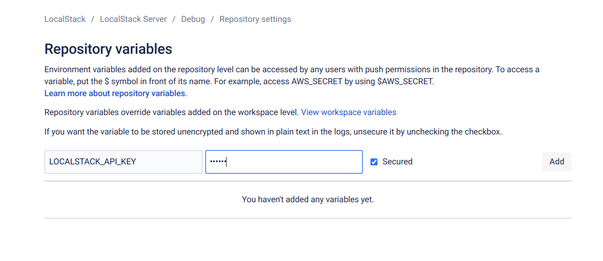

This guide describes how to start and use LocalStack in your BitBucket Pipelines.

## BitBucket Pipelines

There are a few restrictions in BitBucket Pipelines that make it hard to customize the behavior of docker.
For a full list see [here](https://support.atlassian.com/bitbucket-cloud/docs/run-docker-commands-in-bitbucket-pipelines/#Full-list-of-restricted-commands). 

### Workarounds for restrictions

1. Enabling Docker-in-Docker for starting localstack via Docker

BitBucket Pipelines don't allow mounting the docker socket (`/var/run/docker.sock`) into the container.
This is usually required for localstack to communicate with the docker daemon on the host.
Fortunately the daemon exposes the port `2375` to communicate with, which is reachable in the main localstack container, but requires changes to the typical docker-compose setup.

2. Mounting tmp directory
If you need to mount the tmp dir, you'll need to mount a directory under `BITBUCKET_CLONE_DIR` since all other mounting is prohibited. 

### Example

bitbucket-pipelines.yml

When using the `services` concept of BitBucket Pipelines keep in mind the following [restrictions](https://support.atlassian.com/bitbucket-cloud/docs/databases-and-service-containers/#Before-you-begin).

```yaml
image: library/ubuntu:20.04

definitions:
  services:
    localstack:
      image: localstack/localstack:0.12.19.1
      variables:
        DOCKER_HOST: tcp://172.17.0.1:2375

pipelines:
  default:
    - step:
        name: 'test with localstack'
        services:
          - localstack
        script:
          - apt-get update
          - apt-get install -y python python3-pip curl
          - pip install awscli-local[ver1]
          - curl localhost:4566/health
          - awslocal cloudformation create-stack --stack-name pipeline-test-stack --template-body file://./stack.json
          - sleep 5
          - awslocal lambda invoke --function-name pipeline-test-fn ./outfile
          - cat ./outfile

```

## Activate LocalStack Pro
You can easily enable LocalStack Pro by adding your API key to the repo's variables.

Just navigate to your BitBucket repo, click on `Repository Settings` in the sidebar. In the sub-section `PIPELINES` click on `Repository Variables` and add your API key (`LOCALSTACK_API_KEY`):




## External Resources

- https://support.atlassian.com/bitbucket-cloud/docs/variables-and-secrets/#Variablesinpipelines-Repositoryvariables
- https://support.atlassian.com/bitbucket-cloud/docs/run-docker-commands-in-bitbucket-pipelines/#Full-list-of-restricted-commands