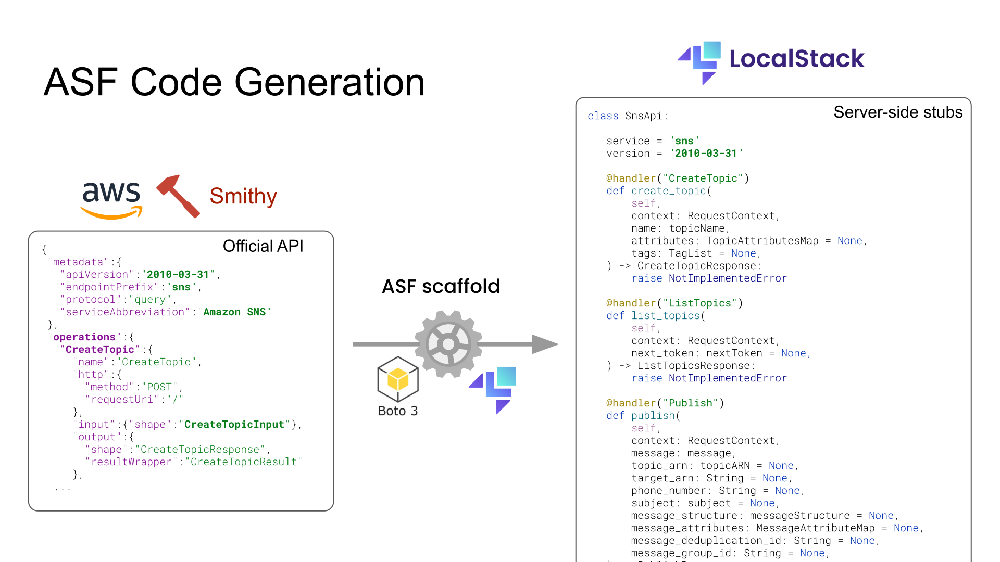
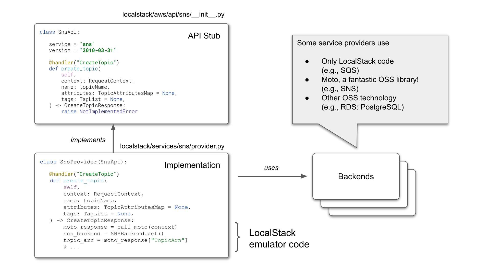
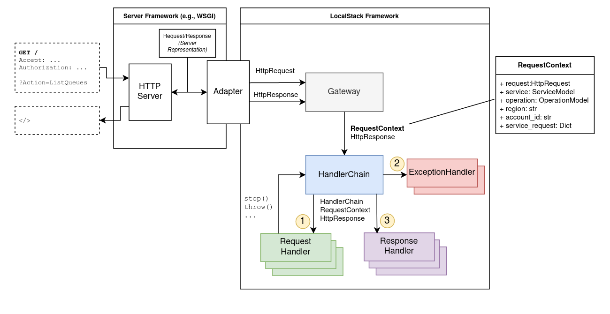
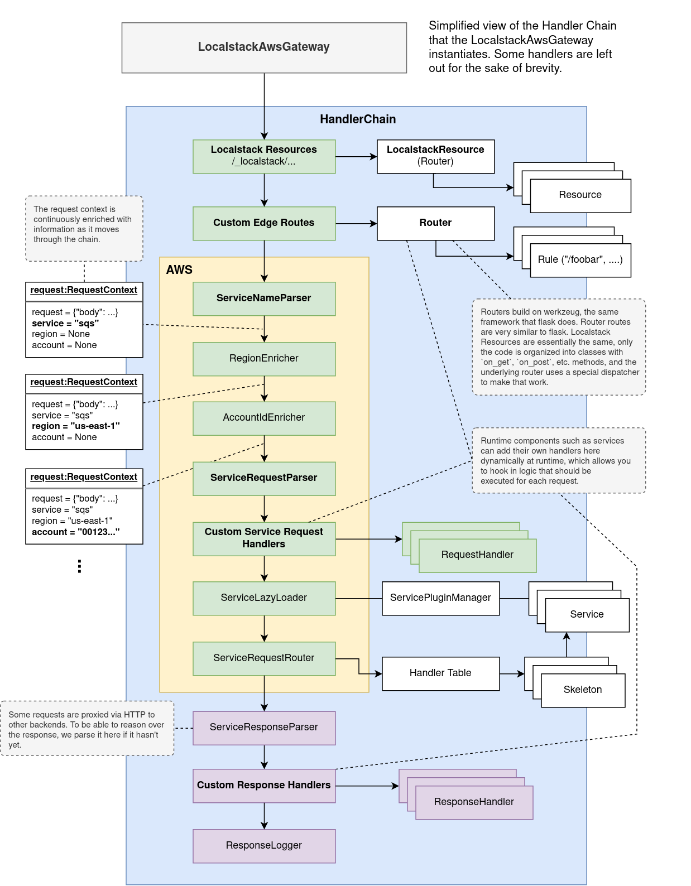

When you first start working on LocalStack, you will most likely start working on AWS providers, either fixing bugs or adding features. In that case, you probably care mostly about [Services](#service), and, depending on the service and how it interacts with the [Gateway](#gateway), also **custom request handlers** and edge **routes**.

If you are adding new service providers, then you’ll want to know how [Plugins](#plugins) work, and how to expose a service provider as a [service plugin](#service-plugin). This guide will give you a comprehensive overview about various core architectural concepts of LocalStack.

## AWS Server Framework (ASF)

AWS is essentially a Remote Procedure Call (RPC) system, and ASF is our server-side implementation of that system. The principal components of which are:

-   Service specifications
-   Stub generation
-   Remote objects (service implementations)
-   Marshalling
-   Skeleton

### Service specifications

AWS developed a specification language, [Smithy](https://awslabs.github.io/smithy/), which they use internally to define their APIs in a declarative way. They use these specs to generate client SDKs and client documentation. All these specifications are available, among other repositories, in the [botocore repository](https://github.com/boto/botocore/tree/develop/botocore/data). Botocore are the internals of the AWS Python SDK, which allows ASF to interpret and operate on the service specifications. Take a look at an example, [the `Invoke` operation of the `lambda` API](https://github.com/boto/botocore/blob/474e7a23d0fd178790579638cec9123d7e92d10b/botocore/data/lambda/2015-03-31/service-2.json#L564-L573):

```json 
	"Invoke":{
    "name":"Invoke",
    "http":{
      "method":"POST",
      "requestUri":"/2015-03-31/functions/{FunctionName}/invocations"
    },
    "input":{"shape":"InvocationRequest"},
    "output":{"shape":"InvocationResponse"},
    "errors":[
      {"shape":"ServiceException"},
    ...
```

### Scaffold - Generating AWS API stubs

We use these specifications to generate server-side API stubs using our scaffold script. The stubs comprise Python representations of _Shapes_ (type definitions), and an `<Service>Api` class that contains all the operations as function definitions. Notice the `@handler` decorator, which binds the function to the particular AWS operation. This is how we know where to dispatch the request to.



You can try it using this command in the LocalStack repository:


$ python -m localstack.aws.scaffold generate <service> --save [--doc]


### Service providers

A service provider is an implementation of an AWS service API. Service providers are the remote object in the RPC terminology. You will find the modern ASF provider implementations in `localstack/services/<service>/provider.py`.

### Marshalling

A server-side protocol implementation requires a marshaller (a parser for incoming requests, and a serializer for outgoing responses).

- Our [protocol parser](https://github.com/localstack/localstack/blob/master/localstack/aws/protocol/parser.py) translates AWS HTTP requests into objects that can be used to call the respective function of the service provider.
- Our [protocol serializer](https://github.com/localstack/localstack/blob/master/localstack/aws/protocol/serializer.py) translates response objects coming from service provider functions into HTTP responses.

## Service

Most services are AWS providers, i.e, implementations of AWS APIs. But don’t necessarily have to be.

### Provider

Here’s the anatomy of an AWS service implementation. It implements the API stub generated by the scaffold.



### Stores

All data processed by the providers are retained by in-memory structures called Stores. Think of them as an in-memory database for the providers to store state. Stores are written in a declarative manner similar to how one would write SQLAlchemy models.

Stores support namespacing based on AWS Account ID and Regions, which allows emulation of multi-tenant setups and data isolation between regions, respectively.

LocalStack has a feature called persistence, where the states of all providers are restored when the LocalStack instance is restarted. This is achieved by pickling and unpickling the provider stores.

### `call_moto`

Many LocalStack service providers use [`moto`](https://github.com/spulec/moto) as a backend. Moto is an open-source library that provides mocking for Python tests that use Boto, the Python AWS SDK. We re-use a lot of moto’s internal functionality, which provides mostly CRUD and some basic emulation for AWS services. We often extend services in Moto with additional functionality. Moto plays such a fundamental role for many LocalStack services, that we have introduced our own tooling around it, specifically to make requests directly to moto.

To add functionality on top of `moto`, you can use `call_moto(context: RequestContext)` to forward the given request to `moto`. When used in a service provider `@handler` method, it will dispatch the request to the correct `moto` implementation of the operation, if it exists, and return the parsed AWS response.

The `MotoFallbackDispatcher` generalizes the behavior for an entire API. You can wrap any provider with it, and it will forward any request that returns a `NotImplementedError` to moto instead and hope for the best.

Sometimes we also use `moto` code directly, for example importing and accessing `moto` backend dicts (state storage for services).

## `@patch`

[The patch utility](https://github.com/localstack/localstack/blob/master/localstack/utils/patch.py) enables easy [monkey patching](https://en.wikipedia.org/wiki/Monkey_patch) of external functionality. We often use this to modify internal moto functionality. Sometimes it is easier to patch internals than to wrap the entire API method with the custom functionality.

### Server

`[Server](<https://github.com/localstack/localstack/blob/master/localstack/utils/serving.py>)` is an abstract class that provides a basis for serving other backends that run in a separate process. For example, our Kinesis implementation uses [kinesis-mock](https://github.com/etspaceman/kinesis-mock/) as a backend that implements the Kinesis AWS API and also emulates its behavior. 

The provider [starts the kinesis-mock binary in a `Server`](https://github.com/localstack/localstack/blob/2e1e8b4e3e98965a7e99cd58ccdeaa6350a2a414/localstack/services/kinesis/kinesis_mock_server.py), and then forwards all incoming requests to it using `forward_request`. This is a similar construct to `call_moto`, only generalized to arbitrary HTTP AWS backends. 

A server is reachable through some URL (not necessarily HTTP), and the abstract class implements the lifecycle of the process (start, stop, is_started, is_running, etc). To create a new server, you only need to overwrite either `do_run`, or `do_start_thread`, with custom logic to start the binary.

There are some existing useful utilities and specializations of `Server` which can be found across the codebase. For example, `DockerContainerServer` spins up a Docker container on a specific port, and `ProxiedDockerContainerServer` adds an additional TCP/HTTP proxy server (running inside the LocalStack container) that tunnels requests to the container.

### External service ports

Some services create additional user-facing resources. For example, the RDS service starts a PostgreSQL server, and the ElastiCache service starts a Redis server, that users then directly connect to. 

These resources are not hidden behind the service API, and need to be exposed through an available network port. This is what the [external service port range](https://docs.localstack.cloud/localstack/external-ports/) is for. We expose this port range by default in the docker-compose template, or via the CLI.

### Service plugin

A service provider has to be exposed as a service plugin for our code loading framework to pick it up.

## Gateway

The Gateway is a simple interface: `process(Request, Response)`. It receives an HTTP request and a response that it should populate. To that end, the Gateway uses a `HandlerChain` to process the request.

An adapter exposes the gateway as something that can be served by a web server. By default, we use Hypercorn, an ASGI web server, and expose the Gateway as an ASGI app through our WSGI/ASGI bridge.

The gateway creates a `RequestContext` object for each request, which is passed through the handler chain.

All components of our HTTP framework build heavily on the Werkzeug HTTP server library [Werkzeug](https://github.com/pallets/werkzeug/), which makes our app WSGI compatible.



### Handler Chain

The handler chain implements a variant of the [chain-of-responsibility pattern](https://en.wikipedia.org/wiki/Chain-of-responsibility_pattern), not unlike [the javax.servlet API](https://docs.oracle.com/javaee/7/api/javax/servlet/package-summary.html). The handler chain knows about three different handlers: Request Handlers, Response Handlers, and Exception Handlers. Request and response handlers have the same interface, they only differ in how they are invoked by the handler chain.

A handler chain can be _running_, _stopped_ or _terminated_. If a request handler stops the chain using `chain.stop()`, the chain stops invoking the remaining request handlers, and jumps straight to the response handlers. If the chain is _terminated_, then even response handlers are skipped.

If an exception occurs during the execution of a request handler, no other request handlers are executed, and instead the chain calls the exception handlers, and then all response handlers. Exceptions during response handlers are logged, but they do not interrupt the handler chain flow.

### LocalStack AWS Gateway

Here is a figure of the handler chain underlying the `LocalstackAwsGateway`, which every HTTP request to `:4566` goes through.

Some handlers are designed to be extended dynamically at runtime by other services. For example, a service can add HTTP routes to the edge router, which can then process the request differently. OpenSearch, for example, uses this to register HTTP routes to [cluster endpoints](https://docs.localstack.cloud/aws/opensearch/#interact-with-the-cluster), that are proxied through `:4566` to the cluster backend.



## Plugins

Plugins provided by [https://github.com/localstack/plux](https://github.com/localstack/plux) are how we load:

-   Service providers
-   Hooks
-   Extensions

Key points to understand are that plugins use [Python entry points, which are part of the PyPA specification](https://packaging.python.org/en/latest/specifications/entry-points/). Entry points are discovered from the code during a build step rather than defined manually (this is the main differentiator of Plux to other code loading tools). In LocalStack, the `make entrypoints` make target does that, which is also part of `make install`.

When you add new hooks or service providers, or any other plugin, make sure to run `make entrypoints`.

When writing plugins, it is important to understand that any code that sits in the same module as the plugin, will be imported when the plugin is _resolved_. That is, _before_ it is loaded. Resolving a plugin simply means discovering the entry points and loading the code the underlying entry point points to. This is why many times you will see imports deferred to the actual loading of the plugin.

## Config

The LocalStack configuration is currently simply a set of well-known environment variables that we parse into python values in `localstack/config.py`. When LocalStack is started via the CLI, we also need to pass those environment variables to the container, which is why we keep [a list of the environment variables we consider to be LocalStack configuration](https://github.com/localstack/localstack/blob/7e3045dcdca255e01c0fbd5dbf0228e500e8f42e/localstack/config.py#L693-L700).

## Hooks

Hooks are functions exposed as plugins that are collected and executed at specific points during the LocalStack lifecycle. This can be both in the runtime (executed in the container) and the CLI (executed on the host).

### **Host/CLI hooks**

These hooks are relevant only to invocations of the CLI. If you use, for example, a docker-compose file to start LocalStack, these are not used.

-   `@hooks.prepare_host` Hooks to prepare the host that's starting LocalStack. Executed on the host when invoking the CLI.
-   `@hooks.onfigure_localstack_container` Hooks to configure the LocalStack container before it starts. Executed on the host when invoking the CLI. This hook receives the `LocalstackContainer` object, which can be used to instrument the `docker run` command that starts LocalStack.

### **Runtime hooks**

-   `@hooks.on_infra_start` Executed when LocalStack runtime components (previously known as _infrastructure_) are started.
-   `@hooks.on_infra_ready` Executed when LocalStack is ready to server HTTP requests.

## Runtime

The components necessary to run the LocalStack server application are collectively referred to as the _runtime_. This includes the Gateway, scheduled worker threads, etc. The runtime is distinct from the CLI, which runs on the host. Currently, there is no clear separation between the two, you will notice this, for example, in the configuration, where some config variables are used for both the CLI and the runtime. Similarly, there is code used by both. Separating the two is an ongoing process.


## LocalStack Package Manager (LPM)

The `lpm` is a module located in `localstack.cli`. It provides a [Click](https://click.palletsprojects.com/)-powered CLI interface to trigger installers.

It uses the Plugins mechanism to discover installers of community and ext. _LPM_ can be used directly as a module, and if called without a specific command it prints an extensive description of its available commands:

```python
source .venv/bin/activate
python -m localstack.cli.lpm
```

### LPM concepts

#### Packages and installers
LPM manages the downloaded dependencies via packages and installers. A package defines a specific kind of software we need for certain services, for example [dynamodb-local](https://docs.aws.amazon.com/amazondynamodb/latest/developerguide/DynamoDBLocal.html). It also encapsulates general information like name, available versions, etc., and manages the access to the actual installer that is used. The installer manages all installation-related information: the destination, the actual installation routine, etc. There are various types of installers available, depending on what we need to install (OS-level packages, executables, jar files, GitHub assets,...), so before you start reinventing the wheel, please check if there is a suitable installer available.

For example, if you need to download a jar file, you can use the `DownloadInstaller` base class. You then overwrite it in a manner like `<MyDownloadName>Installer(DownloadInstaller)` and all you need to provide is the download link (more in the example below). Most of the base installers work in a similar fashion.

Packages and installers can usually be found in `packages.py` in the `localstack/services/<service>` folder of the service that requires the dependency. Dependencies that are required by multiple services are saved under `localstack/packages`.

Regarding installed versions, it is important to note that LPM will not install arbitrary versions it does not "know" about, even if those versions exist for the provided package. For example, if you attempt to install the latest version for a dependency (e.g. stepfunctions-local) but the lpm-package only supports a certain, pinned version, the installation will fail. Resources that do not use versions (e.g. because there is only a link to the newest one) generally use `latest` as version name. Different versions of a package would use different installer objects.

#### Installation targets
To keep things nice and clean, LPM installs packages in two locations, `static_libs` and `var_libs`.

`static_libs` is `.filesystem/usr/lib/localstack`. It is used for packages installed at build time. Regarding the docker container, the packages are installed in a non-host-mounted volume, and the directory is re-created whenever a container is recreated. This is the default target if a package is installed in the aforementioned way via `python -m localstack.cli.lpm install`.

`var_libs` is `.filesystem/var/lib/localstack`. It is the main and default location used for packages installed at runtime. Regarding the docker container, the packages are installed in a host-mounted volume, and the content of the directory will persist across multiple containers.

#### Installation life-cycle
The installer base class provides two methods to manage potentially necessary side tasks for the installation: `_prepare_installation` and `_post_process`. These methods simply `pass` by default and need to be overwritten should they be needed. Most notably, they are used for the OS-level packages to add repositories to the OS-package-manager like `apt`.

#### Plugins mechanism
For LPM to be able to discover a package, we expose it via the package plugins mechanism. This is usually done by writing a function in `plugins.py` that returns the current package instance and marking it with the `@package` decorator (check the example below). It can be passed additional conditions to determine whether this should actually be loaded or not. 

#### Special mention: OSPackageInstaller
Package installers that install packages on operating system level (like PostgreSQL) work a bit differently since they need to use the underlying package manager of the OS. At the time of writing and its foreseeable future, the supported operating systems for these installers are:
- Debian (standard docker image)
- Red Hat

Since this is intended for the docker image, it will fail with an exception when run outside of docker in host mode. This can be bypassed on Debian-like systems that use `apt` by installing the necessary dependency manually on the host. 
Also the installation target has no effect for these packages, since they are installed and managed at system level.

### Example
We will now install \<MyEssentialGitHubResource\> to showcase how installing some dependency usually looks like.
1. Create `packages.py` under `localstack/services/\<my-service\> if not already present.
2. Add the following content to `packages.py`
```python
# This defines the package

class MyGitHubPackage(Package):
  def __init__(self, default_version: str = "<my-default-version>"):
    super().__init__(name="My essential GitHub package", default_version=default_version)

  @lru_cache
  def _get_installer(self, version: str) -> PackageInstaller:
    return MyGitHubPackageInstaller(version)

  def get_versions(self) -> List[str]:
    return ["<my-default-version>", "<alt-version-1>", "<alt-version-2>"]

# This defines the installer. Depending on the type, different urls, names, etc. need to be provided

class MyGitHubPackageInstaller(GitHubReleaseInstaller):
  def __init__(self, version: str):
    super().__init__("<my-github-package>", version, "<github-username>/<github-repository>")

  def _get_github_asset_name(self):
    arch = get_arch()
    operating_system = get_os()
    if arch == "amd64":
      if operating_system == "windows":
        bin_file = "<my-github-package>.exe"
      else:
        bin_file = "<my-github-package>"
      else:
        bin_file = "<my-github-package>.jar"
    return bin_file
```
3. Add the package reference at the bottom of `packages.py`.
```python
my_github_package = MyGitHubPackage()
```
4. Create `plugins.py` in the same directory as before if not already present.
5. Add the following content to `plugins.py`.
```python
@package(name="<my-github-package>")
def my_github_package() -> Package:
  from localstack.services.<my-service>.packages import my_github_package

  return my_github_package
```
That's it, we just implemented an installation routine for a github asset including path lookup, cleanup of temp-files, etc. Now we need to recreate our entrypoints, and then we can install it via `python -m localstack.cli.lpm install <my-github-package>`.
For a concrete implementation and more details, you can compare the example code e.g. against the files under localstack/services/kinesis.

### `lpm` in more detail
Now that we covered the basic concepts, we can look into the different lpm-commands more closely, however the gist is covered by the already mentioned overview.

- `python -m localstack.cli.lpm list`

`lpm list` is straightforward, it lists all available packages in alphabetic order and adds whether this is a community or pro dependency. `-v`/`--verbose` will print additional info if any, such as the package versions that are available.

- `python -m localstack.cli.lpm install [OPTIONS] PACKAGE...`

`lpm install` installs one or more packages with the given options. The available options are `--target` and `--version`.
- `--target`

As mentioned, the default target for LPM is `static_libs`, but should the need arise, LPM can also install under `var_libs`.
- `--version`

The version to be installed. Remember that the version needs to be supported by LPM or it will fail, even if the version theoretically exists.

An important thing to note here is that at the time of writing, the provided options will be applied for all given packages. This makes the combination of the `--version` parameter with multiple packages rather error prone, since version numbers, names, and formats differ across packages. This use is therefore discouraged. 

### LPM and LocalStack pro
LPM works largely the same for pro as it does for community. The most important differences are:
- packages for pro use the `@pro_package` decorator instead of the `@package` one.
- At the time of writing, only pro uses OS-level packages.
- The lpm-related code is unencrypted, but the rest of the pro code is not. Therefore it is important to not import any code that will be encrypted in the deployed version. This should not be an issue most of the time, since the services naturally depend on their packages, and not the other way around.

## Utilities

The codebase contains a wealth of utility functions for various common tasks like handling strings, JSON/XML, threads/processes, collections, date/time conversions, and much more.

The utilities are grouped into multiple util modules inside the `[localstack.utils](<https://github.com/localstack/localstack/tree/master/localstack/utils>)` package. Some of the most commonly used utils modules include:

-   `.files` - file handling utilities (e.g., `load_file`, `save_file`, or `mkdir`)
-   `.json` - handle JSON content (e.g., `json_safe`, or `canonical_json`)
-   `.net` - network ports (e.g., `wait_for_port_open`, or `is_ip_address`)
-   `.run` - run external commands (e.g., `run`, or `ShellCommandThread`)
-   `.strings` - string/bytes manipulation (e.g., `to_str`, `to_bytes`, or `short_uid`)
-   `.sync` - concurrency synchronization (e.g., `poll_condition`, or `retry`)
-   `.threads` - manage threads and processes (e.g., `FuncThread`)
