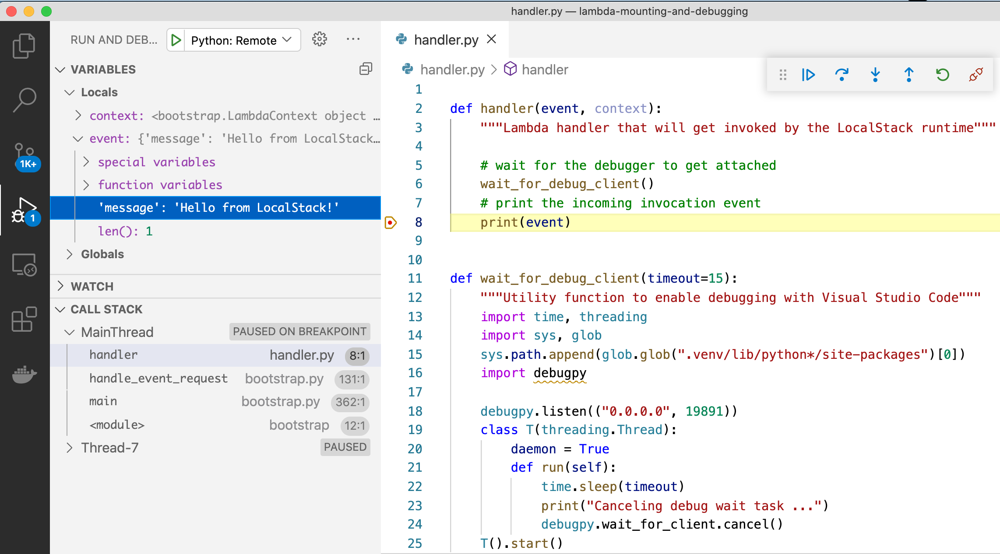
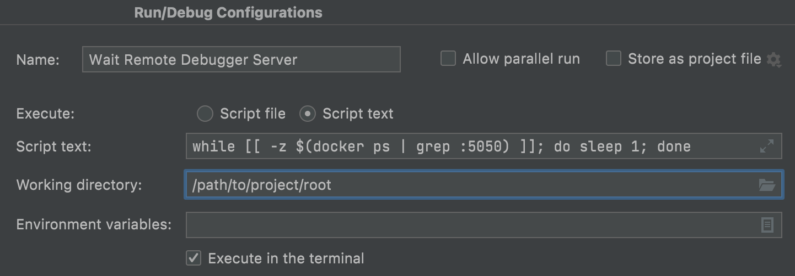
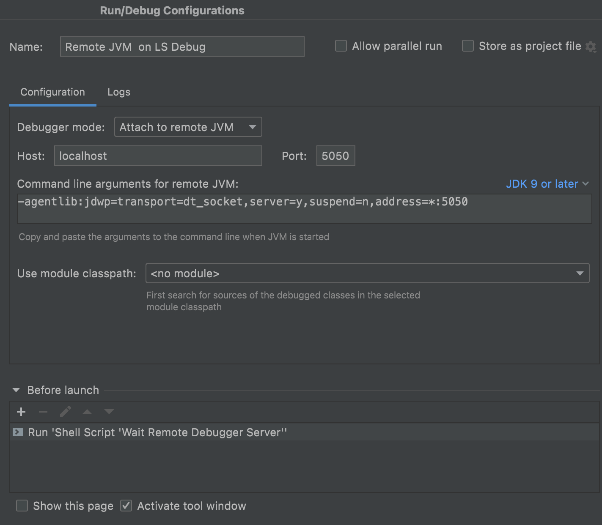

## Overview

This guide covers the remote debugging of Lambda functions with [Visual Studio Code](https://code.visualstudio.com/) or IntelliJ IDEA as an IDE.
For a simple working example of this feature, check out [our samples repository](https://github.com/localstack/localstack-pro-samples/tree/master/lambda-mounting-and-debugging).

| Complexity   | ★☆☆☆☆             |
|--------------|-------------------|
| Time to read | 5 minutes         |
| Edition      | community/pro     |
| Platform     | any               |

More examples and tooling support for local Lambda debugging (including support for other IDEs like PyCharm) is coming soon - stay tuned!

### Covered Topics

* [Debugging Python lambdas](#debugging-python-lambdas)
* [Debugging JVM lambdas](#debugging-jvm-lambdas)
* [Useful Links](#useful-links)

## Debugging Python lambdas

Lambda functions debugging used to be a difficult task. LocalStack changes that
with the same local code mounting functionality that also helps you
to [iterate quickly over your function code]().

For a simple working example of this feature, you can refer to
[our samples](https://github.com/localstack/localstack-pro-samples/tree/master/lambda-mounting-and-debugging).
There, the necessary code fragments for enabling debugging are already present.

### Configure LocalStack for remote Python debugging

First, make sure that LocalStack is started with the following configuration (see the [Configuration docs]() for more information):
```sh
LAMBDA_REMOTE_DOCKER=0 \
    LAMBDA_DOCKER_FLAGS='-p 19891:19891' \
    DEBUG=1 localstack start
```

### Preparing your code

For providing the debug server, we use [`debugpy`](https://github.com/microsoft/debugpy)
inside the Lambda function code. In general, all you need is the following code
fragment placed inside your handler code:
```python
import debugpy
debugpy.listen(19891)
debugpy.wait_for_client()  # blocks execution until client is attached
```
For extra convenience, you can use the `wait_for_debug_client` function from our example.
It implements the above-mentioned start of the debug server and also adds an automatic cancellation of the wait task if the debug client (i.e. VSCode) doesn't connect.

```python
def wait_for_debug_client(timeout=15):
    """Utility function to enable debugging with Visual Studio Code"""
    import time, threading
    import sys, glob
    sys.path.append(glob.glob(".venv/lib/python*/site-packages")[0])
    import debugpy

    debugpy.listen(("0.0.0.0", 19891))
    class T(threading.Thread):
        daemon = True
        def run(self):
            time.sleep(timeout)
            print("Canceling debug wait task ...")
            debugpy.wait_for_client.cancel()
    T().start()
    print("Waiting for client to attach debugger ...")
    debugpy.wait_for_client()
```

### Creating the Lambda function

To create the Lambda function, you just need to take care of two things:
1. Deploy the function via an S3 Bucket. You need to use the magic variable `__local__` as the bucket name.
2. Set the S3 key to the path of the directory your lambda function resides in.
   The handler is then referenced by the filename of your lambda code and the function in that code that should be invoked.

So, in our [example](https://github.com/localstack/localstack-pro-samples/tree/master/lambda-mounting-and-debugging), this would be:

```sh
awslocal lambda create-function --function-name my-cool-local-function \
    --code S3Bucket="__local__",S3Key="$(pwd)/" \
    --handler handler.handler \
    --runtime python3.8 \
    --role cool-stacklifter
```

We can quickly verify that it works by invoking it with a simple payload:

```sh
awslocal lambda invoke --function-name my-cool-local-function --payload '{"message": "Hello from LocalStack!"}' output.txt
```

### Configuring Visual Studio Code for remote Python debugging

For attaching the debug server from Visual Studio Code, you need to add a run configuration.

```json
{
    "version": "0.2.0",
    "configurations": [
        {
            "name": "Python: Remote Attach",
            "type": "python",
            "request": "attach",
            "connect": {
                "host": "localhost",
                "port": 19891
            },
            "pathMappings": [
                {
                    "localRoot": "${workspaceFolder}",
                    "remoteRoot": "."
                }
            ]
        }
    ]
}
```

With our function from above you have about 15 seconds (the timeout is configurable) to switch to Visual Studio Code and run the preconfigured remote debugger.
Make sure to set a breakpoint in the Lambda handler code first, which can then later be inspected.

The screenshot below shows the triggered breakpoint with our `'Hello from LocalStack!'` in the variable inspection view:



### Limitations

Due to the ports used by the debugger, you can currently only debug one Lambda at a time.
Multiple concurrent invocations will not work.

## Debugging JVM lambdas

### Configure LocalStack for remote JVM debugging

Set `LAMBDA_JAVA_OPTS` with `jdwp` settings and expose the debug port
(you can use any other port of your choice):

```yaml
#docker-compose.yml

services:
  localstack:
    ...
    environment:
      ...
      - LAMBDA_JAVA_OPTS=-agentlib:jdwp=transport=dt_socket,server=y,suspend=y,address=*:5050
      - LAMBDA_DOCKER_FLAGS=-p 127.0.0.1:5050:5050
```

Note the `suspend=y` option here, it will delay code execution until debugger is
attached to debgger server. If you want to change that simply switch to `suspend=n`.

### Configuring IntelliJ IDEA for remote JVM debugging

Open the `Run/Debug Configurations` window and create a new `Shell Script` with
the following content:

```shell
while [[ -z $(docker ps | grep :5050) ]]; do sleep 1; done
```



This shell script should simplify the process a bit since the debugger server is not
immediately available (only once lambda container is up).

Then create a new `Remote JVM Debug` configuration and use the script from
above as a `Before launch` target:



Now to debug your lambda function, simply click on the `Debug` icon with
`Remote JVM on LS Debug` configuration selected, and then invoke your
lambda function.

### Configuring Visual Studio Code for remote JVM debugging

Make sure you installed the following extensions:
* [Language Support for Java(TM) by Red Hat](https://marketplace.visualstudio.com/items?itemName=redhat.java)
* [Debugger for Java](https://marketplace.visualstudio.com/items?itemName=vscjava.vscode-java-debug)

Add a new task by creating/modifying the `.vscode/tasks.json` file:

```json
{
    "version": "2.0.0",
    "tasks": [
        {
          "label": "Wait Remote Debugger Server",
          "type": "shell",
          "command": "while [[ -z $(docker ps | grep :5050) ]]; do sleep 1; done; sleep 1;"
        }
    ]
}
```

Create a new `launch.json` file or edit an existing one from the `Run and Debug` tab,
then add the following configuration:

```json
{
    "version": "0.2.0",
    "configurations": [
        {
            "type": "java",
            "name": "Remote JVM on LS Debug",
            "projectRoot": "${workspaceFolder}",
            "request": "attach",
            "hostName": "localhost",
            "preLaunchTask": "Wait Remote Debugger Server",
            "port": 5050
        }
    ]
}
```

Now to debug your lambda function, click on the `Debug` icon with
`Remote JVM on LS Debug` configuration selected, and then invoke your
lambda function.

## Resources

* [Lambda Code Mounting and Debugging (Python)](https://github.com/localstack/localstack-pro-samples/tree/master/lambda-mounting-and-debugging)
* [Spring Cloud Function on LocalStack (Kotlin JVM)](https://github.com/localstack/localstack-pro-samples/tree/master/spring-cloud-function-microservice)
