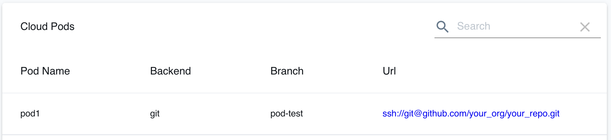

Local Cloud Pods are a mechanism that allows you to take a snapshot of your local instance, persist it to a storage backend (e.g., git repository), and easily share it out with your team members.

You can create and manage Local Cloud Pods via the Web UI, and in order to load and store the persistent state of pods, you can use the `localstack` command line interface (CLI).

Below is a simple example of how you can push and pull Local Cloud Pods using the `localstack` CLI:

```sh
# User 1 pushes state of Cloud Pod to persistent server
$ awslocal kinesis list-streams
{"StreamNames": ["mystream123"]}
$ localstack pod push mypod1
...

# User 2 pulls state from the server to local instance
$ localstack pod pull mypod1
$ awslocal kinesis list-streams
{"StreamNames": ["mystream123"]}
```

{}
Using local Cloud pods requires setting the `DATA_DIR` configuration variable to point to a folder on your local machine - this folder will be used to persist and load the state of cloud pods in your local instance.
{}

Local Cloud Pods support different storage mechanisms - currently we're focusing on using `git` repositories as the storage backend, as `git` is often readily available on developers' machines and is easy to integrate with (no additional access control settings required).
Support for more storage backends is coming soon (e.g., S3 buckets, FTP servers, etc.).

You can use the [LocalStack Web UI](https://app.localstack.cloud/pods) to create a new Local Cloud Pod (make sure to adjust the Git URL and branch name to point to your repository):



Once the pod has been created, can use the CLI to log in and list the pod in your terminal:
```
$ export LOCALSTACK_API_KEY=...
$ localstack login
...
$ localstack pod list
Name    Backend    URL                                Size    State
------  ---------  ---------------------------------  ------  -------
pod1    git        ssh://git@github.com/your_org/...  1.68MB  Shared
```

{}
Cloud Pods are a feature of LocalStack Pro.
Please ensure that the `LOCALSTACK_API_KEY` is properly configured.
{}

After the pod definition has been created, you should be able to use the `push`/`pull` commands listed above to push and pull the pod state to the Git repo.
After pulling the pod, LocalStack will automatically inject pod state in your instance at runtime without requiring a restart.

In some cases, you may want to reset your current application state before pulling a pod.
This can be achieved by manually deleting the `DATA_DIR` and restarting the application with the `localstack pod reset` command.

{}
If you `pull` a Local Cloud Pod, it will attempt to merge the stored pod state with the existing state in your LocalStack instance.
Please make sure to create a backup of any data before pulling a cloud pod, if required.
{}