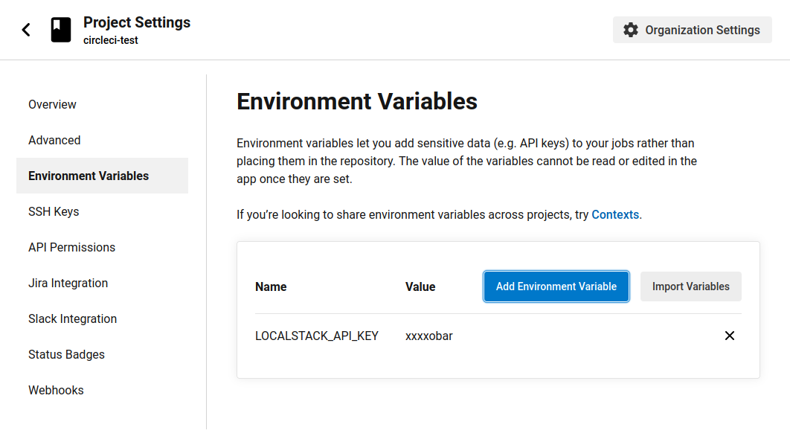

This guide describes how to start and use LocalStack in your CircleCI pipelines.

## The LocalStack Circle CI Orb

LocalStack is an official partner of [Circle CI](https://circleci.com/) and can easily be integrated into your pipeline by using the [official CircleCI Orb](https://circleci.com/developer/orbs/orb/localstack/platform).\
The [Orb's documentation](https://circleci.com/developer/orbs/orb/localstack/platform) features examples, as well as a description of the available commands.

When using the official CircleCI Orb, using LocalStack in your pipeline is as easy as adding the Orb to your pipeline and executing the startup command.\
The following example CircleCI config (`.circleci/config.yml`) starts LocalStack, creates a new S3 bucket, and prints a nice message in the end:
```yaml
version: 2.1
orbs:
  localstack: localstack/platform@1.0
jobs:
  run-integration-tests:
    executor: localstack/default
    steps:
      - localstack/startup
      - run:
          command: awslocal s3 mb s3://test-bucket
      - run:
          command: echo "Execute your tests here :)"
workflows:
  integration-test:
    jobs:
      - run-integration-tests
```

## Activate LocalStack Pro
You can easily enable LocalStack Pro by adding your API key to the project's environment variables. The LocalStack Orb will automatically pick it up and activate the Pro features.

Just go to the project settings in CircleCI, click on `Environment Variables` in the sidebar and add your API key:




## Ran into trouble?

If you run into any issues or problems while integrating LocalStack with CircleCI, please [submit an issue](https://github.com/localstack/ci-plugin-circleci/issues).
