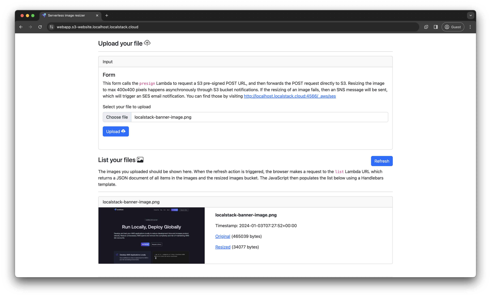

## Introduction

In this quickstart guide, we'll walk you through the process of starting LocalStack on your local machine and deploying a [serverless image resizer application](https://github.com/localstack-samples/sample-serverless-image-resizer-s3-lambda) that utilizes several AWS services. This guide aims to help you understand how to use LocalStack for the development and testing of your AWS applications locally. It introduces you to the following key concepts:

- Starting a LocalStack instance on your local machine.
- Deploying an AWS serverless application infrastructure locally.
- Running an automated integration test suite against local infrastructure.
- Exploring the LocalStack Web Application to view deployed resources.
- Destroying the local infrastructure you have provisioned.

## Architecture

The following diagram shows the architecture that we will deploy locally using LocalStack:



The architecture:

- Configures S3 bucket notifications to invoke a Lambda function.
- Provides S3 pre-signed POST URLs for direct uploads to the S3 bucket.
- Creates S3 website hosting for serving the static application client.
- Configures direct invocation URLs for Lambda functions accessible to the client.
- Establishes Lambda SNS to SNS topic notifications for failure handling.
- Creates SNS to SES subscriptions for email notifications triggered by specific events.

An internal SES LocalStack testing endpoint (`/_localstack/aws/ses`) is configured as well, to test email sending functionality while running our local integration test suite.

## Prerequisites

- [LocalStack CLI](https://docs.localstack.cloud/getting-started/installation/#localstack-cli)
- [LocalStack Web Application account](https://app.localstack.cloud/sign-up) & [Auth Token](https://docs.localstack.cloud/getting-started/auth-token/)
- [Docker](https://docs.docker.com/get-docker/)
- [Python 3.9+](https://www.python.org/downloads/) & `pip`
- [AWS CLI](https://docs.aws.amazon.com/cli/latest/userguide/getting-started-install.html) & [`awslocal` wrapper](https://docs.localstack.cloud/user-guide/integrations/aws-cli/#localstack-aws-cli-awslocal)
- `jq`, `zip` & `curl`

You can start LocalStack using the `localstack` CLI. Start the LocalStack Pro container with your `LOCALSTACK_AUTH_TOKEN` pre-configured:



export LOCALSTACK_AUTH_TOKEN=<your-auth-token>
localstack start


$env:LOCALSTACK_AUTH_TOKEN=<your-auth-token>
localstack start



If you prefer running LocalStack in detached mode, you can add the `-d` flag to the `localstack start` command, and use Docker Desktop to view the logs.

## Instructions

To get started, clone the sample application repository from GitHub:


$ git clone https://github.com/localstack-samples/sample-serverless-image-resizer-s3-lambda.git
$ cd sample-serverless-image-resizer-s3-lambda


You can now follow the instructions below to start LocalStack, deploy the sample application, and test the application.

### Setup a virtual environment

To deploy the sample application, you need to have specific Python packages are installed. It is advisable to utilize a virtual environment for the installation process, allowing the packages to be installed in an isolated environment. Execute the following commands to create a virtual environment and install the packages in `requirements-dev.txt`:



python -m venv .venv
source .venv/bin/activate
pip install -r requirements-dev.txt


python -m venv .venv
.venv\Scripts\activate
pip install -r requirements-dev.txt




If you are encountering issues with the installation of the packages, such as Pillow, ensure you use the same version as the Python Lambdas (3.9) for Pillow to work. If you're using <a href="https://github.com/pyenv/pyenv">pyenv</a>, install and activate Python 3.9 with the following commands:

$ pyenv install 3.9.0
$ pyenv global 3.9.0



### Setup the serverless image resizer

This application enables serverless image resizing using [S3](https://docs.localstack.cloud/user-guide/aws/s3/), [SSM](https://docs.localstack.cloud/user-guide/aws/ssm/), [Lambda](https://docs.localstack.cloud/user-guide/aws/lambda/), [SNS](https://docs.localstack.cloud/user-guide/aws/sns/), and [SES](https://docs.localstack.cloud/user-guide/aws/ses/). A simple web interface allows users to upload and view resized images. A Lambda function generates S3 pre-signed URLs for direct uploads, while S3 bucket notifications trigger image resizing. Another Lambda function lists and provides pre-signed URLs for browser display. The application also handles Lambda failures through SNS and SES email notifications.

The sample application uses AWS CLI and our `awslocal` wrapper to deploy the application to LocalStack. You can build and deploy the sample application on LocalStack by running the following command:


$ bin/deploy.sh


Alternatively, you can follow these instructions to deploy the sample application manually step-by-step.


In absence of the `awslocal` wrapper, you can use the `aws` CLI directly, by configuring an [endpoint URL](https://docs.localstack.cloud/user-guide/integrations/aws-cli/#configuring-an-endpoint-url) or a [custom profile](https://docs.localstack.cloud/user-guide/integrations/aws-cli/#configuring-a-custom-profile) like `localstack`. You can then swap `awslocal` with `aws --endpoint-url=http://localhost:4566` or `aws --profile=localstack` in the commands below.


#### Create the S3 buckets


$ awslocal s3 mb s3://localstack-thumbnails-app-images
$ awslocal s3 mb s3://localstack-thumbnails-app-resized


#### Add bucket names into the parameter store


$ awslocal ssm put-parameter \
    --name /localstack-thumbnail-app/buckets/images \
    --type "String" \
    --value "localstack-thumbnails-app-images"
$ awslocal ssm put-parameter \
    --name /localstack-thumbnail-app/buckets/resized \
    --type "String" \
    --value "localstack-thumbnails-app-resized"


#### Create SNS DLQ Topic for failed lambda invocations


$ awslocal sns create-topic --name failed-resize-topic


To receive immediate alerts in case of image resize failures, subscribe an email address to the system. You can use the following command to subscribe an email address to the SNS topic:


$ awslocal sns subscribe \
    --topic-arn arn:aws:sns:us-east-1:000000000000:failed-resize-topic \
    --protocol email \
    --notification-endpoint my-email@example.com


#### Create the Presign Lambda


$ (cd lambdas/presign; rm -f lambda.zip; zip lambda.zip handler.py)
$ awslocal lambda create-function \
    --function-name presign \
    --runtime python3.9 \
    --timeout 10 \
    --zip-file fileb://lambdas/presign/lambda.zip \
    --handler handler.handler \
    --role arn:aws:iam::000000000000:role/lambda-role \
    --environment Variables="{STAGE=local}"
$ awslocal lambda wait function-active-v2 --function-name presign
$ awslocal lambda create-function-url-config \
    --function-name presign \
    --auth-type NONE


#### Create the Image List Lambda


$ (cd lambdas/list; rm -f lambda.zip; zip lambda.zip handler.py)
$ awslocal lambda create-function \
    --function-name list \
    --handler handler.handler \
    --zip-file fileb://lambdas/list/lambda.zip \
    --runtime python3.9 \
    --timeout 10 \
    --role arn:aws:iam::000000000000:role/lambda-role \
    --environment Variables="{STAGE=local}"
$ awslocal lambda wait function-active-v2 --function-name list
$ awslocal lambda create-function-url-config \
    --function-name list \
    --auth-type NONE


#### Build the Image Resizer Lambda



cd lambdas/resize
rm -rf libs lambda.zip
docker run --platform linux/x86_64 -v "$PWD":/var/task "public.ecr.aws/sam/build-python3.9" /bin/sh -c "pip install -r requirements.txt -t libs; exit"
cd libs && zip -r ../lambda.zip . && cd ..
zip lambda.zip handler.py
rm -rf libs
cd ../..


cd lambdas/resize
rm -rf package lambda.zip
mkdir package
pip install -r requirements.txt -t package --platform manylinux_2_28_x86_64 --python-version 3.9 --no-deps
zip lambda.zip handler.py
cd package
zip -r ../lambda.zip *;
cd ../..


cd lambdas/resize
rm -rf package lambda.zip
mkdir package
pip install -r requirements.txt -t package
zip lambda.zip handler.py
cd package
zip -r ../lambda.zip *;
cd ../..



#### Create the Image Resizer Lambda


$ awslocal lambda create-function \
    --function-name resize \
    --runtime python3.9 \
    --timeout 10 \
    --zip-file fileb://lambdas/resize/lambda.zip \
    --handler handler.handler \
    --dead-letter-config TargetArn=arn:aws:sns:us-east-1:000000000000:failed-resize-topic \
    --role arn:aws:iam::000000000000:role/lambda-role \
    --environment Variables="{STAGE=local}"
$ awslocal lambda wait function-active-v2 --function-name resize
$ awslocal lambda put-function-event-invoke-config \
    --function-name resize \
    --maximum-event-age-in-seconds 3600 \
    --maximum-retry-attempts 0


#### Connect S3 bucket to Resizer Lambda


$ awslocal s3api put-bucket-notification-configuration \
    --bucket localstack-thumbnails-app-images \
    --notification-configuration "{\"LambdaFunctionConfigurations\": [{\"LambdaFunctionArn\": \"$(awslocal lambda get-function --function-name resize --output json | jq -r .Configuration.FunctionArn)\", \"Events\": [\"s3:ObjectCreated:*\"]}]}"


#### Create the S3 static website


$ awslocal s3 mb s3://webapp
$ awslocal s3 sync --delete ./website s3://webapp
$ awslocal s3 website s3://webapp --index-document index.html


#### Retrieve the Lambda Function URLs

Retrieve the Lambda function URLs for the `presign` and `list` Lambda functions using the following commands:


$ awslocal lambda list-function-url-configs --function-name presign --output json | jq -r '.FunctionUrlConfigs[0].FunctionUrl'
$ awslocal lambda list-function-url-configs --function-name list --output json | jq -r '.FunctionUrlConfigs[0].FunctionUrl'


Save these URLs for later use in the sample application.

### Run the sample AWS application

To access the application, go to [**https://webapp.s3-website.localhost.localstack.cloud:4566**](https://webapp.s3-website.localhost.localstack.cloud:4566) in your browser.

Paste the `presign` and `list` Lambda function URLs into the application and click **Apply**. Alternatively, click on **Load from API** to automatically load the URLs.

Upload an image, and click **Upload**. The upload form uses the `presign` Lambda to request an S3 pre-signed POST URL, forwarding the POST request to S3. Asynchronous resizing (maximum 400x400 pixels) occurs through S3 bucket notifications.

If successful, the application displays a **success!** alert. Click **Refresh** to trigger your browser to request the `list` Lambda URL, returning a JSON document of all items in the images (`localstack-thumbnails-app-images`) and resized images (`localstack-thumbnails-app-resized`) bucket.

### View the deployed resources

You can inspect the resources deployed as part of the sample application by accessing the [**LocalStack Web Application**](https://app.localstack.cloud/). Navigate to your [**Default Instance**](https://app.localstack.cloud/inst/default/status) to view the deployed resources.

Click on [S3](https://app.localstack.cloud/inst/default/resources/s3) or [Lambda](https://app.localstack.cloud/inst/default/resources/lambda/functions) to view the S3 buckets and Lambda functions respectively.

### Run integration tests

To run automated integration tests against the sample application, use the following command:


$ pytest -v


Additionally, you can verify that when the `resize` Lambda fails, an SNS message is sent to a topic that an SES subscription listens to, triggering an email with the raw failure message. Since there's no real email server involved, you can use the LocalStack SES developer endpoint to list messages sent via SES:


$ curl -s http://localhost.localstack.cloud:4566/_aws/ses | jq


An alternative option is to use a service like MailHog or `smtp4dev`. Start LocalStack with `SMTP_HOST=host.docker.internal:1025`, pointing to the mock SMTP server.

### Destroy the local infrastructure

Now that you've learned how to deploy a local AWS infrastructure for your sample application, let's clean up and tear down the resources associated with the project:


$ localstack stop


LocalStack is ephemeral, meaning it doesn't persist any data across restarts. It runs inside a Docker container, and once it's stopped, all locally created resources are automatically removed.

To persist the local cloud resources across restarts, navigate to our [persistence documentation]() or learn about [Cloud Pods](), our next generation state management utility.

## Next Steps

Congratulations on deploying an AWS application locally using LocalStack! To expand your LocalStack capabilities, explore the following based on your expertise:

- [Tutorials](): Check out our tutorials to learn how to use LocalStack across various AWS services and application stacks.
- [User Guide](): Explore LocalStack's emulated AWS services, third-party integrations, tooling, CI service providers, and more in our User Guide.
- [References](): Dive into LocalStack references for a comprehensive understanding of key internals and technical details.
- [Blog](https://blog.localstack.cloud): Read our blog posts about LocalStack and the latest enhancements for a better local development and testing experience.
