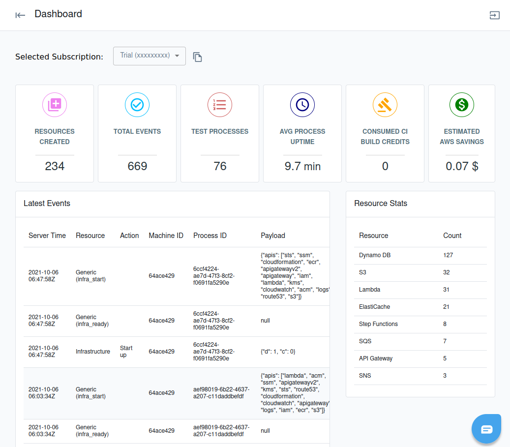

## LocalStack Event Analytics

LocalStack allows for transparent collection of execution events, in order to provide usage analytics and insights into the testing process overall.

Simply configure your system with the `LOCALSTACK_API_KEY` environment variable, and the system will start making your events accessible on the LocalStack dashboard at https://app.localstack.cloud/dashboard.


Please note that data privacy is one of our key concerns; data is only collected in an anonymized way, and never exposes any sensitive information about your application.


The following screenshot shows an the Analytics Dashboard in action:

The top row shows a summary of your LocalStack usage.
A test process or Process ID refers to a single run of LocalStack.
The table shows the detailed list of events sorted by date.

## Configuration

You can disable event reporting on your LocalStack client by setting the environment variable `DISABLE_EVENTS=1`.

{}
Brave blocks `localhost` requests due to security by default via shields, some sites need access to `localhost/127.0.0.1` to work correctly. Easy option to allow a user to enable this is manually enabling via the site `brave://settings/content/insecureContent`.
{}
