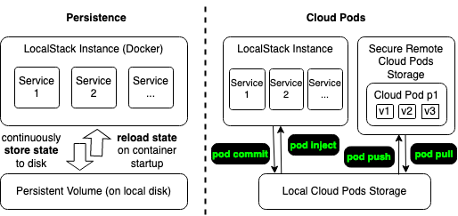

Cloud Pods are a mechanism that allows you to take a snapshot of the state in your current LocalStack instance, persist it to a storage backend, and easily share it with your team members.



While the [Persistence]() feature ensures that the service state survives container restarts, Cloud Pods go beyond and allow more fine-grained control over your state.
Instead of simply restoring a state when restarting LocalStack, Cloud Pods allow you to take snapshots of your local instance (with the `commit` command) and inject such snapshots into a running instance (with the `inject` command) without requiring a restart.

In addition, we provide a remote storage backend that can be used to store the state of your running application and share it with your team members.

You can interact with Cloud Pods via the Web UI, and to load and store the persistent state of pods, you can use the `localstack` [command-line interface (CLI)]().


Below is a simple example of how you can `push` and `pull` Cloud Pods to/from the remote platform using the `localstack` CLI:

```bash
# User 1 pushes state of Cloud Pod to persistent server
$ awslocal kinesis list-streams
{"StreamNames": ["mystream123"]}
$ localstack pod push --name mypod1
...

# User 2 pulls state from the server to local instance
$ localstack pod pull --name mypod1
$ awslocal kinesis list-streams
{"StreamNames": ["mystream123"]}
```

{}
Currently, Cloud Pods CLI commands require to set a `LOCALSTACK_API_KEY`.
Additionally, they require to install `localstack` runtime dependencies. 
You can install them with `pip install localstack"[runtime]"`.
{}

After pulling the pod, LocalStack will automatically inject its state into your instance at runtime, without requiring a restart.
By default, the injecting state will replace the one in current the application state.
The application and the injecting state can be merged with the `--merge` flag.

{}
Please be aware that the merge feature is still experimental and might lead sometimes to unwanted results.
Please make sure to create a backup of any data before merging a cloud pod, if required.
{}
