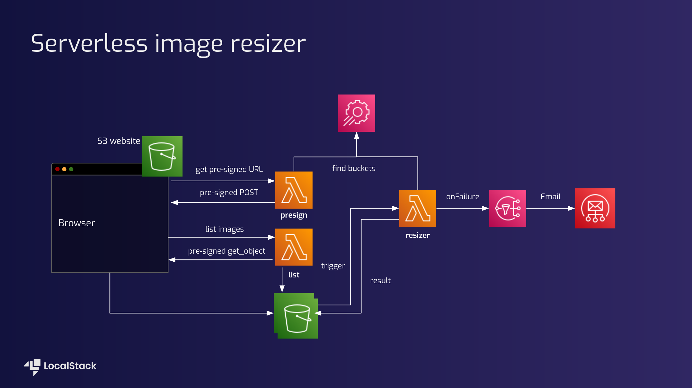
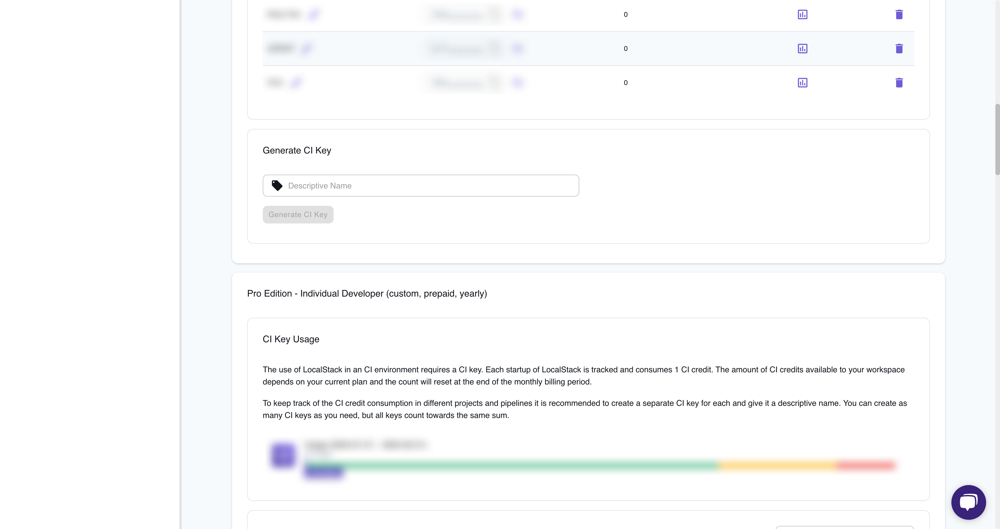

## Introduction

Building and maintaining applications that interact with AWS services can be a challenge. Testing these integrations in a reliable and efficient manner is crucial for ensuring smooth operation. This tutroial introduces a powerful combination: LocalStack and GitHub Actions.

We'll explore how to leverage LocalStack, a drop-in replacement for AWS and GitHub Actions, a CI/CD tool, to streamline our cloud integration testing process. LocalStack facilitates cloud integration testing with frameworks like `pytest`. This streamlines development workflows by reducing reliance on cloud, minimizing cloud costs, and ultimately improving developer experience. 

In this tutorial we will learn to create the Github Action Workflow to automate the integration testing process for our demo sample. 

## Prerequisites

1. LocalStack Pro with [LocalStack Auth Token](https://docs.localstack.cloud/getting-started/auth-token/)
2. [Docker](https://docs.docker.com/engine/install/)
3. [Python-3](https://www.python.org/downloads/)
4. [LocalStack web application account](https://app.localstack.cloud/sign-in)
5. [GitHub account](https://github.com/) & [`gh` CLI](https://github.com/cli/cli?tab=readme-ov-file#installation) (optional)

## Architecture Overview

We will be using the demo - [Serverless image resizer](https://github.com/localstack-samples/sample-serverless-image-resizer-s3-lambda/tree/main) for our tutorial. In this serverless image resizer application, a simple frontend  application facilitates image uploads. A separate lambda generates pre-signed URLs for direct upload to a designated S3 bucket. File uploads to this bucket triggers a python lambda that handles image resizing. Another lambda takes charge of listing all uploaded and resized images, additionally generating pre-signed URLs specifically for the browser to display them. 

The architecture incorporates error handling by routing lambda failures to a 'Simple Notification Service' (SNS) topic, which in turn sends an email notification, through 'Amazon Simple Email Service'(SES). 

Using the LocalStack internal `/_localstack/aws/ses` endpoint, we can run end-to-end integration tests to verify that emails have been sent correctly.




## Create the GitHub Action Workflow

We will create a GitHub Action workflow called "Run Integration Tests" to automate the integration testing process for our demo sample. This workflow will execute various steps to ensure smooth testing and monitoring of our application's functionality. It will be covering key aspects such as:
- Setting up Python 3+, docker, installing project dependencies, starting LocalStack for cloud emulation
-  Deploying Infrastructure 
-  Running tests with `pytest` 
-  Enabling localStack logs, sending Slack notifications on failure, and generating & uploading diagnostic reports for troubleshooting purposes.
  
  
To begin, let's clone the [repository](https://github.com/localstack-samples/sample-serverless-image-resizer-s3-lambda/tree/main) and fork it. Afterward, we'll proceed with the following steps:

- Create a new directory named `.github` in the root of the repository.
- Inside the `.github` directory, create a sub-directory named `workflows`.
- Within the `workflows` sub-directory, create a new file called `integration-test.yml`.

Next, we'll outline the various steps needed to build our integration testing workflow. Let's get started!

### Setting Up Development Environment with LocalStack

We will be setting up dependencies and starting localstack in the github runner.

**Step 1: Checkout & set up Python 3+**

This step is crucial for workflows as it checks out your repository's code onto the runner, allowing subsequent steps to access and operate on your project's files. We will also set up a specific Python version (3.11 in this case) on the runner using the `actions/setup-python@v2` action.

```yaml
- name: Checkout
  uses: actions/checkout@v2

- name: Set up Python 3.11
  id: setup-python
  uses: actions/setup-python@v2
  with:
    python-version: 3.11
```

**Step 2: Docker setup (macOS only)**

For macOS environments, this step installs `docker` and starts [`colima`](https://github.com/abiosoft/colima) (Container runtimes on macOS (and Linux) with minimal setup), which could be necessary for certain development or testing scenarios.

```yaml
- name: Docker setup (macOS only)
  id: setup-docker-mac
  if: ${{ runner.os == 'macOS' }}
  run: |
    brew install docker
    colima start
```

**Step 3: Set up Project**

This step installs the dependencies listed in your [`requirements-dev.txt`](https://github.com/localstack-samples/sample-serverless-image-resizer-s3-lambda/blob/main/requirements-dev.txt) file, ensuring that your project has all the necessary libraries and packages to run correctly.

```yaml
- name: Set up Project
  run: |
    pip install -r requirements-dev.txt
```

**Step 4: Start LocalStack**

In the following action, we start LocalStack with specific configurations and environment variables set, such as `LOCALSTACK_API_KEY`. It is required to activate your Pro license on the GitHub Actions runner. We are passing the `LOCALSTACK_API_KEY` as a **repository secret**, we will see how to set this up soon. Later in the action we are setting the log level to `TRACE` to get detailed logs.

```yaml
- name: Start LocalStack
  uses: LocalStack/setup-localstack@main
  with:
    image-tag: 'latest'
    use-pro: 'true'
    configuration: LS_LOG=trace
    install-awslocal: 'true'
  env:
    LOCALSTACK_API_KEY: ${{ secrets.LOCALSTACK_API_KEY }}
```

### Deploy Infrastructure

With our LocalStack environment and dependencies set up, we're ready to deploy the application infrastructure using LocalStack on the GitHub runner.

**Step 5: Deploy infrastructure**

This step executes a shell script [`bin/deploy.sh`](https://github.com/localstack-samples/sample-serverless-image-resizer-s3-lambda/blob/main/bin/deploy.sh) that handles deploying your project's infrastructure. This script automates the setup of various AWS services using LocalStack for local development and testing. It creates S3 buckets, SNS topics and subscriptions, deploys Lambda functions, sets up Lambda function URL configurations, and configures S3 bucket notifications. 

It also hosts a static website on an S3 bucket. After execution, it provides the URLs for the deployed Lambda functions and the web app.

```yaml
- name: Deploy infrastructure
  run: |
    bin/deploy.sh
```

### Implement integration tests against LocalStack

We will implement an integration test to run against our infrastructure using `pytest`. This will ensure that our infrastructure and code deployment are functioning correctly. For creating tests, create a folder named `tests` and create a file named `test_integration.py`. Add the necessary imports and [`pytest fixtures`](https://docs.pytest.org/en/6.2.x/reference.html#fixtures-api):

In our [demo](https://github.com/localstack-samples/sample-serverless-image-resizer-s3-lambda/blob/main/tests/test_integration.py), we have implemented tests for two key functionalities:

- `test_s3_resize_integration`: This test uploads an image file to the source bucket, triggers a resize operation, and checks if the resized image appears in the target bucket. It verifies the correctness of the resizing process.
- `test_failure_sns_to_ses_integration`: This test uploads a file to the source bucket, simulating a failure scenario. It checks if a message regarding the failure is successfully sent from the SNS topic to the SES endpoint, validating the failure notification mechanism.
  

**Lets dive into one of the test's code**

This test function uploads an image file ("`nyan-cat.png`") to a source bucket specified by parameters fetched from AWS SSM. It then waits for the resized image to appear in a target bucket and verifies that the resized image file is smaller than the original file. After successful verification, it deletes both the original and resized images from their respective buckets:

```python
def test_s3_resize_integration():
    file = os.path.join(os.path.dirname(__file__), "nyan-cat.png")
    key = os.path.basename(file)
    parameter = ssm.get_parameter(Name="/localstack-thumbnail-app/buckets/images")
    source_bucket = parameter["Parameter"]["Value"]
    parameter = ssm.get_parameter(Name="/localstack-thumbnail-app/buckets/resized")
    target_bucket = parameter["Parameter"]["Value"]
    s3.upload_file(file, Bucket=source_bucket, Key=key)
    # wait for the resized image to appear
    s3.get_waiter("object_exists").wait(Bucket=target_bucket, Key=key)
    s3.head_object(Bucket=target_bucket, Key=key)
    s3.download_file(
        Bucket=target_bucket, Key=key, Filename="/tmp/nyan-cat-resized.png"
    )
    assert os.stat("/tmp/nyan-cat-resized.png").st_size &lt; os.stat(file).st_size
    s3.delete_object(Bucket=source_bucket, Key=key)
    s3.delete_object(Bucket=target_bucket, Key=key)
```

**Step 6: Run Tests**

Let's create the action to run the tests. 

This step runs your project's integration tests using `pytest`, with AWS related environment variables set for testing against AWS services provided via LocalStack.

```yaml
- name: Run Tests
  env:
    AWS_DEFAULT_REGION: us-east-1
    AWS_REGION: us-east-1
    AWS_ACCESS_KEY_ID: test
    AWS_SECRET_ACCESS_KEY: test
  run: |
    pytest tests
```

### Configure a CI key for GitHub Actions

Now we have created the whole workflow and we are all set to run in our CI pipeline. For this you need to set up a continuous integration (CI) key for LocalStack. LocalStack requires a CI Key for use in CI or similar automated environments.

Follow these steps to add your LocalStack CI key to your GitHub repository:

1. Go to the [LocalStack Web Application](https://app.localstack.cloud/sign-in) and access the CI Keys page.
   
   
  
2. Switch to the Generate CI Key tab, provide a name, and click Generate [CI Key](https://app.localstack.cloud/workspace/ci-keys).
3. In your [GitHub repository secrets](https://docs.github.com/en/actions/security-guides/using-secrets-in-github-actions), set the Name as `LOCALSTACK_API_KEY` and the Secret as the CI Key.

### Monitoring and Reporting Actions
 
We will now implement monitoring and reporting actions. It will enable teams to monitor service activity, promptly notify stakeholders of critical events, generate detailed diagnostic reports for troubleshooting, and securely store these reports for further analysis:

1. **LocalStack Logs**: Display LocalStack logs to monitor service activity.
2. **Slack Notification**: Notify stakeholders via Slack in case of job failure or non-pull request events.
3. **Generate Diagnostic Report**: Create a diagnostic report using LocalStack's diagnostic endpoint if the job fails.
4. **Upload Diagnostic Report**: Upload the generated diagnostic report as an artifact for detailed analysis in case of job failure.

**Step 7: Show LocalStack logs**

In case of any issues or for debugging purposes, this step displays the LocalStack logs to provide insights into the interactions and operations performed during the workflow.

```yaml
- name: Show localstack logs
  if: always()
  run: |
    localstack logs
```

**Step 8: Send a Slack notification**

When the workflow encounters a failure or for non-pull request events, this step sends a notification to a Slack channel using the `ravsamhq/notify-slack-action@v2` action, providing details about the workflow status and relevant links.

```yaml
- name: Send a Slack notification
  if: failure() || github.event_name != 'pull_request'
  uses: ravsamhq/notify-slack-action@v2
  with:
    status: ${{ job.status }}
    token: ${{ secrets.GITHUB_TOKEN }}
    notification_title: "{workflow} has {status_message}"
    message_format: "{emoji} *{workflow}* {status_message} in &lt;{repo_url}|{repo}>"
    footer: "Linked Repo &lt;{repo_url}|{repo}> | &lt;{run_url}|View Workflow run>"
    notify_when: "failure"

  env:
    SLACK_WEBHOOK_URL: ${{ secrets.SLACK_WEBHOOK_URL }}
```

**Step 9: Generate a Diagnostic Report**

In case of a failure, this step generates a diagnostic report by querying LocalStack, compresses it, and stores it as `diagnose.json.gz` for further analysis.

```yaml
- name: Generate a Diagnostic Report
  if: failure()
  run: |
    curl -s localhost:4566/_localstack/diagnose | gzip -cf > diagnose.json.gz
```

**Step 10: Upload the Diagnostic Report**

Upon failure of any step of the workflow, this  action uploads the generated diagnostic report as an artifact, making it accessible for review and troubleshooting.

```yaml
- name: Upload the Diagnostic Report
  if: failure()
  uses: actions/upload-artifact@v3
  with:
    name: diagnose.json.gz
    path: ./diagnose.json.gz
```

## Best practice for LocalStack and CI

**Streamline State Management:** Instead of reinventing the wheel with manual state scripting, consider utilizing existing tools such as [LocalStack SAM](https://docs.localstack.cloud/user-guide/integrations/aws-sam/) for serverless applications. 

**Leverage Cloud Pods Effectively:** LocalStack's [Cloud Pods](https://docs.localstack.cloud/user-guide/state-management/) offer a valuable optimization technique. By pre-populating your LocalStack environment with specific data sets or configurations, you can significantly reduce setup time during CI runs and also maintain consistency across CI runs, ensuring efficient test execution.


## Conclusion


## Additional resources

1. Continuous Integration Doc [https://docs.localstack.cloud/user-guide/ci/](https://docs.localstack.cloud/user-guide/ci/)
2. Gitlab CI [https://docs.localstack.cloud/user-guide/ci/gitlab-ci/](https://docs.localstack.cloud/user-guide/ci/gitlab-ci/)
3. CI Keys [https://docs.localstack.cloud/user-guide/web-application/ci-keys/](https://docs.localstack.cloud/user-guide/web-application/ci-keys/)
