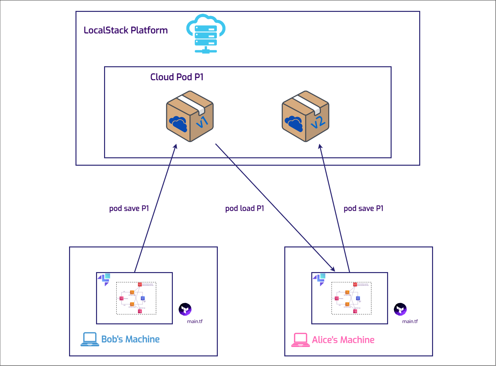

# **Introduction**

By replicating environments, teams can share the exact conditions under which a bug occurs.

For developing AWS applications locally, the tool of choice is LocalStack, which can sustain a full-blown comprehensive stack.
However, when issues appear, and engineers need a second opinion from a colleague, recreating the environment from scratch can leave
details slipping through the cracks.
This is where Cloud Pods come in, to encapsulate the state of the LocalStack instance and allow for seamless
collaboration.
While databases have snapshots, similarly, LocalStack uses Cloud Pods for reproducing state and data.

In this tutorial, we will explore a common situation where a basic IAM misconfiguration causes unnecessary delays in finding the right solution.
We will also discuss the best practices to prevent this and review some options for configuring Cloud Pod storage.
The full sample application can be found [on GitHub](https://github.com/localstack-samples/cloud-pods-collaboration-demo) to clone, for following along more easily.

### **Prerequisites**

- [LocalStack CLI](https://docs.localstack.cloud/getting-started/installation/#localstack-cli) (preferably using `pip`)
- [Docker](https://docs.docker.com/engine/install/)
- [Terraform](https://developer.hashicorp.com/terraform/tutorials/aws-get-started/install-cli) or [OpenTofu](https://opentofu.org/docs/intro/install/) and [terraform-local](https://docs.localstack.cloud/user-guide/integrations/terraform/#install-the-tflocal-wrapper-script)
- Optional for Lambda build & editing: [Maven 3.9.4](https://maven.apache.org/install.html) & [Java 21](https://www.java.com/en/download/help/download_options.html)

- Basic knowledge of AWS services (API Gateway, Lambda, DynamoDB, IAM)
- Basic understanding of Terraform for provisioning AWS resources

In this demo scenario, a new colleague, Bob, joins the company, clones the application repository, and starts working on the Lambda code.
He will add the necessary
resources in the Terraform configuration file and some IAM policies that the functions need in order to access the database.
He is following good practice rules, where the resource has only the necessary permissions.
However, Bob encounters an error despite this.

### Architecture Overview

The stack consists of an API Gateway that exposes endpoints and integrates with two Lambda functions responsible for adding and fetching
products from a DynamoDB database.
IAM policies are enforced to ensure compliance with the
**[principle of least privilege](https://en.wikipedia.org/wiki/Principle_of_least_privilege)**, and the logs will be sent to the CloudWatch service.

### Note

This demo application is suitable for AWS and behaves the same as on LocalStack.
You can try this out by running the Terraform configuration file against the AWS platform.


### Starting LocalStack

In the root directory, there is a `docker-compose.yml` file that will spin up version 3.3.0 of LocalStack, with an
important configuration flag, `ENFORCE_IAM=1`, which will facilitate IAM policy evaluation and enforcement.
For this
example, a `LOCALSTACK_AUTH_TOKEN` is needed, which you can find in the LocalStack web app on the
[Getting Started](https://app.localstack.cloud/getting-started) page.


$ export LOCALSTACK_AUTH_TOKEN=<your-auth-token>
$ docker compose up


### The Terraform Configuration File

The entire Terraform configuration file for setting up the application stack is available in the same repository at
https://github.com/localstack-samples/cloud-pods-collaboration-demo/blob/main/terraform/main.tf.
To deploy all the resources on LocalStack,
navigate to the project's root folder and use the following commands:


$ cd terraform
$ tflocal init
$ tflocal plan
$ tflocal apply --auto-approve


`tflocal` is a small wrapper script to run Terraform against LocalStack.
The endpoints for all services are configured to point to the
LocalStack API, which allows you to deploy your unmodified Terraform scripts against LocalStack.

- **`init`**: This command initializes the Terraform working directory, installs any necessary plugins, and sets up the backend.
- **`plan`**: Creates an execution plan, which allows you to review the actions Terraform will take to change your infrastructure.
- **`apply`**: Finally, the **`apply`** command applies the changes required to reach the desired state of the configuration.
If **`-auto-approve`** is used, it bypasses the interactive approval step normally required.

As mentioned previously, there is something missing from this configuration, and that is the **`GetItem`** operation permission
for one of the Lambda functions:

```java
resource "aws_iam_policy" "lambda_dynamodb_policy" {
  name        = "LambdaDynamoDBAccess"
  description = "IAM policy for accessing DynamoDB from Lambda"

  policy = jsonencode({
    Version = "2012-10-17"
    Statement = [
      {
        Action = [
          "dynamodb:Scan",
          "dynamodb:Query",
          "dynamodb:UpdateItem",
          "dynamodb:PutItem",
        ]
        Effect   = "Allow"
        Resource = "*"
      },
    ]
  })
}
```

Bob has mistakenly used `dynamodb:Scan` and `dynamodb:Query`, but missed adding the `dynamodb:GetItem` action to the policy document above.

### Reproducing the issue locally

Let’s test out the current state of the application.
The Terraform configuration file outputs the REST API ID of the API Gateway.
We can capture that value and use it further to invoke the **`add-product`** Lambda:


$ export rest_api_id=$(cd terraform; tflocal output --raw rest_api_id)


The endpoint for the API Gateway is constructed similarly to the one on AWS:

**`
https://<apiId>.execute-api.localhost.localstack.cloud:4566/<stageId>/<path>
`**

So adding two products to the database is straightforward using `curl`:


$ curl --location "http://$rest_api_id.execute-api.localhost.localstack.cloud:4566/dev/productApi" \
--header 'Content-Type: application/json' \
--data '{
  "id": "34534",
  "name": "EcoFriendly Water Bottle",
  "description": "A durable, eco-friendly water bottle designed to keep your drinks cold for up to 24 hours and hot for up to 12 hou
s. Made from high-quality, food-grade stainless steel, it'\''s perfect for your daily hydration needs.",
  "price": "29.99"
}'

$ curl --location "http://$rest_api_id.execute-api.localhost.localstack.cloud:4566/dev/productApi?id=82736" \
--header 'Content-Type: application/json' \
--data '{
  "id": "82736",
  "name": "Sustainable Hydration Flask",
  "description": "This sustainable hydration flask is engineered to maintain your beverages at the ideal temperature—cold for 24 hours and hot for 12 hours.
Constructed with premium, food-grade stainless steel, it offers an environmentally friendly solution to stay hydrated throughout the day.",
  "price": "31.50"
}'


The response is the one that we expect: `Product added/updated successfully.`

However, retrieving one of the products does not return the desired result:


$ curl --location "http://$rest_api_id.execute-api.localhost.localstack.cloud:4566/dev/productApi?id=34534"
<disable-copy>
Internal server error⏎  
</disable-copy>


An `Internal server error⏎`  does not give out too much information.
Bob does not know for sure what could be
causing this.
The Lambda code and the configurations look fine to him.

## Using Cloud Pods for collaborative debugging

### Creating a Cloud Pod

To share this exact environment and issue with Alice, a more experienced colleague, Bob only needs to run a simple `localstack pod` command:


$ localstack pod save cloud-pod-product-app
<disable-copy>
Cloud Pod `cloud-pod-product-app` successfully created ✅
Version: 1
Remote: platform
Services: sts,iam,apigateway,dynamodb,lambda,s3,cloudwatch,logs
</disable-copy>


LocalStack provides a remote storage backend that can be used to store the state of your application and share it with your team members.

The Cloud Pods CLI is included in the LocalStack CLI installation, so there’s no need for additional plugins to begin using it.
The `LOCALSTACK_AUTH_TOKEN` needs to be set as an environment variable.

Additionally, there are other commands for managing Cloud Pods included in the CLI:


$ localstack pod --help
<disable-copy>
Usage: localstack pod [OPTIONS] COMMAND [ARGS]...

  Manage the state of your instance via Cloud Pods.

Options:
  -h, --help  Show this message and exit.

Commands:
  delete    Delete a Cloud Pod
  list      List all available Cloud Pods
  load      Load the state of a Cloud Pod into the application runtime
  remote    Manage Cloud Pod remotes
  save      Create a new Cloud Pod
  versions  List all available versions for a Cloud Pod
</disable-copy>


### Pulling and Loading the Cloud Pod

The workflow between Alice and Bob is incredibly easy:



Now, in a fresh LocalStack instance, Alice can immediately load the Cloud Pod, because she's part of the
same organization:


$ localstack pod load  cloud-pod-product-app
<disable-copy>
Cloud Pod cloud-pod-product-app successfully loaded
</disable-copy>


### Debugging and Resolving the Issue

Not only can Alice easily reproduce the bug now, but she also has access to the state and data of the services
involved, meaning that the Lambda logs are still in the CloudWatch log groups.


By spotting the error message, there’s an instant starting point for checking the source of the problem.
The error message displayed in the logs is very specific:

`"Error: User: arn:aws:sts::000000000000:assumed-role/productRole/get-product is not authorized to perform: dynamodb:GetItem on resource: arn:aws:dynamodb:us-east-1:000000000000:table/Products because no identity-based policy allows the dynamodb:GetItem action (Service: DynamoDb, Status Code: 400, Request ID: d50e9dad-a01a-4860-8c21-e844a930ba7d)"`

### Identifying the Misconfiguration

The error points to a permissions issue related to accessing DynamoDB.
The action **`dynamodb:GetItem`** is
not authorized for the role, preventing the retrieval of a product by its ID.
This kind of error was not foreseen as one
of the exceptions to be handled in the application.
IAM policies are not always easy and straightforward, so it's a well known fact that
these configurations are prone to mistakes.

To confirm the finding, Alice now has the exact same environment to reproduces the error in.
There are no machine specific configurations and
no other manual changes.
This leads to the next step in troubleshooting: **inspecting the Terraform configuration file** responsible
for defining the permissions attached to the Lambda role for interacting with DynamoDB.

### Fixing the Terraform Configuration

Upon review, Alice discovers that the Terraform configuration does not include the necessary permission **`dynamodb:GetItem`** in the
policy attached to the Lambda role.
This oversight explains the error message.
The Terraform configuration file acts as a
blueprint for AWS resource permissions, and any missing action can lead to errors related to authorization.

This scenario underscores the importance of thorough review and testing of IAM roles and policies when working with AWS resources.
It's easy to overlook a single action in a policy, but as we've seen, such an omission can significantly impact application
functionality.
By carefully checking the Terraform configuration files and ensuring that all necessary permissions are included,
developers can avoid similar issues and ensure a smoother, error-free interaction with AWS services.

The action list should now look like this:


resource "aws_iam_policy" "lambda_dynamodb_policy" {
  name        = "LambdaDynamoDBAccess"
  description = "IAM policy for accessing DynamoDB from Lambda"

  policy = jsonencode({
    Version = "2012-10-17"
    Statement = [
      {
        Action = [
          "dynamodb:GetItem",
          "dynamodb:UpdateItem",
          "dynamodb:PutItem",
        ]
        Effect   = "Allow"
        Resource = "*"
      },
    ]
  })
}


To double-check, Alice creates the stack on AWS, and observes that the issue is the same, related to policy
misconfiguration:


### Impact on the team

Alice has updated the infrastructure and deployed a new version of the Cloud Pod with the necessary fixes.
Bob will
access the updated infrastructure and proceed with his tasks.
Meanwhile, Carol is developing integration tests for the
CI pipeline.
She will use the stable version of the infrastructure to ensure that the workflows function effectively from
start to finish.


### Other Remote Options

For organizations with specific data regulations, LocalStack offers multiple remote storage options for Cloud Pods,
allowing full control with on-premises storage if needed.
That way, Bob, Alice and Carol could collaborate using either an S3 bucket remote storage or an ORAS (OCI Registry as Storage) remote storage.
The Cloud Pods command-line interface enables users to manage these remotes with ease, by following the instructions in the
[documentation](https://docs.localstack.cloud/user-guide/state-management/cloud-pods/#remotes).

## Conclusion

Cloud Pods play a crucial role in team collaboration, significantly speeding up development processes.
The multiple and
versatile options for remote storage can support different business requirements for companies that prefer using the
environments they control.
Cloud Pods are not just for teamwork; they also excel in other areas, such as creating
resources in Continuous Integration (CI) for ultra-fast testing pipelines.

## Additional resources

- [Cloud Pods documentation](https://docs.localstack.cloud/user-guide/state-management/cloud-pods/)
- [Terraform for AWS](https://developer.hashicorp.com/terraform/tutorials/aws-get-started)
