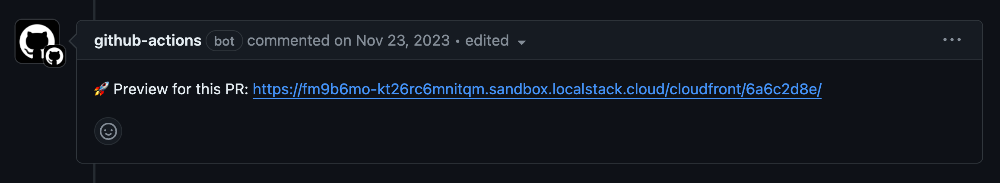

## Introduction

LocalStack's core cloud emulator allows you set up your cloud infrastructure on your local machine. You can access databases, queues, and other managed services without needing to connect to a remote cloud provider. This speeds up your Software Development Life Cycle (SDLC) by making development and testing more efficient. Despite this, you still need a staging environment to do final acceptance tests before deploying your application to production.

In many cases, staging environments are costly and deploying changes to them takes a lot of time. Also, teams can only use one staging environment at a time, which makes it difficult to test changes quickly.

With LocalStack's Ephemeral Instances, you can create short-lived, self-contained deployments of LocalStack in the cloud. These Ephemeral Instances let you deploy your application on a remote LocalStack container, creating an Application Preview. This allows you to run end-to-end tests, preview features, and collaborate within your team or across teams asynchronously.

This tutorial will show you how to use LocalStack's Ephemeral Instance feature to generate an Application Preview automatically for every new Pull Request (PR) using a GitHub Action workflow.

## Prerequisites

- [LocalStack Web Application account](https://app.localstack.cloud/)
- [GitHub Account](https://github.com/join)  & [`gh` CLI](https://github.com/cli/cli?tab=readme-ov-file#installation) (optional)

## Tutorial: Setting up Application Previews for your cloud application

This tutorial uses a [public LocalStack sample](https://github.com/localstack-samples/sample-notes-app-dynamodb-lambda-apigateway) to showcase a simple note-taking application using the modular AWS SDK for JavaScript. The example application deploys several AWS resources including DynamoDB, Lambda, API Gateway, S3, Cognito, and CloudFront, functioning as follows:

-   Five Lambda functions handle basic CRUD functionality around note entities.
-   The frontend is built with React and served via Cloudfront and an S3 bucket.
-   DynamoDB is used as a persistence layer to store the notes.
-   API Gateway exposes the Lambda functions through HTTP APIs.
-  A Cognito User Pool is used for Authentication and Authorization.

This tutorial guides you through setting up a GitHub Action workflow to create an Application Preview of the sample application by deploying it on an ephemeral instance.

### Create the GitHub Action workflow

GitHub Actions serves as a continuous integration and continuous delivery (CI/CD) platform, automating software development workflows directly from GitHub. It allows customization of actions and automation throughout the software development lifecycle.

In this tutorial, you'll implement a workflow that:

- Checks out the repository from GitHub.
- Installs necessary dependencies.
- Deploys the application on a ephemeral LocalStack Instance using a GitHub Action Runner to generate a sharable application preview.

To begin, fork the [LocalStack sample repository](https://github.com/localstack-samples/sample-notes-app-dynamodb-lambda-apigateway) on GitHub. If you're using GitHub's `gh` CLI, fork and clone the repository with this command:

```bash 
gh repo fork https://github.com/localstack-samples/sample-notes-app-dynamodb-lambda-apigateway
```

After forking and cloning, navigate to the `.github/workflows` directory in your forked repository and open the `preview.yml` file. This file will contain the GitHub Action workflow configuration.

Now you're set to create your GitHub Action workflow, which will deploy your cloud application on an ephemeral instance using LocalStack.

### Set Up the Actions & dependencies

To achieve the goal, you can utilize a few prebuilt Actions:

-   [`actions/checkout`](https://github.com/actions/checkout): Checkout the application code with Git.
-   [`setup-localstack/ephemeral/startup`](https://github.com/localstack/setup-localstack): Configure the workflow to generate the application preview.
-   [`LocalStack/setup-localstack/finish`](https://github.com/localstack/setup-localstack): Add a comment to the PR, which includes a URL to the application preview.

You will find the following content to the `preview.yml` file that you opened earlier:

```yaml 
name: Create PR Preview

on:
  pull_request:
    types: [opened, synchronize, reopened]
```

This configuration ensures that every time a pull request is raised, the action is triggered.

A new job named `preview` specifies the GitHub-hosted runner to execute our workflow steps, while checking out the code:

```yaml 
jobs:
  preview:
    permissions: write-all
    runs-on: ubuntu-latest
    timeout-minutes: 15
    steps:
      - name: Checkout
        uses: actions/checkout@v4
```

### Deploy the application preview

To deploy the application preview, you can utilize the `LocalStack/setup-localstack/ephemeral/startup` action, which requires the following parameters:

-   `github-token`: Automatically configured on the GitHub Action runner.
-   `localstack-api-key`: Configuration of a LocalStack CI key (`LOCALSTACK_API_KEY`) to activate licensed features in LocalStack.
-   `preview-cmd`: The set of commands necessary to deploy the application, including its infrastructure, on LocalStack.

The following step sets up the dependencies and deploys the application preview on an ephemeral LocalStack instance:

```yaml 
- name: Deploy Preview
  uses: LocalStack/setup-localstack/ephemeral/startup@v0.2.0
  with:
    github-token: ${{ secrets.GITHUB_TOKEN }}
    localstack-api-key: ${{ secrets.LOCALSTACK_API_KEY }}
    preview-cmd: |
        npm install -g aws-cdk-local aws-cdk
        pip install awscli-local[ver1]
        make build
        make bootstrap
        make deploy
        make prepare-frontend-local
        make build-frontend
        make bootstrap-frontend
        make deploy-frontend
        distributionId=$(awslocal cloudfront list-distributions | jq -r '.DistributionList.Items[0].Id')
        echo "PREVIEW_URL=$AWS_ENDPOINT_URL/cloudfront/$distributionId/" >> $GITHUB_ENV
```

In the provided workflow:

-   Dependencies such as `awslocal`, AWS CDK library, and the `cdklocal` wrapper are installed.
-   `Makefile` targets are employed to build the application, bootstrap the CDK stack, and deploy it.
-   Additionally, the frontend application is built and deployed on an S3 bucket served via a CloudFront distribution.
-   The application preview URL is provided by querying the CloudFront distribution ID using `awslocal`.

To complete the process, the last step attaches the application preview URL to the Pull Request (PR) as a comment. This allows for quick access to the deployed URL for validating features or enhancements pushed to your application.

```yaml 
- name: Finalize PR comment
  uses: LocalStack/setup-localstack/finish@v0.2.0
  with:
    github-token: ${{ secrets.GITHUB_TOKEN }}
    include-preview: true
    preview-url: ${{ env.PREVIEW_URL }}
```

### Configure a CI key for GitHub Actions

Before triggering your workflow, set up a continuous integration (CI) key for LocalStack. LocalStack requires a CI Key for usage in CI or similar automated environments to activate licensed features.

Follow these steps to add your LocalStack CI key to your forked GitHub repository:

-   Navigate to the [LocalStack Web Application](https://app.localstack.cloud/) and access the [CI Keys](https://app.localstack.cloud/workspace/ci-keys) page.
-   Scroll down to the **Generate CI Key** card, where you can provide a name, and click **Generate CI Key** to receive a new key.
-   In your [GitHub repository secrets](https://docs.github.com/en/actions/security-guides/using-secrets-in-github-actions), set the **Name** as `LOCALSTACK_API_KEY` and the **Secret** as the CI Key.

Now, you can commit and push your workflow to your forked GitHub repository.

### Run the GitHub Action workflow

Now that the GitHub Action Workflow is set up, each pull request in your cloud application will undergo building, deployment, and packaging as an application preview running within an ephemeral instance. The workflow will automatically update the application preview whenever new commits are pushed to the pull request.


<br><br>

In case your deployment encounters issues and fails on LocalStack, you can troubleshoot by incorporating additional steps to generate a diagnostics report. After downloading, you can visualize logs and environment variables using a tool like [`diapretty`](https://github.com/silv-io/diapretty):

```yaml
- name: Generate a Diagnostic Report
  if: failure()
  run: curl -s localhost:4566/_localstack/diagnose | gzip -cf > diagnose.json.gz

- name: Upload the Diagnostic Report
  if: failure()
  uses: actions/upload-artifact@v3
  with:
    name: diagnose.json.gz
    path: ./diagnose.json.gz
```

## Conclusion

In this tutorial, you've learned how to utilize LocalStack's Ephemeral Instances to generate application previews for your cloud applications. You can explore additional use cases with Ephemeral Instances, including:

- Injecting a pre-defined Cloud Pod into an ephemeral instance to rapidly spin up infrastructure.
- Running your automated end-to-end (E2E) test suite to conduct thorough testing before deploying to production.
- Enabling collaboration across different teams by offering a pre-production environment for collaborative work.
