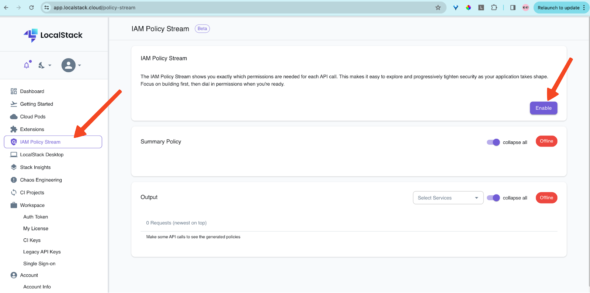
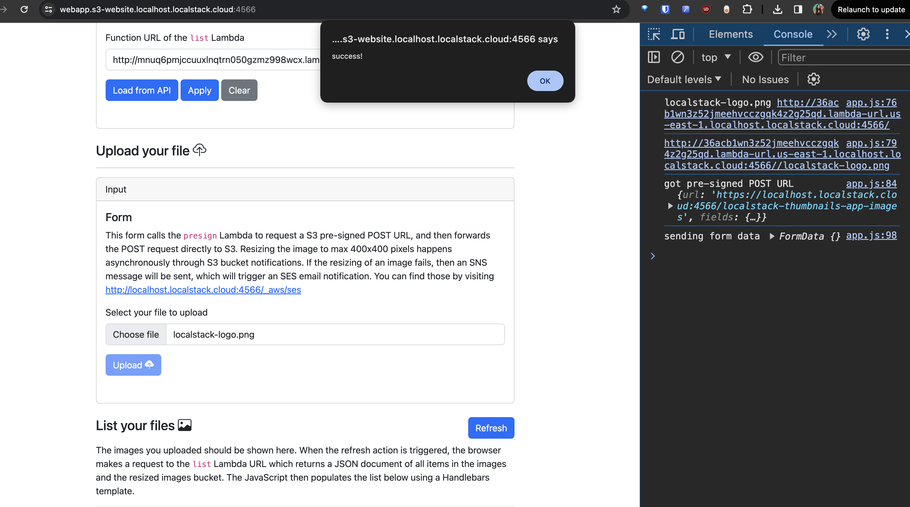
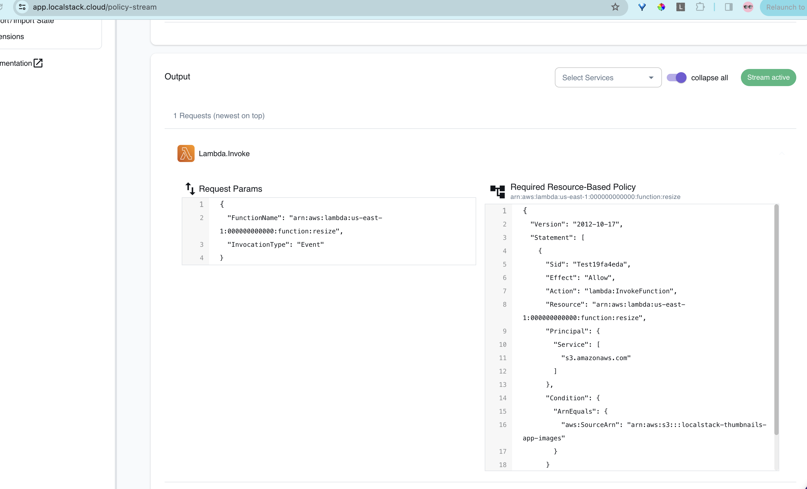
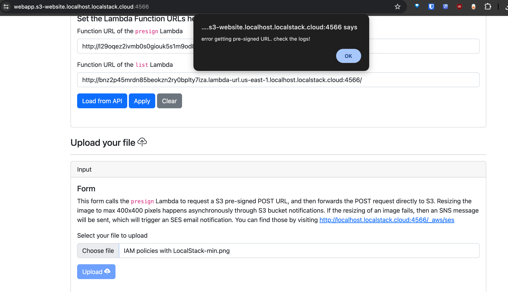

# **Introduction**

When developing cloud and serverless applications, managing access to AWS resources is crucial. This involves setting up IAM roles and crafting policies to grant permissions appropriately. However, crafting these policies effectively can be quite intricate, especially if you aim to restrict access to the bare minimum for all users.

One tool that simplifies this process is LocalStack's IAM Policy Stream. This feature automatically generates IAM policies for your AWS API requests locally, aiding in identifying the precise permissions required for your cloud application. Additionally, it helps catch any potential logical errors, such as unexpected actions, within your policies.

In this tutorial, we'll delve into leveraging LocalStack’s IAM Policy Stream to streamline policy generation and right-sizing while developing and testing a microservice architecture. Let's dive in!


## **Prerequisites**

1. LocalStack Pro with [LocalStack Auth Token](https://docs.localstack.cloud/getting-started/auth-token/)
2. [Docker](https://docs.docker.com/engine/install/)
3. [Python-3](https://www.python.org/downloads/)
4. [LocalStack web application account](https://app.localstack.cloud/sign-in)
5. [GitHub account](https://github.com/) & [`gh` CLI](https://github.com/cli/cli?tab=readme-ov-file#installation) (optional)

- Basic knowledge of [IAM Policy](https://docs.aws.amazon.com/IAM/latest/UserGuide/access_policies.html) 
- Basic understanding of [Terraform](https://developer.hashicorp.com/terraform/intro) for provisioning AWS resources


## Architecture Overview

We will be using the demo - [Serverless image resizer](https://github.com/localstack-samples/sample-serverless-image-resizer-s3-lambda/tree/main) for our tutorial. In this serverless image resizer application, a simple frontend  application facilitates image uploads. A separate lambda generates pre-signed URLs for direct upload to a designated S3 bucket. File uploads to this bucket triggers a python lambda that handles image resizing. Another lambda takes charge of listing all uploaded and resized images, additionally generating pre-signed URLs specifically for the browser to display them. 

The architecture incorporates error handling by routing lambda failures to a 'Simple Notification Service' (SNS) topic, which in turn sends an email notification, through 'Amazon Simple Email Service'(SES). 

Using the LocalStack internal `/_localstack/aws/ses` endpoint, we can run end-to-end integration tests to verify that emails have been sent correctly.


## Right Sizing IAM with LocalStack's IAM Policy Stream

In this tutorial we will dive into deploying a webapp hosted on s3 bucket, that uses AWS lambda to resize images and upload it in a s3 bucket. 

We will see what are IAM policies and how they help control access across the cloud. We will review the current policies attached to the lambdas’ and eventually see how we can leverage LocalStack’s IAM Policy Stream to find the right-sized policy to attach to the lambda to make it work. Let’s get started !

### Understanding IAM Policies

Before proceeding further, let's try to understand IAM Policies.  We'll deploy our web application and its infrastructure using Terraform. We will leverage LocalStack's IAM Policy Stream feature to gain insights into IAM Policies. We'll analyze a specific AWS API call and examine the generated IAM policy for it on the LocalStack Web Application. Later, we will break down the generated IAM Policy. 

#### Deploy the infrastructure

**Set dev environment**

- Clone the [sample demo repository](git@github.com:localstack-samples/sample-serverless-image-resizer-s3-lambda.git) and set required dev environment. Make sure you use the same version as the Python Lambdas to make Pillow work. If you use pyenv, then first install and activate Python 3.11: 
  
  ```
  pyenv install 3.11.6
  pyenv global 3.11.6
  ```

- Create a virtualenv and install all the development dependencies there:
  
  ```
  python -m venv .venv
  source .venv/bin/activate
  pip install -r requirements-dev.txt
  ```

- Start LocalStack Pro with `LOCALSTACK_AUTH_TOKEN` set. You can read about it more from [LocalStack Installation docs](https://docs.localstack.cloud/getting-started/auth-token/):

  `LOCALSTACK_AUTH_TOKEN=... localstack start`

**Deploy the Infrastructure** 

- You can create the AWS infrastructure on LocalStack by running `bin/deploy.sh`. Make sure you have Python 3.11 activated before running the script.
   
- **Using the application**: Once deployed, visit http://webapp.s3-website.localhost.localstack.cloud:4566. Paste the Function URL of the presign Lambda generated into the form field.

  ```
    awslocal lambda list-function-url-configs --function-name presign
    awslocal lambda list-function-url-configs --function-name list
  ```

**Finally, proceed to upload a file directly onto the web application.**


#### Now let's explore the IAM Policy Stream on LocalStack Web Application

1. First go to https://app.localstack.cloud/policy-stream. To use the feature, go to the IAM Policy Stream section, and click on Enable to view the Summary Policy and Output.
   
   

2. Next, let's upload the LocalStack logo image to our frontend app in a new tab.
   
   

3. We'll return to our web app to review the policy generated from the "upload your file" action. Let's delve into its details and break it down step by step
   
   


**Let's breakdown the policy generated:**

```json
{
  "Version": "2012-10-17",
  "Statement": [
    {
      "Sid": "Test19fa4eda",
      "Effect": "Allow",
      "Action": "lambda:InvokeFunction",
      "Resource": "arn:aws:lambda:us-east-1:000000000000:function:resize",
      "Principal": {
        "Service": [
          "s3.amazonaws.com"
        ]
      },
      "Condition": {
        "ArnEquals": {
          "aws:SourceArn": "arn:aws:s3:::localstack-thumbnails-app-images"
        }
      }
    }
  ]
}
```

This IAM policy example grants permission to invoke a specific Lambda function (`resize`) from an Amazon S3 bucket (`localstack-thumbnails-app-images`) under certain conditions. Let's break down each part of the policy:

- **Statement**:
  - **Sid**: `"Test19fa4eda"` is a unique identifier for this statement, often used for reference or auditing purposes.
  - **Effect**: `"Allow"` specifies that the action (`lambda:InvokeFunction`) is allowed.
  - **Action**: `"lambda:InvokeFunction"` permits invoking Lambda functions.
  - **Resource**: `"arn:aws:lambda:us-east-1:000000000000:function:resize"` specifies the ARN of the Lambda function (`resize`) in the `us-east-1` region.
  - **Principal**: Specifies the entity that can perform the action. In this case, the principal is `"Service"` with a value of `"s3.amazonaws.com"`, indicating that the action can be performed by the Amazon S3 service.
  - **Condition**:
    - **ArnEquals**: Checks if the ARN of the source matches `"arn:aws:s3:::localstack-thumbnails-app-images"`. This condition ensures that the Lambda function can only be invoked when the source ARN (the S3 bucket) is `arn:aws:s3:::localstack-thumbnails-app-images`.

#### Explanation of the IAM Policy: 

- This IAM policy allows the Amazon S3 service (`s3.amazonaws.com`) to invoke the `resize` Lambda function (`arn:aws:lambda:us-east-1:000000000000:function:resize`) under specific conditions.
- The condition (`ArnEquals`) ensures that the Lambda function can only be invoked when the source ARN matches `arn:aws:s3:::localstack-thumbnails-app-images`, which is the ARN of the S3 bucket `localstack-thumbnails-app-images`.
- This policy is useful for scenarios where you want a specific S3 bucket to trigger a specific Lambda function, adding a layer of control and security to your AWS resources.

Understanding the structure and components of IAM policies, as demonstrated in this example, helps in effectively managing access control and defining permissions within AWS environments.

### Leveraging LocalStack's IAM Policy Stream

When deploying AWS resources on the cloud, the default policy is to `deny` , thus we need to identify the actual permissions to be given so that the app can function properly and resources can talk to each other. These permissions are what comprises of a `policy`, as we saw in the previous section.

The common issue that we face when giving these permissions is over permissive roles that we attach to these resources. This is one of the common security issues, where a resource has more permissions than necessary. Maintaining the right balance between right-sizing the IAM policies is something developers struggle with, but not anymore! 

LocalStack’s IAM Policy Stream, helps you exactly right-size the IAM policies, based on actual API calls the particular resource does.

In this section, we will use IAM Policy Stream, to find the right-sized IAM policy for our lambda. When you’re creating resources on your AWS cloud, the default is `deny` for AWS policies, thus resources are created with no permissions, by default.

**To observe this in action, follow these steps:**

- Enable IAM Policy Stream on the [dashboard](https://app.localstack.cloud/policy-stream).
- Upload an image on the web app.
- Check the generated IAM policy in the IAM Policy Stream dashboard.
- Save the generated policy for aws resource in a file named `right-sized-presign-lambda-policy.json`
- Apply an 'under-sized' IAM policy to the `presize` Lambda, that generates a pre-sign URL for uploading image to the bucket. We will put a restrictive policy that doesn’t give any permissions to the lambda. This is exactly how it is when you’re creating resources on your AWS cloud and don’t have any policies attached to your resource (lambda, s3 etc). The default is `deny` for AWS policies.
- Attempt to upload an image to the bucket, which should fail due to insufficient permissions granted to the Lambda.
- Attach the right-sized policy generated by IAM Policy Stream and retry uploading, which should now succeed as the Lambda has the necessary permissions.

#### Let's attach a deny policy to `presign` lamda function

```json
{
  "Version": "2012-10-17",
  "Statement": [
    {
      "Sid": "Stmt1714550096312",
      "Action": "*",
      "Effect": "Deny",
      "Resource": "*"
    }
  ]
}
```

We will create this policy as `empty-policy.json` and attach it to our `presign` function.
```bash
awslocal iam create-policy --policy-name EmptyPolicy --policy-document file://empty-policy.json

awslocal lambda add-permission --function-name presign --statement-id EmptyPolicy --action lambda:InvokeFunction --principal "*" --source-arn "arn:aws:lambda:us-east-1:000000000000:function:presign" --source-account "000000000000"
```

This will ensure that the lambda is not able to access any resources and thus simulating real world scenario.

#### Image Upload: Analyzing Application Failure

Lets try uploading an image file and see what we get as response from the frontend. 

 

#### Let's attach the right-sized policy now

Now lets attach the right-sized IAM policy generated from the IAM policy stream, we saved earlier.

```json
{
  "Version": "2012-10-17",
  "Statement": [
    {
      "Sid": "Test92ae9aa9",
      "Effect": "Allow",
      "Action": "sts:AssumeRole",
      "Resource": "arn:aws:iam::000000000000:role/lambda-role",
      "Principal": {
        "Service": [
          "lambda.amazonaws.com"
        ]
      }
    }
  ]
}
```
Now lets apply the policy.

```bash
awslocal iam create-policy --policy-name PreSignAssumeRole --policy-document file://right-sized-presign-lambda-policy.json

awslocal lambda add-permission --function-name presign --statement-id PreSignAssumeRole --action lambda:InvokeFunction --principal "*" --source-arn "arn:aws:lambda:us-east-1:000000000000:function:presign" --source-account "000000000000"
```

We will see that the webapp is againg working as perviously! 

Similarly we can leverage the IAM Policy stream to add the exact IAM policies needed for other resources to function properly. We can add these policies to our Terraform/IAC files. 

## Conclusion

In this tutorial, we've explored how LocalStack's IAM Policy Stream can streamline the process of generating and right-sizing IAM policies for AWS resources. 

Key takeaways from this tutorial include:

- Understanding the importance of IAM policies in controlling access across cloud environments.
- Utilizing LocalStack's IAM Policy Stream to generate policies based on actual API calls and right-sizing them forsecurity.

By incorporating LocalStack IAM Policy Stream into your development workflow, you can enhance access control, improve resource management, and mitigate potential security risks in your AWS environment. 

## Additional resources

- [IAM Policy Enforcement](https://docs.localstack.cloud/user-guide/security-testing/iam-enforcement/) 
- [Identity and Access Management (IAM)](https://docs.localstack.cloud/user-guide/aws/iam/)
- [IAM Policy Stream](https://docs.localstack.cloud/user-guide/security-testing/iam-policy-stream/)