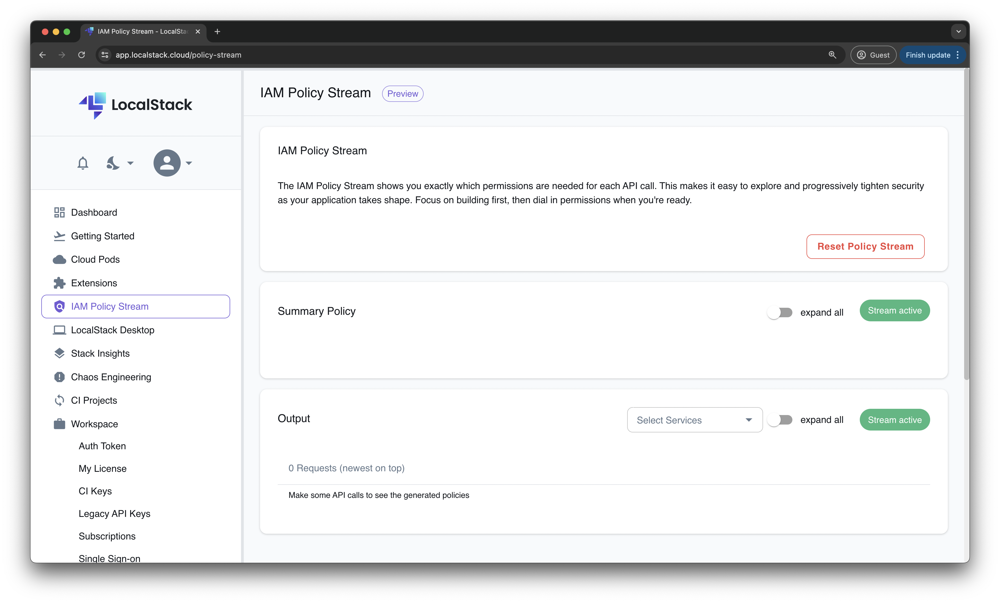
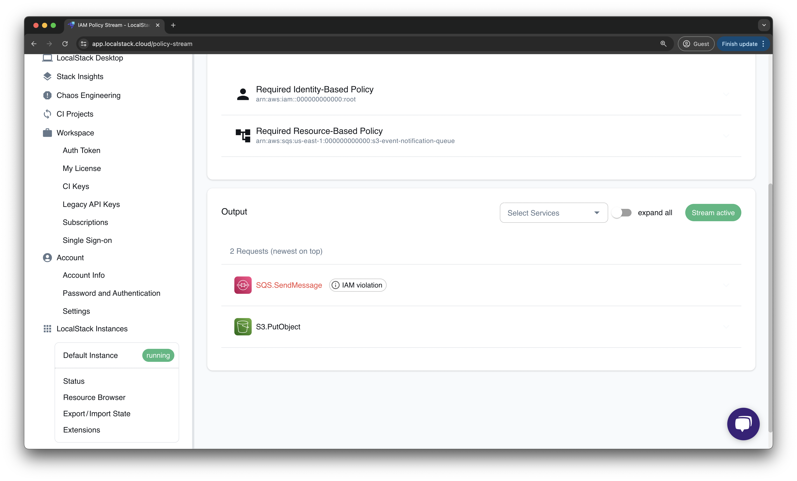
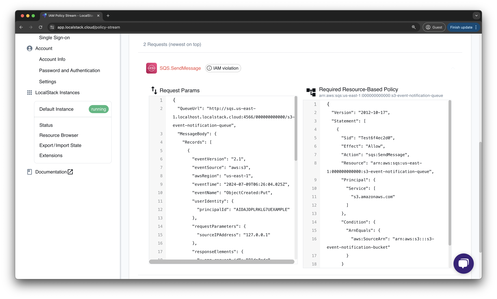
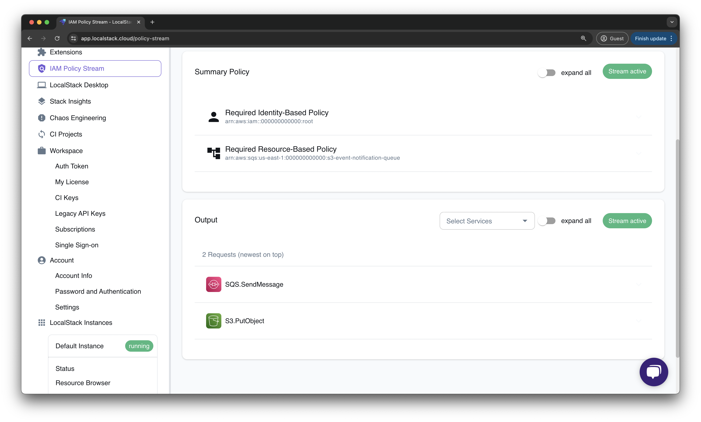
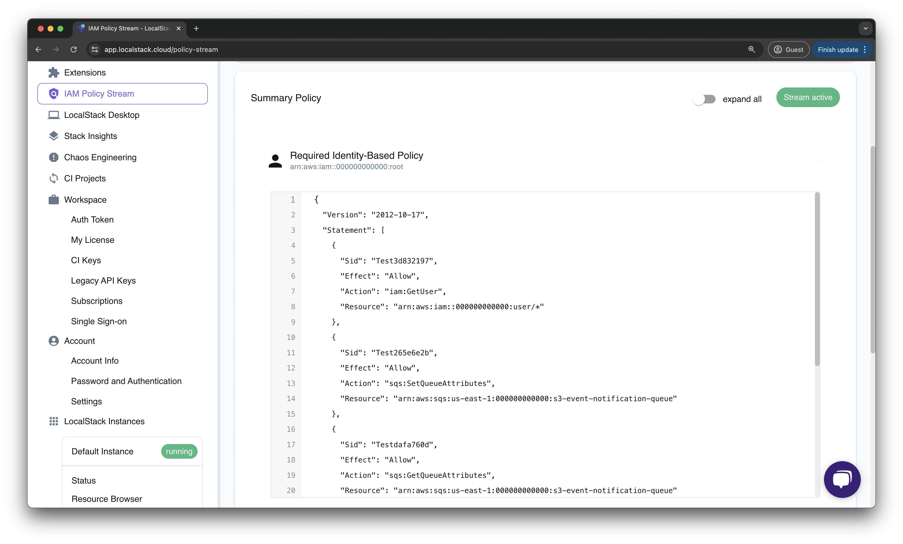
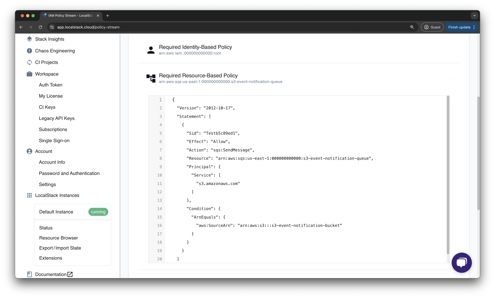

## Introduction

When you're developing cloud and serverless applications, you need to grant access to various AWS resources like S3 buckets and RDS databases. To handle this, you create IAM roles and assign permissions through policies. However, configuring these policies can be challenging, especially if you want to ensure minimal access of all principals to your resources.

[LocalStack IAM Policy Stream](https://app.localstack.cloud/policy-stream) automates the generation of IAM policies for your AWS API requests on your local machine. This stream helps you identify the necessary permissions for your cloud application and allows you to detect logical errors, such as unexpected actions in your policies.

This tutorial will guide you through setting up IAM Policy Stream for a locally running AWS application. We'll use a basic example involving an S3 bucket, an SQS queue, and a bucket notification configuration. You'll generate the policy for the bucket notification configuration and insert it into the SQS queue.

## Why use IAM Policy Stream?

LocalStack enables you to create and enforce local IAM roles and policies using the [`ENFORCE_IAM` feature](https://docs.localstack.cloud/user-guide/security-testing/iam-enforcement/). However, users often struggle to figure out the necessary permissions for different actions. It's important to find a balance, avoiding giving too many permissions while making sure the right ones are granted.

This challenge becomes more complex when dealing with AWS services that make requests not directly visible to users. For instance, if an SNS topic sends a message to an SQS queue and the underlying call fails, there might be no clear error message, causing confusion, especially for those less familiar with the services.

IAM Policy Stream simplifies this by automatically generating the needed policies and showing them to users. This makes it easier to integrate with resources, roles, and users, streamlining the development process. Additionally, it serves as a useful learning tool, helping users understand the permissions linked to various AWS calls and improving the onboarding experience for newcomers to AWS.

## Prerequisites

-   [LocalStack CLI](https://docs.localstack.cloud/getting-started/installation/#localstack-cli)  with  [`LOCALSTACK_AUTH_TOKEN`](https://docs.localstack.cloud/getting-started/auth-token/)
-   [Docker](https://docs.docker.com/get-docker/)
-   [Terraform]() & [`tflocal` wrapper]()
-   [AWS](https://docs.aws.amazon.com/cli/v1/userguide/cli-chap-install.html)  CLI with  [`awslocal` wrapper](https://github.com/localstack/awscli-local)
-   [LocalStack Web Application account](https://app.localstack.cloud/sign-up)
-   [jq](https://jqlang.github.io/jq/download/)

## Tutorial: Configure an S3 bucket for event notifications using SQS

In this tutorial, you will configure a LocalStack S3 bucket to send event notifications to an SQS queue. You will then use IAM Policy Stream to generate the necessary IAM policy for the SQS queue. You will use Terraform to create the resources and the AWS CLI to interact with them. With LocalStack's IAM enforcement enabled, you can thoroughly test your policy and ensure that the development setup mirrors the production environment.

### Start your LocalStack container

Launch the LocalStack container on your local machine using the specified command:


$ DEBUG=1 ENFORCE_IAM=1 IAM_SOFT_MODE=1 localstack start


In the above command:

-   `DEBUG=1` turns on detailed logging to check API calls and IAM violations.
-   `ENFORCE_IAM=1` activates IAM enforcement to make sure only allowed actions are performed.
-   `IAM_SOFT_MODE=1` lets you test IAM enforcement by logging violations without stopping the API calls.

### Create the Terraform configuration

Create a new file called `main.tf` for the Terraform setup of an S3 bucket and an SQS queue. Start by using the `aws_sqs_queue` resource to create an SQS queue named `s3-event-notification-queue`.

```hcl
resource "aws_sqs_queue" "queue" {
  name = "s3-event-notification-queue"
}
```

Next, use the `aws_s3_bucket` resource to create an S3 bucket called `s3-event-notification-bucket`.

```hcl
resource "aws_s3_bucket" "bucket" {
  bucket = "s3-event-notification-bucket"
}
```

Finally, use the `aws_s3_bucket_notification` resource to link the S3 bucket with the SQS queue for sending notifications:

```hcl
resource "aws_s3_bucket_notification" "bucket_notification" {
  bucket = aws_s3_bucket.bucket.id

  queue {
    queue_arn = aws_sqs_queue.queue.arn
    events    = ["s3:ObjectCreated:*"]
  }
}
```

### Deploy the Terraform configuration

You can use `tflocal` to deploy your Terraform configuration within the LocalStack environment. Run the following commands to initialize and apply the Terraform configuration:


$ tflocal init
$ tflocal apply


You will be prompted to confirm the changes. Type `yes` to continue. Since LocalStack is used, no real AWS resources are created. LocalStack will emulate ephemeral development resources that will be removed automatically once you stop the LocalStack container.

After applying the Terraform configuration, the output will appear similar to this:

```shell
aws_sqs_queue.queue: Creating...
aws_s3_bucket.bucket: Creating...
aws_s3_bucket.bucket: Creation complete after 1s [id=s3-event-notification-bucket]
aws_sqs_queue.queue: Still creating... [10s elapsed]
aws_sqs_queue.queue: Still creating... [20s elapsed]
aws_sqs_queue.queue: Creation complete after 26s [id=http://sqs.us-east-1.localhost.localstack.cloud:4566/000000000000/s3-event-notification-queue]
aws_s3_bucket_notification.bucket_notification: Creating...
aws_s3_bucket_notification.bucket_notification: Creation complete after 0s [id=s3-event-notification-bucket]
Apply complete! Resources: 3 added, 0 changed, 0 destroyed.
```

### Start the IAM Policy Stream

Access the [LocalStack Web Application](https://app.localstack.cloud/) and go to the [IAM Policy Stream dashboard](https://app.localstack.cloud/policy-stream). This feature enables you to directly examine the generated policies, displaying the precise permissions required for each API call.


<br><br>

You'll observe the Stream active status icon, indicating that making any local AWS API request will trigger the generation of an IAM Policy. Now, let's proceed to upload a file to the S3 bucket to trigger the event notification and generate the IAM policy.

### Trigger the event notification

Create a new file named `some-log-file.log` and upload it to the S3 bucket using the AWS CLI:


$ echo "Hello, LocalStack" > some-log-file.log
$ awslocal s3 cp some-log-file.log s3://s3-event-notification-bucket/


Uploading a file will activate an event notification, sending a message to the SQS queue. However, since the SQS queue lacks the necessary permissions, an IAM violation will appear in the [IAM Policy Stream dashboard](https://app.localstack.cloud/policy-stream).


<br><br>

You can also navigate to the LocalStack logs and observe the IAM violation message:

```shell
2024-07-09T05:30:33.583  INFO --- [et.reactor-4] l.s.i.p.handler            : Request for service 'sqs' by principal 's3.amazonaws.com' for operation 'SendMessage' denied.
2024-07-09T05:30:33.583 DEBUG --- [et.reactor-4] l.s.i.p.handler            : Necessary permissions for this action: ["Action 'sqs:SendMessage' for 'arn:aws:sqs:us-east-1:000000000000:s3-event-notification-queue'"]
2024-07-09T05:30:33.583 DEBUG --- [et.reactor-4] l.s.i.p.handler            : 0 permissions have been explicitly denied: []
2024-07-09T05:30:33.583 DEBUG --- [et.reactor-4] l.s.i.p.handler            : 0 permissions have been explicitly allowed: []
2024-07-09T05:30:33.583 DEBUG --- [et.reactor-4] l.s.i.p.handler            : 1 permissions have been implicitly denied: ["Action 'sqs:SendMessage' for 'arn:aws:sqs:us-east-1:000000000000:s3-event-notification-queue'"]
```

### Generate the IAM policy

Go to the IAM Policy Stream dashboard and review the API calls such as `PutObject`, `SendMessage`, and `ReceiveMessage`. Notice that the `SendMessage` call was denied due to an IAM violation. Click on the **SQS.SendMessage** action to see the suggested IAM policy.


<br><br>

LocalStack automatically recommends a resource-based policy for the SQS queue `arn:aws:sqs:us-east-1:000000000000:s3-event-notification-queue`. Copy this policy and incorporate it into your Terraform configuration under the `aws_sqs_queue` resource by adding the `policy` attribute:

```hcl
resource "aws_sqs_queue" "queue" {
  name = "s3-event-notification-queue"

  policy = <<POLICY
{
  "Version": "2012-10-17",
  "Statement": [
    {
      "Sid": "Test22bf6867",
      "Effect": "Allow",
      "Action": "sqs:SendMessage",
      "Resource": "arn:aws:sqs:us-east-1:000000000000:s3-event-notification-queue",
      "Principal": {
        "Service": [
          "s3.amazonaws.com"
        ]
      },
      "Condition": {
        "ArnEquals": {
          "aws:SourceArn": "arn:aws:s3:::s3-event-notification-bucket"
        }
      }
    }
  ]
}
POLICY
}
```

Now, re-apply the Terraform configuration to update the SQS queue with the new policy:


$ tflocal apply


Next, trigger the event notification again by uploading a file to the S3 bucket. You can confirm that the S3 bucket is correctly set up for event notifications through the SQS queue by checking if the message is received in the SQS queue:


$ awslocal sqs receive-message \
    --queue-url http://sqs.us-east-1.localhost.localstack.cloud:4566/000000000000/s3-event-notification-queue


The following output will show the message sent by the S3 bucket:

```shell
{
    "Messages": [
        {
            "MessageId": "7c9d6b22-cb35-4a66-98dc-6f48dfc78f33",
            "ReceiptHandle": "MTM4ZTg2NTYtMGIwNC00ZWE2LWIyM2EtNWNlZTIyOTZmOGE1IGFybjphd3M6c3FzOnVzLWVhc3QtMTowMDAwMDAwMDAwMDA6czMtZXZlbnQtbm90aWZpY2F0aW9uLXF1ZXVlIDdjOWQ2YjIyLWNiMzUtNGE2Ni05OGRjLTZmNDhkZmM3OGYzMyAxNzIwNTAzNjEyLjU2NDEyOTQ=",
            "MD5OfBody": "10eacb105ec11badc56f7e0198e0c4ad",
            "Body": "{\"Service\": \"Amazon S3\", \"Event\": \"s3:TestEvent\", \"Time\": \"2024-07-09T05:29:55.923Z\", \"Bucket\": \"s3-event-notification-bucket\", \"RequestId\": \"bfa882c0-a3b0-4549-b4c5-ac34167b3076\", \"HostId\": \"eftixk72aD6Ap51TnqcoF8eFidJG9Z/2\"}"
        }
    ]
}
```

You can now check the IAM Policy Stream dashboard to confirm that there are no violations and that your AWS API requests have been successfully executed with the correct IAM policies.


<br><br>

### Generating a comprehensive policy

In scenarios where there are many AWS services, and every AWS API request generates a policy it might be cumbersome to analyze every policy. In such cases, you can generate one comprehensive policy for all your AWS resources together.

You can navigate to the **Summary Policy** tab on the IAM Policy Stream dashboard. This concatenates the policy per principle which the policy should be attached to. For the example above, you would be able to see the **Identity Policy** for the root user which has all the actions and resources inside one single policy file for the operations we performed.


<br><br>

On the other hand, you have the **Resource Policy** for the SQS queue, where you can see the permission necessary for the subscription. For larger AWS applications, you would be able to find multiple roles and multiple resource-based policies depending on your scenario.


<br><br>

## Conclusion

IAM Policy Stream streamlines your development process by minimizing the manual creation of policies and confirming the necessity of granted permissions. However, it is advisable to manually confirm that your policy aligns with your intended actions. Your code may unintentionally make requests, and LocalStack considers all requests made during policy generation as valid.

A practical scenario is automating tests like integration or end-to-end testing against your application, allowing LocalStack to automatically generate policies with required permissions. You can then review and customize them to meet your needs, ensuring that overly permissive policies don't find their way into production environments.
