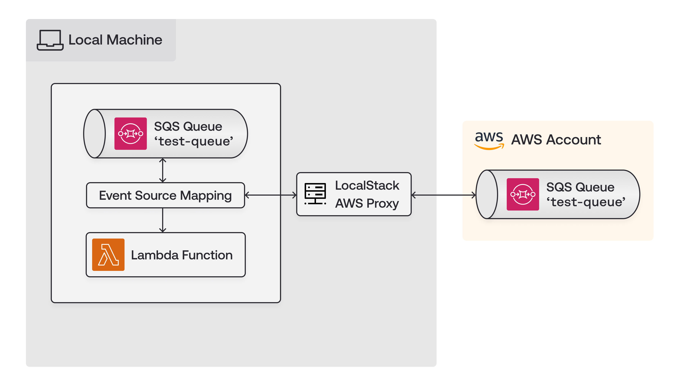

## Introduction

LocalStack's core cloud emulator enables you to emulate various cloud services on your own local machine.
This allows you to work on and test your cloud-based solutions without needing to connect to a remote cloud.
However, sometimes you might need to smoothly switch between your local setup and actual cloud resources, especially in hybrid scenarios.
This could be useful, for example, if you want to share a database with your local Lambda function, or if you require access to S3 files stored remotely while running a Glue ETL job locally.

With the [AWS Replicator extension](https://github.com/localstack/localstack-extensions/tree/main/aws-replicator), you can:

- Enable your local environment to mirror AWS cloud resources at the API level, allowing for direct interaction with cloud services.
- Facilitate the forwarding of specific requests from LocalStack to AWS without the need for complex proxy setups.
- Support scenarios that require a combination of local and cloud resources, such as testing cloud services with local databases or functions.

In this tutorial, you will learn how to install the AWS Replicator extension and utilize its different modes to seamlessly work in a hybrid environment.

## Prerequisites

- [LocalStack CLI](https://docs.localstack.cloud/getting-started/installation/#localstack-cli)  with  [`LOCALSTACK_AUTH_TOKEN`](https://docs.localstack.cloud/getting-started/auth-token/)
- [Docker](https://docs.localstack.cloud/getting-started/auth-token/)
- [AWS CLI](https://docs.aws.amazon.com/cli/v1/userguide/cli-chap-install.html) with  [`awslocal` wrapper](https://github.com/localstack/awscli-local)
- [LocalStack Web Application account](https://app.localstack.cloud/sign-up)
- [AWS Account](https://aws.amazon.com/) with an [`AWS_ACCESS_KEY_ID` & `AWS_SECRET_ACCESS_KEY`](https://docs.aws.amazon.com/IAM/latest/UserGuide/id_credentials_access-keys.html#Using_CreateAccessKey)

## Install the AWS Replicator extension

To install the AWS Replicator Extension, follow these steps:

1. Launch your LocalStack container using the `localstack` CLI, ensuring that `LOCALSTACK_AUTH_TOKEN` is available in the environment.
2. Visit the [Extensions library](https://app.localstack.cloud/extensions/library) page on the LocalStack Web Application.
  
3. Scroll down to find the **AWS replicator** card, then click on the **Install on Instance** button.
  

Once the installation is complete, you will notice that your LocalStack container has restarted with the AWS Replicator extension successfully installed.
To confirm the installation, execute the following command:


$ localstack extensions list
<disable-copy>
┏━━━━━━━━━━━━━━━━━━━━━━━━━━━━━━┳━━━━━━━━━━━━━━━━━━━━━━━━━━━━━━┳━━━━━━━━━┳━━━━━━━━━━━━━━━━━┳━━━━━━━━━━━━━━━━┓
┃ Name                         ┃ Summary                      ┃ Version ┃ Author          ┃ Plugin name    ┃
┡━━━━━━━━━━━━━━━━━━━━━━━━━━━━━━╇━━━━━━━━━━━━━━━━━━━━━━━━━━━━━━╇━━━━━━━━━╇━━━━━━━━━━━━━━━━━╇━━━━━━━━━━━━━━━━┩
│ localstack-extension-aws-re… │ LocalStack Extension: AWS    │ 0.1.11  │ LocalStack Team │ aws-replicator │
│                              │ replicator                   │         │                 │                │
└──────────────────────────────┴──────────────────────────────┴─────────┴─────────────────┴────────────────┘
</disable-copy>


After verifying the successful installation, you can shut down the LocalStack container to re-start it with additional configuration variables.

## Tutorial: Working with the AWS Replicator Extension

In this tutorial, you will set up a basic example consisting of:

- A Lambda function named `func1` that prints a simple statement when invoked.
- An SQS queue named `test-queue` where messages are sent.
- An event source mapping that triggers the Lambda function when a message is sent to the SQS queue.

The basic architecture for the scenario is outlined in the figure below.
It shows the relationship between the resources deployed in the LocalStack container, the LocalStack AWS Proxy, and the remote AWS account.



In the following sections, you will create the SQS queue on your local machine and the remote cloud to showcase how you can switch between the two with the AWS Replicator extension.

### Create the Lambda function

Begin by running your LocalStack container with the following configuration:


$ EXTRA_CORS_ALLOWED_ORIGINS=https://aws-replicator.localhost.localstack.cloud:4566 \
DEBUG=1 \
localstack start


In the above command:

- The `EXTRA_CORS_ALLOWED_ORIGINS` variable allows the AWS Replicator extension's web interface to connect with the LocalStack container.
- The `DEBUG` variable enables verbose logging allowing you to see the printed statements from the Lambda function.

Next, create a file named `testlambda.py` and add the following Python code to it:

```python
def handler(*args, **kwargs):
  print("Debug output from Lambda function")
```

Execute the following commands to create the local Lambda function:


$ (zip testlambda.zip testlambda.py)
$ awslocal lambda create-function \
    --function-name func1 \
    --runtime python3.8 \
    --role arn:aws:iam::000000000000:role/r1 --handler testlambda.handler \
    --timeout 30 \
    --zip-file fileb://./testlambda.zip


Once the Lambda function is successfully created, you will see output similar to this:

```bash
{
    "FunctionName": "func1",
    "FunctionArn": "arn:aws:lambda:us-east-1:000000000000:function:func1",
    "Runtime": "python3.8",
    "Role": "arn:aws:iam::000000000000:role/r1",
    "Handler": "testlambda.handler",
    "CodeSize": 250,
    ...
}
```

### Create the SQS queue

You can create the local SQS queue named `test-queue` by executing the following command:


$ awslocal sqs create-queue --queue-name test-queue


The output will display the Queue URL:

```bash
{
    "QueueUrl": "http://sqs.us-east-1.localhost.localstack.cloud:4566/000000000000/test-queue"
}
```

Additionally, you can create the remote SQS queue on the real AWS cloud to test invocation after starting the AWS Replicator extension.

Use the following command to set up the SQS queue on AWS:


$ aws sqs create-queue --queue-name test-queue


### Invoke the Lambda function

Before invoking, set up an event source mapping between the SQS queue and the Lambda function.
Configure the queue for Lambda using the following command:


$ awslocal lambda create-event-source-mapping \
    --function-name func1 \
    --batch-size 1 \
    --event-source-arn arn:aws:sqs:us-east-1:000000000000:test-queue


The following output would be retrieved:

```bash
{
    ...
    "MaximumBatchingWindowInSeconds": 0,
    "EventSourceArn": "arn:aws:sqs:us-east-1:000000000000:test-queue",
    "FunctionArn": "arn:aws:lambda:us-east-1:000000000000:function:func1",
    ..
    "FunctionResponseTypes": []
}
```

You can then send a message to the SQS queue to trigger the local Lambda function:


awslocal sqs send-message \
    --queue-url http://sqs.us-east-1.localhost.localstack.cloud:4566/000000000000/test-queue \
    --message-body '{}'


Upon successful execution, you will receive a message ID and MD5 hash of the message body.

```bash
{
    "MD5OfMessageBody": "99914b932bd37a50b983c5e7c90ae93b",
    "MessageId": "64e8297c-f0b2-4b68-a482-6cd3317f5096"
}
```

In the LocalStack logs, you will see confirmation of the Lambda function invocation along with any debug messages.

```bash
2024-03-26T07:23:47.842 DEBUG --- [5119b27cdf1e] l.s.l.i.version_manager    : [func1-381c6f7c-3ad8-4c79-aad8-5119b27cdf1e] START RequestId: 381c6f7c-3ad8-4c79-aad8-5119b27cdf1e Version: $LATEST
2024-03-26T07:23:47.842 DEBUG --- [5119b27cdf1e] l.s.l.i.version_manager    : [func1-381c6f7c-3ad8-4c79-aad8-5119b27cdf1e] Debug output from Lambda function
2024-03-26T07:23:47.842 DEBUG --- [5119b27cdf1e] l.s.l.i.version_manager    : [func1-381c6f7c-3ad8-4c79-aad8-5119b27cdf1e] END RequestId: 381c6f7c-3ad8-4c79-aad8-5119b27cdf1e
```

### Run the AWS Replicator extension

To run the AWS Replicator extension:

- Access [`https://aws-replicator.localhost.localstack.cloud:4566`](https://aws-replicator.localhost.localstack.cloud:4566/) via your web browser.
  
- Provide your AWS Credentials: `AWS_ACCESS_KEY_ID`, `AWS_SECRET_ACCESS_KEY`, and optionally `AWS_SESSION_TOKEN`.
- Add a new YAML-based Proxy configuration to proxy requests for specific resources to AWS.
  For this scenario, configure it to proxy requests for the SQS queue created earlier.

  ```yaml
  services:
    sqs:
      resources:
        - '.*:test-queue'
   ```

- Save the configuration to enable the AWS Replicator extension.
  Once enabled, you will see the proxy status as **enabled**.
  

To invoke the local Lambda function with the remote SQS queue:

- Navigate to your AWS Management Console and access **Simple Queue Service**.
- Select the **test-queue** queue.
- Send a message with a body (e.g., `Hello LocalStack`) by clicking **Send Message**.

You will observe the local Lambda function being invoked once again, with corresponding debug messages visible in the logs.

```bash
2024-03-26T07:45:16.524 DEBUG --- [db58fad602e5] l.s.l.i.version_manager    : [func1-ed938bb0-e1ee-41fb-a844-db58fad602e5] START RequestId: ed938bb0-e1ee-41fb-a844-db58fad602e5 Version: $LATEST
2024-03-26T07:45:16.524 DEBUG --- [db58fad602e5] l.s.l.i.version_manager    : [func1-ed938bb0-e1ee-41fb-a844-db58fad602e5] Debug output from Lambda function
2024-03-26T07:45:16.524 DEBUG --- [db58fad602e5] l.s.l.i.version_manager    : [func1-ed938bb0-e1ee-41fb-a844-db58fad602e5] END RequestId: ed938bb0-e1ee-41fb-a844-db58fad602e5
```

You can even run the standard `awslocal` commands in your terminal that would query the remote cloud resources, instead of the local ones.

Upon completion, you can click **Disable** on the AWS Replicator extension web interface to deactivate the proxy configuration.
Additionally, you can delete the remote SQS queue to avoid AWS billing for long-running resources.
To remove local resources, stop the LocalStack container to clear the local Lambda function and SQS queue.

## Conclusion

In this tutorial, you've discovered how the AWS Replicator extension bridges the gap between local and remote cloud resources by mirroring resources from real AWS accounts into your LocalStack instance.
You can explore additional use-cases with the AWS Replicator extension, such as:

- Developing a local Lambda function that interacts with a remote DynamoDB table
- Executing a local Athena SQL query in LocalStack, accessing files in a real S3 bucket on AWS
- Testing a local Terraform script with SSM parameters from a real AWS account
- And many more!
