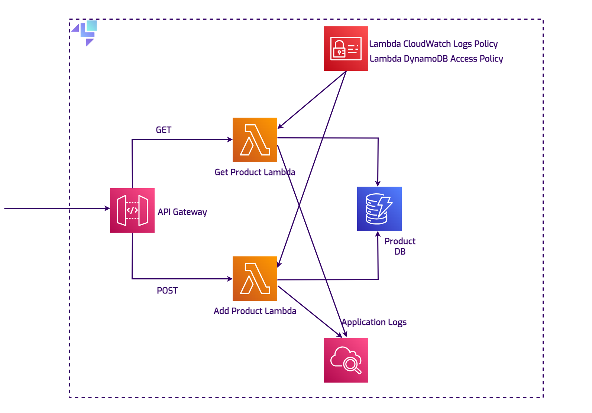
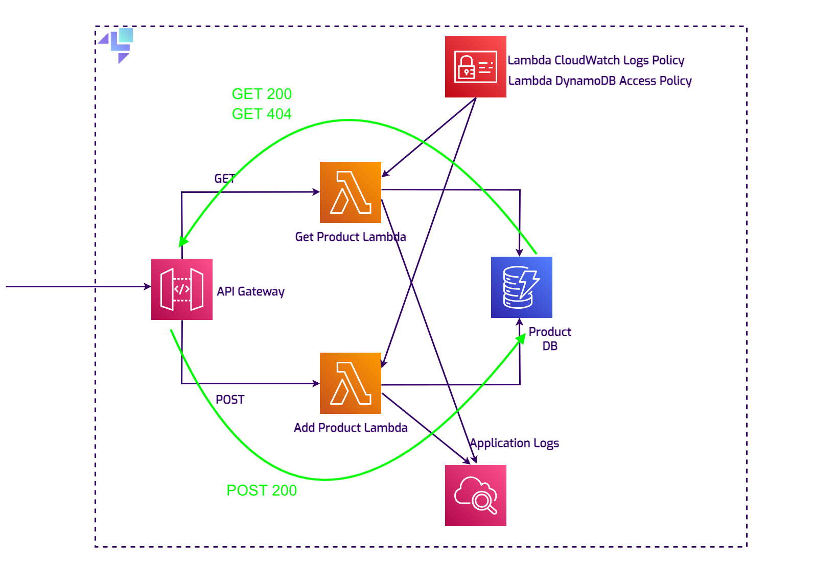

## Introduction: The importance of integration testing and how to streamline it

LocalStack is a robust tool that emulates a local AWS cloud stack, allowing engineers to test and develop apps using AWS services directly from their local environments.
This tool is essential for enhancing developer experience, reducing development costs and increasing efficiency.

In LocalStack, [**initialization hooks**](https://docs.localstack.cloud/references/init-hooks/) are scripts that customize or initialize your LocalStack instance at different stages of its lifecycle. Up until now, the supported
hooks could be shell or Python scripts executed at predefined lifecycle phases — BOOT, START, READY, and SHUTDOWN. By placing scripts in the respective directories
(/etc/localstack/init/{stage}.d), developers can automate tasks like setting up initial states, configuring services, or performing clean-up activities.
This feature ensures that your local environment is prepared and configured exactly as needed before your applications start interacting with it.

Now that we understand the functionality of initialization hooks in LocalStack, the value of extending this feature becomes clear. Terraform, is one of the most
widely adopted tools for provisioning AWS infrastructure, so naturally, enabling Terraform configuration files to be used 
directly as initialization hooks supports enhancing LocalStack's utility. The direct use of Terraform scripts as init hooks allows developers to replicate 
production environments accurately and automate integration tests more effectively. 
This capability ensures that the test environment mirrors the production setup as closely as possible.

Testcontainers is an open-source framework that provides lightweight APIs for bootstrapping local development and test dependencies
with real services wrapped in Docker containers.
Running tests with Testcontainers and LocalStack is important for AWS-powered applications because it ensures each test runs in a clean,
isolated environment, providing consistency across all development and CI machines.

This tutorial guides you through using LocalStack's [**new extension**](https://github.com/localstack/localstack-extensions/tree/main/terraform-init) that supports Terraform configuration files as initialization hooks, eliminating the need for 
any sort of conversion. You'll learn how to configure your cloud environment directly with Terraform config files in LocalStack, integrating these setups with 
Testcontainers for seamless testing. This approach simplifies the development and testing cycle, making it more efficient and closely aligned with real AWS
infrastructure practices.


## Prerequisites

For this tutorial, you will need:

- [LocalStack Pro](https://docs.localstack.cloud/getting-started/auth-token/) to emulate the AWS services. If you don't have a subscription yet, you can just get a trial license for free.
- Optional: [LocalStack CLI](https://docs.localstack.cloud/getting-started/installation/)
- [Docker](https://docker.io/)
- [Java 17](https://openjdk.org/install/)
- Optional for building the Lambda functions: [Apache Maven 3.9.8](https://maven.apache.org/install.html)
- Optional: [Terraform](https://developer.hashicorp.com/terraform/tutorials/aws-get-started/install-cli) and [terraform-local](https://github.com/localstack/terraform-local)


## Project overview

You can get hands-on with this setup by cloning the [**demo repository**](https://github.com/localstack-samples/terraform-init-hooks-demo). 
To quickly understand how everything connects, check out the diagram.

. 

The setup is simple, yet reflects a realistic scenario: there's an API Gateway that directs requests to two Lambda functions.
One Lambda function fetches product details by ID, and the other saves new products to a DynamoDB database. A CloudWatch Logs instance is used to store and access the Lambda log files.

## Using Terraform init hooks

### Using init hooks directly 

Let's first have a look at how you can leverage Terraform init hooks to configure services directly in LocalStack at startup. 
After establishing this foundation, we will proceed to integrate these configurations with Testcontainers to further enhance our development and testing workflow.


To use Terraform configuration files as initialization hooks in LocalStack, start by installing the necessary extension with the configuration flag 
**`EXTENSION_AUTO_INSTALL="localstack-extension-terraform-init"`**. This will install both `Terraform` and `tfloca`l into your LocalStack container. 
Mount your `main.tf` file directly into the **`/etc/localstack/init/ready.d`** directory. Upon LocalStack's startup, if a `main.tf` is detected in any init stage directory,
the extension will automatically execute **`tflocal init`** and **`tflocal apply`** within that directory.


If you're new to Terraform, you can quickly familiarize yourself with the basic commands by reading the [getting started tutorials](https://developer.hashicorp.com/terraform/tutorials/aws-get-started/aws-change) 
on their official documentation page.


It's important to note that this extension is fairly new and is currently intended for straightforward Terraform configurations. Improvement changes might still occur.
If you mount a directory instead of a single file, the AWS Terraform provider needs to be downloaded each time, and any state files created will be in your 
host directory, potentially requiring `sudo` to modify or delete.

#### Examples

##### LocalStack CLI

From the root folder of the demo project, navigate to the `terrform` folder and run:
```commandline
$ export LOCALSTACK_AUTH_TOKEN=<your_auth_toke>
$ localstack start -e EXTENSION_AUTO_INSTALL=localstack-extension-terraform-init 
                -v ./terraform/main.tf:/etc/localstack/init/ready.d/main.tf 
                -v ./target/product-lambda.jar:/etc/localstack/init/ready.d/target/product-lambda.jar
```
This is the easiest way to quickly spin up the necessary resources at startup.
The command starts LocalStack with configurations to automatically install the `localstack-extension-terraform-init` extension and
mount the necessary files into the container: the Terraform configuration file and the Lambda JAR file. 
If Docker gives you any trouble regarding mounting permissions, you can add `$(pwd)` in front of the local paths, to turn them into
absolute paths.

##### Docker compose

Another way of easily starting LocalStack with the necessary resources is using `docker compose`. In the root folder, there is a `docker-compose.yml` file
with all the essential configs:

Environment Variables
- **LOCALSTACK_AUTH_TOKEN**: Required for using LocalStack Pro.
- **DEBUG**: Set to 1 to enable verbose logging of the container.
- **EXTENSION_AUTO_INSTALL**: Automatically installs specified LocalStack extensions, in this case, `localstack-extension-terraform-init` which allows Terraform configurations to be directly used as init hooks.

Volumes
- Docker Socket: Mounts the Docker socket `/var/run/docker.sock` from the host into the container. This allows LocalStack to manage Docker containers directly, facilitating functionalities like spinning up Lambda containers.
- Terraform Configuration: Mounts a directory containing Terraform configurations (./terraform) from the host to `/etc/localstack/init/ready.d` in the container. This enables the use of init hooks, as well as the AWS provider (plugins and modules) 
which is downloaded once and reused in subsequent startups.
- Lambda Function JAR: Places the product-lambda.jar file from the host into the `/etc/localstack/init/ready.d/target` directory in the container, making it available for use in `main.tf`.

After running `docker compose up`, we should keep an eye on the container logs until the `Ready.` message appears.

Now we can test the functionality of our stack by running the following commands:

```bash
$  awslocal apigateway get-rest-apis --query 'items[?name==`product-api-gateway`].id'
[
    "ixqd52qrip"
]

```

This will get us the ID of the API Gateway, necessary to build the URL:

```bash
$ curl --location "http://ixqd52qrip.execute-api.localhost.localstack.cloud:4566/dev/productApi" \
                                                        --header 'Content-Type: application/json' \
                                                        --data '{
                                                      "id": "34534",
                                                      "name": "EcoFriendly Water Bottle",
                                                      "description": "A durable, eco-friendly water bottle designed to keep your drinks cold for up to 24 hours.",
                                                      "price": "29.99"
                                                    }'
Product added/updated successfully.
```
To check if the product object has been persisted to the database, we can fire a GET request against the same URL:
```bash
$ curl --location "http://ixqd52qrip.execute-api.localhost.localstack.cloud:4566/dev/productApi?id=34534"

{"price":"29.99","name":"EcoFriendly Water Bottle","description":"A durable, eco-friendly water bottle designed to keep your drinks cold for up to 24 hours.","id":"34534"}
```

### Integrating with Testcontainers

#### The setup

Now that we've established how seamlessly LocalStack integrates with Terraform using initialization hooks, let's explore how we can leverage this setup to enhance our testing
processes using [Testcontainers](https://testcontainers.com/). This is a Java project, but the framework supports multiple other programming languages.
We can now automate and streamline our LocalStack configurations, ensuring that every test suite includes a fresh, fully configured environment. This helps users
build confidence in moving on to deploy to the AWS platform, as the IaC files remain unchanged.

To get started with Testcontainers, you need to include a few dependencies in the Maven `pom.xml` file:

```xml
    <dependency>
      <groupId>org.testcontainers</groupId>
      <artifactId>testcontainers</artifactId>
    </dependency>
    <dependency>
      <groupId>org.testcontainers</groupId>
      <artifactId>junit-jupiter</artifactId>
      <scope>test</scope>
    </dependency>
    <dependency>
      <groupId>org.testcontainers</groupId>
      <artifactId>localstack</artifactId>
      <scope>test</scope>
    </dependency>
```

In the provided code snippet, we configure a LocalStackContainer object using Testcontainers, specifically designed to utilize the LocalStack Pro version.
You'll need to set the `LOCALSTACK_AUTH_TOKEN` as an environment variable. The configuration is abstracted in a superclass to be reusable across different test cases.

```java
  @Container
  protected static LocalStackContainer localStack =
      new LocalStackContainer(DockerImageName.parse("localstack/localstack-pro:latest"))
          .withEnv("LAMBDA_REMOVE_CONTAINERS", "1")
              .withEnv("EXTENSION_AUTO_INSTALL", "localstack-extension-terraform-init")
          .withEnv("LOCALSTACK_AUTH_TOKEN", System.getenv("LOCALSTACK_AUTH_TOKEN"))
          .withFileSystemBind("./target/product-lambda.jar",
              "/etc/localstack/init/ready.d/target/product-lambda.jar")
          .withFileSystemBind("./terraform",
              "/etc/localstack/init/ready.d")
          .withEnv("DEBUG", "1")
          .withStartupTimeout(Duration.of(2, ChronoUnit.MINUTES));
```
Here's what each configuration line accomplishes:
- **LAMBDA_REMOVE_CONTAINERS="1"**: Ensures that Lambda containers are removed after execution to free up resources and avoid clutter.
- **EXTENSION_AUTO_INSTALL="localstack-extension-terraform-init"**: Automatically installs the Terraform init hooks extension, enabling Terraform configurations to be used directly for initializing LocalStack services.
- **LOCALSTACK_AUTH_TOKEN**: Fetches the LocalStack auth token from environment variables.
- **DEBUG="1"**: Enables verbose logging for troubleshooting and ensuring detailed logs are available for debugging.

The `withFileSystemBind` commands mount the `product-lambda.jar` and the directory containing Terraform configurations from the host machine into the appropriate init hook
directory within the LocalStack container.
The last line specifies a timeout for the container startup, set to 2 minutes. This ensures that the container has enough time to 
initialize all services, including any delays in setting up environments or network issues.

#### The tests

The test suite in the `ProductAppTests` class is checking three scenarios:

- Product Persistence: Test the ability to successfully save a new product to DynamoDB via a Lambda function, confirming the POST request and verifying the product's storage.

- Product Retrieval: Ensures the system can accurately fetch a product by its ID from DynamoDB through a GET request.

- Non-Existent Product Handling: Validate the system's response to a request for a non-existent product, ensuring the Lambda function properly returns the appropriate error message "Product not found".

. 

Since the app runs entirely inside the LocalStack container, an HTTP client is used to make calls against the service.

```java
  @Test
    @Order(1)
    void testSuccessfulPostAction() {

        var postUrl =
                localStackEndpoint + "/restapis/" + apiGWId + "/dev/_user_request_/productApi";

        var expectedResponse =
                "Product added/updated successfully.";

        try (CloseableHttpClient httpClient = HttpClients.createDefault()) {

            // add headers to a POST request
            var httpPost = new HttpPost(postUrl);
            httpPost.setHeader(new BasicHeader("Content-Type", "application/json"));
            // create the JSON request body
            var jsonRequestBody = "{\n" +
                    "  \"id\": \"34534\",\n" +
                    "  \"name\": \"EcoFriendly Water Bottle\",\n" +
                    "  \"description\": \"A durable, eco-friendly water bottle.\",\n" +
                    "  \"price\": \"29.99\"\n" +
                    "}";

            // set the request body
            var entity = new StringEntity(jsonRequestBody);
            httpPost.setEntity(entity);
            // execute the request
            try (CloseableHttpResponse response = httpClient.execute(httpPost)) {
                String responseBody = EntityUtils.toString(response.getEntity());

                Assertions.assertEquals(HttpStatus.SC_OK, response.getStatusLine().getStatusCode());
                Assertions.assertEquals(expectedResponse, responseBody);
            }
        } catch (IOException e) {
            throw new RuntimeException(e);
        }
    }
```

It is now incredibly straightforward to utilize our own Infrastructure as Code directly to construct the exact, production-ready environment needed for effective testing.

## Conclusion

Leveraging Terraform init hooks allows us to precisely replicate our production infrastructure within our testing environments, ensuring that our Infrastructure as Code is
consistently applied. This is crucial for maintaining the integrity and reliability of our systems, as it enables thorough testing under conditions that closely mirror
the actual deployment scenario. By preserving this production-ready setup throughout the testing phase, we can confidently validate changes and catch potential 
issues early, enhancing our deployment quality and operational stability.