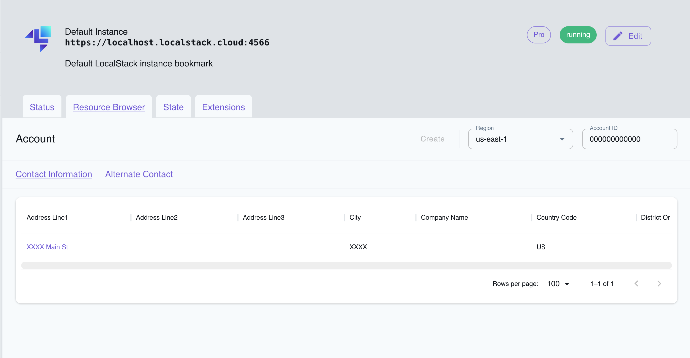

## Introduction

The Account service provides APIs to manage your AWS account. You can use the Account APIs to retrieve information about your account, manage your contact information and alternate contacts. Additionally, you can use the Account APIs to enable or disable a region for your account, and delete alternate contacts in your account.

LocalStack supports Account via the Pro offering, allowing you to use the Account API to retrieve information about your account. The supported APIs are available on our [API coverage page](https://docs.localstack.cloud/references/coverage/coverage_account/), which provides information on the extent of Account's integration with LocalStack.


LocalStack's Account provider is mock-only and does not support any real AWS account. The Account APIs are only intended to demonstrate how you can use and mock the AWS Account APIs in your local environment. It's important to note that LocalStack doesn't offer a programmatic interface to manage your AWS or your LocalStack account.


## Getting started

This guide is designed for users who are new to Account and assumes basic knowledge of the AWS CLI and our [`awslocal`](https://github.com/localstack/awscli-local) wrapper script. 

Start your LocalStack container using your preferred method. We will demonstrate how to put contact information, fetch account details, and attach an alternate contact to your account.

### Put contact information

You can use the [`PutContactInformation`](https://docs.aws.amazon.com/accounts/latest/reference/API_PutContactInformation.html) API to add or update the contact information for your AWS account. Run the following command to add contact information to your account:


$ awslocal account put-contact-information \
    --contact-information '{
        "FullName": "Jane Doe",
        "PhoneNumber": "+XXXXXXXXX",
        "AddressLine1": "XXXX Main St",
        "City": "XXXX",
        "PostalCode": "XXXXX",
        "CountryCode": "US",
        "StateOrRegion": "WA"
    }'


### Fetch account details

You can use the [`GetContactInformation`](https://docs.aws.amazon.com/accounts/latest/reference/API_GetContactInformation.html) API to retrieve the contact information for your AWS account. Run the following command to fetch the contact information for your account:


$ awslocal account get-contact-information


The command will return the contact information for your account:

```json
{
    "ContactInformation": {
        "AddressLine1": "XXXX Main St",
        "City": "XXXX",
        "CountryCode": "US",
        "FullName": "Jane Doe",
        "PhoneNumber": "+XXXXXXXXX",
        "PostalCode": "XXXXX",
        "StateOrRegion": "WA"
    }
}
```

### Attach alternate contact

You can attach an alternate contact using [`PutAlternateContact`](https://docs.aws.amazon.com/accounts/latest/reference/API_PutAlternateContact.html) API. Run the following command to attach an alternate contact to your account:


$ awslocal account put-alternate-contact \
    --alternate-contact-type "BILLING" \
    --email-address "bill@ing.com" \
    --name "Bill Ing" \
    --phone-number "+1 555-555-5555" \
    --title "Billing"


## Resource Browser

The LocalStack Web Application provides a Resource Browser for managing contact information & alternate accounts for the Account service. You can access the Resource Browser by opening the LocalStack Web Application in your browser, navigating to the Resources section, and then clicking on **Account** under the **Management & Governance** section.


<br><br>

The Resource Browser allows you to perform the following actions:

* **Create Contact Information**: Add the contact information for your mocked AWS account by clicking on the **Create** button in the contact information section.
* **Create Alternate Contact**: Add an alternate contact for your mocked AWS account by clicking on the **Create** button in the alternate contacts section.
* **View Contact Information**: View the contact information for your mocked AWS account by clicking on the contact information.
* **Update Contact Information**: Update the contact information for your mocked AWS account by clicking on the contact information.
* **Filter**: Filter the contact information and alternate contacts by types, such as `BILLING`, `OPERATIONS`, and `SECURITY`.
