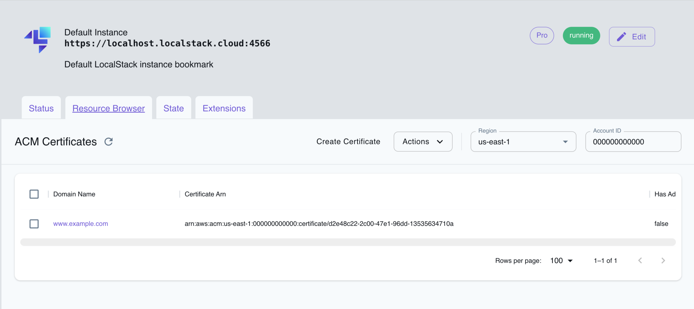

## Introduction

[AWS Certificate Manager (ACM)](https://aws.amazon.com/certificate-manager/) is a service that enables you to create and manage SSL/TLS certificates that can be used to secure your applications and resources in AWS.
You can use ACM to provision and deploy public or private certificates trusted by browsers and other clients.

ACM supports securing multiple domain names and subdomains and can create wildcard SSL certificates to protect an entire domain and its subdomains.
You can also use ACM to import certificates from third-party certificate authorities or to generate private certificates for internal use.

LocalStack allows you to use the ACM APIs to create, list, and delete certificates.
The supported APIs are available on our [API coverage page](https://docs.localstack.cloud/references/coverage/coverage_acm/), which provides information on the extent of ACM's integration with LocalStack.

## Getting started

This guide is designed for users who are new to ACM and assumes basic knowledge of the AWS CLI and our [`awslocal`](https://github.com/localstack/awscli-local) wrapper script.

### Request a public certificate

Start your LocalStack container using your preferred method, then use the [RequestCertificate API](https://docs.aws.amazon.com/acm/latest/APIReference/API_RequestCertificate.html) to request a new public ACM certificate.
Specify the domain name you want to request the certificate for, and any additional options you need.
Here's an example command:


$ awslocal acm request-certificate \
   --domain-name www.example.com \
   --validation-method DNS \
   --idempotency-token 1234 \
   --options CertificateTransparencyLoggingPreference=DISABLED


This command will return the Amazon Resource Name (ARN) of the new certificate, which you can use in other ACM commands.

```json
{
   "CertificateArn": "arn:aws:acm:<region>:000000000000:certificate/<certificate_ID>"
}
```

### List the certificates

Use the [`ListCertificates` API](https://docs.aws.amazon.com/acm/latest/APIReference/API_ListCertificates.html) to list all the certificates.
This command returns a list of the ARNs of all the certificates that have been requested or imported into ACM.
Here's an example command:


$ awslocal acm list-certificates --max-items 10


### Describe the certificate

Use the [`DescribeCertificate` API](https://docs.aws.amazon.com/acm/latest/APIReference/API_DescribeCertificate.html) to view the details of a specific certificate.
Provide the ARN of the certificate you want to view, and this command will return information about the certificate's status, domain name, and other attributes.
Here's an example command:


$ awslocal acm describe-certificate --certificate-arn arn:aws:acm:<region>:account:certificate/<certificate_ID>


### Delete the certificate

Finally you can use the [`DeleteCertificate` API](https://docs.aws.amazon.com/acm/latest/APIReference/API_DeleteCertificate.html) to delete a certificate from ACM, by passing the ARN of the certificate you want to delete.
Here's an example command:


$ awslocal acm delete-certificate --certificate-arn arn:aws:acm:<region>:account:certificate/<certificate_ID>


## Resource Browser

The LocalStack Web Application provides a Resource Browser for managing ACM Certificates.
You can access the Resource Browser by opening the LocalStack Web Application in your browser, navigating to the **Resource Browser** section, and then clicking on **Certificate Manager** under the **Security Identity Compliance** section.


<br><br>

The Resource Browser allows you to perform the following actions:

- **Create Certificate**: Create a new ACM certificate by clicking **Create Certificate** and providing the required information.
- **View Certificate**: View the details of a specific certificate by clicking on the domain name.
- **Delete Certificate**: Delete a certificate by selecting the certificate, followed by clicking **Actions** and then **Remove Selected**.

## Examples

The following code snippets and sample applications provide practical examples of how to use ACM in LocalStack for various use cases:

- [API Gateway with Custom Domains](https://github.com/localstack/localstack-pro-samples/tree/master/apigw-custom-domain)
- [Generating an ACM certificate via Terraform](https://github.com/localstack/localstack-terraform-samples/tree/master/acm-route53)
