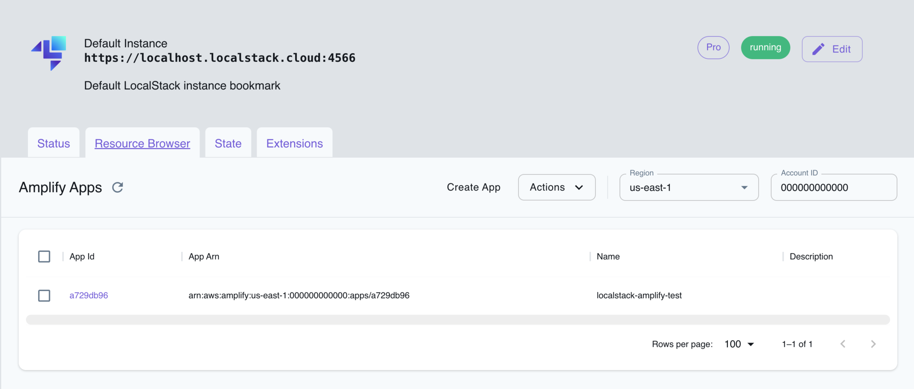

## Introduction

Amplify is a JavaScript-based development framework with libraries, UI components, and a standard CLI interface for building and deploying web and mobile applications. With Amplify, developers can build and host static websites, single-page applications, and full-stack serverless web applications using an abstraction layer over popular AWS services like DynamoDB, Cognito, AppSync, Lambda, S3, and more.

LocalStack allows you to use the Amplify APIs to build and test their Amplify applications locally. The supported APIs are available on our [API coverage page](https://docs.localstack.cloud/references/coverage/coverage_amplify/), which provides information on the extent of Amplify's integration with LocalStack.


The `amplifylocal` CLI and the Amplify JS library have been deprecated and are no longer supported. We recommend using the Amplify CLI with the Amplify LocalStack Plugin instead.


## Amplify LocalStack Plugin

[Amplify LocalStack Plugin](https://github.com/localstack/amplify-localstack) allows the `amplify` CLI tool to create resources on your local machine instead of AWS. It achieves this by redirecting any requests to AWS to a LocalStack container running locally on your machine.

### Installation

To install the Amplify LocalStack Plugin, install the [amplify-localstack](https://www.npmjs.com/package/amplify-localstack) package from the npm registry and add the plugin to your Amplify setup:


$ npm install -g amplify-localstack
$ amplify plugin add amplify-localstack


### Configuration

You can configure the following environment variables to customize LocalStack's behaviour:

- `EDGE_PORT`: The port number under which the LocalStack edge service is accessible. The default value is `4566`.
- `LOCALSTACK_HOSTNAME`: It specifies the target host under which the LocalStack edge service is accessible. The default value is `localhost.localstack.cloud`.
- `LOCALSTACK_ENDPOINT`: It allows you to set a custom endpoint directly. If set, it overrides the values set for `EDGE_PORT` and `LOCALSTACK_HOSTNAME`. The default value is `https://localhost.localstack.cloud:4566`.

### Usage

After installing the plugin, you can deploy your resources to LocalStack using the `amplify init` or `amplify push` commands. The console will prompt you to select whether to deploy to LocalStack or AWS.

You can also add the parameter `--use-localstack true` to your commands to avoid being prompted and automatically use LocalStack. Here is an example:


$ amplify init --use-localstack true
$ amplify add api
$ amplify push --use-localstack true


## Resource Browser

The LocalStack Web Application provides a Resource Browser for managing Amplify applications. You can access the Resource Browser by opening the LocalStack Web Application in your browser, navigating to the **Resource Browser** section, and then clicking on **Amplify** under the **Front-end Web & Mobile** section.

  

The Resource Browser allows you to perform the following actions:

- **Create new Amplify applications**: Create new Amplify applications by clicking **Create App** and filling in the required details.
- **View Amplify applications**: View the list of Amplify applications created in LocalStack by clicking on the application ID.
- **Edit Amplify applications**: Edit the configuration of an existing Amplify application by clicking on the application ID and then clicking **Edit App**.
- **Delete Amplify applications**: Delete an existing Amplify application by selecting the application, followed by clicking **Actions** and then **Remove Selected**.
