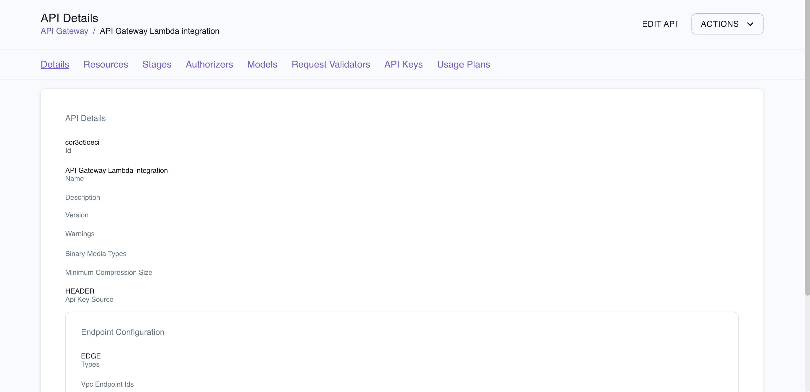

## Introduction

API Gateway is a managed service that enables developers to create, deploy, and manage APIs (Application Programming Interfaces). It allows easy creation of REST, HTTP, and WebSocket APIs to securely access data, business logic, or functionality from backend services like AWS Lambda functions or EC2 instances. API Gateway supports standard HTTP methods such as `GET`, `POST`, `PUT`, `PATCH`, and `DELETE` and integrates with various AWS services, including Lambda, Cognito, CloudWatch, and X-Ray.

LocalStack supports API Gateway V1 in the Community image and API Gateway V2 in the Pro image. LocalStack allows you to use the API Gateway APIs to create, deploy, and manage APIs on your local machine to invoke those exposed API endpoints. 

The supported APIs are available on the API coverage page for [API Gateway V1](https://docs.localstack.cloud/references/coverage/coverage_apigateway/) & [API Gateway V2](https://docs.localstack.cloud/references/coverage/coverage_apigatewayv2/), which provides information on the extent of API Gateway's integration with LocalStack.

## Getting started

This guide is designed for users new to API Gateway and assumes basic knowledge of the AWS CLI and our [`awslocal`](https://github.com/localstack/awscli-local) wrapper script.

Start your LocalStack container using your preferred method. We will use the Lambda proxy integration to integrate an API method with a Lambda function. The Lambda function will be invoked with a `GET` request and return a response with a status code of `200` and a body containing the string `Hello from Lambda!`.

### Create a Lambda function

Create a new file named `lambda.js` with the following contents:

```javascript
'use strict'

const apiHandler = (payload, context, callback) => {
    callback(null, {
        statusCode: 200,
        body: JSON.stringify({
            message: 'Hello from Lambda'
        }),
    }); 
}
    
module.exports = {
    apiHandler,
}
```

The above code defines a function named `apiHandler` that returns a response with a status code of `200` and a body containing the string `Hello from Lambda`. Zip the file and upload it to LocalStack using the `awslocal` CLI. Run the following command:


$ zip function.zip lambda.js
$ awslocal lambda create-function \
  --function-name apigw-lambda \
  --runtime nodejs16.x \
  --handler lambda.apiHandler \
  --memory-size 128 \
  --zip-file fileb://function.zip \
  --role arn:aws:iam::111111111111:role/apigw


This creates a new Lambda function named `apigw-lambda` with the code you specified.

### Create a REST API

We will use the API Gateway's [`CreateRestApi`](https://docs.aws.amazon.com/apigateway/latest/api/API_CreateRestApi.html) API to create a new REST API. Here's an example command: 


$ awslocal apigateway create-rest-api --name 'API Gateway Lambda integration'


This creates a new REST API named `API Gateway Lambda integration`. The above command returns the following response:

```json
{
    "id": "cor3o5oeci",
    "name": "API Gateway Lambda integration",
    "createdDate": "2023-04-27T16:08:46+05:30",
    "apiKeySource": "HEADER",
    "endpointConfiguration": {
        "types": [
            "EDGE"
        ]
    },
    "disableExecuteApiEndpoint": false
}
```

Note the REST API ID returned in the response. You'll need this ID for the next step.

### Fetch the Resources

Use the REST API ID generated in the previous step to fetch the resources for the API, using the [`GetResources`](https://docs.aws.amazon.com/apigateway/latest/api/API_GetResources.html) API:


$ awslocal apigateway get-resources --rest-api-id <REST_API_ID>


The above command returns the following response:

```json
{
    "items": [
        {
            "id": "u53af9hm83",
            "path": "/"
        }
    ]
}
```

Note the ID of the root resource returned in the response. You'll need this ID for the next step.

### Create a resource

Create a new resource for the API using the [`CreateResource`](https://docs.aws.amazon.com/apigateway/latest/api/API_CreateResource.html) API. Use the ID of the resource returned in the previous step as the parent ID:


$ awslocal apigateway create-resource \
  --rest-api-id <REST_API_ID> \
  --parent-id <PARENT_ID> \
  --path-part "{somethingId}"


The above command returns the following response:

```json
{
    "id": "zzcvcf56ar",
    "parentId": "u53af9hm83",
    "pathPart": "{somethingId}",
    "path": "/{somethingId}"
}
```

Note the ID of the root resource returned in the response. You'll need this Resource ID for the next step.

### Add a method and integration

Add a `GET` method to the resource using the [`PutMethod`](https://docs.aws.amazon.com/apigateway/latest/api/API_PutMethod.html) API. Use the ID of the resource returned in the previous step as the Resource ID:


awslocal apigateway put-method \
  --rest-api-id <REST_API_ID> \
  --resource-id <RESOURCE_ID> \
  --http-method GET \
  --request-parameters "method.request.path.somethingId=true" \
  --authorization-type "NONE"


The above command returns the following response:

```json
{
    "httpMethod": "GET",
    "authorizationType": "NONE",
    "apiKeyRequired": false,
    "requestParameters": {
        "method.request.path.somethingId": true
    }
}
```

Now, create a new integration for the method using the [`PutIntegration`](https://docs.aws.amazon.com/apigateway/latest/api/API_PutIntegration.html) API.


$ awslocal apigateway put-integration \
  --rest-api-id <REST_API_ID> \
  --resource-id <RESOURCE_ID> \
  --http-method GET \
  --type AWS_PROXY \
  --integration-http-method POST \
  --uri arn:aws:apigateway:us-east-1:lambda:path/2015-03-31/functions/arn:aws:lambda:us-east-1:000000000000:function:apigw-lambda/invocations \
  --passthrough-behavior WHEN_NO_MATCH


The above command integrates the `GET` method with the Lambda function created in the first step. We can now proceed with the deployment before invoking the API.

### Create a deployment

Create a new deployment for the API using the [`CreateDeployment`](https://docs.aws.amazon.com/apigateway/latest/api/API_CreateDeployment.html) API:


$ awslocal apigateway create-deployment \
  --rest-api-id <REST_API_ID> \
  --stage-name test


Your API is now ready to be invoked. You can use `cURL` or any HTTP REST client to invoke the API endpoint:


$ curl -X GET http://localhost:4566/restapis/<REST_API_ID>/test/_user_request_/test

{"message":"Hello World"}


## LocalStack features

LocalStack provides additional features and functionality on top of the official AWS APIs, to help you develop, debug, and test your local API Gateway APIs.

### Accessing HTTP APIs via Local Domain Name

To demonstrate how to access APIs through LocalStack's local domain name, consider the following Serverless configuration that shows two Lambda functions (`serviceV1` and `serviceV2`) that are connected to an API Gateway v1 (`http` event) and an API Gateway v2 endpoint (`httpApi` event), respectively:

```yaml
...
plugins:
  - serverless-localstack
custom:
  localstack:
    stages: [local]
functions:
  serviceV1:
    handler: handler.handler
    events:
      - http:    # for API GW v1 integration
          method: POST
          path: /my/path1
  serviceV2:
    handler: handler.handler
    events:
      - httpApi: # for API GW v2 integration
          method: POST
          path: /my/path2
```

After you deploy the Lambda functions and API Gateway endpoints, you can access them using the LocalStack edge port (`4566` by default). There are two alternative URL formats to access these endpoints.

#### Recommended URL format

The recommended URL format for accessing APIs is to use the following URL syntax with an `execute-api` hostname:

```shell
http://<apiId>.execute-api.localhost.localstack.cloud:4566/<stageId>/<path>
```

Here's an example of how you would access the HTTP/REST API with an ID of `0v1p6q6`:

```shell
http://0v1p6q6.execute-api.localhost.localstack.cloud:4566/local/my/path2
```

Note that the local stage ID is added in this example. Adding the stage ID is required for API Gateway V1 APIs, but optional for API Gateway V2 APIs (in case they include the wildcard `$default` stage). For v2 APIs, the following URL should also work:

```shell
http://0v1p6q6.execute-api.localhost.localstack.cloud:4566/my/path1
```

#### Alternative URL format

The alternative URL format is an endpoint with the predefined path marker `_user_request_`:

```shell
http://localhost:4566/restapis/<apiId>/<stageId>/_user_request_/<path>
```

For the example above, the URL would be:

```shell
http://localhost:4566/restapis/0v1p6q6/local/_user_request_/my/path1
```

This format is sometimes used in case of local DNS issues.

### WebSocket APIs

WebSocket APIs provide real-time communication channels between a client and a server. To use WebSockets in LocalStack, you can define a WebSocket route in your Serverless configuration:

```yaml
...
plugins:
  - serverless-localstack
functions:
  actionHandler:
    handler: handler.handler
    events:
      - websocket:
          route: test-action
```

Upon deployment of the Serverless project, LocalStack creates a new API Gateway V2 endpoint. To retrieve the list of APIs and verify the WebSocket endpoint, you can use the `awslocal` CLI:


$ awslocal apigatewayv2 get-apis
{
    "Items": [{
        "ApiEndpoint": "ws://localhost:4510",
        "ApiId": "129ca37e",
        ...
    }]
}


In the above example, the WebSocket endpoint is `ws://localhost:4510`. Assuming your Serverless project contains a simple Lambda `handler.js` like this:

```javascript
module.exports.handler = function(event, context, callback) {
  callback(null, event);
};
```

You can send a message to the WebSocket at `ws://localhost:4510` and the same message will be returned as a response on the same WebSocket.

To push data from a backend service to the WebSocket connection, you can use the [Amazon API Gateway Management API](https://awscli.amazonaws.com/v2/documentation/api/latest/reference/apigatewaymanagementapi/index.html). In LocalStack, use the following CLI command (replace `<connectionId>` with your WebSocket connection ID):


$ awslocal apigatewaymanagementapi \
  post-to-connection \
  --connection-id '<connectionId>' \
  --data '{"msg": "Hi"}'


## Custom IDs for API Gateway resources via tags

You can assign custom IDs to API Gateway REST and HTTP APIs using the `_custom_id_` tag during resource creation. This can be useful to ensure a static endpoint URL for your API, simplifying testing and integration with other services.

To assign a custom ID to an API Gateway REST API, use the `create-rest-api` command with the `tags={"_custom_id_":"myid123"}` parameter. The following example assigns the custom ID `"myid123"` to the API:


$ awslocal apigateway create-rest-api --name my-api --tags '{"_custom_id_":"myid123"}'
{
    "id": "myid123",
    ....
}


You can also configure the protocol type, the possible values being `HTTP` and `WEBSOCKET`: 


$ awslocal apigatewayv2 create-api \
  --name=my-api \
  --protocol-type=HTTP --tags="_custom_id_=my-api"                                                                                                                   
{
    "ApiEndpoint": "my-api.execute-api.localhost.localstack.cloud:4566",
    "ApiId": "my-api",
    "Name": "my-api",
    "ProtocolType": "HTTP",
    "Tags": {
        "_custom_id_": "my-api"
    }
}



Setting the API Gateway ID via `_custom_id_` works only on the creation of the resource, but not on update in LocalStack. Ensure that you set the `_custom_id_` tag on creation of the resource.


## Custom Domain Names with API Gateway

You can use custom domain names with API Gateway V1 and V2 APIs. To route requests to a custom domain name for an API Gateway V2 API, include the `Host` header with the custom domain name in your request. For example, assuming that you have set up a custom domain name `test.example.com` to point to your LocalStack instance, you can send a request like this:


$ curl -H 'Host: test.example.com' http://localhost:4566/test


## API Gateway Resource Browser

The LocalStack Web Application provides a Resource Browser for managing API Gateway resources. You can access the Resource Browser by opening the LocalStack Web Application in your browser and navigating to the **Resources** section, then clicking on **API Gateway** under the **App Integration** section.

The Resource Browser displays [API Gateway V1](https://app.localstack.cloud/resources/gateway/v1) and [API Gateway V2](https://app.localstack.cloud/resources/gateway/v2) resources. You can click on individual resources to view their details.



The Resource Browser allows you to perform the following actions:

- **Create API**: Create a new API ([`V1`](https://app.localstack.cloud/resources/gateway/v1/new)/[`V2`](https://app.localstack.cloud/resources/gateway/v2/new)) by clicking on **Create API** button on top-right and creating a new configuration by clicking on **Submit** button.
- **Edit API**: Edit the API configuration (`V1`/`V2`) by clicking on **Edit API** button on top-right and saving the new configuration by clicking on **Submit** button.
- **Check the Resources**: Click on **Resources** tab to view the resources associated with the API, along with their details, such as `Id`, `ParentId`, `Path Part`, and `Path` and their `HTTP` method.
- **Navigate the Stages**: Click on **Stages** tab to view the stages associated with the API, along with their details, such as `Deployment Id`, `Stage Name`, `Client Certificate Id`, and more.
- **Delete API**: Delete the API configuration (`V1`/`V2`) by selecting the resource, clicking on **Remove Selected** button on top-right and confirming the deletion by clicking on **Continue** button.

You can also use the Resource Browser to check out the **Authorizers**, **Models**, **Request Validators**, **API Keys**, and **Usage Plans**.

## Examples

The following code snippets and sample applications provide practical examples of how to use API Gateway in LocalStack for various use cases:

- [API Gateway with Custom Domains over our LocalStack Pro samples](https://github.com/localstack/localstack-pro-samples/tree/master/apigw-custom-domain)
- [Websockets via API Gateway V2](https://github.com/localstack/localstack-pro-samples/tree/master/serverless-websockets)
- [Serverless Container-based APIs with Amazon ECS and Amazon API Gateway](https://github.com/localstack/serverless-api-ecs-apigateway-sample)
- [Step-up Authentication using Amazon Cognito, DynamoDB, API Gateway Lambda Authorizer, and Lambda functions](https://github.com/localstack/step-up-auth-sample)
- [Serverless Microservices with Amazon API Gateway, DynamoDB, SQS, and Lambda](https://github.com/localstack/microservices-apigateway-lambda-dynamodb-sqs-sample)
- [Note-Taking application using AWS SDK for JavaScript, Amazon DynamoDB, Lambda, Cognito, API Gateway, and S3](https://github.com/localstack/aws-sdk-js-notes-app)
- For Terraform samples, check out the [LocalStack Terraform examples](https://github.com/localstack/localstack-terraform-samples) repository
