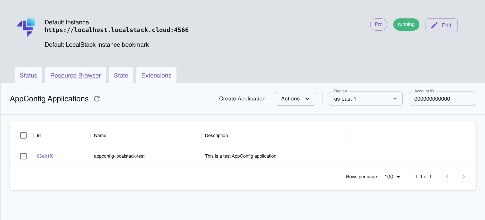

AppConfig is a service provided by Amazon Web Services (AWS) that simplifies the process of managing and deploying application configurations.
AppConfig offers centralized management of configuration data and the ability to create, manage, and deploy configuration changes separately.
It allows you to avoid deploying the service repeatedly for smaller changes, enables controlled deployments to applications and includes built-in validation checks & monitoring.

LocalStack allows you to use the AppConfig APIs in your local environment to define configurations for different environments and deploy them to your applications as needed.
The supported APIs are available on our [API coverage page](https://docs.localstack.cloud/references/coverage/coverage_appconfig/), which provides information on the extent of AppConfig's integration with LocalStack.

## Getting started

This guide is designed for users new to AppConfig and assumes basic knowledge of the AWS CLI and our [`awslocal`](https://github.com/localstack/awscli-local) wrapper script.

Start your LocalStack container using your preferred method.
We will demonstrate how to create an AppConfig application, environment, configuration profiles & feature flags, and deploy the configuration with the AWS CLI.

### Create an AppConfig application and environment

You can create an AppConfig application using the [`CreateApplication`](https://docs.aws.amazon.com/appconfig/latest/APIReference/API_CreateApplication.html) API.
The application is a folder/directory that contains the configuration data for your specific application.
The following command creates an application named `my-app`:


$ awslocal appconfig create-application \
    --name my-app \
    --description "My application"


The following output would be retrieved:

```bash
{
    "Id": "400c285",
    "Name": "my-app",
    "Description": "My application"
}
```

You can now create an AppConfig environment for your application using the [`CreateEnvironment`](https://docs.aws.amazon.com/appconfig/latest/APIReference/API_CreateEnvironment.html) API.
An environment consists of the deployment group of your AppConfig applications.
The following command creates an environment named `my-app-env`:


$ awslocal appconfig create-environment \
    --application-id 400c285 \
    --name my-app-env \
    --description "My application environment"


Replace the `application-id` with the ID of the application you created in the previous step.
The following output would be retrieved:

```bash
{
    "ApplicationId": "400c285",
    "Id": "3695ea3",
    "Name": "my-app-env",
    "Description": "My application environment",
    "State": "ReadyForDeployment"
}
```

### Create configuration profiles and feature flags

You can create an AppConfig configuration profile using the [`CreateConfigurationProfile`](https://docs.aws.amazon.com/appconfig/latest/APIReference/API_CreateConfigurationProfile.html) API.
A configuration profile contains for the configurations of your AppConfig applications.
The following command creates a configuration profile named `my-app-config`:


$ awslocal appconfig create-configuration-profile \
    --application-id 400c285 \
    --name my-app-config \
    --location-uri hosted \
    --type AWS.AppConfig.FeatureFlags


The following output would be retrieved:

```bash
{
    "ApplicationId": "400c285",
    "Id": "7d748f9",
    "Name": "my-app-config",
    "LocationUri": "hosted",
    "Type": "AWS.AppConfig.FeatureFlags"
}
```

You can now create a JSON file to add your feature flag configuration data.
Create a file named `feature-flag-config.json` with the following content:

```json
{
  "allow_mobile_payments": {
    "enabled": false
  },
  "default_payments_per_region": {
    "enabled": true
  }
}
```

You can now use the [`CreateHostedConfigurationVersion`](https://docs.aws.amazon.com/appconfig/latest/APIReference/API_CreateHostedConfigurationVersion.html) API to save your feature flag configuration data to AppConfig.
The following command creates a hosted configuration version for the configuration profile you created in the previous step:


$ awslocal appconfig create-hosted-configuration-version \
    --application-id 400c285 \
    --configuration-profile-id 7d748f9 \
    --content-type "application/json" \
    --content file://feature-flag-config.json \
    configuration-data.json


The following output would be retrieved:

```bash
{
    "ApplicationId": "400c285",
    "ConfigurationProfileId": "7d748f9",
    "VersionNumber": 1,
    "ContentType": "application/json"
}
```

### Create an AppConfig deployment

You can now create an AppConfig deployment strategy using the [`CreateDeploymentStrategy`](https://docs.aws.amazon.com/appconfig/latest/APIReference/API_CreateDeploymentStrategy.html) API.
A deployment strategy defines important criteria for rolling out your configuration to the target environment.
The following command creates a deployment strategy named `my-app-deployment-strategy`:


$ awslocal appconfig create-deployment-strategy \
    --name my-app-deployment-strategy \
    --description "My application deployment strategy" \
    --deployment-duration-in-minutes 10 \
    --growth-factor 1.0


The following output would be retrieved:

```bash
{
    "Id": "f2f2225",
    "Name": "my-app-deployment-strategy",
    "Description": "My application deployment strategy",
    "DeploymentDurationInMinutes": 10,
    "GrowthFactor": 1.0
}
```

You can now use the [`StartDeployment`](https://docs.aws.amazon.com/appconfig/latest/APIReference/API_StartDeployment.html) API to deploy the configuration.
The following command deploys the configuration to the environment you created in the previous step:


$ awslocal appconfig start-deployment \
    --application-id 400c285 \
    --environment-id 3695ea3 \
    --deployment-strategy-id f2f2225 \
    --configuration-profile-id 7d748f9 \
    --configuration-version 1 \
    --description "My application deployment"


The following output would be retrieved:

```bash
{
    "ApplicationId": "400c285",
    "EnvironmentId": "3695ea3",
    "DeploymentStrategyId": "f2f2225",
    "ConfigurationProfileId": "7d748f9",
    "DeploymentNumber": 1,
    "ConfigurationName": "my-app-config",
    "ConfigurationLocationUri": "hosted",
    "ConfigurationVersion": "1",
    "Description": "My application deployment",
    "DeploymentDurationInMinutes": 0,
    "GrowthFactor": 1.0,
    "State": "BAKING",
    "EventLog": [
        {
            "EventType": "DEPLOYMENT_STARTED",
            "TriggeredBy": "USER",
            "Description": "Deployment started",
            "OccurredAt": "2023-08-28T11:18:43.273250Z"
        }
    ],
    "PercentageComplete": 0.0,
    "StartedAt": "2023-08-28T11:18:43.273250Z",
    "AppliedExtensions": []
}
```

## Resource Browser

The LocalStack Web Application provides a Resource Browser for managing AppConfig applications.
You can access the Resource Browser by opening the LocalStack Web Application in your browser, navigating to the **Resource Browser** section, and then clicking on **AppConfig** under the **Developer Tools** section.


<br><br>

The Resource Browser allows you to perform the following actions:

- **Create new AppConfig applications**: Create new AppConfig applications by clicking **Create Application** and filling in the required details.
- **View AppConfig applications**: View the list of AppConfig applications created in LocalStack by clicking on the application ID.
- **Edit AppConfig applications**: Edit the configuration of an existing AppConfig application by clicking on the application ID and then clicking **Edit Application**.
- **Delete AppConfig applications**: Delete an existing AppConfig application by selecting the application, followed by clicking **Actions** and then **Remove Selected**.
