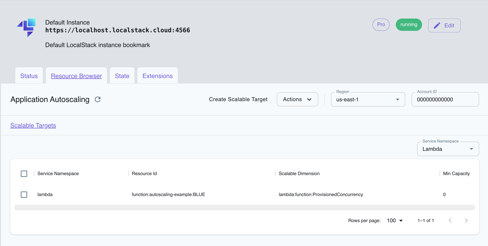

## Introduction

Application Auto Scaling is a centralized solution for managing automatic scaling by defining scaling policies based on specific metrics.
Based on CPU utilization or request rates, it automatically adjusts capacity in response to changes in workload.
With Application Auto Scaling, you can configure automatic scaling for services such as DynamoDB, ECS, Lambda, ElastiCache, and more.
Auto scaling uses CloudWatch under the hood to configure scalable targets which a service namespace, resource ID, and scalable dimension can uniquely identify.

LocalStack allows you to use the Application Auto Scaling APIs in your local environment to scale different resources based on scaling policies and scheduled scaling.
The supported APIs are available on our [API coverage page](), which provides information on the extent of Application Auto Scaling's integration with LocalStack.

## Getting Started

This guide is designed for users new to Application Auto Scaling and assumes basic knowledge of the AWS CLI and our [`awslocal`](https://github.com/localstack/awscli-local) wrapper script.

Start your LocalStack container using your preferred method.
We will demonstrate how you can configure auto scaling to handle a heavy workload for your Lambda function.

### Create a Lambda Function

To create a new Lambda function, create a new file called `index.js` with the following code:

```js
exports.handler = async (event, context) => {
    console.log('Hello from Lambda!');
    return {
        statusCode: 200,
        body: 'Hello, World!'
    };
};
```

Run the following command to create a new Lambda function using the [`CreateFunction`](https://docs.aws.amazon.com/cli/latest/reference/lambda/create-function.html) API:


$ zip function.zip index.js

$ awslocal lambda create-function \
    --function-name autoscaling-example \
    --runtime nodejs18.x \
    --zip-file fileb://function.zip \
    --handler index.handler \
    --role arn:aws:iam::000000000000:role/cool-stacklifter


### Create a version and alias for your Lambda function

Next, you can create a version for your Lambda function and publish an alias.
We will use the [`PublishVersion`](https://docs.aws.amazon.com/cli/latest/reference/lambda/publish-version.html) and [`CreateAlias`](https://docs.aws.amazon.com/cli/latest/reference/lambda/create-alias.html) APIs for this.
Run the following commands:


$ awslocal lambda publish-version --function-name autoscaling-example
$ awslocal lambda create-alias \
    --function-name autoscaling-example \
    --description "alias for blue version of function" \
    --function-version 1 \
    --name BLUE


### Register the Lambda function as a scalable target

To register the Lambda function as a scalable target, you can use the [`RegisterScalableTarget`](https://docs.aws.amazon.com/cli/latest/reference/application-autoscaling/register-scalable-target.html) API.
We will specify the `--service-namespace` as `lambda`, `--scalable-dimension` as `lambda:function:ProvisionedConcurrency`, and `--resource-id` as `function:autoscaling-example:BLUE`.

Run the following command to register the scalable target:


$ awslocal application-autoscaling register-scalable-target \
    --service-namespace lambda \
    --scalable-dimension lambda:function:ProvisionedConcurrency \
    --resource-id function:autoscaling-example:BLUE \
    --min-capacity 0 --max-capacity 0


### Setting up a scheduled action

You can create a scheduled action that scales out by specifying the `--schedule` parameter with a recurring schedule specified as a cron job.
Run the following command to create a scheduled action using the [`PutScheduledAction`](https://docs.aws.amazon.com/cli/latest/reference/application-autoscaling/put-scheduled-action.html) API:


awslocal application-autoscaling put-scheduled-action \
    --service-namespace lambda \
    --scalable-dimension lambda:function:ProvisionedConcurrency \
    --resource-id function:autoscaling-example:BLUE \
    --scheduled-action-name lambda-action \
    --schedule "cron(*/2* ** *)" \
    --scalable-target-action MinCapacity=1,MaxCapacity=5


You can confirm if the scheduled action exists using [`DescribeScheduledActions`](https://docs.aws.amazon.com/cli/latest/reference/application-autoscaling/describe-scheduled-actions.html) API:


$ awslocal application-autoscaling describe-scheduled-actions \
    --service-namespace lambda


### Setting up a target tracking scaling policy

You can now set up a target tracking scaling policy to scale based on current resource utilization.
You can use the [`PutScalingPolicy`](https://docs.aws.amazon.com/cli/latest/reference/application-autoscaling/put-scaling-policy.html) API to create a target tracking scaling policy after ensuring that your predefined metric expects the target value.
When metrics lack data due to minimal application load, Application Auto Scaling does not adjust capacity.

Run the following command to create a target-tracking scaling policy:


$ awslocal application-autoscaling put-scaling-policy \
    --service-namespace lambda \
    --scalable-dimension lambda:function:ProvisionedConcurrency \
    --resource-id function:events-example:BLUE \
    --policy-name scaling-policy --policy-type TargetTrackingScaling \
    --target-tracking-scaling-policy-configuration '{ "TargetValue": 50.0, "PredefinedMetricSpecification": { "PredefinedMetricType": "predefinedmetric" }}'


## Resource Browser

The LocalStack Web Application provides a Resource Browser for managing AppConfig applications.
You can access the Resource Browser by opening the LocalStack Web Application in your browser, navigating to the **Resource Browser** section, and then clicking on **Application Auto Scaling** under the **App Integration** section.


<br><br>

The Resource Browser allows you to perform the following actions:

* **Create scalable target**: Create a new scalable target by clicking **Create Scalable Target** and providing the required details.
* **Filter services**: Filter services by service namespace to view only the services you are interested in, by choosing from the dropdown list.
* **Delete**: Delete a scalable target by selecting the target, followed by clicking **Actions** and then **Remove Selected**.

The following service namespaces are currently supported:

* Elastic Container Service (ECS)
* Elastic MapReduce (EMR)
* Elastic Compute Cloud (EC2)
* AppStream
* Lambda
* DynamoDB
* RDS
* Sagemaker
* Kafka
* Cassandra
* Comprenhend
* Custom Resource
