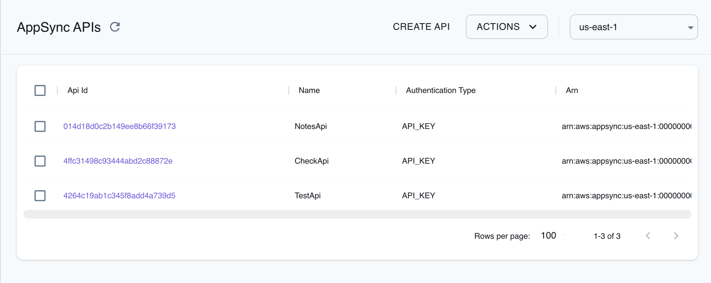

## Introduction

AppSync is a managed service provided by Amazon Web Services (AWS) that enables you to create serverless GraphQL APIs to query databases, microservices, and other APIs. AppSync allows you to define your data models and business logic using a declarative approach, and connect to various data sources, including other AWS services, relational databases, and custom data sources.

LocalStack allows you to use the AppSync APIs in your local environment to connect your applications and services to data and events. The supported APIs are available on our [API coverage page](https://docs.localstack.cloud/references/coverage/coverage_appsync/), which provides information on the extent of AppSync's integration with LocalStack.

## Getting started

This guide is designed for users new to AppSync and assumes basic knowledge of the AWS CLI and our [`awslocal`](https://github.com/localstack/awscli-local) wrapper script.

Start your LocalStack container using your preferred method. We will demonstrate how to create an AppSync API with a DynamoDB data source using the AWS CLI.

### Create a DynamoDB table

You can create a DynamoDB table using the [`CreateTable`](https://docs.aws.amazon.com/amazondynamodb/latest/APIReference/API_CreateTable.html) API. Execute the following command to create a table named `DynamoDBNotesTable` with a primary key named `NoteId`:


$ awslocal dynamodb create-table \
    --table-name DynamoDBNotesTable \
    --attribute-definitions AttributeName=NoteId,AttributeType=S \
    --key-schema AttributeName=NoteId,KeyType=HASH \
    --billing-mode PAY_PER_REQUEST


After the table is created, you can use the [`ListTables`](https://docs.aws.amazon.com/amazondynamodb/latest/APIReference/API_ListTables.html) API. Run the following command to list all tables in your running LocalStack container:


$ awslocal dynamodb list-tables


The following output would be retrieved:

```bash
{
    "TableNames": [
        "DynamoDBNotesTable"
    ]
}
```

### Create a GraphQL API

You can create a GraphQL API using the [`CreateGraphqlApi`](https://docs.aws.amazon.com/appsync/latest/APIReference/API_CreateGraphqlApi.html) API. Execute the following command to create a GraphQL API named `NotesApi`:


$ awslocal appsync create-graphql-api \
    --name NotesApi \
    --authentication-type API_KEY


The following output would be retrieved:

```bash
{
    "graphqlApi": {
        "name": "NotesApi",
        "apiId": "014d18d0c2b149ee8b66f39173",
        "authenticationType": "API_KEY",
        "arn": "arn:aws:appsync:us-east-1:000000000000:apis/014d18d0c2b149ee8b66f39173",
        "uris": {
            "GRAPHQL": "http://localhost:4566/graphql/014d18d0c2b149ee8b66f39173",
            "REALTIME": "ws://localhost:4510/graphql/014d18d0c2b149ee8b66f39173"
        },
        "tags": {},
        "xrayEnabled": false
    }
}
```

You can now create an API key for your GraphQL API using the [`CreateApiKey`](https://docs.aws.amazon.com/appsync/latest/APIReference/API_CreateApiKey.html) API. Execute the following command to create an API key for your GraphQL API:


$ awslocal appsync create-api-key \
    --api-id 014d18d0c2b149ee8b66f39173


The following output would be retrieved:

```bash
{
    "apiKey": {
        "id": "31d94a05",
        "expires": 1693551600
    }
}
```

### Create a GraphQL schema

Create a file named `schema.graphql` with the following content:

```graphql
type Note {
  NoteId: ID!
  title: String
  content: String
}
type PaginatedNotes {
  notes: [Note!]!
  nextToken: String
}
type Query {
  allNotes(limit: Int, nextToken: String): PaginatedNotes!
  getNote(NoteId: ID!): Note
}
type Mutation {
  saveNote(NoteId: ID!, title: String!, content: String!): Note
  deleteNote(NoteId: ID!): Note
}
type Schema {
  query: Query
  mutation: Mutation
}
```

You can start the schema creation process using the [`StartSchemaCreation`](https://docs.aws.amazon.com/appsync/latest/APIReference/API_StartSchemaCreation.html) API. Execute the following command to start the schema creation process:


$ awslocal appsync start-schema-creation \
    --api-id 014d18d0c2b149ee8b66f39173 \
    --definition file://schema.graphql


The following output would be retrieved:

```bash
{
    "status": "ACTIVE"
}
```

### Create a data source

You can create a data source using the [`CreateDataSource`](https://docs.aws.amazon.com/appsync/latest/APIReference/API_CreateDataSource.html) API. Execute the following command to create a data source named `DynamoDBNotesTable`:


$ awslocal appsync create-data-source \
    --name AppSyncDB \
    --api-id 014d18d0c2b149ee8b66f39173 \
    --type AMAZON_DYNAMODB \
    --dynamodb-config tableName=DynamoDBNotesTable,awsRegion=us-east-1


The following output would be retrieved:

```bash
{
    "dataSource": {
        "dataSourceArn": "arn:aws:appsync:us-east-1:000000000000:apis/014d18d0c2b149ee8b66f39173/datasources/AppSyncDB",
        "name": "AppSyncDB",
        "type": "AMAZON_DYNAMODB",
        "dynamodbConfig": {
            "tableName": "DynamoDBNotesTable",
            "awsRegion": "us-east-1"
        }
    }
}
```

### Create a resolver

You can create a resolver using the [`CreateResolver`](https://github.com/localstack/docs/pull/782) API. You can create a custom `request-mapping-template.vtl` and `response-mapping-template.vtl` file to use as a mapping template to use for requests and responses respectively. Execute the following command to create a VTL resolver attached to the `PaginatedNotes.notes` field:


$ awslocal appsync create-resolver \
    --api-id 014d18d0c2b149ee8b66f39173 \
    --type Query \
    --field PaginatedNotes.notes \
    --data-source-name AppSyncDB \
    --request-mapping-template file://request-mapping-template.vtl \
    --response-mapping-template file://response-mapping-template.vtl


## Custom GraphQL API IDs

You can employ a pre-defined ID during the creation of GraphQL APIs by utilizing the special tag `_custom_id_`. For example, the following command will create a GraphQL API with the ID `faceb00c`:


$ awslocal appsync create-graphql-api \
    --name my-api \
    --authentication-type API_KEY \
    --tags _custom_id_=faceb00c


The following output would be retrieved:

```bash
{
    "graphqlApi": {
        "name": "my-api",
        "apiId": "faceb00c",
        "authenticationType": "API_KEY",
        "arn": "arn:aws:appsync:us-east-1:000000000000:apis/my-api",
        "uris": {
            "GRAPHQL": "http://localhost:4566/graphql/faceb00c",
            "REALTIME": "ws://localhost:4510/graphql/faceb00c"
        },
        "tags": {
            "_custom_id_": "faceb00c"
        }
    }
}
```

## GraphQL Data sources

LocalStack supports the following data source types types and services:

| Resolver Type         | Description                                                            |
| --------------------- | ---------------------------------------------------------------------- |
| `AMAZON_DYNAMODB`     | Provides access to DynamoDB tables.                                    |
| `RELATIONAL_DATABASE` | Provides access to RDS database tables.                                |
| `AWS_LAMBDA`          | Allows retrieval of data from Lambda function invocations.             |
| `HTTP`                | Enables calling HTTP endpoints to fetch data.                          |
| `NONE`                | Used for pass-through resolver mapping templates returning input data. |

## GraphQL resolvers

LocalStack's AppSync offers support for both unit and pipeline resolvers, as detailed in the [AWS resolvers documentation](https://docs.aws.amazon.com/appsync/latest/devguide/resolver-components.html). Unit resolvers consist of request and response mapping templates, facilitating the transformation of requests to and from data sources.

Pipeline resolvers, on the other hand, invoke AppSync functions that wraps the AppSync data sources. Unit resolvers are written in the Velocity templating language (VTL), while pipeline resolvers can be written in either VTL or JavaScript.

## Configuring GraphQL Endpoints

There are three configurable strategies that govern how GraphQL API endpoints are created. The strategy can be configured via the `GRAPHQL_ENDPOINT_STRATEGY` environment variable.

| Value    | Format                                                 | Description                                                                                         |
|----------|--------------------------------------------------------|-----------------------------------------------------------------------------------------------------|
| `domain` | `<api-id>.appsync-api.localhost.localstack.cloud:4566` | This strategy, slated to be the future default, uses the `localhost.localstack.cloud` domain to route to your localhost. |
| `path`   | `localhost:4566/appsync-api/<api-id>/graphql`         | An alternative strategy that can be beneficial if you're unable to resolve LocalStack's `localhost` domain. |
| `legacy` | `localhost:4566/graphql/<api-id>`                    | This strategy represents the old endpoint format, which is currently the default but will eventually be phased out. |

## Resolver evaluation endpoints

LocalStack supports the resolver evaluation endpoints: [`EvaluateCode`](https://docs.aws.amazon.com/appsync/latest/APIReference/API_EvaluateCode.html) and [`EvaluateMappingTemplate`](https://docs.aws.amazon.com/appsync/latest/APIReference/API_EvaluateMappingTemplate.html).

Resolver code can be either passed in as a string, or from a file with the `file://` prefix for the `--template/--code` arguments.
See the AWS documentation for [`evaluate-mapping-template`](https://awscli.amazonaws.com/v2/documentation/api/latest/reference/appsync/evaluate-mapping-template.html) and [`evaluate-code`](https://awscli.amazonaws.com/v2/documentation/api/latest/reference/appsync/evaluate-code.html) for more details.

### VTL resolver templates


awslocal appsync evaluate-mapping-template \
    --template '$ctx.result' \
    --context '{"result":"ok"}'
<disable-copy>
{
    "evaluationResult": "ok",
    "logs": []
}
</disable-copy>


### JavaScript resolvers


awslocal appsync evaluate-code \
    --runtime name=APPSYNC_JS,runtimeVersion=1.0.0 \
    --function request \
    --code 'export function request(ctx) { return ctx.result; }; export function response(ctx) {};' \
    --context '{"result": "ok"}'
<disable-copy>
{
    "evaluationResult": "ok",
    "logs": []
}
</disable-copy>


## Resource Browser

The LocalStack Web Application provides a Resource Browser for managing AppSync APIs, Data Sources, Schema, Query, Types, Resolvers, Functions and API keys. You can access the Resource Browser by opening the LocalStack Web Application in your browser, navigating to the **Resources** section, and then clicking on **AppSync** under the **App Integration** section.



The Resource Browser allows you to perform the following actions:

- **Create API**: Create a new GraphQL API by clicking **Create API** and providing a name for the API, Authentication Type, and optional tags among other parameters.
- **Edit API**: Click on the GraphQL API name and click **Edit API** to edit the GraphQL API, by updating the parameters before clicking **Submit**.
- **Create Data Source**: Click on the GraphQL API name and click **Data Source**. Click on **Create Data Source** to create a new data source for the GraphQL API, by providing a name for the data source, data source type, and Service Role ARN before clicking **Submit**.
- **Edit Data Source**: Click on the GraphQL API name and click **Data Source**. Click on the data source name and click **Edit Data Source** to edit the data source, by updating the parameters before clicking **Submit**.
- **Create Types**: Click on the GraphQL API name and click **Types**. Click on **Create Type** to create a type definition, in GraphQL Schema Definition Language (SDL) format, before clicking **Submit**.
- **Create API Key**: Click on the GraphQL API name and click **API Keys**. Click on **Create API Key** to create an API key for the GraphQL API, by providing a description for the API key and its expiration time before clicking **Submit**.
- **View and edit Schema**: Click on the GraphQL API name and click **Schema**. You can view the GraphQL schema, and edit the GraphQL schema, in GraphQL Schema Definition Language (SDL) format, before clicking **Update**.
- **Query**: Click on the GraphQL API name and click **Query**. You can query the GraphQL API by providing the GraphQL query and variables, including the operation and API key, before clicking **Execute**.
- **Attach Resolver**: Click on the GraphQL API name and click **Resolvers**. Click on **Attach Resolver** to attach a resolver to a field, by providing the field name, data source name, Request Mapping Template, Response Mapping Template, among other parameters, before clicking **Submit**.
- **Create Function**: Click on the GraphQL API name and click **Functions**. Click on **Create Function** to create a function, by providing a name for the function, data source name, and Function Version, Request Mapping Template, Response Mapping Template, among other parameters, before clicking **Submit**.

## Examples

The following code snippets and sample applications provide practical examples of how to use AppSync in LocalStack for various use cases:

- [AppSync GraphQL APIs for DynamoDB and RDS Aurora PostgreSQL](https://github.com/localstack/appsync-graphql-api-sample)
