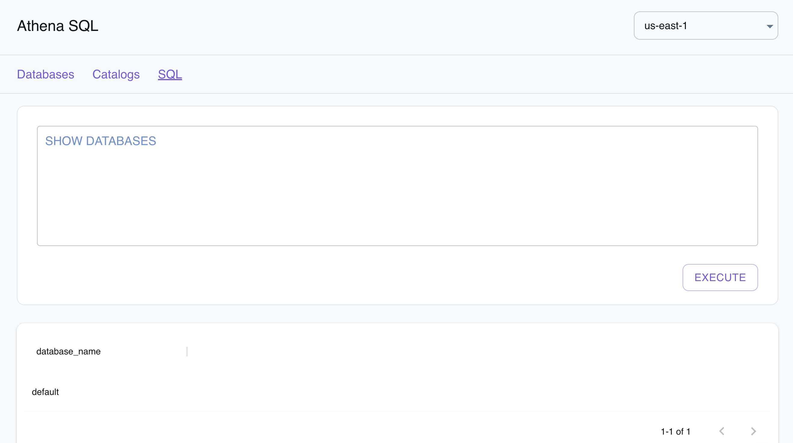

## Introduction

Athena is an interactive query service provided by Amazon Web Services (AWS) that enables you to analyze data stored in S3 using standard SQL queries.
Athena allows users to create ad-hoc queries to perform data analysis, filter, aggregate, and join datasets stored in S3.
It supports various file formats, such as JSON, Parquet, and CSV, making it compatible with a wide range of data sources.

LocalStack allows you to configure the Athena APIs with a Hive metastore that can connect to the S3 API and query your data directly in your local environment.
The supported APIs are available on our [API coverage page](https://docs.localstack.cloud/references/coverage/coverage_athena/), which provides information on the extent of Athena's integration with LocalStack.

## Getting started

This guide is designed for users new to Athena and assumes basic knowledge of the AWS CLI and our [`awslocal`](https://github.com/localstack/awscli-local) wrapper script.

Start your LocalStack container using your preferred method.
We will demonstrate how to create an Athena table and run a query against it in addition to reading the results with the AWS CLI.


To utilize the Athena API, LocalStack will download additional dependencies.
This involves getting a Docker image of around 1.5GB, containing Presto, Hive, and other tools.
These components are retrieved automatically when you initiate the service.
To ensure a smooth initial setup, ensure you're connected to a stable internet connection while fetching these components for the first time.


### Create an S3 bucket

You can create an S3 bucket using the [`mb`](https://docs.aws.amazon.com/cli/latest/reference/s3/mb.html) command.
Run the following command to create a bucket named `athena-bucket`:


$ awslocal s3 mb s3://athena-bucket


You can create some sample data using the following commands:


$ echo "Name,Service" > data.csv
$ echo "LocalStack,Athena" >> data.csv


You can upload the data to your bucket using the [`cp`](https://docs.aws.amazon.com/cli/latest/reference/s3/cp.html) command:


$ awslocal s3 cp data.csv s3://athena-bucket/data/


### Create an Athena table

You can create an Athena table using the [`CreateTable`](https://docs.aws.amazon.com/athena/latest/APIReference/API_CreateTable.html) API
Run the following command to create a table named `athena_table`:


$ awslocal athena start-query-execution \
    --query-string "create external table tbl01 (name STRING, surname STRING) ROW FORMAT DELIMITED FIELDS TERMINATED BY ',' LOCATION 's3://athena-bucket/data/';" --result-configuration "OutputLocation=s3://athena-bucket/output/"


The following output would be retrieved:

```bash
{
    "QueryExecutionId": "593acab7"
}
```

You can retrieve information about the query execution using the [`GetQueryExecution`](https://docs.aws.amazon.com/athena/latest/APIReference/API_GetQueryExecution.html) API.
Run the following command:


$ awslocal athena get-query-execution --query-execution-id 593acab7


Replace `593acab7` with the `QueryExecutionId` returned by the [`StartQueryExecution`](https://docs.aws.amazon.com/athena/latest/APIReference/API_StartQueryExecution.html) API.

### Get output of the query

You can get the output of the query using the [`GetQueryResults`](https://docs.aws.amazon.com/athena/latest/APIReference/API_GetQueryResults.html) API.
Run the following command:


$ awslocal athena get-query-results --query-execution-id 593acab7


You can now read the data from the `tbl01` table and retrieve the data from S3 that was mentioned in your table creation statement.
Run the following command:


$ awslocal athena start-query-execution \
    --query-string "select * from tbl01;" --result-configuration "OutputLocation=s3://athena-bucket/output/"     


You can retrieve the execution details similarly using the [`GetQueryExecution`](https://docs.aws.amazon.com/athena/latest/APIReference/API_GetQueryExecution.html) API using the `QueryExecutionId` returned by the previous step.

You can copy the `ResultConfiguration` from the output and use it to retrieve the results of the query.
Run the following command:


$ awslocal cp s3://athena-bucket/output/593acab7.csv .
$ cat 593acab7.csv


Replace `593acab7.csv` with the path to the file that was present in the `ResultConfiguration` of the previous step.
You can also use the [`GetQueryResults`](https://docs.aws.amazon.com/athena/latest/APIReference/API_GetQueryResults.html) API to retrieve the results of the query.

## Delta Lake Tables

LocalStack Athena supports [Delta Lake](https://delta.io), an open-source storage framework that extends Parquet data files with a file-based transaction log for ACID transactions and scalable metadata handling.

To illustrate this feature, we take a sample published in the [AWS blog](https://aws.amazon.com/blogs/big-data/crawl-delta-lake-tables-using-aws-glue-crawlers).

The Delta Lake files used in this sample are available in a public S3 bucket under `s3://aws-bigdata-blog/artifacts/delta-lake-crawler/sample_delta_table`.
For your convenience, we have prepared the test files in a downloadable ZIP file [here](https://localstack-assets.s3.amazonaws.com/aws-sample-athena-delta-lake.zip).
We start by downloading and extracting this ZIP file:


$ mkdir /tmp/delta-lake-sample; cd /tmp/delta-lake-sample
$ wget https://localstack-assets.s3.amazonaws.com/aws-sample-athena-delta-lake.zip
$ unzip aws-sample-athena-delta-lake.zip; rm aws-sample-athena-delta-lake.zip


We can then create an S3 bucket in LocalStack using the [`awslocal`](https://github.com/localstack/awscli-local) command line, and upload the files to the bucket:

$ awslocal s3 mb s3://test
$ awslocal s3 sync /tmp/delta-lake-sample s3://test


Next, we create the table definitions in Athena:

$ awslocal athena start-query-execution \
    --query-string "CREATE EXTERNAL TABLE test (product_id string, product_name string, \
    price bigint, currency string, category string, updated_at double) \
    LOCATION 's3://test/' TBLPROPERTIES ('table_type'='DELTA')"


Please note that this query may take some time to finish executing.
You can observe the output in the LocalStack container (ideally with `DEBUG=1` enabled) to follow the steps of the query execution.

Finally, we can now run a `SELECT` query to extract data from the Delta Lake table we've just created:

$ queryId=$(awslocal athena start-query-execution --query-string "SELECT * from deltalake.default.test" | jq -r .QueryExecutionId)
$ awslocal athena get-query-results --query-execution-id $queryId


The query should yield a result similar to the output below:
```
...
    "Rows": [
        {
            "Data": [
                { "VarCharValue": "product_id" },
                { "VarCharValue": "product_name" },
                { "VarCharValue": "price" },
                { "VarCharValue": "currency" },
                { "VarCharValue": "category" },
                { "VarCharValue": "updated_at" }
            ]
        },
        {
            "Data": [
                { "VarCharValue": "00005" },
                { "VarCharValue": "USB charger" },
                { "VarCharValue": "50" },
                { "VarCharValue": "INR" },
                { "VarCharValue": "Electronics" },
                { "VarCharValue": "1653462374.9975588" }
            ]
        },
        ...
...
```


The `SELECT` statement above currently requires us to prefix the database/table name with `deltalake.` - this will be further improved in a future iteration, for better parity with AWS.


## Iceberg Tables

The LocalStack Athena implementation also supports [Iceberg tables](https://docs.aws.amazon.com/athena/latest/ug/querying-iceberg-creating-tables.html).
You can define an Iceberg table in Athena using the `CREATE TABLE` statement, as shown in the example below:

```sql
CREATE TABLE mytable (c1 integer, c2 string, c3 double)
LOCATION 's3://mybucket/prefix/' TBLPROPERTIES ( 'table_type' = 'ICEBERG' )
```

Once the table has been created and data inserted into it, you can see the Iceberg metadata and data files being created in S3:

```
s3://mybucket/_tmp.prefix/
s3://mybucket/prefix/data/00000-0-user1_20230212221600_cd8f8cbd-4dcc-4c3f-96a2-f08d4104d6fb-job_local1695603329_0001-00001.parquet
s3://mybucket/prefix/data/00000-0-user1_20230212221606_eef1fd88-8ff1-467a-a15b-7a24be7bc52b-job_local1976884152_0002-00001.parquet
s3://mybucket/prefix/metadata/00000-06706bea-e09d-4ff1-b366-353705634f3a.metadata.json
s3://mybucket/prefix/metadata/00001-3df6a04e-070d-447c-a213-644fe6633759.metadata.json
s3://mybucket/prefix/metadata/00002-5dcd5d07-a9ed-4757-a6bc-9e87fcd671d5.metadata.json
s3://mybucket/prefix/metadata/2f8d3628-bb13-4081-b5a9-30f2e81b7226-m0.avro
s3://mybucket/prefix/metadata/70de28f7-6507-44ae-b505-618d734174b9-m0.avro
s3://mybucket/prefix/metadata/snap-8425363304532374388-1-70de28f7-6507-44ae-b505-618d734174b9.avro
s3://mybucket/prefix/metadata/snap-9068645333036463050-1-2f8d3628-bb13-4081-b5a9-30f2e81b7226.avro
s3://mybucket/prefix/temp/
```

## Client configuration

You can configure the Athena service in LocalStack with various clients, such as [PyAthena](https://github.com/laughingman7743/PyAthena/), [awswrangler](https://github.com/aws/aws-sdk-pandas), among others!
Here are small snippets to get you started:



from pyathena import connect

conn = connect(
    s3_staging_dir="s3://s3-results-bucket/output/",
    region_name="us-east-1",
    endpoint_url="http://localhost:4566",
)
cursor = conn.cursor()

cursor.execute("SELECT 1,2,3 AS test")
print(cursor.fetchall())


import awswrangler as wr
import pandas as pd

ENDPOINT = "http://localhost:4566"
DATABASE = "testdb"
S3_BUCKET = "s3://s3-results-bucket/output/"

wr.config.athena_endpoint_url = ENDPOINT
wr.config.glue_endpoint_url = ENDPOINT
wr.config.s3_endpoint_url = ENDPOINT
wr.catalog.create_database(DATABASE)
df = wr.athena.read_sql_query("SELECT 1 AS col1, 2 AS col2, 3 AS col3", database=DATABASE)
print(df)



## Resource Browser

The LocalStack Web Application provides a Resource Browser for Athena query execution, writing SQL queries, and visualizing query results.
You can access the Resource Browser by opening the LocalStack Web Application in your browser, navigating to the **Resources** section, and then clicking on **Athena** under the **Analytics** section.



The Resource Browser allows you to perform the following actions:

- **View Databases**: View the databases available in your Athena instance by clicking on the **Databases** tab.
- **View Catalogs**: View the catalogs available in your Athena instance by clicking on the **Catalogs** tab.
- **Edit Catalogs**: Edit the catalogs available in your Athena instance by clicking on the **Catalog name**, editing the catalog, and then clicking on the **Submit** button.
- **Create Catalogs**: Create a new catalog by clicking on the **Create Catalog** button, entering the catalog details, and then clicking on the **Submit** button.
- **Run SQL Queries**: Run SQL queries by clicking on the **SQL** button, entering the query, and then clicking on the **Execute** button.

## Examples

The following code snippets and sample applications provide practical examples of how to use Athena in LocalStack for various use cases:

- [Query data in S3 Bucket with Amazon Athena, Glue Catalog & CloudFormation](https://github.com/localstack/query-data-s3-athena-glue-sample)
