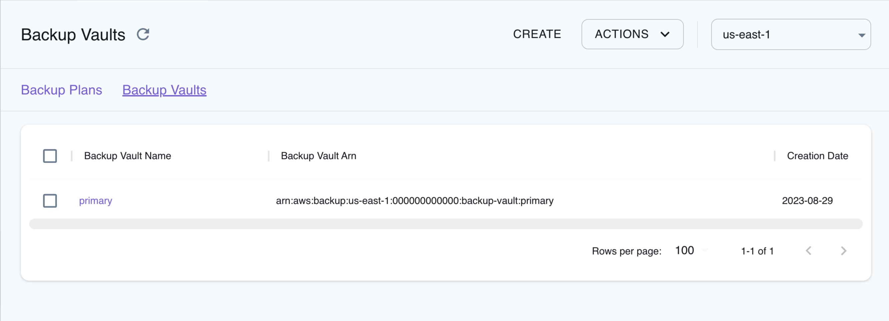

## Introduction

Backup is a centralized backup service provided by Amazon Web Services. It simplifies the process of backing up and restoring your data across various AWS services and resources. Backup supports a wide range of AWS resources, including Elastic Block Store (EBS) volumes, Relational Database Service (RDS) databases, DynamoDB tables, Elastic File System (EFS) file systems, and more. Backup enables you to set backup retention policies, allowing you to specify how long you want to retain your backup copies.

LocalStack allows you to use the Backup APIs in your local environment to manage backup plans, create scheduled or on-demand backups of certain resource types. The supported APIs are available on our [API coverage page](https://docs.localstack.cloud/references/coverage/coverage_backup/), which provides information on the extent of Backup's integration with LocalStack.

## Getting started

This guide is designed for users new to Backup and assumes basic knowledge of the AWS CLI and our [`awslocal`](https://github.com/localstack/awscli-local) wrapper script.

Start your LocalStack container using your preferred method. We will demonstrate how to create a backup job and specify a set of resources to the backup plan name and backup rules with the AWS CLI.

### Create a backup vault

You can create a backup vault which acts as a logical container where backups are stored using the [`CreateBackupVault`](https://docs.aws.amazon.com/aws-backup/latest/devguide/API_CreateBackupVault.html) API. Run the following command to create a backup vault named `my-vault`:


$ awslocal backup create-backup-vault \
    --backup-vault-name primary


The following output would be retrieved:

```bash
{
    "BackupVaultName": "primary",
    "BackupVaultArn": "arn:aws:backup:us-east-1:000000000000:backup-vault:primary",
    "CreationDate": 1693286432.432258
}
```

### Create a backup plan

You can create a backup plan which specifies the backup vault to store the backups in and the schedule for creating backups. You can specify the backup plan in a `backup-plan.json` file:

```json
{
    "BackupPlanName": "testplan",
    "Rules": [{
        "RuleName": "HalfDayBackups",
        "TargetBackupVaultName": "primary",
        "ScheduleExpression": "cron(0 5/12 ? * * *)",
        "StartWindowMinutes": 480,
        "CompletionWindowMinutes": 10080,
        "Lifecycle": {
            "DeleteAfterDays": 30
        },
        "CopyActions": [{
            "DestinationBackupVaultArn": "arn:aws:backup:us-east-1:000000000000:backup-vault:secondary",
            "Lifecycle": {
                "DeleteAfterDays": 30
            }
        }]
    }]
}
```

You can use the [`CreateBackupPlan`](https://docs.aws.amazon.com/aws-backup/latest/devguide/API_CreateBackupPlan.html) API to create a backup plan. Run the following command to create a backup plan:


$ awslocal backup create-backup-plan \
    --backup-plan file://backup-plan.json


The following output would be retrieved:

```bash
{
    "BackupPlanId": "9337aba3",
    "BackupPlanArn": "arn:aws:backup:us-east-1:000000000000:backup-plan:testplan",
    "CreationDate": 1693286644.0,
    "VersionId": "9dc2cb60"
}
```

### Create a backup selection

You can create a backup selection which specifies the resources to backup and the backup plan to associate with. You can specify the backup selection in a `backup-selection.json` file:

```json
{
    "SelectionName": "Myselection",
    "IamRoleArn": "arn:aws:iam::000000000000:role/service-role/AWSBackupDefaultServiceRole",
    "Resources": ["arn:aws:ec2:us-east-1:000000000000:volume/vol-0abcdef1234"],
    "ListOfTags": [{
        "ConditionType": "STRINGEQUALS",
        "ConditionKey": "backup",
        "ConditionValue": "yes"
    }]
}

```

You can use the [`CreateBackupSelection`](https://docs.aws.amazon.com/aws-backup/latest/devguide/API_CreateBackupSelection.html) API to create a backup selection. Run the following command to create a backup selection:


$ awslocal backup create-backup-selection \
    --backup-plan-id 9337aba3 \
    --backup-selection file://backup-plan-resources.json 


Replace the `--backup-plan-id` value with the `BackupPlanId` value from the output of the previous command. The following output would be retrieved:

```bash
{
    "SelectionId": "91ce25f8",
    "BackupPlanId": "9337aba3",
    "CreationDate": 1693287607.209043
}
```

## Resource Browser

The LocalStack Web Application provides a Resource Browser for managing backup plans and vaults. You can access the Resource Browser by opening the LocalStack Web Application in your browser, navigating to the **Resources** section, and then clicking on **Backup** under the **Storage** section.



The Resource Browser allows you to perform the following actions:

- **Create Backup Plan**: Create a backup plan by clicking the **Create** button in the **Backup Plans** tab and specifying the backup plan details, including the plan name, rules, backup setting, and more in the modal dialog.
- **Create Backup Vault**: Create a backup vault by clicking the **Create** button in the **Backup Vault** tab and specifying the vault name, tags, and other parameters in the modal dialog.
- **Create Backup**: Create a backup by clicking the **Backup Vault** and then clicking the **Actions** button followed by clicking the **Create Backup** button in the modal dialog. Specify the backup name, backup vault, and other parameters in the modal dialog.
- **Assign Resources**: Click the backup plan and then click the **Actions** button followed by clicking the **Assign Resources** button in the modal dialog. Specify the backup plan ID and resources to assign in the modal dialog, and click **Submit** to assign the resources to the backup plan.
- **Delete Vault**: Delete a backup vault by clicking the **Backup Vault** or selecting multiple vaults. Click the **Actions** button followed by clicking the **Delete Vault** button or **Remove Selected** to delete an individual vault or multiple vaults respectively in the modal dialog.
- **Delete Backup Plan**: Delete a backup plan by clicking the **Backup Plan** or selecting multiple plans. Click the **Actions** button followed by clicking the **Delete Backup Plan** button or **Remove Selected** to delete an individual plan or multiple plans respectively in the modal dialog.
