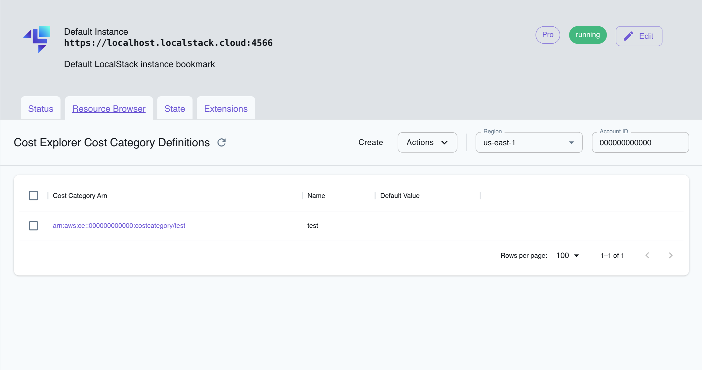

## Introduction

Cost Explorer is a service provided by Amazon Web Services (AWS) that enables you to visualize, analyze, and manage your AWS spending and usage. Cost Explorer offers options to filter and group data by dimensions such as service, region, instance type, and more. With Cost Explorer, you can forecast costs, track budget progress, and set up alerts to receive notifications when spending exceeds predefined thresholds.

LocalStack allows you to use the Cost Explorer APIs in your local environment to create and manage cost category definition, cost anomaly monitors & subscriptions. The supported APIs are available on our [API coverage page](https://docs.localstack.cloud/references/coverage/coverage_ce/), which provides information on the extent of Cost Explorer's integration with LocalStack.

## Getting started

This guide is designed for users new to Cost Explorer and assumes basic knowledge of the AWS CLI and our [`awslocal`](https://github.com/localstack/awscli-local) wrapper script.

Start your LocalStack container using your preferred method. We will demonstrate how to mock the Cost Explorer APIs with the AWS CLI.

### Create a Cost Category definition

You can create a Cost Category definition using the [`CreateCostCategoryDefinition`](https://docs.aws.amazon.com/aws-cost-management/latest/APIReference/API_CreateCostCategoryDefinition.html)) API. The following example creates a Cost Category definition using an empty rule condition of type "REGULAR":


$ awslocal ce create-cost-category-definition --name test \
    --rule-version "CostCategoryExpression.v1" --rules '[{"Value": "test", "Rule": {}, "Type": "REGULAR"}]'


The following output would be retrieved:

```bash
{
    "CostCategoryArn": "arn:aws:ce::000000000000:costcategory/test"
}
```

You can describe the Cost Category definition using the [`DescribeCostCategoryDefinition`](https://docs.aws.amazon.com/aws-cost-management/latest/APIReference/API_DescribeCostCategoryDefinition.html) API. Run the following command:


$ awslocal ce describe-cost-category-definition \
    --cost-category-arn arn:aws:ce::000000000000:costcategory/test


The following output would be retrieved:

```bash
{
    "CostCategory": {
        "CostCategoryArn": "arn:aws:ce::000000000000:costcategory/test",
        "Name": "test",
        "RuleVersion": "CostCategoryExpression.v1",
        "Rules": [
            {
                "Value": "test",
                "Rule": {},
                "Type": "REGULAR"
            }
        ]
    }
}
```

### Create a cost anomaly subscription

You can add an alert subscription to a cost anomaly detection monitor to define subscribers using the [`CreateAnomalySubscription`](https://docs.aws.amazon.com/aws-cost-management/latest/APIReference/API_CreateAnomalySubscription.html) API. The following example creates a cost anomaly subscription:


$ awslocal ce create-anomaly-subscription --anomaly-subscription '{
    "AccountId": "12345",
    "SubscriptionName": "sub1",
    "Frequency": "DAILY",
    "MonitorArnList": [],
    "Subscribers": [],
    "Threshold": 111
}'


The following output would be retrieved:

```bash
{
    "SubscriptionArn": "arn:aws:ce::000000000000:anomalysubscription/70644961"
}
```

You can retrieve the cost anomaly subscriptions using the [`GetAnomalySubscriptions`](https://docs.aws.amazon.com/aws-cost-management/latest/APIReference/API_GetAnomalySubscriptions.html) API. Run the following command:


$ awslocal ce get-anomaly-subscriptions


The following output would be retrieved:

```bash
{
    "AnomalySubscriptions": [
        {
            "SubscriptionArn": "arn:aws:ce::000000000000:anomalysubscription/70644961",
            "AccountId": "12345",
            "MonitorArnList": [],
            "Subscribers": [],
            "Threshold": 111.0,
            "Frequency": "DAILY",
            "SubscriptionName": "sub1"
        }
    ]
}
```

### Create a cost anomaly monitor

You can create a new cost anomaly detection subscription with the requested type and monitor specification using the [`CreateAnomalyMonitor`](https://docs.aws.amazon.com/aws-cost-management/latest/APIReference/API_CreateAnomalyMonitor.html) API. The following example creates a cost anomaly monitor:


$ awslocal ce create-anomaly-monitor --anomaly-monitor '{
    "MonitorName": "mon5463",
    "MonitorType": "DIMENSIONAL"
}'


The following output would be retrieved:

```bash
{
    "MonitorArn": "arn:aws:ce::000000000000:anomalymonitor/22570ff3"
}
```

You can retrieve the cost anomaly monitors using the [`GetAnomalyMonitors`](https://docs.aws.amazon.com/aws-cost-management/latest/APIReference/API_GetAnomalyMonitors.html) API. Run the following command:


$ awslocal ce get-anomaly-monitors


The following output would be retrieved:

```bash
{
    "AnomalyMonitors": [
        {
            "MonitorArn": "arn:aws:ce::000000000000:anomalymonitor/22570ff3",
            "MonitorName": "mon5463",
            "MonitorType": "DIMENSIONAL"
        }
    ]
}
```

## Resource Browser

The LocalStack Web Application provides a Resource Browser for managing cost category definitions for the Cost Explorer service. You can access the Resource Browser by opening the LocalStack Web Application in your browser, navigating to the Resources section, and then clicking on **Cost Explorer** under the **Cloud Financial Management** section.


<br><br>

The Resource Browser allows you to perform the following actions:

- **Create Cost Category definition**: Create a new Cost Category definition by clicking on the **Create** button and providing the required details.
- **View Cost Category definition**: View the details of a Cost Category definition by clicking on the Cost Category definition.
- **Delete Cost Category definition**: Delete a Cost Category definition by selecting on the Cost Categorty definition, and then clicking on the **Actions** button followed by **Remove Selected**.

## Current Limitations

LocalStack's Cost Explorer implementation cannot programmatically query your cost and usage data, or provide aggregated data such as total monthly costs or total daily usage. However, you can use the integrations to mock the Cost Explorer APIs and test your workflow locally.
