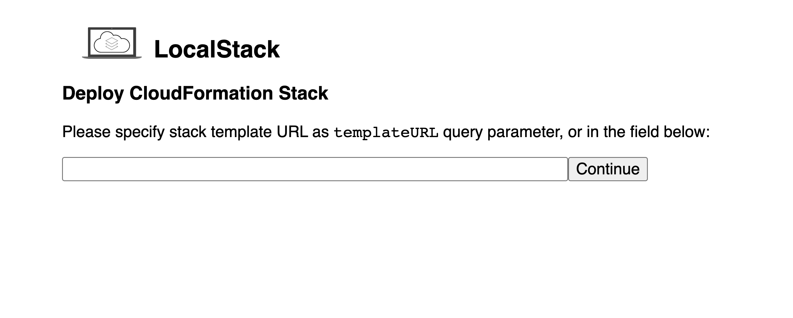
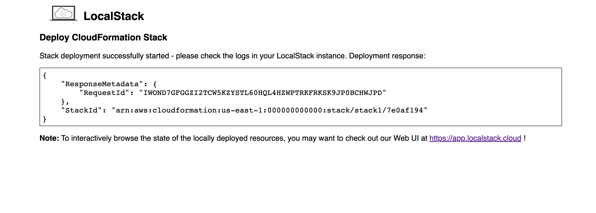

## Overview

AWS CloudFormation is AWS's primary Infrastructure-as-Code (IaC) service. It is used to declaratively define your architecture on the AWS cloud, including resources such as S3 Buckets, Lambda Functions, and much more.

CloudFormation **Stack** templates are written in either YAML or JSON and can be written manually or generated by higher-level tools such as [AWS CDK](  ), [AWS SAM]( ), [Pulumi]() or [Serverless Framework]( ).

## Quickstart

In this quickstart guide we will deploy a simple CloudFormation stack consisting of a single S3 Bucket.

### Prerequisites

Make sure you've set up [`awslocal`]() and that you have a running LocalStack instance.

### Deploy a CloudFormation Stack to LocalStack



Resources:
  LocalBucket:
    Type: AWS::S3::Bucket
    Properties:
      BucketName: cfn-quickstart-bucket


{
  "Resources": {
    "LocalBucket": {
      "Type": "AWS::S3::Bucket",
      "Properties": {
        "BucketName": "cfn-quickstart-bucket"
      }
    }
  }
}



Use this code snippet and save the content in either `cfn-quickstart-stack.yaml` or `cfn-quickstart-stack.json` respectively.

```bash
# Deploy the bucket on LocalStack
# The template file (ending with .yaml or .json) should contain the stack content from above
awslocal cloudformation deploy --stack-name cfn-quickstart-stack --template-file "./cfn-quickstart-stack.yaml"

# Verify the bucket was created successfully
# The output should include a bucket with the name cfn-quickstart-bucket
awslocal s3api list-buckets

# Delete the stack (this will also delete the bucket)
awslocal cloudformation delete-stack --stack-name cfn-quickstart-stack
```

Check out the official [AWS CloudFormation User Guide](https://docs.aws.amazon.com/AWSCloudFormation/latest/UserGuide/Welcome.html) for a general introduction to CloudFormation concepts and a more comprehensive introduction on how to write CloudFormation templates.

## CloudFormation User-Interface

You can also use LocalStack's CloudFormation user-interface to deploy and manage your CloudFormation stacks by using public templates. The user-interface is available at `http://localhost:4566/_localstack/cloudformation/deploy`.



You can use the CloudFormation user-interface to point to an existing CloudFormation template URL, fill out the required parameters, and trigger the deployment from the browser. Let us use the following example template to deploy a CloudFormation stack:

- Use the public CloudFormation template URL: `https://s3.eu-central-1.amazonaws.com/cloudformation-templates-eu-central-1/DynamoDB_Secondary_Indexes.template`.
- Next we download the template URL and extract the stack parameters (default values automatically applied):
  
- Upon submission, the stack deployment is triggered, and we display a result message:
  

To interactively browse the state of the locally deployed resources, you may want to check out our [Web application](https://app.localstack.cloud).

## Support

We are constantly improving our feature coverage for CloudFormation, with new resource types getting added on an ongoing basis.
Your feature requests help us prioritize which resources we need to prioritize, so please feel free to [open a new GitHub issue](https://github.com/localstack/localstack/issues/new?assignees=&labels=feature-request&template=feature-request.yml&title=feature+request%3A+%3Ctitle%3E) or add a _thumbs up_ to an existing issue.

### Features

| Feature             | Support                                         |
|:--------------------|:------------------------------------------------|
| Dynamic References  | -                                               |
| Rules               | -                                               |
| Custom resources    | Partial                                         |
| Drift detection     | -                                               |
| Importing Resources | -                                               |
| Change sets         | **Full**                                        |
| Nested stacks       | Partial                                         |
| StackSets           | Partial                                         |

In general `UPDATE` support for resources is currently limited.
Prefer re-creating a stack rather than updating an existing one. 

# Template Features

Localstack supports a wide range of Cloudformation template features, including:

* **Outputs**
  Outputs are values that are generated by the template and can be used by other resources or by users

* **Conditionals**

  Conditionals allow you to define logic in your templates that only executes if certain conditions are met. For example, you could use a conditional to only create a resource if a certain parameter is set.

* **Mappings**

  Mappings allow you to define a lookup table that can be used to reference values in your templates. For example, you could use a mapping to define a list of regions that your application can be deployed to.

* **Implicit type conversion**

  Localstack automatically converts values to the correct type when they are used in your templates. This means that you don't have to worry about explicitly casting values to the correct type.

* **Intrinsic Functions**

  Intrinsic functions are a set of built-in functions that you can use to perform common tasks in your templates. For example, you could use the `Fn::Base64` function to encode a string as base64.


   | Intrinsic Function | Supported | Explanation |
   |---|---|---|
   | Fn::And | Yes | Performs a logical AND operation on two or more expressions. |
   | Fn::Or | Yes | Performs a logical OR operation on two or more expressions. |
   | Fn::Base64 | Yes | Converts a binary string to a Base64-encoded string. |
   | Fn::Sub | Yes | Performs a string substitution operation. |
   | Fn::Split | Yes | Splits a string into an array of strings. |
   | Fn::Length | Yes | Returns the length of a string. |
   | Fn::Join | Yes | Joins an array of strings into a single string. |
   | Fn::FindInMap | Yes | Finds a value in a map. |
   | Fn::Ref | Yes | References a resource in the template. |
   | Fn::GetAtt | Yes | Gets an attribute from a resource. |
   | Fn::If | Yes | Performs a conditional evaluation. |
   | Fn::Import | Yes | Imports a value from another template. |
   | Fn::ToJsonString | No | Converts an object or map into a json string. |
   | Fn::Cidr | No | Generates a CIDR block from the inputs. |
   | Fn::GetAZs | No | Returns a list of the Availability Zones of a region. |


* **Exports/Import values**

  You can export values from your templates and import them into other templates. This allows you to reuse values across multiple templates.

* **SSM Parameters with version or secured for stack parameters**

  You can use SSM parameters as stack parameters. This allows you to store sensitive configuration data in SSM Parameter Store and reference it in your templates.

* **SecretsManager Secrets as stack parameters**

  You can use SecretsManager secrets as stack parameters. This allows you to store sensitive configuration data in SecretsManager and reference it in your templates.

* **UsePreviousValue for the update**

  You can use the `UsePreviousValue` attribute to specify that a resource should not be recreated when you update your stack. This can be useful if you want to preserve the state of a resource when you update your stack.

* **Macros**
  Macros allow you to define reusable blocks of code that can be used in your templates.

    * `GlobalScope`: applies the transformation on the complete template.
    * `Snipped Transformation`: applies the transformation on just a segment of the template
    * `AWS::Serverless-2016-10-31` 


### Resources (Community Edition)

|Resource|Create|Delete|Update|
|-----|-----:|-----:|----:|
|AWS::ApiGateway::Account|-|-|-|
|AWS::ApiGateway::ApiKey|✅|-|-|
|AWS::ApiGateway::BasePathMapping|✅|-|-|
|AWS::ApiGateway::Deployment|✅|-|-|
|AWS::ApiGateway::DomainName|✅|-|-|
|AWS::ApiGateway::GatewayResponse|✅|-|-|
|AWS::ApiGateway::Method|✅|-|✅|
|AWS::ApiGateway::Model|✅|-|-|
|AWS::ApiGateway::RequestValidator|✅|✅|-|
|AWS::ApiGateway::Resource|✅|-|-|
|AWS::ApiGateway::RestApi|✅|✅|-|
|AWS::ApiGateway::Stage|✅|-|-|
|AWS::ApiGateway::UsagePlan|✅|-|-|
|AWS::ApiGateway::UsagePlanKey|✅|-|-|
|AWS::CDK::Metadata|-|-|-|
|AWS::CertificateManager::Certificate|✅|✅|-|
|AWS::CloudFormation::Stack|✅|-|-|
|AWS::CloudWatch::Alarm|✅|✅|-|
|AWS::CloudWatch::CompositeAlarm|✅|✅|-|
|AWS::DynamoDB::Table|✅|✅|-|
|AWS::EC2::Instance|✅|✅|✅|
|AWS::EC2::InternetGateway|✅|-|-|
|AWS::EC2::NatGateway|✅|✅|-|
|AWS::EC2::Route|✅|✅|-|
|AWS::EC2::RouteTable|✅|✅|-|
|AWS::EC2::SecurityGroup|✅|✅|-|
|AWS::EC2::Subnet|✅|✅|-|
|AWS::EC2::SubnetRouteTableAssociation|✅|✅|-|
|AWS::EC2::VPC|✅|✅|-|
|AWS::EC2::VPCGatewayAttachment|✅|-|-|
|AWS::ECR::Repository|✅|✅|-|
|AWS::Elasticsearch::Domain|✅|✅|-|
|AWS::Events::Connection|✅|✅|-|
|AWS::Events::EventBus|✅|✅|-|
|AWS::Events::EventBusPolicy|✅|✅|-|
|AWS::Events::Rule|✅|✅|-|
|AWS::IAM::Group|✅|✅|-|
|AWS::IAM::InstanceProfile|✅|✅|-|
|AWS::IAM::ManagedPolicy|✅|-|-|
|AWS::IAM::Policy|✅|✅|-|
|AWS::IAM::Role|✅|✅|✅|
|AWS::IAM::ServiceLinkedRole|✅|✅|-|
|AWS::IAM::User|✅|✅|-|
|AWS::KMS::Alias|✅|✅|-|
|AWS::KMS::Key|✅|✅|-|
|AWS::Kinesis::Stream|✅|✅|-|
|AWS::Kinesis::StreamConsumer|✅|✅|-|
|AWS::KinesisFirehose::DeliveryStream|✅|✅|-|
|AWS::Lambda::EventInvokeConfig|✅|✅|-|
|AWS::Lambda::EventSourceMapping|✅|-|-|
|AWS::Lambda::Function|✅|✅|✅|
|AWS::Lambda::Permission|✅|-|-|
|AWS::Lambda::Version|✅|-|-|
|AWS::Logs::LogGroup|✅|✅|-|
|AWS::Logs::LogStream|✅|✅|-|
|AWS::Logs::SubscriptionFilter|✅|✅|-|
|AWS::OpenSearchService::Domain|✅|✅|-|
|AWS::Redshift::Cluster|✅|-|-|
|AWS::ResourceGroups::Group|✅|✅|-|
|AWS::Route53::RecordSet|✅|-|-|
|AWS::S3::Bucket|✅|✅|-|
|AWS::S3::BucketPolicy|✅|✅|-|
|AWS::SNS::Subscription|✅|✅|-|
|AWS::SNS::Topic|✅|✅|-|
|AWS::SNS::TopicPolicy|✅|✅|-|
|AWS::SQS::Queue|✅|✅|-|
|AWS::SQS::QueuePolicy|✅|✅|-|
|AWS::SSM::Parameter|✅|✅|-|
|AWS::SecretsManager::ResourcePolicy|✅|✅|-|
|AWS::SecretsManager::RotationSchedule|-|-|-|
|AWS::SecretsManager::Secret|✅|✅|-|
|AWS::SecretsManager::SecretTargetAttachment|-|-|-|
|AWS::StepFunctions::Activity|✅|✅|-|
|AWS::StepFunctions::StateMachine|✅|✅|✅|


### Resources (Pro / Enterprise Edition)

The resources below are only available with a valid Pro license key.
When running the Community Edition, any unsupported resources in the stack are ignored and will not get deployed.

|Resource|Create|Delete|Update|
|-----|-----:|-----:|----:|
|AWS::Amplify::App|✅|-|-|
|AWS::Amplify::Branch|✅|-|-|
|AWS::ApiGateway::Authorizer|✅|✅|-|
|AWS::ApiGatewayV2::Api|✅|✅|-|
|AWS::ApiGatewayV2::Authorizer|✅|✅|-|
|AWS::ApiGatewayV2::Deployment|✅|✅|-|
|AWS::ApiGatewayV2::DomainName|✅|✅|-|
|AWS::ApiGatewayV2::Integration|✅|✅|-|
|AWS::ApiGatewayV2::IntegrationResponse|✅|✅|-|
|AWS::ApiGatewayV2::Route|✅|✅|-|
|AWS::ApiGatewayV2::RouteResponse|✅|✅|-|
|AWS::ApiGatewayV2::Stage|✅|✅|-|
|AWS::ApiGatewayV2::VpcLink|✅|✅|-|
|AWS::AppSync::ApiKey|✅|-|-|
|AWS::AppSync::DataSource|✅|-|-|
|AWS::AppSync::FunctionConfiguration|✅|-|-|
|AWS::AppSync::GraphQLApi|✅|-|-|
|AWS::AppSync::GraphQLSchema|✅|-|-|
|AWS::AppSync::Resolver|✅|✅|✅|
|AWS::ApplicationAutoScaling::ScalableTarget|✅|✅|-|
|AWS::ApplicationAutoScaling::ScalingPolicy|✅|✅|-|
|AWS::Backup::BackupPlan|✅|✅|-|
|AWS::CloudFormation::CustomResource|✅|-|-|
|AWS::CloudFront::CloudFrontOriginAccessIdentity|✅|-|-|
|AWS::CloudFront::Distribution|✅|-|-|
|AWS::CloudFront::Function|✅|✅|-|
|AWS::CloudFront::OriginRequestPolicy|✅|✅|-|
|AWS::CloudTrail::Trail|✅|✅|-|
|AWS::Cognito::IdentityPool|✅|✅|-|
|AWS::Cognito::IdentityPoolRoleAttachment|✅|-|-|
|AWS::Cognito::UserPool|✅|✅|-|
|AWS::Cognito::UserPoolClient|✅|✅|-|
|AWS::Cognito::UserPoolDomain|✅|✅|-|
|AWS::Cognito::UserPoolGroup|✅|✅|-|
|AWS::Cognito::UserPoolIdentityProvider|✅|✅|-|
|AWS::DocDB::DBCluster|✅|✅|-|
|AWS::DocDB::DBClusterParameterGroup|✅|✅|-|
|AWS::DocDB::DBInstance|✅|✅|-|
|AWS::DocDB::DBSubnetGroup|✅|✅|-|
|AWS::EC2::EIP|✅|✅|-|
|AWS::EC2::SecurityGroupEgress|✅|-|-|
|AWS::EC2::SecurityGroupIngress|✅|-|-|
|AWS::EC2::VPCEndpoint|✅|-|-|
|AWS::ECS::Cluster|✅|✅|-|
|AWS::ECS::Service|✅|✅|-|
|AWS::ECS::TaskDefinition|✅|-|-|
|AWS::ElastiCache::CacheCluster|✅|✅|-|
|AWS::ElastiCache::ParameterGroup|✅|✅|-|
|AWS::ElastiCache::ReplicationGroup|✅|✅|-|
|AWS::ElastiCache::SecurityGroup|✅|✅|-|
|AWS::ElastiCache::SubnetGroup|✅|✅|-|
|AWS::ElasticLoadBalancingV2::Listener|✅|-|-|
|AWS::ElasticLoadBalancingV2::ListenerRule|✅|-|-|
|AWS::ElasticLoadBalancingV2::LoadBalancer|✅|-|-|
|AWS::ElasticLoadBalancingV2::TargetGroup|✅|-|-|
|AWS::Glue::Classifier|✅|-|-|
|AWS::Glue::Crawler|✅|-|-|
|AWS::Glue::Database|✅|-|-|
|AWS::Glue::Job|✅|-|-|
|AWS::Glue::Table|✅|-|-|
|AWS::Glue::Trigger|✅|-|-|
|AWS::Glue::Workflow|✅|-|-|
|AWS::IoT::Certificate|✅|-|-|
|AWS::IoT::Policy|✅|✅|-|
|AWS::IoT::Thing|✅|✅|-|
|AWS::IoT::TopicRule|✅|✅|-|
|AWS::IoTAnalytics::Channel|✅|✅|-|
|AWS::IoTAnalytics::Dataset|✅|✅|-|
|AWS::IoTAnalytics::Datastore|✅|✅|-|
|AWS::IoTAnalytics::Pipeline|✅|✅|-|
|AWS::KinesisAnalytics::Application|✅|-|-|
|AWS::KinesisAnalytics::ApplicationOutput|✅|-|-|
|AWS::Lambda::Alias|✅|-|-|
|AWS::Lambda::LayerVersion|✅|-|-|
|AWS::Lambda::LayerVersionPermission|✅|-|-|
|AWS::MSK::Cluster|✅|✅|-|
|AWS::QLDB::Ledger|✅|✅|-|
|AWS::RDS::DBCluster|✅|✅|-|
|AWS::RDS::DBClusterParameterGroup|✅|✅|-|
|AWS::RDS::DBInstance|✅|✅|-|
|AWS::RDS::DBParameterGroup|✅|✅|-|
|AWS::RDS::DBSubnetGroup|✅|✅|-|
|AWS::Redshift::ClusterParameterGroup|✅|✅|-|
|AWS::Redshift::ClusterSecurityGroup|✅|✅|-|
|AWS::Redshift::ClusterSubnetGroup|✅|✅|-|
|AWS::Route53::HostedZone|✅|✅|-|
|AWS::SES::ReceiptRule|✅|✅|-|
|AWS::SES::ReceiptRuleSet|✅|✅|-|
|AWS::SES::Template|✅|✅|✅|
|AWS::ServiceDiscovery::HttpNamespace|✅|✅|-|
|AWS::ServiceDiscovery::PrivateDnsNamespace|✅|✅|-|
|AWS::ServiceDiscovery::PublicDnsNamespace|✅|✅|-|
|AWS::ServiceDiscovery::Service|✅|✅|-|
|AWS::Timestream::Database|✅|✅|-|
|AWS::Timestream::Table|✅|✅|-|
