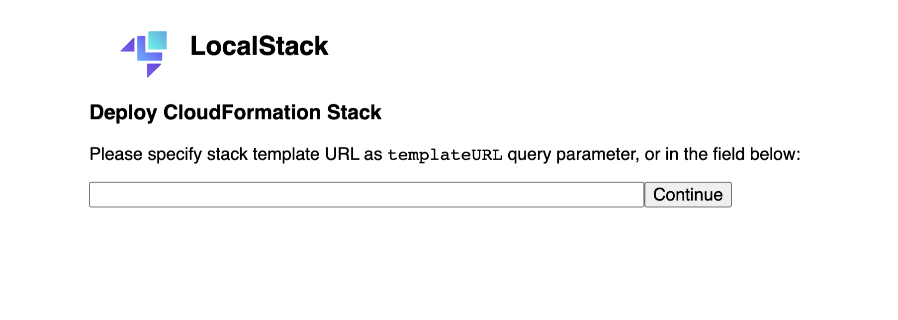
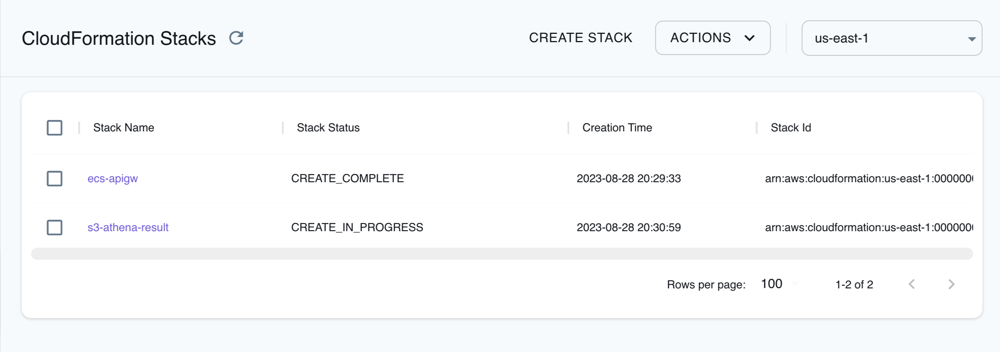

## Introduction

CloudFormation is a service provided by Amazon Web Services (AWS) that allows you to define and provision infrastructure as code. It enables you to create, update, and manage resources in a repeatable and automated manner using declarative templates. With CloudFormation, you can use JSON or YAML templates to define your desired infrastructure state. You can specify resources, their configurations, dependencies, and relationships in these templates.

LocalStack supports CloudFormation, allowing you to use the CloudFormation APIs in your local environment to declaratively define your architecture on the AWS, including resources such as S3 Buckets, Lambda Functions, and much more. The [API coverage page](https://docs.localstack.cloud/references/coverage/coverage_cloudformation/) and [feature coverage](#feature-coverage) provides information on the extent of CloudFormation's integration with LocalStack.

## Getting started

This guide is designed for users new to CloudFormation and assumes basic knowledge of the AWS CLI and our [`awslocal`](https://github.com/localstack/awscli-local) wrapper script.

Start your LocalStack container using your preferred method. We will demonstrate how to deploy a simple CloudFormation stack consisting of a single S3 Bucket with the AWS CLI.

### Create a CloudFormation Stack

CloudFormation stack is a collection of AWS resources that you can create, update, or delete as a single unit. Stacks are defined using JSON or YAML templates. Use the following code snippet and save the content in either `cfn-quickstart-stack.yaml` or `cfn-quickstart-stack.json`, depending on your preferred format.



Resources:
  LocalBucket:
    Type: AWS::S3::Bucket
    Properties:
      BucketName: cfn-quickstart-bucket


{
  "Resources": {
    "LocalBucket": {
      "Type": "AWS::S3::Bucket",
      "Properties": {
        "BucketName": "cfn-quickstart-bucket"
      }
    }
  }
}



### Deploy the CloudFormation Stack

You can deploy the CloudFormation stack using the AWS CLI with the [`deploy`](https://docs.aws.amazon.com/cli/latest/reference/cloudformation/deploy/index.html) command. The `deploy` command creates and updates CloudFormation stacks. Run the following command to deploy the stack:


$ awslocal cloudformation deploy \
    --stack-name cfn-quickstart-stack \
    --template-file "./cfn-quickstart-stack.yaml"


You can verify that the stack was created successfully by listing the S3 buckets in your LocalStack container using the [`ListBucket` API](https://docs.aws.amazon.com/cli/latest/reference/s3api/list-buckets.html). Run the following command to list the buckets:


$ awslocal s3api list-buckets


### Delete the CloudFormation Stack

You can delete the CloudFormation stack using the [`delete-stack`](https://docs.aws.amazon.com/cli/latest/reference/cloudformation/delete-stack.html) command. Run the following command to delete the stack along with all the resources created by the stack:


$ awslocal cloudformation delete-stack \
    --stack-name cfn-quickstart-stack


## Local User-Interface

You can also utilize LocalStack's local CloudFormation user-interface to deploy and manage your CloudFormation stacks using public templates. You can access the user-interface at [`localhost:4566/_localstack/cloudformation/deploy`](http://localhost:4566/_localstack/cloudformation/deploy).

  

You can utilize the CloudFormation user interface to provide an existing CloudFormation template URL, input the necessary parameters, and initiate the deployment directly from your browser. Let's proceed with an example template to deploy a CloudFormation stack.

To begin, employ the public CloudFormation template URL: [`s3.eu-central-1.amazonaws.com/cloudformation-templates-eu-central-1/DynamoDB_Secondary_Indexes.template`](https://s3.eu-central-1.amazonaws.com/cloudformation-templates-eu-central-1/DynamoDB_Secondary_Indexes.template).

Following this, download the template URL and extract the stack parameters (default values will be automatically applied). Upon submission, the stack deployment will be triggered, and a result message will be displayed.

## Resource Browser

The LocalStack Web Application provides a Resource Browser for managing CloudFormation stacks to manage your AWS resources locally. You can access the Resource Browser by opening the LocalStack Web Application in your browser, navigating to the **Resources** section, and then clicking on **CloudFormation** under the **Management/Governance** section.

The Resource Browser allows you to perform the following actions:

- **Create Stack**: Create a new CloudFormation stack by clicking on **Create Stack** and provide a template file or URL, including the stack name and parameters.
- **Edit Stack**: Edit an existing CloudFormation stack by clicking on **Edit Stack** and editing the stack name and parameters and clicking on **Submit**.
- **View Stack**: View an existing CloudFormation stack by clicking on the Stack Name and viewing the stack details, including the stack name, status, and resources.
- **Delete Stack**: Delete an existing CloudFormation stack by clicking on the Stack Name and clicking on **Actions** and then **Remove Selected**.

## Examples

The following code snippets and sample applications provide practical examples of how to use CloudFormation in LocalStack for various use cases:

- [Serverless Container-based APIs with Amazon ECS & API Gateway](https://github.com/localstack/serverless-api-ecs-apigateway-sample)
- [Deploying containers on ECS clusters using ECR and Fargate](https://docs.localstack.cloud/tutorials/ecs-ecr-container-app/)
- [Messaging Processing application with SQS, DynamoDB, and Fargate](https://github.com/localstack/sqs-fargate-ddb-cdk-go)

## Feature coverage


We are continually enhancing our CloudFormation feature coverage by consistently introducing new resource types. Your feature requests assist us in determining the priority of resource additions. Feel free to contribute by [creating a new GitHub issue](https://github.com/localstack/localstack/issues/new?assignees=&labels=feature-request&template=feature-request.yml&title=feature+request%3A+%3Ctitle%3E).


### Features

| Feature             | Support                                         |
|:--------------------|:------------------------------------------------|
| Parameters          | Partial                                         |
| Dynamic References  | **Full**                                        |
| Rules               | -                                               |
| Mappings            | **Full**                                        |
| Conditions          | **Full**                                        |
| Transform           | **Full**                                        |
| Outputs             | **Full**                                        |
| Custom resources    | Partial                                         |
| Drift detection     | -                                               |
| Importing Resources | -                                               |
| Change sets         | **Full**                                        |
| Nested stacks       | Partial                                         |
| StackSets           | Partial                                         |
| Intrinsic Functions | Partial                                         |


Currently, support for `UPDATE` operations on resources is limited. Prefer stack re-creation over stack update at this time.


### Intrinsic Functions

| Intrinsic Function | Supported | Explanation                                                  |
| ------------------ | --------- | ------------------------------------------------------------ |
| `Fn::And`          | Yes       | Performs a logical AND operation on two or more expressions. |
| `Fn::Or`           | Yes       | Performs a logical OR operation on two or more expressions.  |
| `Fn::Base64`       | Yes       | Converts a binary string to a Base64-encoded string.         |
| `Fn::Sub`          | Yes       | Performs a string substitution operation.                    |
| `Fn::Split`        | Yes       | Splits a string into an array of strings.                    |
| `Fn::Length`       | Yes       | Returns the length of a string.                              |
| `Fn::Join`         | Yes       | Joins an array of strings into a single string.              |
| `Fn::FindInMap`    | Yes       | Finds a value in a map.                                      |
| `Fn::Ref`          | Yes       | References a resource in the template.                       |
| `Fn::GetAtt`       | Yes       | Gets an attribute from a resource.                           |
| `Fn::If`           | Yes       | Performs a conditional evaluation.                           |
| `Fn::Import`       | Yes       | Imports a value from another template.                       |
| `Fn::ToJsonString` | No        | Converts an object or map into a json string.                |
| `Fn::Cidr`         | No        | Generates a CIDR block from the inputs.                      |
| `Fn::GetAZs`       | No        | Returns a list of the Availability Zones of a region.        |

### Resources


When utilizing the Community image, any resources within the stack that are not supported will be disregarded and won't be deployed.


#### Community image

| Resource                                    | Create | Delete | Update |
|---------------------------------------------|-------:|-------:|-------:|
| AWS::Amplify::Branch                        |      ✅ |      ✅ |      - |
| AWS::ApiGateway::Account                    |      ✅ |      ✅ |      - |
| AWS::ApiGateway::ApiKey                     |      ✅ |      ✅ |      - |
| AWS::ApiGateway::BasePathMapping            |      ✅ |      ✅ |      - |
| AWS::ApiGateway::Deployment                 |      ✅ |      ✅ |      - |
| AWS::ApiGateway::DomainName                 |      ✅ |      ✅ |      - |
| AWS::ApiGateway::GatewayResponse            |      ✅ |      ✅ |      - |
| AWS::ApiGateway::Method                     |      ✅ |      ✅ |      ✅ |
| AWS::ApiGateway::Model                      |      ✅ |      ✅ |      - |
| AWS::ApiGateway::RequestValidator           |      ✅ |      ✅ |      - |
| AWS::ApiGateway::Resource                   |      ✅ |      ✅ |      - |
| AWS::ApiGateway::RestApi                    |      ✅ |      ✅ |      - |
| AWS::ApiGateway::Stage                      |      ✅ |      ✅ |      - |
| AWS::ApiGateway::UsagePlan                  |      ✅ |      ✅ |      ✅ |
| AWS::ApiGateway::UsagePlanKey               |      ✅ |      ✅ |      - |
| AWS::AutoScaling::AutoScalingGroup          |      ✅ |      ✅ |      - |
| AWS::AutoScaling::LaunchConfiguration       |      ✅ |      ✅ |      - |
| AWS::CDK::Metadata                          |      ✅ |      ✅ |      ✅ |
| AWS::CertificateManager::Certificate        |      ✅ |      ✅ |      - |
| AWS::CloudFormation::Macro                  |      ✅ |      ✅ |      - |
| AWS::CloudFormation::Stack                  |      ✅ |      ✅ |      - |
| AWS::CloudFormation::WaitCondition          |      ✅ |      ✅ |      - |
| AWS::CloudFormation::WaitConditionHandle    |      ✅ |      ✅ |      - |
| AWS::CloudWatch::Alarm                      |      ✅ |      ✅ |      - |
| AWS::CloudWatch::CompositeAlarm             |      ✅ |      ✅ |      - |
| AWS::DynamoDB::GlobalTable                  |      ✅ |      ✅ |      - |
| AWS::DynamoDB::Table                        |      ✅ |      ✅ |      - |
| AWS::EC2::DHCPOptions                       |      ✅ |      ✅ |      - |
| AWS::EC2::Instance                          |      ✅ |      ✅ |      ✅ |
| AWS::EC2::InternetGateway                   |      ✅ |      ✅ |      - |
| AWS::EC2::KeyPair                           |      ✅ |      ✅ |      - |
| AWS::EC2::NatGateway                        |      ✅ |      ✅ |      - |
| AWS::EC2::NetworkAcl                        |      ✅ |      ✅ |      - |
| AWS::EC2::Route                             |      ✅ |      ✅ |      - |
| AWS::EC2::RouteTable                        |      ✅ |      ✅ |      - |
| AWS::EC2::SecurityGroup                     |      ✅ |      ✅ |      - |
| AWS::EC2::Subnet                            |      ✅ |      ✅ |      - |
| AWS::EC2::SubnetRouteTableAssociation       |      ✅ |      ✅ |      - |
| AWS::EC2::TransitGateway                    |      ✅ |      ✅ |      - |
| AWS::EC2::TransitGatewayAttachment          |      ✅ |      ✅ |      - |
| AWS::EC2::VPC                               |      ✅ |      ✅ |      - |
| AWS::EC2::VPCGatewayAttachment              |      ✅ |      ✅ |      - |
| AWS::ECR::Repository                        |      ✅ |      ✅ |      - |
| AWS::Elasticsearch::Domain                  |      ✅ |      ✅ |      - |
| AWS::Events::ApiDestination                 |      ✅ |      ✅ |      - |
| AWS::Events::Connection                     |      ✅ |      ✅ |      - |
| AWS::Events::EventBus                       |      ✅ |      ✅ |      - |
| AWS::Events::EventBusPolicy                 |      ✅ |      ✅ |      - |
| AWS::Events::Rule                           |      ✅ |      ✅ |      - |
| AWS::IAM::AccessKey                         |      ✅ |      ✅ |      ✅ |
| AWS::IAM::Group                             |      ✅ |      ✅ |      - |
| AWS::IAM::InstanceProfile                   |      ✅ |      ✅ |      - |
| AWS::IAM::ManagedPolicy                     |      ✅ |      ✅ |      - |
| AWS::IAM::Policy                            |      ✅ |      ✅ |      ✅ |
| AWS::IAM::Role                              |      ✅ |      ✅ |      ✅ |
| AWS::IAM::ServiceLinkedRole                 |      ✅ |      ✅ |      - |
| AWS::IAM::User                              |      ✅ |      ✅ |      - |
| AWS::KMS::Alias                             |      ✅ |      ✅ |      - |
| AWS::KMS::Key                               |      ✅ |      ✅ |      - |
| AWS::Kinesis::Stream                        |      ✅ |      ✅ |      - |
| AWS::Kinesis::StreamConsumer                |      ✅ |      ✅ |      - |
| AWS::KinesisFirehose::DeliveryStream        |      ✅ |      ✅ |      - |
| AWS::Lambda::Alias                          |      ✅ |      ✅ |      - |
| AWS::Lambda::CodeSigningConfig              |      ✅ |      ✅ |      - |
| AWS::Lambda::EventInvokeConfig              |      ✅ |      ✅ |      - |
| AWS::Lambda::EventSourceMapping             |      ✅ |      ✅ |      - |
| AWS::Lambda::Function                       |      ✅ |      ✅ |      ✅ |
| AWS::Lambda::LayerVersion                   |      ✅ |      ✅ |      - |
| AWS::Lambda::LayerVersionPermission         |      ✅ |      ✅ |      - |
| AWS::Lambda::Permission                     |      ✅ |      ✅ |      ✅ |
| AWS::Lambda::Url                            |      ✅ |      ✅ |      - |
| AWS::Lambda::Version                        |      ✅ |      ✅ |      - |
| AWS::Logs::LogGroup                         |      ✅ |      ✅ |      - |
| AWS::Logs::LogStream                        |      ✅ |      ✅ |      - |
| AWS::Logs::SubscriptionFilter               |      ✅ |      ✅ |      - |
| AWS::OpenSearchService::Domain              |      ✅ |      ✅ |      - |
| AWS::Redshift::Cluster                      |      ✅ |      ✅ |      - |
| AWS::ResourceGroups::Group                  |      ✅ |      ✅ |      - |
| AWS::Route53::HealthCheck                   |      ✅ |      ✅ |      - |
| AWS::Route53::RecordSet                     |      ✅ |      ✅ |      - |
| AWS::S3::Bucket                             |      ✅ |      ✅ |      - |
| AWS::S3::BucketPolicy                       |      ✅ |      ✅ |      - |
| AWS::SNS::Subscription                      |      ✅ |      ✅ |      ✅ |
| AWS::SNS::Topic                             |      ✅ |      ✅ |      - |
| AWS::SNS::TopicPolicy                       |      ✅ |      ✅ |      - |
| AWS::SQS::Queue                             |      ✅ |      ✅ |      ✅ |
| AWS::SQS::QueuePolicy                       |      ✅ |      ✅ |      ✅ |
| AWS::SSM::MaintenanceWindow                 |      ✅ |      ✅ |      - |
| AWS::SSM::MaintenanceWindowTarget           |      ✅ |      ✅ |      - |
| AWS::SSM::MaintenanceWindowTask             |      ✅ |      ✅ |      - |
| AWS::SSM::Parameter                         |      ✅ |      ✅ |      ✅ |
| AWS::SSM::PatchBaseline                     |      ✅ |      ✅ |      - |
| AWS::Scheduler::Schedule                    |      ✅ |      ✅ |      - |
| AWS::Scheduler::ScheduleGroup               |      ✅ |      ✅ |      - |
| AWS::SecretsManager::ResourcePolicy         |      ✅ |      ✅ |      - |
| AWS::SecretsManager::RotationSchedule       |      ✅ |      ✅ |      - |
| AWS::SecretsManager::Secret                 |      ✅ |      ✅ |      - |
| AWS::SecretsManager::SecretTargetAttachment |      ✅ |      ✅ |      - |
| AWS::ServiceDiscovery::HttpNamespace        |      ✅ |      ✅ |      - |
| AWS::ServiceDiscovery::PrivateDnsNamespace  |      ✅ |      ✅ |      - |
| AWS::ServiceDiscovery::PublicDnsNamespace   |      ✅ |      ✅ |      - |
| AWS::ServiceDiscovery::Service              |      ✅ |      ✅ |      - |
| AWS::StepFunctions::Activity                |      ✅ |      ✅ |      - |
| AWS::StepFunctions::StateMachine            |      ✅ |      ✅ |      ✅ |
| AWS::Timestream::Database                   |      ✅ |      ✅ |      - |
| AWS::Timestream::Table                      |      ✅ |      ✅ |      - |

#### Pro image

| Resource                                        | Create | Delete | Update |
|-------------------------------------------------|-------:|-------:|-------:|
| AWS::Amplify::App                               |      ✅ |      ✅ |      - |
| AWS::ApiGateway::Authorizer                     |      ✅ |      ✅ |      - |
| AWS::ApiGateway::VpcLink                        |      ✅ |      ✅ |      - |
| AWS::ApiGatewayV2::Api                          |      ✅ |      ✅ |      - |
| AWS::ApiGatewayV2::ApiMapping                   |      ✅ |      ✅ |      - |
| AWS::ApiGatewayV2::Authorizer                   |      ✅ |      ✅ |      - |
| AWS::ApiGatewayV2::Deployment                   |      ✅ |      ✅ |      - |
| AWS::ApiGatewayV2::DomainName                   |      ✅ |      ✅ |      - |
| AWS::ApiGatewayV2::Integration                  |      ✅ |      ✅ |      - |
| AWS::ApiGatewayV2::IntegrationResponse          |      ✅ |      ✅ |      - |
| AWS::ApiGatewayV2::Route                        |      ✅ |      ✅ |      - |
| AWS::ApiGatewayV2::RouteResponse                |      ✅ |      ✅ |      - |
| AWS::ApiGatewayV2::Stage                        |      ✅ |      ✅ |      - |
| AWS::ApiGatewayV2::VpcLink                      |      ✅ |      ✅ |      - |
| AWS::AppConfig::Application                     |      ✅ |      ✅ |      - |
| AWS::AppConfig::ConfigurationProfile            |      ✅ |      ✅ |      - |
| AWS::AppConfig::Deployment                      |      ✅ |      ✅ |      - |
| AWS::AppConfig::DeploymentStrategy              |      ✅ |      ✅ |      - |
| AWS::AppConfig::Environment                     |      ✅ |      ✅ |      - |
| AWS::AppConfig::HostedConfigurationVersion      |      ✅ |      ✅ |      - |
| AWS::AppSync::ApiKey                            |      ✅ |      ✅ |      - |
| AWS::AppSync::DataSource                        |      ✅ |      ✅ |      - |
| AWS::AppSync::FunctionConfiguration             |      ✅ |      ✅ |      - |
| AWS::AppSync::GraphQLApi                        |      ✅ |      ✅ |      - |
| AWS::AppSync::GraphQLSchema                     |      ✅ |      ✅ |      - |
| AWS::AppSync::Resolver                          |      ✅ |      ✅ |      ✅ |
| AWS::ApplicationAutoScaling::ScalableTarget     |      ✅ |      ✅ |      - |
| AWS::ApplicationAutoScaling::ScalingPolicy      |      ✅ |      ✅ |      - |
| AWS::Athena::DataCatalog                        |      ✅ |      ✅ |      - |
| AWS::Athena::NamedQuery                         |      ✅ |      ✅ |      - |
| AWS::Athena::WorkGroup                          |      ✅ |      ✅ |      - |
| AWS::Backup::BackupPlan                         |      ✅ |      ✅ |      - |
| AWS::CloudFormation::CustomResource             |      ✅ |      - |      - |
| AWS::CloudFront::CachePolicy                    |      ✅ |      ✅ |      - |
| AWS::CloudFront::CloudFrontOriginAccessIdentity |      ✅ |      ✅ |      - |
| AWS::CloudFront::Distribution                   |      ✅ |      ✅ |      - |
| AWS::CloudFront::Function                       |      ✅ |      ✅ |      - |
| AWS::CloudFront::OriginAccessControl            |      ✅ |      ✅ |      - |
| AWS::CloudFront::OriginRequestPolicy            |      ✅ |      ✅ |      - |
| AWS::Cloudfront::ResponseHeadersPolicy          |      ✅ |      ✅ |      - |
| AWS::CloudTrail::Trail                          |      ✅ |      ✅ |      - |
| AWS::Cognito::IdentityPool                      |      ✅ |      ✅ |      - |
| AWS::Cognito::IdentityPoolRoleAttachment        |      ✅ |      ✅ |      - |
| AWS::Cognito::UserPool                          |      ✅ |      ✅ |      - |
| AWS::Cognito::UserPoolClient                    |      ✅ |      ✅ |      - |
| AWS::Cognito::UserPoolDomain                    |      ✅ |      ✅ |      - |
| AWS::Cognito::UserPoolGroup                     |      ✅ |      ✅ |      - |
| AWS::Cognito::UserPoolIdentityProvider          |      ✅ |      ✅ |      - |
| AWS::Cognito::UserPoolResourceServer            |      ✅ |      ✅ |      - |
| AWS::DocDB::DBCluster                           |      ✅ |      ✅ |      - |
| AWS::DocDB::DBClusterParameterGroup             |      ✅ |      ✅ |      - |
| AWS::DocDB::DBInstance                          |      ✅ |      ✅ |      - |
| AWS::DocDB::DBSubnetGroup                       |      ✅ |      ✅ |      - |
| AWS::EC2::EIP                                   |      ✅ |      ✅ |      - |
| AWS::EC2::LaunchTemplate                        |      ✅ |      ✅ |      - |
| AWS::EC2::PrefixList                           |      ✅ |      ✅ |      - |
| AWS::EC2::SecurityGroupEgress                   |      ✅ |      ✅ |      - |
| AWS::EC2::SecurityGroupIngress                  |      ✅ |      ✅ |      - |
| AWS::EC2::SubnetRouteTableAssociation           |      ✅ |      ✅ |      - |
| AWS::EC2::VpcEndpoint                           |      ✅ |      ✅ |      - |
| AWS::EC2::VPCCidrBlock                          |      ✅ |      ✅ |      - |
| AWS::EC2::VPCEndpoint                           |      ✅ |      ✅ |      - |
| AWS::EC2::VPCEndpointService                    |      ✅ |      ✅ |      - |
| AWS::ECS::CapacityProvider                      |      ✅ |      ✅ |      - |
| AWS::ECS::Cluster                               |      ✅ |      ✅ |      - |
| AWS::ECS::ClusterCapacityProviderAssociations   |      ✅ |      ✅ |      - |
| AWS::ECS::Service                               |      ✅ |      ✅ |      - |
| AWS::ECS::TaskDefinition                        |      ✅ |      ✅ |      - |
| AWS::EFS::AccessPoint                          |      ✅ |      ✅ |      - |
| AWS::EFS::FileSystem                            |      ✅ |      ✅ |      - |
| AWS::EFS:MountTarget                            |      ✅ |      ✅ |      - |
| AWS::EKS::Cluster                               |      ✅ |      ✅ |      - |
| AWS::EKS::FargateProfile                        |      ✅ |      ✅ |      - |
| AWS::EKS::Nodegroup                             |      ✅ |      ✅ |      - |
| AWS::ElastiCache::CacheCluster                  |      ✅ |      ✅ |      - |
| AWS::ElastiCache::ParameterGroup                |      ✅ |      ✅ |      - |
| AWS::ElastiCache::ReplicationGroup              |      ✅ |      ✅ |      - |
| AWS::ElastiCache::SecurityGroup                 |      ✅ |      ✅ |      - |
| AWS::ElastiCache::SubnetGroup                   |      ✅ |      ✅ |      - |
| AWS::ElasticBeanstalk::Application              |      ✅ |      ✅ |      - |
| AWS::ElasticBeanstalk::ApplicationVersion       |      ✅ |      ✅ |      - |
| AWS::ElasticBeanstalk::ConfigurationTemplate    |      ✅ |      ✅ |      - |
| AWS::ElasticBeanstalk::Environment              |      ✅ |      ✅ |      - |
| AWS::ElasticLoadBalancingV2::Listener           |      ✅ |      ✅ |      - |
| AWS::ElasticLoadBalancingV2::ListenerRule       |      ✅ |      ✅ |      - |
| AWS::ElasticLoadBalancingV2::LoadBalancer       |      ✅ |      ✅ |      - |
| AWS::ElasticLoadBalancingV2::TargetGroup        |      ✅ |      ✅ |      - |
| AWS::Glue::Classifier                           |      ✅ |      ✅ |      - |
| AWS::Glue::Crawler                              |      ✅ |      ✅ |      - |
| AWS::Glue::Database                             |      ✅ |      ✅ |      - |
| AWS::Glue::Job                                  |      ✅ |      ✅ |      - |
| AWS::Glue::Registry                             |      ✅ |      ✅ |      - |
| AWS::Glue::Table                                |      ✅ |      ✅ |      - |
| AWS::Glue::Trigger                              |      ✅ |      ✅ |      - |
| AWS::Glue::Workflow                             |      ✅ |      ✅ |      - |
| AWS::IoT::Certificate                           |      ✅ |      ✅ |      - |
| AWS::IoT::Policy                                |      ✅ |      ✅ |      - |
| AWS::IoT::RoleAlias                             |      ✅ |      ✅ |      - |
| AWS::IoT::Thing                                 |      ✅ |      ✅ |      - |
| AWS::IoT::TopicRule                             |      ✅ |      ✅ |      - |
| AWS::IoTAnalytics::Channel                      |      ✅ |      ✅ |      - |
| AWS::IoTAnalytics::Dataset                      |      ✅ |      ✅ |      - |
| AWS::IoTAnalytics::Datastore                    |      ✅ |      ✅ |      - |
| AWS::IoTAnalytics::Pipeline                     |      ✅ |      ✅ |      - |
| AWS::KinesisAnalytics::Application              |      ✅ |      ✅ |      - |
| AWS::KinesisAnalytics::ApplicationOutput        |      ✅ |      ✅ |      - |
| AWS::MSK::Cluster                               |      ✅ |      ✅ |      - |
| AWS::Neptune::DBCluster                         |      ✅ |      ✅ |      - |
| AWS::Neptune::DBClusterParameterGroup           |      ✅ |      ✅ |      - |
| AWS::Neptune::DBInstance                        |      ✅ |      ✅ |      - |
| AWS::Neptune::DBParameterGroup                  |      ✅ |      ✅ |      - |
| AWS::Neptune::DBSubnetGroup                     |      ✅ |      ✅ |      - |
| AWS::Pipes::Pipe                                |      ✅ |      ✅ |      - |
| AWS::QLDB::Ledger                               |      ✅ |      ✅ |      - |
| AWS::RDS::DBCluster                             |      ✅ |      ✅ |      - |
| AWS::RDS::DBClusterParameterGroup               |      ✅ |      ✅ |      - |
| AWS::RDS::DBInstance                            |      ✅ |      ✅ |      - |
| AWS::RDS::DBParameterGroup                      |      ✅ |      ✅ |      - |
| AWS::RDS::DBProxy                               |      ✅ |      ✅ |      - |
| AWS::RDS::DBProxyTargetGroup                    |      ✅ |      ✅ |      - |
| AWS::RDS::DBSubnetGroup                         |      ✅ |      ✅ |      - |
| AWS::RDS::GlobalCluster                         |      ✅ |      ✅ |      - |
| AWS::Redshift::ClusterParameterGroup            |      ✅ |      ✅ |      - |
| AWS::Redshift::ClusterSecurityGroup             |      ✅ |      ✅ |      - |
| AWS::Redshift::ClusterSubnetGroup               |      ✅ |      ✅ |      - |
| AWS::Route53::HostedZone                        |      ✅ |      ✅ |      - |
| AWS::SageMaker::Endpoint                        |      ✅ |      ✅ |      - |
| AWS::SageMaker::EndpointConfig                  |      ✅ |      ✅ |      - |
| AWS::SageMaker::Model                           |      ✅ |      ✅ |      - |
| AWS::SES::ReceiptRule                           |      ✅ |      ✅ |      - |
| AWS::SES::ReceiptRuleSet                        |      ✅ |      ✅ |      - |
| AWS::SES::Template                              |      ✅ |      ✅ |      ✅ |
| AWS::SecretsManager::SecretTargetAttachment     |      ✅ |      ✅ |      - |
| AWS::WAFv2::IPSet                               |      ✅ |      ✅ |      - |
| AWS::WAFv2::LoggingConfiguration                |     ✅ |      ✅ |      - |
| AWS::WAFv2::WebACL                              |      ✅ |      ✅ |      - |
| AWS::WAFv2::WebACLAssociation                   |      ✅ |      ✅ |      - |
