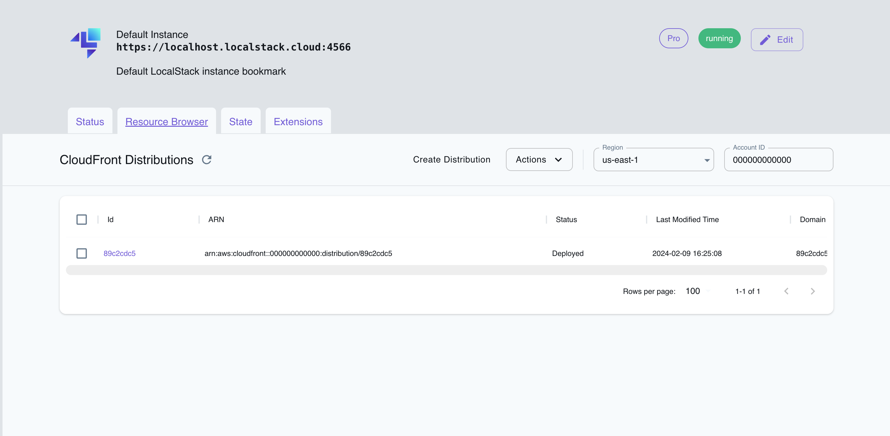

## Introduction

CloudFront is a content delivery network (CDN) service provided by Amazon Web Services (AWS). CloudFront distributes its web content, videos, applications, and APIs with low latency and high data transfer speeds. CloudFront APIs allow you to configure distributions, customize cache behavior, secure content with access controls, and monitor the CDN's performance through real-time metrics.

LocalStack allows you to use the CloudFront APIs in your local environment to create local CloudFront distributions to transparently access your applications and file artifacts. The supported APIs are available on our [API coverage page](https://docs.localstack.cloud/references/coverage/coverage_cloudfront/), which provides information on the extent of CloudFront's integration with LocalStack.

## Getting started

This guide is intended for users who wish to get more acquainted with CloudFront over LocalStack. It assumes you have basic knowledge of the AWS CLI (and our [`awslocal`](https://github.com/localstack/awscli-local) wrapper script).

Start your LocalStack container using your preferred method. We will demonstrate how you can create an S3 bucket, put a text file named `hello.txt` to the bucket, and then create a CloudFront distribution which makes the file accessible via a `https://abc123.cloudfront.net/hello.txt` proxy URL (where `abc123` is a placeholder for the real distribution ID).

To get started, create an S3 bucket using the `mb` command:


$ awslocal s3 mb s3://abc123


You can now go ahead, create a new text file named `hello.txt` and upload it to the bucket:


$ echo 'Hello World' > /tmp/hello.txt
$ awslocal s3 cp /tmp/hello.txt s3://abc123/hello.txt --acl public-read


After uploading the file to S3, you can create a CloudFront distribution using the [`CreateDistribution`](https://docs.aws.amazon.com/cloudfront/latest/APIReference/API_CreateDistribution.html) API call. Run the following command to create a distribution with the default settings:


$ domain=$(awslocal cloudfront create-distribution \
   --origin-domain-name abc123.s3.amazonaws.com | jq -r '.Distribution.DomainName')
$ curl -k https://$domain/hello.txt



If you wish to use CloudFront on system host, ensure your local DNS setup is correctly configured.
Refer to the section on [System DNS configuration]() for details.


In the example provided above, be aware that the final command (`curl https://$domain/hello.txt`) might encounter a temporary failure accompanied by a warning message `Could not resolve host`. This can occur because different operating systems adopt diverse DNS caching strategies, causing a delay in the availability of the CloudFront distribution's DNS name (e.g., `abc123.cloudfront.net`) within the system. Typically, after a few retries, the command should succeed. It's worth noting that similar behavior can be observed in the actual AWS environment, where CloudFront DNS names may take up to 10-15 minutes to propagate across the network.

## Using custom URLs

LocalStack Pro supports using an alternate domain name, also referred to as a `CNAME` or custom domain name, to access your applications and file artifacts instead of relying on the domain name generated by CloudFront for your distribution.

To set up the custom domain name, you must configure it in your local DNS server. Once that is done, you can designate the desired domain name as an alias for the target distribution. To achieve this, you'll need to provide the `Aliases` field in the `--distribution-config` option when creating or updating a distribution. The format of this structure is similar to the one used in [AWS CloudFront options](https://docs.aws.amazon.com/cli/latest/reference/cloudfront/create-distribution.html#options).

In the given example, two domains are specified as `Aliases` for a distribution. Please note that a complete configuration would entail additional values relevant to the distribution, which have been omitted here for brevity.


--distribution-config {...'Aliases':'{'Quantity':2, 'Items': ['custom.domain.one', 'customDomain.two']}'...}


## Resource Browser

The LocalStack Web Application provides a Resource Browser for CloudFront, which allows you to view and manage your CloudFront distributions. You can access the Resource Browser by opening the LocalStack Web Application in your browser, navigating to the **Resource Browser** section, and then clicking on **CloudFront** under the **Analytics** section.

 
 

The Resource Browser allows you to perform the following actions:

- **Create Distribution**: Create a new CloudFront distribution by specifying the **Origins** and other settings.
- **List Distributions**: View a list of all CloudFront distributions.
- **Edit Distribution**: Modify the settings of an existing CloudFront distribution by opening the distribution's details page and clicking on the **Edit Distribution** button.
- **Delete Distribution**: Delete an existing CloudFront distribution by selecting the distribution, click on **Actions**, and then click on **Remove Selected**.

## Examples

The following code snippets and sample applications provide practical examples of how to use CloudFront in LocalStack for various use cases:

- [Step-up Authentication using Amazon Cognito](https://github.com/localstack/step-up-auth-sample)
