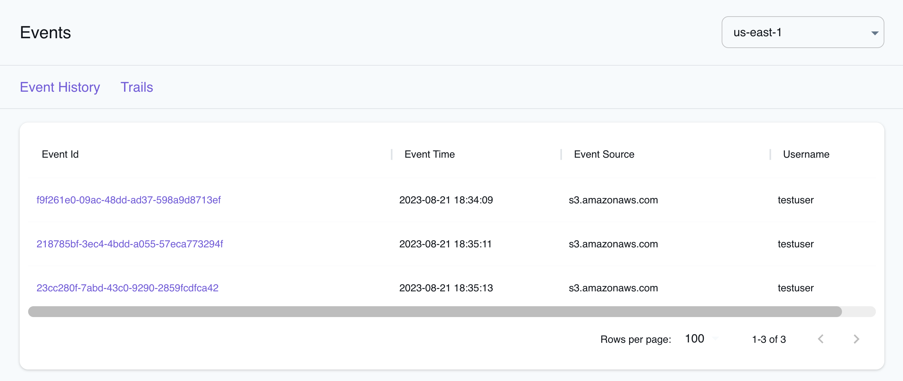

## Introduction

CloudTrail is a service provided by Amazon Web Services (AWS) that enables you to track and monitor all activities and events within your AWS environment. It records API calls and actions made on your AWS resources, offering an audit trail that helps you understand changes, diagnose issues, and maintain compliance.

LocalStack allows you to use the CloudTrail APIs in your local environment to create and manage Event history and trails. The supported APIs are available on our [API coverage page](https://docs.localstack.cloud/references/coverage/coverage_cloudtrail/), which provides information on the extent of CloudTrail's integration with LocalStack.

## Getting started

This guide is designed for users new to CloudTrail and assumes basic knowledge of the AWS CLI and our [`awslocal`](https://github.com/localstack/awscli-local) wrapper script.

Start your LocalStack container using your preferred method. We will demonstrate how to enable S3 object logging to CloudTrail using AWS CLI.

### Create a bucket

Before you create a trail, you need to create an S3 bucket where CloudTrail can deliver the log data. You can use the [`mb`](https://docs.aws.amazon.com/cli/latest/reference/s3/mb.html) command to create a bucket:


$ awslocal s3 mb s3://my-bucket


### Create a trail

You can create a trail which would allow the delivery of events to the S3 bucket we created earlier. You can use the [`CreateTrail`](https://docs.aws.amazon.com/awscloudtrail/latest/APIReference/API_CreateTrail.html) API to create a trail. Run the following command to create a trail:


$ awslocal cloudtrail create-trail \
    --name MyTrail \
    --s3-bucket-name my-bucket


### Enable logging and configure event selectors

You can now enable logging for your trail. You can use the [`StartLogging`](https://docs.aws.amazon.com/awscloudtrail/latest/APIReference/API_StartLogging.html) API to enable logging for your trail. Run the following command to enable logging:


$ awslocal cloudtrail start-logging --name MyTrail


You can further configure event selectors for the trail. In this example, we will configure the trail to log all S3 object level events. You can use the [`PutEventSelectors`](https://docs.aws.amazon.com/awscloudtrail/latest/APIReference/API_PutEventSelectors.html) API to configure event selectors for your trail. Run the following command to configure event selectors:


$ awslocal cloudtrail put-event-selectors \
    --trail-name MyTrail \
    --event-selectors '[{"ReadWriteType": "All", "IncludeManagementEvents":true, "DataResources": [{"Type": "AWS::S3::Object", "Values": ["arn:aws:s3:::my-bucket/"]}]}]'


You can verify if your configuration is correct by using the [`GetEventSelectors`](https://docs.aws.amazon.com/awscloudtrail/latest/APIReference/API_GetEventSelectors.html) API. Run the following command to verify your configuration:


$ awslocal cloudtrail get-event-selectors \
    --trail-name MyTrail


The following output would be retrieved:

```json
{
    "TrailARN": "arn:aws:cloudtrail:us-east-1:000000000000:trail/MyTrail",
    "EventSelectors": [
        {
            "ReadWriteType": "All",
            "IncludeManagementEvents": true,
            "DataResources": [
                {
                    "Type": "AWS::S3::Object",
                    "Values": [
                        "arn:aws:s3:::my-bucket/"
                    ]
                }
            ]
        }
    ]
}
```

### Test the configuration

You can now test the configuration by creating an object in the S3 bucket. You can use the [`cp`](https://docs.aws.amazon.com/cli/latest/reference/s3/cp.html) command to copy an object in the S3 bucket:


$ echo "hello world" > /tmp/hello-world
$ awslocal s3 cp /tmp/hello-world s3://my-bucket/hello-world
$ awslocal s3 ls s3://my-bucket


You can verify that the object was created in the S3 bucket. You can also verify that the object level event was logged by CloudTrail using the [`LookupEvents`](https://docs.aws.amazon.com/awscloudtrail/latest/APIReference/API_LookupEvents.html) API. Run the following command to verify the event:


$ awslocal cloudtrail lookup-events \
    --lookup-attributes AttributeKey=EventName,AttributeValue=PutObject \
    --max-results 1


The following output would be retrieved:

```json
{
	"Events": [{
		"EventId": "218785bf-3ec4-4bdd-a055-57eca773294f",
		"EventName": "PutObject",
		"ReadOnly": "false",
        ...
		"CloudTrailEvent": "{\"eventVersion\": \"1.08\", ... {\"bucketName\": \"my-bucket\", \"key\": \"hello-world\"} ...}"
	}]
}
```

## Resource Browser

The LocalStack Web Application provides a Resource Browser for managing CloudTrail's Event History & Trails. You can access the Resource Browser by opening the LocalStack Web Application in your browser, navigating to the **Resources** section, and then clicking on **CloudTrail** under the **Management/Governance** section.


<br>
<br>

The Resource Browser allows you to perform the following actions:

- **Create Trail**: Create a new CloudTrail trail, by specifying the name of the trail, the S3 bucket where the logs should be stored, and other optional parameters.
- **View Trail**: View the details of a CloudTrail trail, including the name, ARN, S3 bucket, and other parameters.
- **View Event History**: View the event history of a CloudTrail trail, including the Event Id, Event time, Event source, and other parameters.
