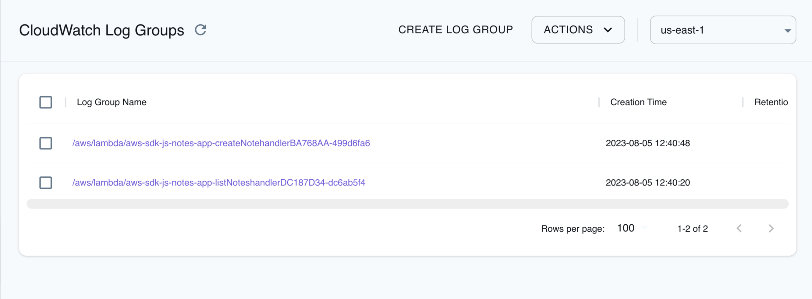
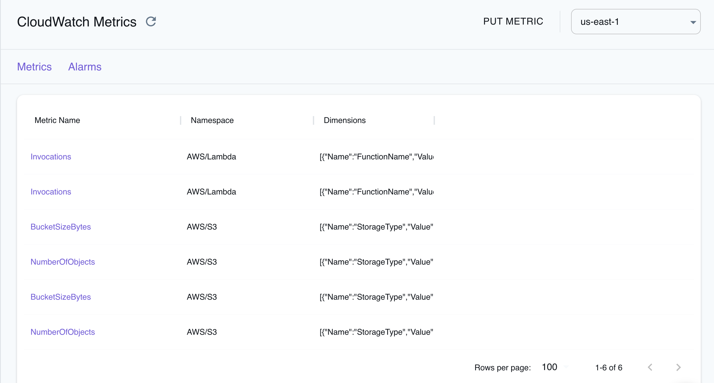

CloudWatch is a comprehensive monitoring and observability service that Amazon Web Services (AWS) provides. It allows you to collect and track metrics, collect and monitor log files, and set alarms. CloudWatch provides valuable insights into your AWS resources, applications, and services, enabling you to troubleshoot issues, optimize performance, and make informed decisions.

LocalStack allows you to use CloudWatch APIs on your local machine to create and manage CloudWatch resources, such as custom metrics, alarms, and log groups, for local development and testing purposes. The supported APIs are available on our [API coverage page](https://docs.localstack.cloud/references/coverage/coverage_cloudwatch/), which provides information on the extent of CloudWatch's integration with LocalStack.


We have introduced an all-new LocalStack-native [CloudWatch provider](https://docs.localstack.cloud/user-guide/aws/cloudwatch/) is available behind a feature flag. You can activate it by configuring  `PROVIDER_OVERRIDE_CLOUDWATCH=v2` in your LocalStack configuration.

We have migrated from storing data in Python objects within the Moto backend to a more robust system. Now, metrics are efficiently stored in SQLite, and alarm resources are managed using LocalStack stores.

-   Various enhancements have been made to attain greater feature parity with AWS.
-   The provider is engineered to ensure thread safety, facilitating smooth concurrent operations.
-   There’s a significant improvement in the integrity and durability of data.
-   The new provider allows for more efficient data retrieval.


## Getting started

This guide is designed for users new to CloudWatch and assumes basic knowledge of the AWS CLI and our [`awslocal`](https://github.com/localstack/awscli-local) wrapper script.

Start your LocalStack container using your preferred method and deploy your Lambda functions that will generate some logs. You can get the name for your Lambda Functions using the [`ListFunctions`](https://docs.aws.amazon.com/lambda/latest/dg/API_ListFunctions.html) API.

Fetch the Log Groups using the [`DescribeLogGroups`](https://docs.aws.amazon.com/AmazonCloudWatchLogs/latest/APIReference/API_DescribeLogGroups.html) API. Run the following command to get the Log Group name:


$ awslocal logs describe-log-groups


The output should look similar to the following:

```sh
{
    "logGroups": [
        {
            "logGroupName": "/aws/lambda/serverless-local-hello",
            "creationTime": 1683009865348,
            "metricFilterCount": 0,
            "arn": "arn:aws:logs:us-east-1:000000000000:log-group:/aws/lambda/serverless-local-hello:*",
            "storedBytes": 262
        },
        {
            "logGroupName": "/aws/lambda/serverless-local-hello2",
            "creationTime": 1683009865420,
            "metricFilterCount": 0,
            "arn": "arn:aws:logs:us-east-1:000000000000:log-group:/aws/lambda/serverless-local-hello2:*",
            "storedBytes": 262
        }
    ]
}
```

Get the log streams for the Log Group using the [`DescribeLogStreams`](https://docs.aws.amazon.com/AmazonCloudWatchLogs/latest/APIReference/API_DescribeLogStreams.html) API. Run the following command to get the Log Stream name:


$ awslocal logs describe-log-streams \
    --log-group-name /aws/lambda/serverless-local-hello


The output should look similar to the following:

```sh
{
    "logStreams": [
        {
            "logStreamName": "2023/05/02/[$LATEST]853a59d0767cfaf10d6b29a6790d8b03",
            "creationTime": 1683009968958,
            "firstEventTimestamp": 1683009968920,
            "lastEventTimestamp": 1683009968945,
            "lastIngestionTime": 1683009968979,
            "uploadSequenceToken": "1",
            "arn": "arn:aws:logs:us-east-1:000000000000:log-group:/aws/lambda/serverless-local-hello:log-stream:2023/05/02/[$LATEST]853a59d0767cfaf10d6b29a6790d8b03",
            "storedBytes": 262
        }
    ]
}
```

You can now fetch the log events using the [`GetLogEvents`](https://docs.aws.amazon.com/AmazonCloudWatchLogs/latest/APIReference/API_GetLogEvents.html) API. Run the following command to get the logs:


$ awslocal logs get-log-events \
    --log-group-name '/aws/lambda/serverless-local-hello' --log-stream-name '2023/05/02/[$LATEST]853a59d0767cfaf10d6b29a6790d8b03'


The output should look similar to the following:

```sh
{
    "events": [
        {
            "timestamp": 1683009968920,
            "message": "START RequestId: 71712856-9f41-4d22-827c-e3883f799f25 Version: $LATEST",
            "ingestionTime": 1683009968979
        },
        {
            "timestamp": 1683009968932,
            "message": "END RequestId: 71712856-9f41-4d22-827c-e3883f799f25",
            "ingestionTime": 1683009968979
        },
        {
            "timestamp": 1683009968945,
            "message": "REPORT RequestId: 71712856-9f41-4d22-827c-e3883f799f25\tDuration: 1.27 ms\tBilled Duration: 2 ms\tMemory Size: 1024 MB\tMax Memory Used: 1024 MB\t",
            "ingestionTime": 1683009968979
        }
    ],
    "nextForwardToken": "f/00000000000000000000000000000000000000000000000000000002",
    "nextBackwardToken": "b/00000000000000000000000000000000000000000000000000000000"
}
```


You can use [filters](https://docs.aws.amazon.com/cli/latest/reference/logs/filter-log-events.html) or [queries](https://docs.aws.amazon.com/cli/latest/reference/logs/get-query-results.html) with the LocalStack Pro image to refine your results.


## Metric Alarms

Alarms in CloudWatch are crucial in monitoring specific data thresholds and automating actions based on those thresholds. To learn more about how alarms are evaluated in general, please refer to the [AWS documentation](https://docs.aws.amazon.com/AmazonCloudWatch/latest/monitoring/AlarmThatSendsEmail.html#alarm-evaluation).

In LocalStack, you can use metric-alarm evaluation, explicitly utilizing the statistic and comparison-operator functionalities. These features enable you to define and evaluate alarms based on various statistical calculations and comparison operators.

### Metric Alarm Examples

Metric alarms in CloudWatch allow you to evaluate the state of a metric by analyzing its data points over a specified period. With metric alarms, you can create customized thresholds and define actions based on the metric's behavior. 

To get started with creating an alarm in LocalStack using the `awslocal` integration, use the following command:


$ awslocal cloudwatch put-metric-alarm \
  --alarm-name my-alarm \
  --metric-name Orders \
  --namespace test \
  --threshold 1 \
  --comparison-operator LessThanThreshold \
  --evaluation-periods 1 \
  --period 30 \
  --statistic Minimum \
  --treat-missing notBreaching


To monitor the status of the alarm, open a separate terminal and execute the following command:


$ watch "awslocal cloudwatch describe-alarms --alarm-names my-alarm | jq '.MetricAlarms[0].StateValue'"


Afterward, you can add some data that will cause a breach and set the `metric-alarm` state to **ALARM** using the following command:


$ awslocal cloudwatch put-metric-data \
    --namespace test \
    --metric-data '[{"MetricName": "Orders", "Value": -1}]'


Within a few seconds, the alarm state should change to **ALARM**, and eventually, it will go back to **OK** as we configured it to treat missing data points as `not breaching`. This allows you to observe how the alarm behaves in response to the provided data.

#### Metric Alarm with Action

When the state of an alarm changes, actions can be triggered accordingly. In LocalStack, you can configure `alarm-actions`, `ok-actions`, and `insufficient-data-actions` to specify the actions to be taken. Currently, only SNS Topics are supported as the target for these actions, and it's important to note that the topic must be created beforehand.

Here's an example demonstrating how to set up an alarm that sends a message to the specified topic when entering the **ALARM** state. Make sure to replace `<topic-arn>` with the valid ARN of an existing SNS topic.


$ awslocal cloudwatch put-metric-alarm \
  --alarm-name my-alarm \
  --metric-name Orders \
  --namespace test \
  --threshold 50 \
  --comparison-operator GreaterThanThreshold \
  --evaluation-periods 1 \
  --period 300 \
  --statistic Maximum \
  --treat-missing notBreaching \
  --alarm-actions <topic-arn> 


By executing this command, you'll create an alarm named `my-alarm` that monitors the `Orders` metric in the `test` namespace. If the metric value exceeds the threshold of 50 (using the `GreaterThanThreshold` operator) during a single evaluation period of 300 seconds, the alarm will trigger the specified action on the provided SNS topic.


Please be aware of the following known limitations in LocalStack:
- Anomaly detection and extended statistics are not supported.
- The `unit` values specified in the alarm are ignored.
- Composite alarms are not evaluated.
- Metric streams are not supported.


## Supported Service Integrations with CloudWatch Metrics

LocalStack supports the following AWS services for integration with CloudWatch metrics:

-   **SQS**: Supports `Approximate*` metrics, `NumberOfMessagesSent`, and other metrics triggered by events such as message received or sending.
-   **Lambda**: Supports `Invocations` and `Errors` metrics.

## Resource Browser

The LocalStack Web Application provides a Resource Browser for managing CloudWatch logs. You can access the Resource Browser by opening the LocalStack Web Application in your browser and navigating to the Resources section, then clicking on [**CloudWatch Logs**](https://app.localstack.cloud/resources/cloudwatch/groups) and [**CloudWatch Metrics**](https://app.localstack.cloud/resources/monitoring) under the **Management/Governance** section.

The Resource Browser allows you to perform the following actions:





* **Create Log Group**: Create a new log group by specifying the `Log Group Name`, `KMS Key ID`, and `Tags`.
* **Put metric**: Create a new metric by specifying the `Namespace` and `Metric Data`.
* **Put Alarm**: Create a new alarm by specifying the `Alarm Name`, `Alarm Description`, `Actions Enabled`, `Metric Name`, `Namespace`, `Statistic`, `Comparison Operator`, `Threshold`, `Evaluation Periods`, `Period`, `Unit`, `Treat Missing Data`, `Tags`, and `Alarm Actions`.
* **Check the Resources**: View and manage existing log groups, metrics, and alarms and perform actions such as `Delete`, `View`, and `Edit`.

## Examples

The following code snippets and sample applications provide practical examples of how to use CloudWatch in LocalStack for various use cases:

* [Creating Cloudwatch metric alarms](https://github.com/localstack/localstack-pro-samples/tree/master/cloudwatch-metrics-aws) to demonstrate a simple example for creating CloudWatch metric alarm based on the metrics of a failing Lambda function.
* [Event-driven architecture with Amazon SNS FIFO, DynamoDB, Lambda, and S3](https://github.com/localstack/event-driven-architecture-with-amazon-sns-fifo) to deploy a recruiting agency application with a job listings website and view the CloudWatch logs.
