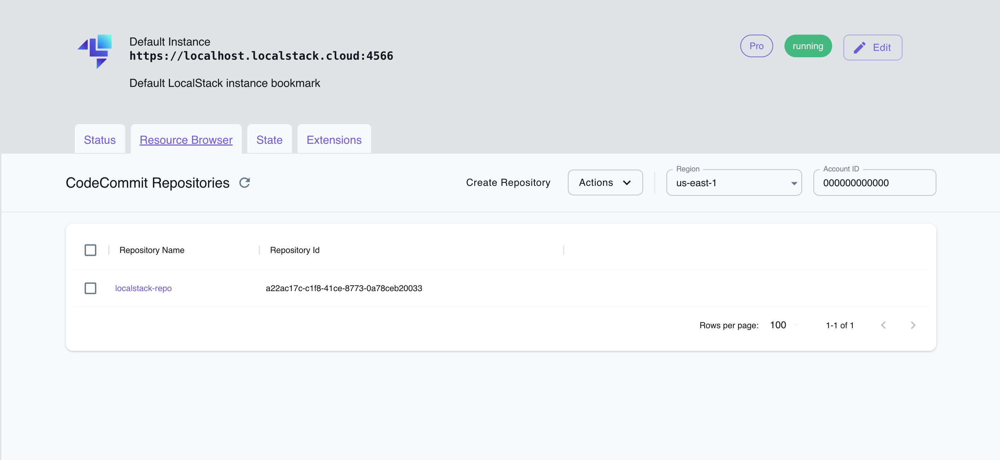

## Introduction

CodeCommit is a managed source control service by AWS that enables developers to store and collaborate on their code repositories.
With CodeCommit, you can host private Git repositories with integrations to other AWS services.
You can also use standard Git commands or CodeCommit APIs (using AWS CLI or SDKs) to manage your repositories.
CodeCommit also uses identity-based policies, which can be attached to IAM users, groups, and roles, ensuring secure and granular access control.

LocalStack allows you to use the CodeCommit APIs in your local environment to create new repositories, push your commits, and manage the repositories.
The supported APIs are available on our [API coverage page](https://docs.localstack.cloud/references/coverage/coverage_codecommit/), which provides information on the extent of CodeCommit's integration with LocalStack.

## Getting started

This guide is designed for users new to CodeCommit and assumes basic knowledge of the AWS CLI and our [`awslocal`](https://github.com/localstack/awscli-local) wrapper script.

Start your LocalStack container using your preferred method.
We will demonstrate how you can create a CodeCommit repository, clone a repository, and push a commit to the repository.

### Create a repository

You can use the [`CreateRepository`](https://docs.aws.amazon.com/codecommit/latest/APIReference/API_CreateRepository.html) API to create a repository.
You need to specify the repository name, repository description, and tags.

Run the following command to create a new repository named `localstack-repo`:


$ awslocal codecommit create-repository \
    --repository-name localstack-repo \
    --repository-description "A demo repository to showcase LocalStack's CodeCommit" \
    --tags Team=LocalStack


If successful, the command will return the following output:

```bash
{
    "repositoryMetadata": {
        "repositoryId": "<REPOSITORY_ID>",
        "repositoryName": "localstack-repo",
        "repositoryDescription": "A demo repository to showcase LocalStack's CodeCommit",
        "lastModifiedDate": "<TIMESTAMP>",
        "creationDate": "<TIMESTAMP>",
        "cloneUrlHttp": "git://localhost:4510/localstack-repo",
        "cloneUrlSsh": "git://localhost:4510/localstack-repo",
        "Arn": "arn:aws:codecommit:us-east-1:000000000000:localstack-repo"
    }
}
```

### Clone a repository

Next, you can clone the CodeCommit repository to a local directory.
To do so, you can use the [`git clone`](https://git-scm.com/docs/git-clone) command.
The repository URL is the `cloneUrlHttp` value returned by the `CreateRepository` API.

Run the following command to clone the repository to a local directory named `localstack-repo`:


$ git clone git://localhost:4510/localstack-repo


You will notice that the repository is empty.
This is because we have not pushed any commits to the repository yet.

### Push a commit

Create a new file named `README.md` in the `localstack-repo` directory.
Add some content to the file and save it.
You can use [`git add`](https://git-scm.com/docs/git-add) to add the file to the staging area, followed by [`git commit`](https://git-scm.com/docs/git-commit) with a commit message, to commit the file to the repository.
Then, you can use [`git commit`](https://git-scm.com/docs/git-commit) to commit the file to the repository.

Run the following command to push the file to the repository:


$ git add README.md
$ git commit -m "Add README.md"
$ git push


If successful, this command returns output similar to the following:

```bash
...
To git://localhost:4510/localstack-repo
 * [new branch]      main -> main
```

## Resource Browser

The LocalStack Web Application provides a Resource Browser for managing CodeCommit repositories. You can access the Resource Browser by opening the LocalStack Web Application in your browser, navigating to the **Resource Browser** section, and then clicking on **CodeCommit** under the **Developer Tools** section.



The Resource Browser allows you to perform the following actions:

- **Create Repository**: Create a new CodeCommit repository by specifying the repository name and description, along with optional tags and KMS key ID.
- **View Repository**: View the details of a CodeCommit repository, including the repository name, description, ARN, and clone URLs.
- **Delete Repository**: Delete a CodeCommit repository by selecting the repository from the list and clicking the **Actions** dropdown menu followed by **Delete**.

## Examples

You can find a sample application illustrating the usage of the CodeCommit APIs locally in the [LocalStack Pro Samples](https://github.com/localstack/localstack-pro-samples/tree/master/codecommit-git-repo).
