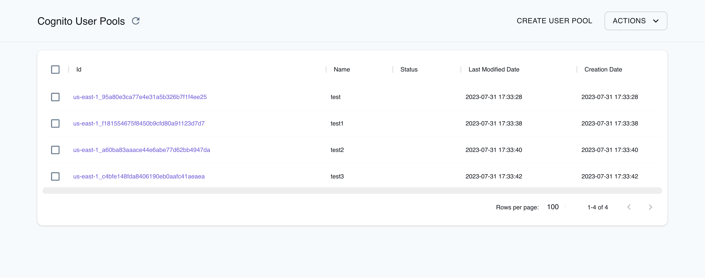

## Introduction

Cognito is a managed identity service provided by AWS that is used for securing user authentication, authorization, and managing user identities in web and mobile applications. Cognito enables developers to add user sign-up, sign-in, and access control functionalities to their applications. Cognito supports various authentication methods, including social identity providers, SAML-based identity providers, and custom authentication flows.

LocalStack allows you to use the Cognito APIs in your local environment to manage authentication and access control for your local application and resources. The supported APIs are available on our [Cognito Identity coverage page](https://docs.localstack.cloud/references/coverage/coverage_cognito-identity/) and [Cognito User Pools coverage page](https://docs.localstack.cloud/references/coverage/coverage_cognito-idp/), which provides information on the extent of Cognito's integration with LocalStack.

## Getting started

This guide is designed for users new to Cognito and assumes basic knowledge of the AWS CLI and our [`awslocal`](https://github.com/localstack/awscli-local) wrapper script.

Start your LocalStack container using your preferred method. We will demonstrate how you can create a Cognito user pool and client, and then sign up and authenticate a new user in the pool.

### Creating a User Pool

To create a user pool, you can use the [`CreateUserPool`](https://docs.aws.amazon.com/cognito-user-identity-pools/latest/APIReference/API_CreateUserPool.html) API call. The following command creates a user pool named `test`:


$ awslocal cognito-idp create-user-pool --pool-name test


You can see an output similar to the following:

```json
"UserPool": {
        "Id": "us-east-1_fd924693e9b04f549f989283123a29c2",
        "Name": "test",
        "Policies": {
            "PasswordPolicy": {
                "MinimumLength": 8,
                "RequireUppercase": true,
                "RequireLowercase": true,
                "RequireNumbers": true,
                "RequireSymbols": true,
                "TemporaryPasswordValidityDays": 7
            }
        },
        "LastModifiedDate": "2021-10-06T11:57:21.883Z",
        "CreationDate": "2021-10-06T11:57:21.883Z",
        "SchemaAttributes": [],
        "VerificationMessageTemplate": {
            "DefaultEmailOption": "CONFIRM_WITH_CODE"
        },
        "EmailConfiguration": {
            "EmailSendingAccount": "COGNITO_DEFAULT"
        },
        "AdminCreateUserConfig": {
            "AllowAdminCreateUserOnly": false
        },
        "Arn": "arn:aws:cognito-idp:us-east-1:000000000000:userpool/us-east-1_fd924693e9b04f549f989283123a29c2"
}
```

You will need the user pool's `id` for further operations. Save it in a `pool_id` variable:


$ pool_id=<your-pool-id>


Alternatively, you can use JSON processor like [`jq`](https://stedolan.github.io/jq/) to extract the essential information right from the outset when creating a pool.


$ pool_id=$(awslocal cognito-idp create-user-pool --pool-name test | jq -rc ".UserPool.Id")


### Adding a Client

You can proceed with adding a client to the pool we just created. You will require the ID of the newly created client for the subsequent steps. You can use the [`CreateUserPoolClient`](https://docs.aws.amazon.com/cognito-user-identity-pools/latest/APIReference/API_CreateUserPoolClient.html) for both client creation and extraction of the corresponding ID. Run the following command:


$ client_id=$(awslocal cognito-idp create-user-pool-client --user-pool-id $pool_id --client-name test-client | jq -rc ".UserPoolClient.ClientId")


### Using Predefined IDs for Pool Creation

When creating Cognito user or identity pools, you have the flexibility to utilize a predefined ID by setting the tag `_custom_id_`. This feature proves particularly useful during the testing of authentication flows, especially when dealing with scenarios involving frequent restarts of LocalStack and the recreation of resources.
Please note that a valid custom id must be in the format `<region>_<custom_pool_id>`.

Run the following command to create a user pool with a predefined ID:


$ awslocal cognito-idp create-user-pool --pool-name p1 --user-pool-tags "_custom_id_=us-east-1_myid123"
{
    "UserPool": {
        "Id": "myid123",
        "Name": "p1",
    ...


You also have the possibility to create a Cognito user pool client with a predefined ID by specifying a `ClientName` with the specific format: `_custom_id_:<custom_client_id>`.


$ awslocal cognito-idp create-user-pool-client --user-pool-id us-east-1_myid123 --client-name _custom_id_:myclient123
{
    "UserPoolClient": {
        "UserPoolId": "us-east-1_myid123",
        "ClientName": "_custom_id_:myclient123",
        "ClientId": "myclient123",
    ...



### Signing up and confirming a user

You can now use the [`SignUp`](https://docs.aws.amazon.com/cognito-user-identity-pools/latest/APIReference/API_SignUp.html) API to sign up a user. Run the following command:


$ awslocal cognito-idp sign-up \
  --client-id $client_id \
  --username example_user \
  --password 12345678Aa! \
  --user-attributes Name=email,Value=<your.email@address.com>


You can see an output similar to the following:

```json
{
    "UserConfirmed": false,
    "UserSub": "5fdbe1d5-7901-4fee-9d1d-518103789c94"
}
```

Once the user is successfully created, a confirmation code will be generated. This code can be found in the LocalStack container logs (as shown below). Additionally, if you have [SMTP configured](#smtp-integration), the confirmation code can be optionally sent via email for enhanced convenience and user experience.

```bash
INFO:localstack_ext.services.cognito.cognito_idp_api: Confirmation code for Cognito user example_user: 125796
DEBUG:localstack_ext.bootstrap.email_utils: Sending confirmation code via email to "your.email@address.com"
```

You can confirm the user with the activation code, using the [`ConfirmSignUp`](https://docs.aws.amazon.com/cognito-user-identity-pools/latest/APIReference/API_ConfirmSignUp.html) API. Execute the following command:


$ awslocal cognito-idp confirm-sign-up \
  --client-id $client_id \
  --username example_user \
  --confirmation-code <received-confirmation-code>


Since the above command does not provide a direct response, we need to verify the success of the request by checking the pool. Run the following command to use the [`ListUsers`](https://docs.aws.amazon.com/cognito-user-identity-pools/latest/APIReference/API_ListUsers.html) API to list the users in the pool:


$ awslocal cognito-idp list-users --user-pool-id $pool_id
{
    "Users": [
        {
            "Username": "example_user",
            "Attributes": [
                {
                    "Name": "email",
                    "Value": "your.email@address.com"
                },
                {
                    "Name": "sub",
                    "Value": "5fdbe1d5-7901-4fee-9d1d-518103789c94"
                },
                {
                    "Name": "cognito:username",
                    "Value": "example_user"
                }
            ],
            "Enabled": true,
            "UserStatus": "CONFIRMED"
        }
    ]
}


## JWT Token Issuer and JSON Web Key Sets (JWKS) endpoints

When Cognito creates JWT tokens, they include an issuer (`iss`) attribute that specifies the endpoint of the corresponding user pool. Generally, the issuer endpoint follows this format, with `<pool_id>` being the ID of the Cognito user pool:

```bash
http://localhost:4566/<pool_id>
```

However, depending on your specific configurations, there might be slight variations in the issuer URL, such as:

```bash
https://cognito-idp.localhost.localstack.cloud/<pool_id>
```

To access the JSON Web Key Sets (JWKS) configuration for each user pool, you can use the standardized well-known URL below:


$ curl 'http://localhost:4566/<pool_id>/.well-known/jwks.json'
{"keys": [{"kty": "RSA", "alg": "RS256", "use": "sig", "kid": "test-key", "n": "k6lrbEH..."]}


Moreover, you can retrieve the global region-specific public keys for Cognito Identity Pools using the following endpoint:


$ curl http://localhost:4566/.well-known/jwks_uri
{"keys": [{"kty": "RSA", "alg": "RS512", "use": "sig", "kid": "ap-northeast-11", "n": "AI7mc1assO5..."]}


## Cognito Lambda Triggers

Cognito offers a variety of lifecycle hooks called Cognito Lambda triggers, which allow you to react to different lifecycle events and customize the behavior of user signup, confirmation, migration, and more.

To illustrate, suppose you wish to define a _user migration_ Lambda trigger. In this case, you can start by creating a Lambda function, let's say named `"f1"`, responsible for performing the migration. Subsequently, you can define the corresponding `--lambda-config` when creating the user pool to link it with the Lambda function:


$ awslocal cognito-idp create-user-pool \
  --pool-name test2 \
  --lambda-config '{"UserMigration":"arn:aws:lambda:us-east-1:000000000000:function:f1"}'


Upon successful authentication of a non-registered user, Cognito will automatically trigger the migration Lambda function, allowing the user to be added to the pool after migration.

## OAuth Flows via Cognito Login Form

You can access the local [Cognito login form](https://docs.aws.amazon.com/cognito/latest/developerguide/login-endpoint.html) by entering the following URL in your web browser:

```bash
https://localhost.localstack.cloud/_aws/cognito-idp/login?response_type=code&client_id=<client_id>&redirect_uri=<redirect_uri>
```
Replace `<client_id>` with the ID of your existing user pool client (for example, `example_user`), and `<redirect_uri>` with the redirect URI specific to your application (e.g., `http://example.com`).

The login form should look similar to the screenshot below:



Upon successful login, the page will automatically redirect to the designated `<redirect_uri>`, with an appended path parameter `?code=<code>`. For instance, the redirect URL might look like `http://example.com?code=test123`.

To obtain a token, you need to submit the received code using `grant_type=authorization_code` to LocalStack's implementation of the Cognito OAuth2 TOKEN Endpoint, which is documented [on the AWS Cognito Token endpoint page](https://docs.aws.amazon.com/cognito/latest/developerguide/token-endpoint.html).

Note that the value of the `redirect_uri` parameter in your token request must match the value provided during the login process. Ensuring this match is crucial for the proper functioning of the authentication flow.

```sh
% curl \
  --data-urlencode 'grant_type=authorization_code' \
  --data-urlencode 'redirect_uri=http://example.com' \
  --data-urlencode "client_id=${client_id}" \
  --data-urlencode 'code=test123' \
  'http://localhost:4566/_aws/cognito-idp/oauth2/token'
{"access_token": "eyJ0eXAi…lKaHx44Q", "expires_in": 86400, "token_type": "Bearer", "refresh_token": "e3f08304", "id_token": "eyJ0eXAi…ADTXv5mA"}
```

## Serverless and Cognito

Furthermore, you have the option to combine Cognito and LocalStack seamlessly with the [Serverless framework](https://www.serverless.com/).

For instance, consider this snippet from a `serverless.yml` configuration:

```yaml
service: test

plugins:
  - serverless-deployment-bucket
  - serverless-pseudo-parameters
  - serverless-localstack

custom:
  localstack:
    stages: [local]

functions:
  http_request:
    handler: http.request
    events:
      - http:
          path: v1/request
          authorizer:
            arn: arn:aws:cognito-idp:us-east-1:#{AWS::AccountId}:userpool/ExampleUserPool

resources:
  Resources:
    UserPool:
      Type: AWS::Cognito::UserPool
      Properties:
        ...
```

After configuring the Serverless setup, you can deploy it using `serverless deploy --stage local`. The provided example includes a Lambda function called `http_request` that's linked to an API Gateway endpoint.

Once deployed, the `v1/request` API Gateway endpoint will be protected by the Cognito user pool named "`ExampleUserPool`". As a result, you can register users against the local pool using the same API calls as you would with AWS.

To send requests to the secured API Gateway endpoint, you need to fetch identity credentials from the local Cognito API. These credentials can then be included as `Authentication` HTTP headers (where `test-1234567` represents the name of the access key ID generated by Cognito):

```bash
Authentication: AWS4-HMAC-SHA256 Credential=test-1234567/20190821/us-east-1/cognito-idp/aws4_request ...
```

## Resource Browser

The LocalStack Web Application provides a Resource Browser for managing Cognito User Pools, and more. You can access the Resource Browser by opening the LocalStack Web Application in your browser, navigating to the **Resources** section, and then clicking on **Cognito** under the **Security Identity Compliance** section.



The Resource Browser allows you to perform the following actions:

- **Create User Pool**: Create a new Cognito User Pool, by specifying the pool name, policies, and other settings.
- **View User Pools**: View a list of all existing Cognito User Pools, including their **Details**, **Groups**, and **Users**.
- **Edit User Pool**: Edit an existing Cognito User Pool, by adding additional configurations, policies, and more.
- **Create Group**: Add a new Group to an existing Cognito User Pool, by specifying the group name, description, Role Arn, and Precedence.
- **Create User**: Add a new User to an existing Cognito User Pool, by specifying the user name, user attributes, and more.
- **Remove Selected**: Remove the selected User Pool, Group, or User from the list of existing Cognito resources.

## Examples

The following code snippets and sample applications provide practical examples of how to use Cognito in LocalStack for various use cases:

- [Running Cognito authentication and user pools locally](https://github.com/localstack/localstack-pro-samples/tree/master/cognito-jwt)
- [Serverless Container-based APIs with ECS & API Gateway](https://github.com/localstack/serverless-api-ecs-apigateway-sample)
- [Step-up Authentication using Cognito](https://github.com/localstack/step-up-auth-sample)

## Current Limitations

By default, LocalStack's Cognito does not send actual email messages. However, if you wish to enable this feature, you will need to provide an email address and configure the corresponding SMTP settings. The instructions on configuring the connection parameters of your SMTP server can be found in the [Configuration]() guide to allow your local Cognito environment to send email notifications.
