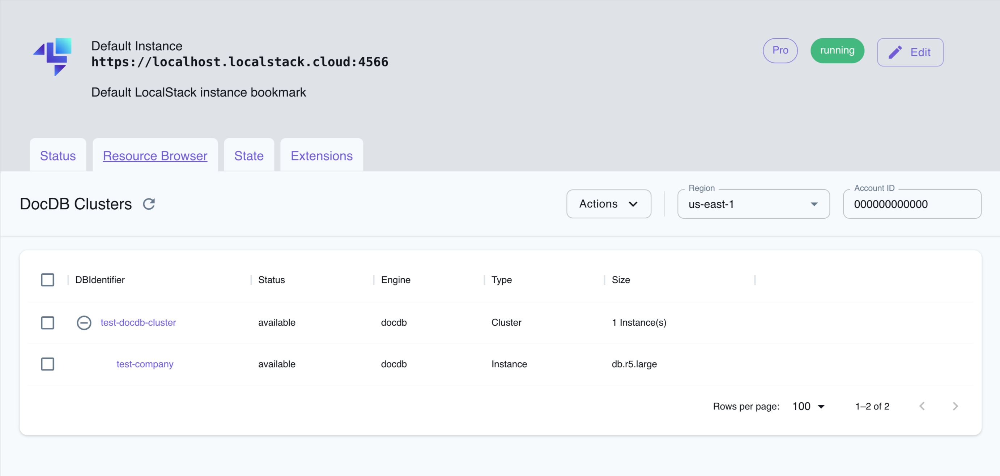

## Introduction

DocumentDB is a fully managed, non-relational database service that supports MongoDB workloads. DocumentDB is compatible with MongoDB, meaning you can use the same MongoDB drivers, applications, and tools to run, manage, and scale workloads on DocumentDB without having to worry about managing the underlying infrastructure.

LocalStack allows you to use the DocumentDB APIs to create and manage DocumentDB clusters and instances. The supported APIs are available on our [API coverage page](https://docs.localstack.cloud/references/coverage/coverage_docdb/), which provides information on the extent of DocumentDB's integration with LocalStack.

## Getting started

To create a new DocumentDB cluster we use the `create-db-cluster` command as follows:


$ awslocal docdb create-db-cluster --db-cluster-identifier test-docdb-cluster --engine docdb


```yaml
{
  "DBCluster": {
    "DBClusterIdentifier": "test-docdb-cluster",
    "DBClusterParameterGroup": "default.docdb",
    "Status": "available",
    "Endpoint": "localhost.localstack.cloud",
    "MultiAZ": false,
    "Engine": "docdb",
    "Port": 39045,
    "MasterUsername": "test",
    "DBClusterMembers": [],
    "VpcSecurityGroups": [
      {
        "VpcSecurityGroupId": "sg-a30edea1f7da6ff90",
        "Status": "active"
      }
    ],
    "StorageEncrypted": false,
    "DBClusterArn": "arn:aws:rds:us-east-1:000000000000:cluster:test-docdb-cluster"
  }
}
```

If we break down the previous command, we can identify:

- `docdb`: The command related to Amazon DocumentDB for the `AWS CLI`.
- `create-db-cluster`: The command to create an Amazon DocumentDB cluster.
- `--db-cluster-identifier test-docdb-cluster`: Specifies the unique identifier for the DocumentDB
  cluster. In this case, it is set to `test-docdb-cluster`. You can customize this identifier to a
  name of your choice.
- `--engine docdb`: Specifies the database engine. Here, it is set to `docdb`, indicating the use of
  Amazon DocumentDB.

Notice in the `DBClusterMembers` field of the cluster description that there are no other databases
created. 
As we did not specify a `MasterUsername` or `MasterUserPassword` for the creation of the database, the mongo-db will not set any credentials when starting the docker container.
To create a new database, we can use the `create-db-instance` command, like in this example:


$ awslocal docdb create-db-instance --db-instance-identifier test-company \
--db-instance-class db.r5.large --engine docdb --db-cluster-identifier test-docdb-cluster

```yaml
{
  "DBInstance": {
    "DBInstanceIdentifier": "test-docdb-instance",
    "DBInstanceClass": "db.r5.large",
    "Engine": "docdb",
    "DBInstanceStatus": "creating",
    "Endpoint": {
      "Address": "localhost.localstack.cloud",
      "Port": 50761
    },
    "InstanceCreateTime": "2022-10-28T04:27:35.917000+00:00",
    "PreferredBackupWindow": "03:50-04:20",
    "BackupRetentionPeriod": 1,
    "VpcSecurityGroups": [ ,
      "AvailabilityZone": "us-east-1a",
      "PreferredMaintenanceWindow": "wed:06:38-wed:07:08",
      "EngineVersion": "12.34",
      "AutoMinorVersionUpgrade": false,
      "PubliclyAccessible": false,
      "StatusInfos": [],
      "DBClusterIdentifier": "test-docdb-cluster",
      "StorageEncrypted": false,
      "DbiResourceId": "db-M5ENSHXFPU6XHZ4G4ZEI5QIO2U",
      "CopyTagsToSnapshot": false,
      "DBInstanceArn": "arn:aws:rds:us-east-1:000000000000:db:test-docdb-instance",
      "EnabledCloudwatchLogsExports": []
      }
      }
```

Some noticeable fields:

- `--db-instance-identifier test-company`: Represents the unique identifier of the newly created
  database.
- `--db-instance-class db.r5.large`: Is the type or class of the Amazon DocumentDB
  instance. It determines the compute and memory capacity allocated to the instance. `db.r5.large` refers to a specific instance type in
  the R5 family. Although the flag is required for database creation, LocalStack will only mock the `DBInstanceClass` attribute.

  You can find out more about instance classes in
  the [AWS documentation](https://docs.aws.amazon.com/AmazonRDS/latest/UserGuide/Concepts.DBInstanceClass.html)
  .

To obtain detailed information about the cluster, we use the `describe-db-cluster` command:

$ awslocal docdb describe-db-clusters --db-cluster-identifier test-docdb-cluster


```yaml
{
  "DBClusters": [
    {
      "DBClusterIdentifier": "test-docdb-cluster",
      "DBClusterParameterGroup": "default.docdb",
      "Status": "available",
      "Endpoint": "localhost.localstack.cloud",
      "MultiAZ": false,
      "Engine": "docdb",
      "Port": 39045,
      "MasterUsername": "test",
      "DBClusterMembers": [
        {
          "DBInstanceIdentifier": "test-company",
          "IsClusterWriter": true,
          "DBClusterParameterGroupStatus": "in-sync",
          "PromotionTier": 1
        }
      ],
      "VpcSecurityGroups": [
        {
          "VpcSecurityGroupId": "sg-a30edea1f7da6ff90",
          "Status": "active"
        }
      ],
      "StorageEncrypted": false,
      "DBClusterArn": "arn:aws:rds:us-east-1:000000000000:cluster:test-docdb-cluster"
    }
  ]
}
```

### Connect to DocumentDB using mongosh

Interacting with the databases is done using `mongosh`, which is an official command-line shell and
[interactive MongoDB shell provided by MongoDB](https://www.mongodb.com/docs/mongodb-shell/).
It is designed to provide a modern and enhanced user experience for interacting with MongoDB
databases.



$ mongosh mongodb://localhost:39045
Current Mongosh Log ID:    64a70b795697bcd4865e1b9a
Connecting to:        mongodb://localhost:
39045/?directConnection=true&serverSelectionTimeoutMS=2000&appName=mongosh+1.10.1
Using MongoDB:        6.0.7
Using Mongosh:        1.10.1

For mongosh info see: https://docs.mongodb.com/mongodb-shell/

------

test>



This command will default to accessing the `test` database that was created with the cluster. Notice the port, `39045`,
which is the cluster port that appears in the aforementioned description.

To work with a specific database, the command is:


$ mongosh mongodb://localhost:39045/test-company
Current Mongosh Log ID:    64a71916fae7fdeeb8b43a73
Connecting to:        mongodb://localhost:
39045/test-company?directConnection=true&serverSelectionTimeoutMS=2000&appName=mongosh+1.10.1
Using MongoDB:        6.0.7
Using Mongosh:        1.10.1

For mongosh info see: https://docs.mongodb.com/mongodb-shell/

------
test-company>



From here on we can manipulate collections
using [the JavaScript methods provided](https://www.mongodb.com/docs/manual/reference/method/)
by `mongosh`:



test-company> db.createCollection("employees")
{ ok: 1 }
test-company> db.createCollection("customers")
{ ok: 1 }
test-company> show collections
customers
employees
test-company> exit



For more information on how to use MongoDB with `mongosh` please refer to
the [MongoDB documentation](https://www.mongodb.com/docs/).

### Connect to DocumentDB using Node.js Lambda


You need to set `DOCDB_PROXY_CONTAINER=1` when starting LocalStack to be able to use the returned `Endpoint`, which will be correctly resolved automatically.

The flag `DOCDB_PROXY_CONTAINER=1` changes the default behavior and the container will be started as proxied container. Meaning a port from the [pre-defined port]() range will be chosen, and when using lambda, you can use `localhost.localstack.cloud` to connect to the instance.


In this sample we will use a Node.js lambda function to connect to a DocumentDB. 
For the mongo-db connection we will use the `mongodb` lib.
Please note, that this sample is only for demo purpose, e.g., we will set the credentials as environment variables to the lambda function.

In a best-practise sample you would use a secret instead.
We included a snippet at the very end.

#### Create the DocDB Cluster with a username and password

We assume you have a `MasterUsername` and `MasterUserPassword` set for DocDB e.g:

$ awslocal docdb create-db-cluster --db-cluster-identifier test-docdb \
   --engine docdb \
   --master-user-password S3cretPwd! \
   --master-username someuser


#### Prepare the lambda function

First, we create the zip required for the lambda function with the mongodb dependency.
You will need [`npm`](https://docs.npmjs.com/) in order to install the dependencies.
In your terminal run:


$ mkdir resources
$ cd resources
$ mkdir node_modules
$ npm install mongodb@6.3.0


Next, copy the following code into a new file named `index.js` in the `resources` folder:


const AWS = require('aws-sdk');
const RDS = AWS.RDS;
const { MongoClient } = require('mongodb');

const docdb_client = new RDS();

const docdb_id = process.env.DOCDB_CLUSTER_ID;
const pwd = process.env.DOCDB_SECRET;

exports.handler = async (event) => {
  try {
    // Get endpoint details using rds/docdb client:
    const cluster_result = await docdb_client.describeDBClusters({DBClusterIdentifier: docdb_id}).promise();
    const cluster = cluster_result.DBClusters[0];
    const host = cluster.Endpoint;
    const port = cluster.Port;
    const user = cluster.MasterUsername;

    // Connection URI
    const dbname = "mydb";
    // retryWrites is by default true, but not supported by AWS DocumentDB
    const uri = `mongodb://${user}:${pwd}@${host}:${port}/?retryWrites=false`;
    
    // Connect to DocumentDB
    const client = await MongoClient.connect(uri);
    const db = client.db(dbname);

    // Insert data
    const collection = db.collection('your_collection');
    await collection.insertOne({ key: 'value' });

    // Query data
    const result = await collection.findOne({ key: 'value' });
    await client.close();

    // Return result
    return {
      statusCode: 200,
      body: JSON.stringify(result),
    };
  } catch (error) {
    return {
      statusCode: 500,
      body: JSON.stringify({ error: error.message }),
    };
  }
};


Now, you can zip the entire. 
Make sure you are inside `resources` directory and run:

$ zip -r function.zip .


Finally, we can create the `lambda` function using `awslocal`:

$ awslocal lambda create-function \
  --function-name MyNodeLambda \
  --runtime nodejs16.x \
  --role arn:aws:iam::000000000000:role/lambda-role \
  --handler index.handler \
  --zip-file fileb://function.zip \
  --environment Variables="{DOCDB_CLUSTER_ID=test-docdb,DOCDB_SECRET=S3cretPwd!}"


You can invoke the lambda by calling:

$ awslocal lambda invoke --function-name MyNodeLambda outfile


The `outfile` contains the returned value, e.g.:
```yaml
{"statusCode":200,"body":"{\"_id\":\"6560a21ca7771a02ef128c72\",\"key\":\"value\"}"}
````

#### Use Secret To Connect to DocDB

The best-practise for accessing databases is by using secrets. 
Secrets follow a [well-defined pattern](https://docs.aws.amazon.com/secretsmanager/latest/userguide/create_database_secret.html).

For the lambda function, you can pass the secret arn as `SECRET_NAME`.
In the lambda, you can then retrieve the secret details like this:

[This sample is a snippet from the scenario test https://github.com/localstack/localstack-ext/blob/master/tests/aws/scenario/rds_neptune_docdb/test_rds_neptune_docdb.py]: #


const AWS = require('aws-sdk');
const { MongoClient } = require('mongodb');

const secretsManager = new AWS.SecretsManager();
const secretName = process.env.SECRET_NAME;

function customURIEncode(str) {
  // encode also characters that encodeURIComponent does not encode
  return encodeURIComponent(str)
    .replace(/!/g, '%21')
    .replace(/~/g, '%7E')
    .replace(/\*/g, '%2A')
    .replace(/'/g, '%27')
    .replace(/\(/g, '%28')
    .replace(/\)/g, '%29');
}

exports.handler = async (event) => {
  try {
    // Retrieve secret
    const secretValue = await secretsManager.getSecretValue({ SecretId: secretName }).promise();
    const { username, password, host, port } = JSON.parse(secretValue.SecretString);

    // make sure username and password are correctly encoded for the URI
    const user = customURIEncode(username);
    const pwd = customURIEncode(password);

    // retryWrites is by default true, but not supported by AWS DocumentDB
    const uri = `mongodb://${user}:${pwd}@${host_name}:${port}/?retryWrites=false`;
    
    // Connect to DocumentDB
    const client = await MongoClient.connect(uri);

    // ... interact with the mongo-db ...
    
    return {
      statusCode: 200
    };
  } catch (error) {
    console.error('Error: ', error);
    return {
      statusCode: 500,
      body: JSON.stringify({ error: error.message }),
    };
  }
};



## Resource Browser

The LocalStack Web Application provides a Resource Browser for managing DocumentDB instances and clusters. You can access the Resource Browser by opening the LocalStack Web Application in your browser, navigating to the **Resources** section, and then clicking on **DocumentDB** under the **Database** section.


<br>
<br>

The Resource Browser allows you to perform the following actions:

- **Create Cluster**: Create a new DocumentDB cluster by specifying the DBCluster Identifier, Availability Zone, and other parameters.
- **Create Instance**: Create a new DocumentDB instance by specifying the database class, engine, DBInstance Identifier, and other parameters.
- **View Instance & Cluster**: View an existing DocumentDB instance or cluster by clicking the instance/cluster name.
- **Edit Instance & Cluster**: Edit an existing DocumentDB instance or cluster by clicking the instance/cluster name and clicking the **Edit Instance** or **Edit Cluster** button.
- **Remove Instance & Cluster**: Remove an existing DocumentDB instance or cluster by clicking the instance/cluster name and clicking the **Actions** followed by **Remove Selected** button.

## Current Limitations

Under the hood, LocalStack starts a MongoDB server, to handle DocumentDB storage, in a separate Docker container and adds port-mapping so that it can be accessed from `localhost`. When defining a port to access the container, an available port on the host machine will be selected, that means there is no pre-defined port range by default.

Because LocalStack utilizes a MongoDB container to provide DocumentDB storage, LocalStack may not have exact feature parity with Amazon DocumentDB. The database engine may support additional features that DocumentDB does not and vice versa.

DocumentDB currently uses the default configuration of the latest [MongoDB Docker image](https://hub.docker.com/_/mongo). When the `MasterUsername` and `MasterUserPassword` are set for the creation for the DocumentDB cluster or instance, the container will be started with the corresponding ENVs `MONGO_INITDB_ROOT_USERNAME` respectively `MONGO_INITDB_ROOT_PASSWORD`. 
