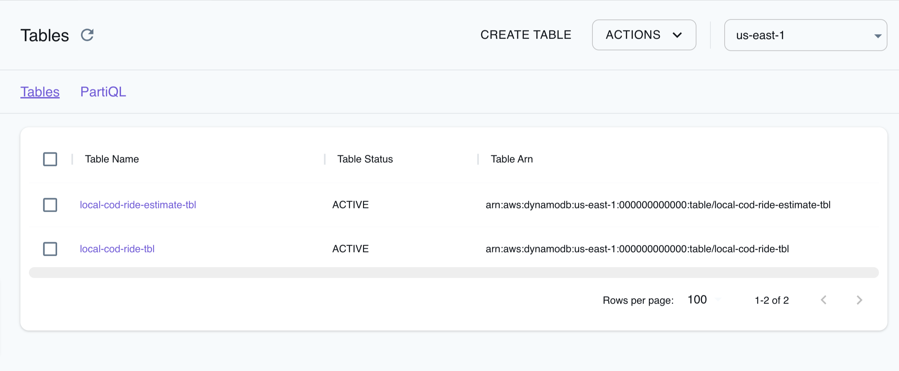

DynamoDB is a fully managed NoSQL database service provided by AWS.
It offers a flexible and highly scalable way to store and retrieve data, making it suitable for a wide range of applications.
DynamoDB provides a fast and scalable key-value datastore with support for replication, automatic scaling, data encryption at rest, and on-demand backup, among other capabilities.

LocalStack allows you to use the DynamoDB APIs in your local environment to manage key-value and document data models.
The supported APIs are available on our [API coverage page](https://docs.localstack.cloud/references/coverage/coverage_dynamodb/), which provides information on the extent of DynamoDB's integration with LocalStack.

## Getting started

This guide is designed for users new to DynamoDB and assumes basic knowledge of the AWS CLI and our [`awslocal`](https://github.com/localstack/awscli-local) wrapper script.

Start your LocalStack container using your preferred method.
We will demonstrate how to create DynamoDB table, along with its replicas, and put an item into the table using the AWS CLI.

### Create a DynamoDB table

You can create a DynamoDB table using the [`CreateTable`](https://docs.aws.amazon.com/amazondynamodb/latest/APIReference/API_CreateTable.html) API.
Execute the following command to create a table named `global01` with a primary key `id`:


$ awslocal dynamodb create-table \
    --table-name global01 \
    --key-schema AttributeName=id,KeyType=HASH \
    --attribute-definitions AttributeName=id,AttributeType=S \
    --billing-mode PAY_PER_REQUEST \
    --region ap-south-1


The following output would be retrieved:

```bash
{
    "TableDescription": {
        "AttributeDefinitions": [
            {
                "AttributeName": "id",
                "AttributeType": "S"
            }
        ],
        "TableName": "global01",
        "KeySchema": [
            {
                "AttributeName": "id",
                "KeyType": "HASH"
            }
        ],
        "TableStatus": "ACTIVE",
        "CreationDateTime": 1693244562.147,
        ...
        "TableArn": "arn:aws:dynamodb:ap-south-1:000000000000:table/global01",
        "TableId": "6bc6dd46-98d8-486a-aed8-6ef66a35df7c",
        ...
        }
    }
}
```

### Create replicas

You can create replicas of a DynamoDB table using the [`UpdateTable`](https://docs.aws.amazon.com/amazondynamodb/latest/APIReference/API_UpdateTable.html) API.
Execute the following command to create replicas in `ap-south-1` and `us-west-1` regions:


$ awslocal dynamodb update-table \
    --table-name global01 \
    --replica-updates '[{"Create": {"RegionName": "eu-central-1"}}, {"Create": {"RegionName": "us-west-1"}}]' \
    --region ap-south-1


The following output would be retrieved:

```bash
{
    "TableDescription": {
        "AttributeDefinitions": [
            {
                "AttributeName": "id",
                "AttributeType": "S"
            }
        ],
        ...
        "Replicas": [
            {
                "RegionName": "eu-central-1",
                "ReplicaStatus": "ACTIVE"
            },
            {
                "RegionName": "us-west-1",
                "ReplicaStatus": "ACTIVE"
            }
        ]
    }
}
```

You can now operate on the table in the replicated regions as well.
You can use the [`ListTables`](https://docs.aws.amazon.com/amazondynamodb/latest/APIReference/API_ListTables.html) API to list the tables in the replicated regions.
Run the following command to list the tables in the `eu-central-1` region:


$ awslocal dynamodb list-tables \
    --region eu-central-1


The following output would be retrieved:

```bash
{
    "TableNames": [
        "global01"
    ]
}
```

### Insert an item

You can insert an item into a DynamoDB table using the [`PutItem`](https://docs.aws.amazon.com/amazondynamodb/latest/APIReference/API_PutItem.html) API.
Execute the following command to insert an item into the `global01` table:


$ awslocal dynamodb put-item \
    --table-name global01 \
    --item '{"id":{"S":"foo"}}' \
    --region eu-central-1


You can now query the number of items in the table using the [`DescribeTable`](https://docs.aws.amazon.com/amazondynamodb/latest/APIReference/API_DescribeTable.html) API.
Run the following command to query the number of items in the `global01` table from a different region:


$ awslocal dynamodb describe-table \
    --table-name global01 \
    --query 'Table.ItemCount' \
    --region ap-south-1


The following output would be retrieved:

```bash
1
```


You can run DynamoDB in memory, which can greatly improve the performance of your database operations. However, this also means that the data will not be possible to persist on disk and will be lost even though persistence is enabled in LocalStack. To enable this feature, you need to set the environment variable `DYNAMODB_IN_MEMORY=1` while starting LocalStack.


### Time To Live

LocalStack supports [Time to Live (TTL)](https://docs.aws.amazon.com/amazondynamodb/latest/developerguide/TTL.html) in DynamoDB.
To enable this feature, you need to set the environment variable `DYNAMODB_REMOVE_EXPIRED_ITEMS` to 1.
This enables a worker running every 60 minutes that scans all the tables and deletes the expired items.

In addition, to programmatically trigger the worker at convenience, we provide the following endpoint:
- `DELETE /_aws/dynamodb/expired`

The response returns the number of deleted items:

```console
curl -X DELETE localhost:4566//_aws/dynamodb/expired
{"ExpiredItems": 3}
```

## Resource Browser

The LocalStack Web Application provides a Resource Browser for managing DynamoDB tables and items.
You can access the Resource Browser by opening the LocalStack Web Application in your browser, navigating to the **Resources** section, and then clicking on **DynamoDB** under the **Database** section.



The Resource Browser allows you to perform the following actions:

- **Create Table**: Create a new DynamoDB table by clicking on the **Create Table** button.
You can specify the table name, table class, key schema and other attributes of the table.
- **Edit Table**: Edit an existing DynamoDB table by clicking on the **Edit Table** button.
You can modify the table name, key schema and other attributes of the table.
- **View items**: View the items in a DynamoDB table by clicking on the **Items** button.
You can also add, edit and delete items in the table.
You can also switch to scan or query mode to view the items in the table.
- **Run PartiQL**: Run a PartiQL query against a DynamoDB table by clicking on the **PartiQL** button.
You can add your query in the editor and click on the **Execute** button to execute the query.
- **Delete Table**: Delete an existing DynamoDB table by selecting the DynamoDB table and clicking **Actions** and then **Remove Selected**.

## Examples

The following code snippets and sample applications provide practical examples of how to use IAM in LocalStack for various use cases:

-   [Serverless Container-based APIs with Amazon ECS & API Gateway](https://github.com/localstack/serverless-api-ecs-apigateway-sample)
-   [Full-Stack application with AWS Lambda, DynamoDB & S3 for shipment validation](https://github.com/localstack/shipment-list-demo)
-   [Step-up Authentication using Amazon Cognito](https://github.com/localstack/step-up-auth-sample)
-   [Serverless microservices with Amazon API Gateway, DynamoDB, SQS, and Lambda](https://github.com/localstack/microservices-apigateway-lambda-dynamodb-sqs-sample)
-   [Event-driven architecture with Amazon SNS FIFO, DynamoDB, Lambda, and S3](https://github.com/localstack/event-driven-architecture-with-amazon-sns-fifo)
-   [Note-Taking application using AWS SDK for JavaScript](https://github.com/localstack/aws-sdk-js-notes-app)
-   [AppSync GraphQL APIs for DynamoDB and RDS Aurora PostgreSQL](https://github.com/localstack/appsync-graphql-api-sample)
-   [Loan Broker application with AWS Step Functions, DynamoDB, Lambda, SQS, and SNS](https://github.com/localstack/loan-broker-stepfunctions-lambda-app)
-   [Messaging Processing application with SQS, DynamoDB, and Fargate](https://github.com/localstack/sqs-fargate-ddb-cdk-go)

## Current Limitations

### Global tables

LocalStack provides support for global tables (Version 2019), which are tables that exist within the same account and are replicated across various regions.

However, legacy global tables (Version 2017) are not supported by LocalStack.
Operations such as `CreateGlobalTable`, `UpdateGlobalTable`, and `DescribeGlobalTable` will not replicate globally.

### Replication 

- Removing the original table region from the replication set while retaining the replicas is currently not feasible.
Deleting the original table will result in the removal of all replicas as well.
- DynamoDB Streams are exclusively supported for original tables and not for replicated ones.
More information can be found in [our public GitHub issue tracker](https://github.com/localstack/localstack/issues/7405).
- Batch operations such as `BatchWriteItem`, `BatchGetItem`, etc. are currently not supported for replicated tables.
