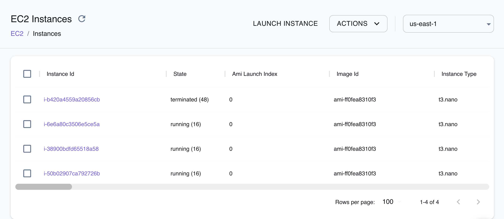

## Introduction

Elastic Compute Cloud (EC2) is a core service within Amazon Web Services (AWS) that provides scalable and flexible virtual computing resources.
EC2 enables users to launch and manage virtual machines, referred to as instances.

LocalStack allows you to use the EC2 APIs in your local environment to create and manage EC2 instances and related resources such as VPCs, EBS volumes, etc.
The list of supported APIs can be found on the [API coverage page](https://docs.localstack.cloud/references/coverage/coverage_ec2/).

## Getting started

This guide is designed for users new to EC2 and assumes basic knowledge of the AWS CLI and our [`awslocal`](https://github.com/localstack/awscli-local) wrapper script.

Start your LocalStack container using your preferred method.
We will demonstrate how to create an EC2 instance that runs a simple Python web server on port 8000 with the AWS CLI.

### Create a Key Pair

To create a key pair, you can use the [`CreateKeyPair`](https://docs.aws.amazon.com/AWSEC2/latest/APIReference/API_CreateKeyPair.html) API.
Run the following command to create the key pair and pipe the output to a file named `key.pem`:


$ awslocal ec2 create-key-pair \
    --key-name my-key \
    --query 'KeyMaterial' \
    --output text | tee key.pem


You can assign necessary permissions to the key pair file using the following command:


$ chmod 400 key.pem


Alternatively, we can import an existing key pair, for example if you have an SSH public key in your home directory under `~/.ssh/id_rsa.pub`:

$ awslocal ec2 import-key-pair --key-name my-key --public-key-material file://~/.ssh/id_rsa.pub


### Add rules to your security group

Currently, LocalStack only supports the `default` security group.
You can add rules to the security group using the [`AuthorizeSecurityGroupIngress`](https://docs.aws.amazon.com/AWSEC2/latest/APIReference/API_AuthorizeSecurityGroupIngress.html) API.
Run the following command to add a rule to allow inbound traffic on port 8000:


$ awslocal ec2 authorize-security-group-ingress \
    --group-id default \
    --protocol tcp \
    --port 8000 \
    --cidr 0.0.0.0/0


The above command will enable rules in the security group to allow incoming traffic from your local machine on port 8000 of an emulated EC2 instance.

### Run an EC2 instance

You can fetch the Security Group ID using the [`DescribeSecurityGroups`](https://docs.aws.amazon.com/AWSEC2/latest/APIReference/API_DescribeSecurityGroups.html) API.
Run the following command to fetch the Security Group ID:


$ awslocal ec2 describe-security-groups


You should see the following output:

```bash
{
    "SecurityGroups": [
        {
            "Description": "default VPC security group",
            "GroupName": "default",
            ...
            "OwnerId": "000000000000",
            "GroupId": "sg-0372ee3c519883079",
            ...
        }
    ]
}
```

To start your Python Web Server in your locally emulated EC2 instance, you can use the following user script by saving it to a file named `user_script.sh`:

```bash
#!/bin/bash -xeu

apt update
apt install python3 -y
python3 -m http.server 8000
```

You can now run an EC2 instance using the [`RunInstances`](https://docs.aws.amazon.com/AWSEC2/latest/APIReference/API_RunInstances.html) API.
Run the following command to run an EC2 instance by adding the appropriate Security Group ID that we fetched in the previous step:


$ awslocal ec2 run-instances \
    --image-id ami-ff0fea8310f3 \
    --count 1 \
    --instance-type t3.nano \
    --key-name my-key \
    --security-group-ids '<SECURITY_GROUP_ID>' \
    --user-data file://./user_script.sh


### Test the Python Web Server

You can now open the LocalStack logs to find the IP address of the locally emulated EC2 instance.
Run the following command to open the LocalStack logs:


$ localstack logs


You should see the following output:

```bash
2023-08-16T17:18:29.702  INFO --- [   asgi_gw_0] l.s.ec2.vmmanager.docker   : Instance i-b07acefd77a3c415f will be accessible via SSH at: 127.0.0.1:12862, 172.17.0.4:22
2023-08-16T17:18:29.702  INFO --- [   asgi_gw_0] l.s.ec2.vmmanager.docker   : Instance i-b07acefd77a3c415f port mappings (container -> host): {'8000/tcp': 29043, '22/tcp': 12862}
```

You can now use the IP address to test the Python Web Server.
Run the following command to test the Python Web Server:


$ curl 172.17.0.4:8000


You should see the following output:

```bash
<!DOCTYPE HTML PUBLIC "-//W3C//DTD HTML 4.01//EN" "http://www.w3.org/TR/html4/strict.dtd">
<html>
<head>
<meta http-equiv="Content-Type" content="text/html; charset=utf-8">
<title>Directory listing for /</title>
...
```


Similar to the setup in production AWS, the user data content is stored at `/var/lib/cloud/instances/<instance_id>/user-data.txt` within the instance.
Any execution of this data is recorded in the `/var/log/cloud-init-output.log` file.


### Connecting via SSH

You can also set up an SSH connection to the locally emulated EC2 instance using the instance IP address.

This section assumes that you have created or imported an SSH key pair named `my-key` (see [instructions above](#create-a-key-pair)).
When running the EC2 instance, make sure to pass the `--key-name` parameter to the command:


$ awslocal ec2 run-instances --key-name my-key ...


Once the instance is up and running, we can use the `ssh` command to set up an SSH connection.
Assuming the instance is available under `127.0.0.1:12862` (as per the LocalStack log output), use this command:


$ ssh -p 12862 -i key.pem root@127.0.0.1



If the `ssh` command throws an error like "Identity file not accessible" or "bad permissions", then please make sure that the key file has a restrictive `0400` permission as illustrated [here](#create-a-key-pair).



## VM Managers

LocalStack Pro comes with emulation capability for certain EC2 resources making them behave like AWS.
This works on top of the mock/CRUD capabilities and makes it possible to implement advanced local setups.

The underlying method for emulation can be controlled using the [`EC2_VM_MANAGER`]() configuration option.


### Docker

LocalStack Pro supports the Docker VM manager which uses the [Docker Engine](https://docs.docker.com/engine/) to emulate EC2 instances.
This is the default VM manager in LocalStack Pro.
The Docker socket from the host machine must be mounted inside the LocalStack container at `/var/run/docker.sock`.

All restrictions associated with containers are also applicable to EC2 instances managed by the Docker manager.
These restrictions include elements like root access and networking.

All launched EC2 instances have the Docker socket mounted inside them at `/var/run/docker.sock` to make Docker-in-Docker usecases possible.

#### Instances and AMIs

LocalStack utilizes a specific naming scheme to recognize and manage associated containers and images.
Docker containers that back EC2 instances are named `localstack-ec2.<InstanceId>`
Similarly, Docker base images which are tagged with the scheme `localstack-ec2/<AmiName>:<AmiId>` are recognized as Amazon Machine Images (AMIs).

You can mark any Docker base image as AMI using the below command:


$ docker tag ubuntu:focal localstack-ec2/ubuntu-focal-ami:ami-000001


The above example will make LocalStack treat the `ubuntu:focal` Docker image as an AMI with name `ubuntu-focal-ami` and ID `ami-000001`.

At startup, LocalStack downloads the following AMIs that can be used to launch Dockerized instances.
This behaviour can be controlled using the `EC2_DOWNLOAD_DEFAULT_IMAGES` configuration variable.
- Ubuntu 20.04 `ami-ff0fea8310f3` (deprecated and marked for removal in the next major release)
- Ubuntu 22.04 `ami-df5de72bdb3b`
- Amazon Linux 2023 `ami-024f768332f0`

All LocalStack-managed Docker AMIs bear the resource tag `ec2_vm_manager:docker`.
These AMIs can be listed using:


$ awslocal ec2 describe-images --filters Name=tag:ec2_vm_manager,Values=docker



All other AMIs that do not have the above tag are mocked and originate from the Community image of LocalStack.
Attempting to launch Dockerized instances using these specific AMIs will result in an `InvalidAMIID.NotFound` error.


#### Networking


Network access to EC2 instance is not possible on macOS. 
This is because Docker Desktop on macOS does not expose the bridge network to the host system.


Network addresses for Dockerized instances are allocated by the Docker daemon and can be obtained from the `PublicIpAddress` attribute.
These addresses are also printed in the logs while the instance is being initialized.

```bash
2022-03-21T14:46:49.540  INFO  Instance i-1d6327abf04e31be6 will be accessible via SSH at: 127.0.0.1:55705
```

When instances are launched, LocalStack attempts to start SSH server `/usr/sbin/sshd` in the Docker base image.
If not found, it installs and starts the [Dropbear](https://github.com/mkj/dropbear) SSH server.

To be able to access the instance at additional ports from the host system, you can modify the default security group and incorporate the needed ingress ports.


Security group ingress rules are applied only during the creation of the Dockerized instance.
Modifying a security group will not open any ports for a running instance.


The system supports up to 32 ingress ports.
This constraint is in place to prevent the host from exhausting available ports.


$ awslocal ec2 authorize-security-group-ingress \
  --group-id default \
  --protocol tcp \
  --port 8080
$ awslocal ec2 describe-security-groups \
  --group-names default


The port mapping details are provided in the logs during the instance initialization process.

```bash
2022-12-20T19:43:44.544  INFO  Instance i-1d6327abf04e31be6 port mappings (container -> host): {'8080/tcp': 51747, '22/tcp': 55705}
```


#### Elastic Block Store

A common use case is to attach an EBS block device to an EC2 instance, which can then be used to create a custom filesystem for additional storage.
This section illustrates how this functionality can be achieved with EC2 Docker instances in LocalStack.


This feature is disabled by default.
Please set the [`EC2_MOUNT_BLOCK_DEVICES`]() configuration option to enable it.


First, we create a user data script `init.sh` which creates an ext3 file system on the block device `/ebs-dev/sda1` and mounts it under `/ebs-mounted`:

$ cat > init.sh <<EOF
#!/bin/bash
set -eo
mkdir -p /ebs-mounted
mkfs -t ext3 /ebs-dev/sda1
mount -o loop /ebs-dev/sda1 /ebs-mounted
touch /ebs-mounted/my-test-file
EOF


We can then start an EC2 instance, specifying a block device mapping under the device name `/ebs-dev/sda1`, and pointing to our `init.sh` user data script:

$ awslocal ec2 run-instances --image-id ami-ff0fea8310f3 --count 1 --instance-type t3.nano \
    --block-device-mapping '{"DeviceName":"/ebs-dev/sda1","Ebs":{"VolumeSize":10}}' \
    --user-data file://init.sh


Please note that, whereas real AWS uses GiB for volume sizes, LocalStack uses MiB as the unit for `VolumeSize` in the command above (to avoid creating huge files locally).
Also, by default block device images are limited to 1 GiB in size, but this can be customized by setting the [`EC2_EBS_MAX_VOLUME_SIZE`]() config variable (defaults to `1000`).

Once the instance is successfully started and initialized, we can first determine the container ID via `docker ps`, and then list the contents of the mounted filesystem `/ebs-mounted`, which should contain our test file named `my-test-file`:

$ docker ps
CONTAINER ID   IMAGE                  PORTS           NAMES
5c60cf72d84a   ...:ami-ff0fea8310f3   19419->22/tcp   localstack-ec2...
$ docker exec 5c60cf72d84a ls /ebs-mounted
my-test-file



#### Instance Metadata Service

The Docker VM manager supports the [Instance Metadata Service](https://docs.aws.amazon.com/AWSEC2/latest/UserGuide/ec2-instance-metadata.html) which is used to retrieve information about the running instance.

Both IMDSv1 and IMDSv2 can be used.
LocalStack does not strictly enforce either versions.
If the `X-aws-ec2-metadata-token` header is present, LocalStack will use IMDSv2, otherwise it will fall back to IMDSv1.

To create an IMDSv2 token, run the following inside the EC2 container:


$ curl -X PUT "http://169.254.169.254/latest/api/token" -H "x-aws-ec2-metadata-token-ttl-seconds: 300"


The token can be used in subsequent requests like so:


$ curl -H "x-aws-ec2-metadata-token: <TOKEN>" -v http://169.254.169.254/latest/meta-data/


Currently a limited set of [metadata categories](https://docs.aws.amazon.com/AWSEC2/latest/UserGuide/instancedata-data-categories.html) are implemented.
If you would like support for more metadata categories, please make a feature request on [GitHub](https://github.com/localstack/localstack/issues/new/choose).


IMDS IPv6 endpoint is currently not supported.



#### Configuration

You can use the [`EC2_DOCKER_FLAGS`]() LocalStack configuration variable to pass supplementary flags to Docker during the initiation of containerized instances.
This allows for fine-tuned behaviours, for example, running containers in privileged mode using `--privileged` or specifying an alternate CPU platform with `--platform`.
Keep in mind that this will apply to all instances that are launched in the LocalStack session.


#### Operations

The following table explains the emulated action for every API operation.

| Operation       | Notes                                                                                        |
|:----------------|:---------------------------------------------------------------------------------------------|
| `CreateImage` | Uses Docker commit to capture a snapshot of a running instance into a new AMI |
| `CopyImage` | ... |
| `DescribeImages` | Retrieves a list of Docker images that can be used as AMIs |
| `ImportImage` | ... |
| `RegisterImage` | ... |
| `DescribeInstances`| Describes both mocked and Docker-backed instances. Docker-backed instances are marked with the resource tag `ec2_vm_manager:docker` |
| `RunInstances` | Creates and runs Docker containers that back instances |
| `StopInstances` | Pauses the Docker containers that back instances |
| `StartInstances` | Resumes the Docker containers that back instances |
| `TerminateInstances` | Stops the Docker containers that back instances |


### Libvirt


The Libvirt VM manager is a preview feature.


The Libvirt VM manager uses the [Libvirt](https://libvirt.org/index.html) API to create fully virtualized EC2 resources.
LocalStack Pro supports the QEMU/KVM hypervisor.

(Add Libvirt setup, KVM/QEMU installation and socket mounting info)


#### AMIs

(Talk about the bring-your-own-image model, storage pools, volumes)


#### Instances

(Describe virtual domains)


#### Networking

(Talk about the methods of accessing the instance)


#### Elastic Block Stores

(Describe volumes)


#### Instance Metadata Service

The Libvirt VM manager does not support the Instance Metadata Service.
Please express your interest for this feature in [this](#TODO) backlog issue.


#### Operations

The following table explains the emulated action for every API operation.

| Operation       | Notes                                                                                        |
|:----------------|:---------------------------------------------------------------------------------------------|
|  |  |


## Resource Browser

The LocalStack Web Application provides a Resource Browser for managing EC2 instances.
You can access the Resource Browser by opening the LocalStack Web Application in your browser, navigating to the **Resources** section, and then clicking on **EC2** under the **Compute** section.


<br>
<br>

The Resource Browser allows you to perform the following actions:
- **Create Instance**: Create a new EC2 instance by clicking the **Launch Instance** button and specifying the AMI ID, instance type, and other parameters.
- **View Instance**: View the details of an EC2 instance by clicking on the Instance ID.
- **Terminate Instance**: Terminate an EC2 instance by selecting the Instance ID, and clicking on the **ACTIONS** button followed by clicking on **Terminate Selected**.
- **Start Instance**: Start a stopped EC2 instance by selecting the Instance ID, and clicking on the **ACTIONS** button followed by clicking on **Start Selected**.
- **Stop Instance**: Stop a running EC2 instance by selecting the Instance ID, and clicking on the **ACTIONS** button followed by clicking on **Stop Selected**.
