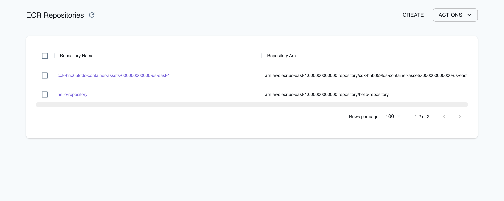

## Introduction

Elastic Container Registry (ECR) is a fully managed container registry service provided by Amazon Web Services.
ECR enables you to store, manage, and deploy Docker container images to build, store, and deploy containerized applications.
ECR integrates with other AWS services, such as Lambda, ECS, and EKS.

LocalStack allows you to use the ECR APIs in your local environment to build & push Docker images to a local ECR registry.
The supported APIs are available on our [API coverage page](https://docs.localstack.cloud/references/coverage/coverage_ecr/), which provides information on the extent of ECR's integration with LocalStack.

## Getting started

This guide is designed for users new to Elastic Container Registry and assumes basic knowledge of the AWS CLI and our [`awslocal`](https://github.com/localstack/awscli-local) wrapper script.

Start your LocalStack container using your preferred method. We will demonstrate how to build and push a Docker image to a local ECR repository.

### Create a Docker image

To get started, create a Docker image for a simple web application that can be used in an ECS task definition.
Create a new file named `Dockerfile` (with no file extension) in your project directory.
This file will contain the instructions for building the Docker image.
Add the following content to the file:

```Dockerfile
FROM public.ecr.aws/docker/library/ubuntu:18.04

# Install dependencies
RUN apt-get update && \
 apt-get -y install apache2

# Install apache and write hello world message
RUN echo 'Hello World!' > /var/www/html/index.html

# Configure apache
RUN echo '. /etc/apache2/envvars' > /root/run_apache.sh && \
 echo 'mkdir -p /var/run/apache2' >> /root/run_apache.sh && \
 echo 'mkdir -p /var/lock/apache2' >> /root/run_apache.sh && \ 
 echo '/usr/sbin/apache2 -D FOREGROUND' >> /root/run_apache.sh && \ 
 chmod 755 /root/run_apache.sh

EXPOSE 80

CMD /root/run_apache.sh
```

You can now build the Docker image from the `Dockerfile` using the `docker CLI:


$ docker build -t localstack-ecr-image .


You can run the following command to verify that the image was built successfully:


$ docker images


You will see output similar to the following:

```bash
REPOSITORY                TAG       IMAGE ID       CREATED          SIZE  
..
localstack-ecr-image      latest    38883941b8fa   1 minute ago     185MB
```

### Create an ECR repository

To push the Docker image to ECR, you first need to create a repository.
You can create an ECR repository using the [`CreateRepository`](https://docs.aws.amazon.com/AmazonECR/latest/APIReference/API_CreateRepository.html) API.
Run the following command to create a repository named `localstack-ecr-repository`:


$ awslocal ecr create-repository \
    --repository-name localstack-ecr-repository \
    --image-scanning-configuration scanOnPush=true


You will see an output similar to the following:

```sh
{
    "repository": {
        "repositoryArn": "arn:aws:ecr:us-east-1:000000000000:repository/localstack-ecr-repository",
        "registryId": "000000000000",
        "repositoryName": "localstack-ecr-repository",
        "repositoryUri": "000000000000.dkr.ecr.us-east-1.localhost.localstack.cloud:4566/localstack-ecr-repository",
        "createdAt": "2023-07-24T16:58:36+05:30",
        "imageTagMutability": "MUTABLE",
        "imageScanningConfiguration": {
            "scanOnPush": true
        },
        "encryptionConfiguration": {
            "encryptionType": "AES256"
        }
    }
}
```

You will need the `repositoryUri` value to push the Docker image to the repository.

### Push the Docker image to the repository

To push the Docker image to the repository, you first need to tag the image with the `repositoryUri`.
Run the following command to tag the image:


$ docker tag localstack-ecr-image 000000000000.dkr.ecr.us-east-1.localhost.localstack.cloud:4566/localstack-ecr-repository


You can now push the image to the repository using the `docker` CLI:


$ docker push 000000000000.dkr.ecr.us-east-1.localhost.localstack.cloud:4566/localstack-ecr-repository


The image will take a few seconds to push to the repository.
You can run the following command to verify that the image was pushed successfully:


$ awslocal ecr list-images --repository-name localstack-ecr-repository


You will see an output similar to the following:

```bash
{
    "imageIds": [
        {
            "imageDigest": "sha256:1cbc853c42983362817b5eecac80b1389c0a5cf9cfd1e711d9d0a1f5a7a36d43",
            "imageTag": "latest"
        }
    ]
}
```

## Resource Browser

The LocalStack Web Application provides a Resource Browser for managing ECR repositories and images.
You can access the Resource Browser by opening the LocalStack Web Application in your browser, navigating to the **Resources** section, and then clicking on **ECR** under the **Compute** section.



The Resource Browser allows you to perform the following actions:

- **Create repository**: Create a new ECR repository by clicking the **Create** button, and specify the **Registry Id**, **Repository Name**, **Tags**, and other options.
- **View repository**: View the details of an ECR repository by clicking on the repository name.
You can also view the push commands to push an image to the repository by clicking the **View Push Commands** button.
- **Delete repository**: Delete an ECR repository by selecting the ECR repository, clicking the **Actions** button, and then clicking **Remove Selected**.

## Examples

The following code snippets and sample applications provide practical examples of how to use ECR in LocalStack for various use cases:

- [Amazon RDS initialization using CDK, Lambda, ECR, and Secrets Manager](https://github.com/localstack/amazon-rds-init-cdk)
- [Lambda Container Images with ECR](https://github.com/localstack/localstack-pro-samples/tree/master/lambda-container-image)
- [Pushing Docker images to ECR and running them locally on ECS](https://github.com/localstack/localstack-pro-samples/tree/master/ecs-ecr-container-app)
