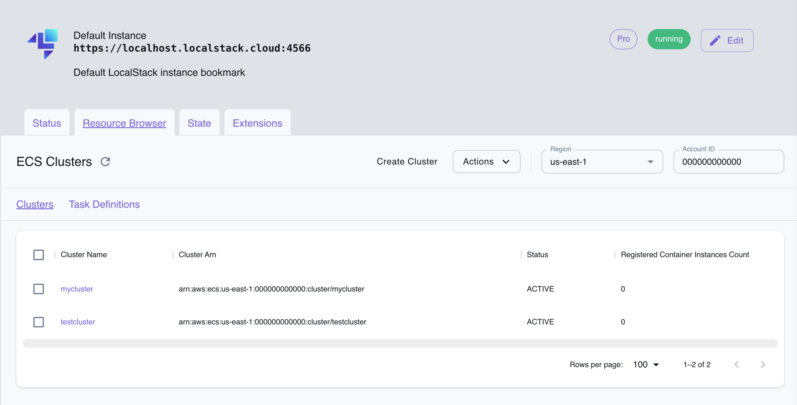

## Introduction

Amazon Elastic Container Service (Amazon ECS) is a fully managed container orchestration service provided by Amazon Web Services (AWS).
It allows you to run, stop, and manage Docker containers on a cluster.
ECS eliminates the need for you to install, operate, and scale your own cluster management infrastructure.

LocalStack allows you to use the ECS APIs in your local environment to create & manage ECS clusters, tasks, and services.
The supported APIs are available on our [API coverage page](https://docs.localstack.cloud/references/coverage/coverage_ecs/), which provides information on the extent of ECS's integration with LocalStack.

## Getting Started

This guide is designed for users new to ECS and assumes basic knowledge of the AWS CLI and our [`awslocal`](https://github.com/localstack/awscli-local) wrapper script.

Start your LocalStack container using your preferred method.
We will demonstrate how to create an ECS service using the AWS CLI

### Create a cluster


By default, the **ECS Fargate** launch type is assumed, i.e., the local Docker engine is used for deployment of applications, and there is no need to create and manage EC2 virtual machines to run the containers.


ECS tasks and services run on a cluster.
Execute the following command to create an ECS cluster named `mycluster`:


$ awslocal ecs create-cluster --cluster-name mycluster
<disable-copy>
{
    "cluster": {
        "clusterArn": "arn:aws:ecs:us-east-1:000000000000:cluster/mycluster",
        "clusterName": "mycluster",
        "status": "ACTIVE",
        "registeredContainerInstancesCount": 0,
        "runningTasksCount": 0,
        "pendingTasksCount": 0,
        "activeServicesCount": 0,
        "settings": [
            {
                "name": "containerInsights",
                "value": "disabled"
            }
        ]
    }
}
</disable-copy>


### Create a task definition

Containers within tasks are defined by a task definition that is managed outside of the context of a cluster.
To create a task definition that runs an `ubuntu` container forever (by running an infinite loop printing "Running" on startup), create the following file as `task_definition.json`:

```json
{
  "containerDefinitions": [
    {
      "name": "server",
      "image": "ubuntu",
      "cpu": 10,
      "memory": 10,
      "command": [
        "sh",
        "-c",
        "while true; do echo running; sleep 1; done"
      ],
      "essential": true,
      "logConfiguration": {
        "logDriver": "awslogs",
        "options": {
          "awslogs-create-group": "true",
          "awslogs-group": "myloggroup",
          "awslogs-stream-prefix": "myprefix",
          "awslogs-region": "us-east-1"
        }
      }
    }
  ],
  "family": "myfamily"
}
```

and then run the following command:


$ awslocal ecs register-task-definition --cli-input-json file://task_definition.json
<disable-copy>
{
    "taskDefinition": {
        "taskDefinitionArn": "arn:aws:ecs:us-east-1:000000000000:task-definition/myfamily:1",
        "containerDefinitions": [
            {
                "name": "server",
                "image": "ubuntu",
                "cpu": 10,
                "memory": 10,
                "portMappings": [],
                "essential": true,
                "command": [
                    "sh",
                    "-c",
                    "while true; do echo running; sleep 1; done"
                ],
                "environment": [],
                "mountPoints": [],
                "volumesFrom": [],
                "logConfiguration": {
                    "logDriver": "awslogs",
                    "options": {
                        "awslogs-create-group": "true",
                        "awslogs-group": "myloggroup",
                        "awslogs-stream-prefix": "myprefix",
                        "awslogs-region": "us-east-1"
                    }
                }
            }
        ],
        "family": "myfamily",
        "networkMode": "bridge",
        "revision": 1,
        "volumes": [],
        "status": "ACTIVE",
        "placementConstraints": [],
        "compatibilities": [
            "EXTERNAL",
            "EC2"
        ],
        "registeredAt": 1713364207.068659
    }
}
</disable-copy>


Task definitions are immutable, and are identified by their `family` field, and calling `register-task-definition` again with the same `family` value creates a new _version_ of a task definition.

This task definition creates a CloudWatch Logs log group and log stream for the container so you can view the service logs.

### Launch a service

Finally we launch an ECS service using the task definition above.
This will create a number of containers in replica mode meaning they are distributed over the nodes of the cluster, or in the case of Fargate, over availability zones within the region of the cluster. To create a service, execute the following command:



$ awslocal ecs create-service --service-name myservice --cluster mycluster --task-definition myfamily --desired-count 1
<disable-copy>
{
    "service": {
        "serviceArn": "arn:aws:ecs:us-east-1:000000000000:service/mycluster/myservice",
        "serviceName": "myservice",
        "clusterArn": "arn:aws:ecs:us-east-1:000000000000:cluster/mycluster",
        "loadBalancers": [],
        "serviceRegistries": [],
        "status": "ACTIVE",
        "desiredCount": 1,
        "runningCount": 1,
        "pendingCount": 0,
        "launchType": "EC2",
        "taskDefinition": "arn:aws:ecs:us-east-1:000000000000:task-definition/myfamily:1",
        "deploymentConfiguration": {
            "deploymentCircuitBreaker": {
                "enable": false,
                "rollback": false
            },
            "maximumPercent": 200,
            "minimumHealthyPercent": 100
        },
        "deployments": [
            {
                "id": "ecs-svc/49976591540684372",
                "status": "PRIMARY",
                "taskDefinition": "arn:aws:ecs:us-east-1:000000000000:task-definition/myfamily:1",
                "desiredCount": 1,
                "pendingCount": 0,
                "runningCount": 1,
                "failedTasks": 0,
                "createdAt": 1709242525.05109,
                "updatedAt": 1709242525.051093,
                "launchType": "EC2",
                "rolloutState": "IN_PROGRESS",
                "rolloutStateReason": "ECS deployment ecs-svc/49976591540684372 in progress."
            }
        ],
        "events": [],
        "createdAt": 1709242525.051096,
        "placementStrategy": [],
        "schedulingStrategy": "REPLICA",
        "createdBy": "arn:aws:iam::000000000000:user/test"
    }
}
</disable-copy>


You should see a new docker container has been created, using the `ubuntu:latest` image, and running the infinite loop command:

```
$ docker ps
CONTAINER ID   IMAGE                       COMMAND                  CREATED         STATUS                   PORTS                                                                                              NAMES
5dfeb9376391   ubuntu                      "sh -c 'while true; …"   3 minutes ago   Up 3 minutes                                                                                                                ls-ecs-mycluster-75f0515e-0364-4ee5-9828-19026140c91a-0-a1afaa9d
9967fe5300cc   localstack/localstack-pro   "docker-entrypoint.sh"   5 minutes ago   Up 5 minutes (healthy)   0.0.0.0:443->443/tcp, 0.0.0.0:4510-4560->4510-4560/tcp, 53/tcp, 5678/tcp, 0.0.0.0:4566->4566/tcp   localstack-main
```

### Collect container logs

To access the generated logs from the container, run the following command:


awslocal logs filter-log-events --log-group-name myloggroup --query 'events[].message'
<disable-copy>
$ awslocal logs filter-log-events --log-group-name myloggroup | head -n 20
{
    "events": [
        {
            "logStreamName": "myprefix/ls-ecs-mycluster-75f0515e-0364-4ee5-9828-19026140c91a-0-a1afaa9d/75f0515e-0364-4ee5-9828-19026140c91a",
            "timestamp": 1713364216375,
            "message": "running",
            "ingestionTime": 1713364216704,
            "eventId": "0"
        },
        {
            "logStreamName": "myprefix/ls-ecs-mycluster-75f0515e-0364-4ee5-9828-19026140c91a-0-a1afaa9d/75f0515e-0364-4ee5-9828-19026140c91a",
            "timestamp": 1713364216440,
            "message": "running",
            "ingestionTime": 1713364216704,
            "eventId": "1"
        },
        {
            "logStreamName": "myprefix/ls-ecs-mycluster-75f0515e-0364-4ee5-9828-19026140c91a-0-a1afaa9d/75f0515e-0364-4ee5-9828-19026140c91a",
            "timestamp": 1713364216505,
            "message": "running",
</disable-copy>


See our [CloudWatch Logs user guide]() for more details.

## LocalStack ECS behavior

You can use the configuration option `MAIN_DOCKER_NETWORK` to specify the network the ECS containers are started in.
Otherwise, your ECS containers will be created in the same Docker network that LocalStack is in.
If your ECS containers depend on LocalStack services, your ECS task network should be the same as the LocalStack container network.

If you are running LocalStack through a `docker run` command, do not forget to enable the communication from the container to the Docker Engine API.
You can provide the access by adding the following option `-v /var/run/docker.sock:/var/run/docker.sock`.

For more information regarding the configuration of LocalStack, please check the [LocalStack configuration]() section.

## Remote debugging

To enable a remote debugging port for your ECS tasks, set the environment variable `ECS_DOCKER_FLAGS="-p 0:<debugger port>"` to expose your debugger on a random port on your host.
You can then use this port to remote attach your debugger.
Or if you are working with a single container, you can set `ECS_DOCKER_FLAGS="-p <debugger port>:<debugger port>"` to expose the debugger port to your host system.

## Mounting local directories for ECS tasks

In some cases, it can be useful to mount code from the host filesystem into the ECS container. For example, to enable a quick debugging loop where you can test changes without having to build and redeploy the task's Docker image each time - similar to the [Lambda Hot Reloading]() feature in LocalStack.

In order to leverage code mounting, we can use the ECS bind mounts feature, which is covered in the [AWS Bind mounts documentation](https://docs.aws.amazon.com/AmazonECS/latest/developerguide/bind-mounts.html).

### Boto3 example

The Python sample code below registers a task definition, mounting a host path `/host/path` into the container under `/container/path`:

```bash
ecs_client = boto3.client("ecs", endpoint_url="http://localhost:4566")
...
ecs_client.register_task_definition(
    family="...",
    containerDefinitions=[
        {
            "name": "...",
            "image": "alpine",
            "command": ["..."],
            "mountPoints": [
                {"containerPath": "/container/path", "sourceVolume": "test-volume"}
            ],
        }
    ],
    volumes=[{"host": {"sourcePath": "/host/path"}, "name": "test-volume"}],
)
```

### CDK example

The same functionality can be achieved with the AWS CDK following this (Python) example:

```python
task_definition = ecs.TaskDefinition(
    ...
    volumes=[
        ecs.Volume(name="test-volume", host=ecs.Host(source_path="/host/path"))
    ]
)

container = task_def.add_container(...)

container.add_mount_points(
    ecs.MountPoint(
        container_path="/container/path",
        source_volume="test-volume",
    ),
)
```

## Private registry authentication

To download images from a private registry using LocalStack, you must provide your credentials.
You can pass your Docker credentials to the container by setting the `DOCKER_CONFIG` environment variable and mounting the `~/.docker/config.json` file as a volume at `/config.json`.
Your file paths might differ, so check Docker's documentation on [Environment Variables](https://docs.docker.com/engine/reference/commandline/cli/#environment-variables) and [Configuration Files](https://docs.docker.com/engine/reference/commandline/cli/#configuration-files) for details.

Here is a Docker Compose example:

```yaml
version: '3.8'
services:
  localstack:
    container_name: "${LOCALSTACK_DOCKER_NAME:-localstack-main}"
    image: localstack/localstack-pro
    ports:
      - "127.0.0.1:4566:4566"            
      - "127.0.0.1:4510-4559:4510-4559"  
      - "127.0.0.1:443:443"              
    environment:
      - LOCALSTACK_AUTH_TOKEN=${LOCALSTACK_AUTH_TOKEN:?}
      - DOCKER_CONFIG=/config.json
    volumes:
      - "${LOCALSTACK_VOLUME_DIR:-./volume}:/var/lib/localstack"
      - "/var/run/docker.sock:/var/run/docker.sock"
      - ~/.docker/config.json:/config.json:ro
```

Alternatively, you can download the image from the private registry before using it or employ an [Initialization Hook](https://docs.localstack.cloud/references/init-hooks/) to install the Docker client and use these credentials to download the image.


## Running ECS on Kubernetes

LocalStack Enterprise image allows you to run ECS tasks on Kubernetes. The tasks are added to ELB load balancer target groups.
You can do so by setting the `ECS_TASK_EXECUTOR` environment variable to `kubernetes` in the LocalStack container.

In this guide, you will learn how to run ECS tasks on Kubernetes by using [`k3d](https://k3d.io/), a lightweight Kubernetes distribution.

### Create a new cluster

After installing `k3d`, you can run the following commands to create a Kubernetes cluster:


$ export NODE_PORT=31566
$ k3d cluster create ls-cluster -p "4566:$NODE_PORT" --wait --timeout 5m


### Install LocalStack in the cluster

You can now install LocalStack in the Kubernetes cluster by using LocalStack's Helm chart. The following command installs LocalStack with the `kubernetes` executor for ECS and sets the `LOCALSTACK_AUTH_TOKEN` environment variable:


$ helm upgrade --install localstack localstack/localstack \
               --set debug=true \
               --set image.repository=localstack/localstack-pro \
               --set image.tag=latest \
               --set readinessProbe.initialDelaySeconds=10 --set livenessProbe.initialDelaySeconds=10 \
               --set service.edgeService.nodePort=$NODE_PORT \
               --set "extraEnvVars[0].name=LOCALSTACK_AUTH_TOKEN" --set-string "extraEnvVars[0].value=${LOCALSTACK_AUTH_TOKEN}" \
               --set "extraEnvVars[1].name=ECS_TASK_EXECUTOR" --set-string "extraEnvVars[1].value=kubernetes" \
               --wait --timeout 5m


After a successful installation, you can access the LocalStack running the following command:


$ curl http://localhost:4566/_localstack/health


You can now create ECS tasks on Kubernetes by following the steps in the [Getting Started](#getting-started) section.

## Resource Browser

The LocalStack Web Application provides a Resource Browser for managing ECS clusters & task definitions.
You can access the Resource Browser by opening the LocalStack Web Application in your browser, navigating to the **Resource Browser** section, and then clicking on **ECS** under the **Compute** section.


<br>
<br>

The Resource Browser allows you to perform the following actions:

- **Create Cluster**: Create a new ECS cluster by clicking on the **Create Cluster** button in the **Clusters** tab and providing the cluster name among other details.
- **Register Task Definition**: Register a new task definition by clicking on the **Register Task Definition** button in the **Task Definitions** tab and providing the task definition details.
- **View Cluster Details**: Click on a cluster in the **Clusters** tab to view the cluster details, including the cluster ARN, status, and other information.
- **View Task Definition Details**: Click on a task definition in the **Task Definitions** tab to view the task definition details, including the task definition ARN, family, and other information.
- **Edit Cluster**: Click on the **Edit Cluster** button while you are viewing a cluster to edit the cluster details.
- **Edit Task Definition**: Click on the **Edit Task Definition** button while you are viewing a task definition to edit the task definition details.
- **Delete Cluster**: Select the cluster name in the **Clusters** tab and click on the **Actions** button followed by **Remove Selected** button.
- **Delete Task Definition**: Select the task definition name in the **Task Definitions** tab and click on the **Actions** button followed by **Remove Selected** button.
