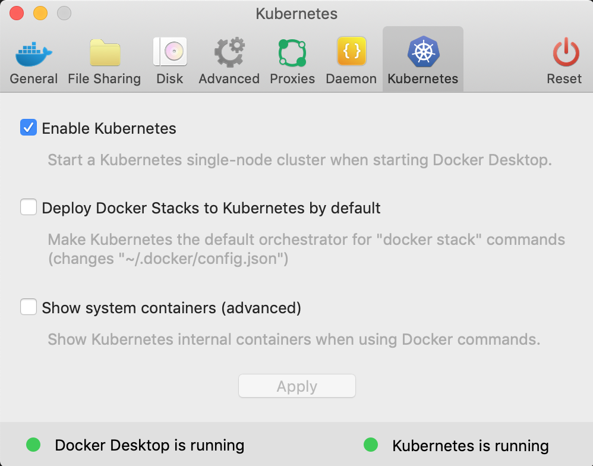
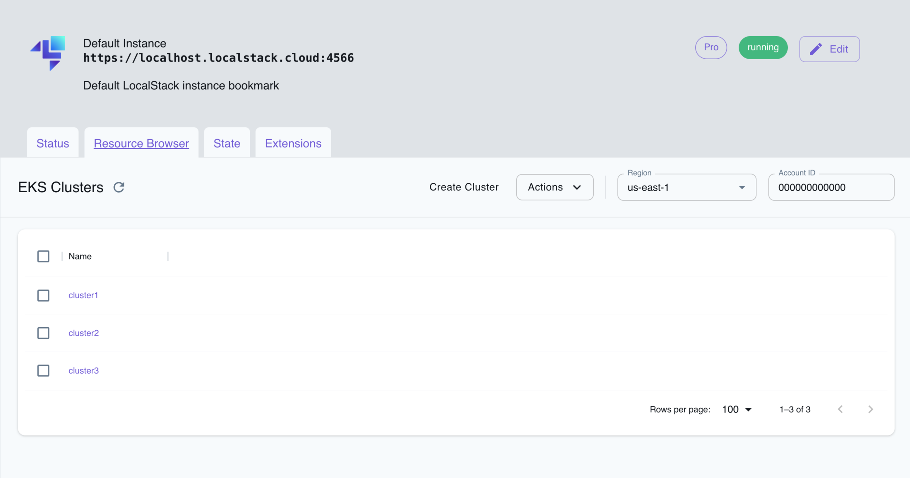

## Introduction

Elastic Kubernetes Service (EKS) is a managed Kubernetes service that makes it easy to run Kubernetes on AWS without installing, operating, and maintaining your own Kubernetes control plane or worker nodes. Kubernetes is an open-source system for automating containerized applications' deployment, scaling, and management.

LocalStack allows you to use the EKS APIs in your local environment to spin up embedded Kubernetes clusters in your local Docker engine or use an existing Kubernetes installation you can access from your local machine (defined in `$HOME/.kube/config`). The supported APIs are available on our [API coverage page](https://docs.localstack.cloud/references/coverage/coverage_eks/), which provides information on the extent of EKS's integration with LocalStack.

## Getting started

This guide is designed for users new to Elastic Kubernetes Service and assumes basic knowledge of the AWS CLI and our [`awslocal`](https://github.com/localstack/awscli-local) wrapper script. To interact with the Kubernetes cluster, you should also install [`kubectl`](https://kubernetes.io/docs/tasks/tools/).

Start your LocalStack container using your preferred method. We will demonstrate how you can auto-install an embedded Kubernetes cluster, configure ingress, and deploy a sample service with ECR.

### Create an embedded Kubernetes cluster

The default approach for creating Kubernetes clusters using the local EKS API is by setting up an embedded [k3d](https://k3d.io/) kube cluster within Docker. LocalStack seamlessly manages the download and installation process, making it hassle-free for users. In most cases, the installation is automatic, eliminating the need for any manual customizations.

A new cluster can be created using the following command:

You can create a new cluster using the [`CreateCluster`](https://docs.aws.amazon.com/eks/latest/APIReference/API_CreateCluster.html) API. Run the following command:


$ awslocal eks create-cluster \
  --name cluster1 \
  --role-arn "arn:aws:iam::000000000000:role/eks-role" \
  --resources-vpc-config "{}"


You can see an output similar to the following:

```bash
{
    "cluster": {
        "name": "cluster1",
        "arn": "arn:aws:eks:us-east-1:000000000000:cluster/cluster1",
        "createdAt": "2022-04-13T16:38:24.850000+02:00",
        "roleArn": "arn:aws:iam::000000000000:role/eks-role",
        "resourcesVpcConfig": {},
        "identity": {
            "oidc": {
                "issuer": "https://localhost.localstack.cloud/eks-oidc"
            }
        },
        "status": "CREATING",
        "clientRequestToken": "cbdf2bb6-fd3b-42b1-afe0-3c70980b5959"
    }
}
```

You can use the `docker` CLI to check that some containers have been created:


$ docker ps
<disable-copy>
CONTAINER ID   IMAGE                          COMMAND                  CREATED          STATUS          PORTS                                           NAMES
...
b335f7f089e4   rancher/k3d-proxy:5.0.1-rc.1   "/bin/sh -c nginx-pr…"   1 minute ago   Up 1 minute   0.0.0.0:8081->80/tcp, 0.0.0.0:44959->6443/tcp   k3d-cluster1-serverlb
f05770ec8523   rancher/k3s:v1.21.5-k3s2       "/bin/k3s server --t…"   1 minute ago   Up 1 minute
...
</disable-copy>


After successfully creating and initializing the cluster, we can easily find the server endpoint, using the [`DescribeCluster`](https://docs.aws.amazon.com/eks/latest/APIReference/API_DescribeCluster.html) API. Run the following command:


$ awslocal eks describe-cluster --name cluster1
<disable-copy>
{
    "cluster": {
        "name": "cluster1",
        "arn": "arn:aws:eks:us-east-1:000000000000:cluster/cluster1",
        "createdAt": "2022-04-13T17:12:39.738000+02:00",
        "endpoint": "https://localhost.localstack.cloud:4511",
        "roleArn": "arn:aws:iam::000000000000:role/eks-role",
        "resourcesVpcConfig": {},
        "identity": {
            "oidc": {
                "issuer": "https://localhost.localstack.cloud/eks-oidc"
            }
        },
        "status": "ACTIVE",
        "certificateAuthority": {
            "data": "..."
        },
        "clientRequestToken": "d188f578-b353-416b-b309-5d8c76ecc4e2"
    }
}
</disable-copy>


### Utilizing ECR Images within EKS

You can now use ECR (Elastic Container Registry) images within your EKS environment.

#### Initial configuration

To modify the return value of resource URIs for most services, including ECR, you can utilize the `LOCALSTACK_HOST` variable in the [configuration]().
By default, ECR returns a `repositoryUri` starting with `localhost.localstack.cloud`, such as: `localhost.localstack.cloud:<port>/<repository-name>`.


In this section, we assume that `localhost.localstack.cloud` resolves in your environment, and LocalStack is connected to a non-default bridge network. For more information, refer to the article about [DNS rebind protection]().

If the domain `localhost.localstack.cloud` does not resolve on your host, you can still proceed by setting `LOCALSTACK_HOST=localhost` (not recommended). 

LocalStack will take care of the DNS resolution of `localhost.localstack.cloud` within ECR itself, allowing you to use the `localhost:<port>/<repository_name>` URI for tagging and pushing the image on your host.


Once you have configured this correctly, you can seamlessly use your ECR image within EKS as expected.

#### Deploying a sample application from an ECR image

To showcase this behavior, let's go through a concise step-by-step guide that will lead us to the successful pulling of an image from local ECR. For the purpose of this guide, we will retag the `nginx` image to be pushed to a local ECR repository under a different name, and then utilize it for a pod configuration.

You can create a new ECR repository using the [`CreateRepository`](https://docs.aws.amazon.com/AmazonECR/latest/APIReference/API_CreateRepository.html) API. Run the following command:


$ awslocal ecr create-repository --repository-name "fancier-nginx"
<disable-copy>
{
    "repository": {
        "repositoryArn": "arn:aws:ecr:us-east-1:000000000000:repository/fancier-nginx",
        "registryId": "c75fd0e2",
        "repositoryName": "fancier-nginx",
        "repositoryUri": "localhost.localstack.cloud:4510/fancier-nginx",
        "createdAt": "2022-04-13T14:22:47+02:00",
        "imageTagMutability": "MUTABLE",
        "imageScanningConfiguration": {
            "scanOnPush": false
        },
        "encryptionConfiguration": {
            "encryptionType": "AES256"
        }
    }
}
</disable-copy>



When creating an ECR repository, a port from the [external service port range]() is dynamically assigned. As a result, the port can differ from the static value `4510` used in the examples below.

To ensure the correct URL and port, it's important to use the `repositoryUrl` obtained from the `create-repository` request. This ensures that you have the accurate endpoint to access the repository.


You can now pull the `nginx` image from Docker Hub using the `docker` CLI:


$ docker pull nginx


You can further tag the image to be pushed to ECR:


$ docker tag nginx localhost.localstack.cloud:4510/fancier-nginx


Finally, you can push the image to local ECR:


$ docker push localhost.localstack.cloud:4510/fancier-nginx


Now, let us set up the EKS cluster using the image pushed to local ECR.

Next, we can configure `kubectl` to use the EKS cluster, using the [`UpdateKubeconfig`](https://docs.aws.amazon.com/eks/latest/APIReference/API_UpdateClusterConfig.html) API. Run the following command:


$ awslocal eks update-kubeconfig --name cluster1 && \
    kubectl config use-context arn:aws:eks:us-east-1:000000000000:cluster/cluster1
<disable-copy>
...
Added new context arn:aws:eks:us-east-1:000000000000:cluster/cluster1 to /home/localstack/.kube/config
Switched to context "arn:aws:eks:us-east-1:000000000000:cluster/cluster1".
...
</disable-copy>


You can now go ahead and add a deployment configuration for the `fancier-nginx` image. 


$ cat <<EOF | kubectl apply -f -
apiVersion: apps/v1
kind: Deployment
metadata:
  name: fancier-nginx
  labels:
    app: fancier-nginx
spec:
  replicas: 1
  selector:
    matchLabels:
      app: fancier-nginx
  template:
    metadata:
      labels:
        app: fancier-nginx
    spec:
      containers:
      - name: fancier-nginx
        image: localhost.localstack.cloud:4510/fancier-nginx:latest
        ports:
        - containerPort: 80
EOF


You can now describe the pod to see if the image was pulled successfully:


$ kubectl describe pod fancier-nginx


In the events, we can see that the pull from ECR was successful:

```bash
  Normal  Pulled     10s   kubelet            Successfully pulled image "localhost.localstack.cloud:4510/fancier-nginx:latest" in 2.412775896s
```


Public Docker images from `registry.k8s.io` can be pulled without additional configuration from EKS nodes, but if you pull images from any other locations that resolve to S3 you can configure `DNS_NAME_PATTERNS_TO_RESOLVE_UPSTREAM=<bucket-name>\.s3.*\.amazonaws\.com` in your [configuration]().


### Configuring an Ingress for your services

To make an EKS service externally accessible, it is necessary to create an Ingress configuration, which exposes the service on a specific path to the load balancer.

For our sample deployment, we can create an `nginx` Kubernetes service by applying the following configuration:


$ cat <<EOF | kubectl apply -f -
apiVersion: v1
kind: Service
metadata:
  name: nginx
spec:
  selector:
    app: fancier-nginx
  ports:
  - name: http
    protocol: TCP
    port: 80
    targetPort: 80
EOF


Use the following ingress configuration to expose the `nginx` service on path `/test123`:


$ cat <<EOF | kubectl apply -f -
apiVersion: networking.k8s.io/v1
kind: Ingress
metadata:
  name: nginx
  annotations:
    ingress.kubernetes.io/ssl-redirect: "false"
spec:
  rules:
  - http:
      paths:
      - path: /test123
        pathType: Prefix
        backend:
          service:
            name: nginx
            port:
              number: 80
EOF


You will be able to send a request to `nginx` via the load balancer port `8081` from the host:


$ curl http://localhost:8081/test123
<disable-copy>
<html>
...
<hr><center>nginx/1.21.6</center>
...
</disable-copy>



You can customize the Load Balancer port by configuring `EKS_LOADBALANCER_PORT` in your environment.


### Enabling HTTPS with local SSL/TLS certificate for the Ingress

To enable HTTPS for your endpoints, you can configure Kubernetes to use SSL/TLS with the [certificate for local domain names](https://github.com/localstack/localstack-artifacts/blob/master/local-certs/server.key) `*.localhost.localstack.cloud`.

The local EKS cluster comes pre-configured with a secret named `ls-secret-tls`, which can be conveniently utilized to define the `tls` section in the ingress configuration:

```yaml
apiVersion: networking.k8s.io/v1
kind: Ingress
metadata:
  name: test-ingress
  annotations:
    ingress.kubernetes.io/ssl-redirect: "false"
    traefik.ingress.kubernetes.io/router.entrypoints: web,websecure
    traefik.ingress.kubernetes.io/router.tls: "true"
spec:
  tls:
  - secretName: ls-secret-tls
    hosts:
    - myservice.localhost.localstack.cloud
  ...
```

Once you have deployed your service using the mentioned ingress configuration, it will be accessible via the HTTPS endpoint `https://myservice.localhost.localstack.cloud`.

Remember that the ingress controller does not support HTTP/HTTPS multiplexing within the same Ingress. Consequently, if you want your service to be accessible via HTTP and HTTPS, you must create two separate Ingress definitions — one Ingress for HTTP and another for HTTPS.


The `ls-secret-tls` secret is created in the `default` namespace. If your ingress and services are residing in a custom namespace, it is essential to copy the secret to that custom namespace to make use of it.


## Use an existing Kubernetes installation

You can also access the EKS API using your existing local Kubernetes installation. This can be achieved by mounting the `$HOME/.kube/config` file into the LocalStack container, especially when using a `docker-compose.yml` file:

```yaml
volumes:
  - "${HOME}/.kube/config:/root/.kube/config"
```

In recent versions of Docker, you can enable Kubernetes as an embedded service running inside Docker. The picture below illustrates the Kubernetes settings in Docker for macOS (similar configurations apply for Linux/Windows). By default, the Kubernetes API is assumed to run on the local TCP port `6443`.



You can create an EKS Cluster configuration using the following command:


$ awslocal eks create-cluster --name cluster1 --role-arn arn:aws:iam::000000000000:role/eks-role --resources-vpc-config '{}'
<disable-copy>
{
    "cluster": {
        "name": "cluster1",
        "arn": "arn:aws:eks:eu-central-1:000000000000:cluster/cluster1",
        "createdAt": "Sat, 05 Oct 2019 12:29:26 GMT",
        "endpoint": "https://172.17.0.1:6443",
        "status": "ACTIVE",
        ...
    }
}
</disable-copy>


And check that it was created with:


$ awslocal eks list-clusters
<disable-copy>
{
    "clusters": [
        "cluster1"
    ]
}
</disable-copy>


To interact with your Kubernetes cluster, configure your Kubernetes client (such as `kubectl` or other SDKs) to point to the `endpoint` provided in the `create-cluster` output mentioned earlier. However, depending on whether you're calling the Kubernetes API from your local machine or from within a Lambda function, you might need to use different endpoint URLs.

For local machine interactions, use `https://localhost:6443` as the endpoint URL. If you are accessing the Kubernetes API from within a Lambda function, you should use `https://172.17.0.1:6443` as the endpoint URL, assuming that `172.17.0.1` is the IP address of the Docker network bridge.

By using the appropriate endpoint URL based on your context, you can effectively communicate with your Kubernetes cluster and manage your resources as needed.

## Customizing the Kubernetes Load Balancer Ports

By default, the Kubernetes load balancer (LB) is exposed on port `8081`. If you need to customize the port or expose the load balancer on multiple ports, you can utilize the special tag name `_lb_ports_` during the cluster creation process.

For instance, if you want to expose the load balancer on ports 8085 and 8086, you can use the following tag definition when creating the cluster:


$ awslocal eks create-cluster \
  --name cluster1 \
  --role-arn arn:aws:iam::000000000000:role/eks-role \
  --resources-vpc-config '{}' --tags '{"_lb_ports_":"8085,8086"}'


## Routing Traffic to Services on Different Endpoints

When working with EKS, a common scenario is to access multiple Kubernetes services behind different endpoints.

For instance, you might have multiple microservices, each following a common path versioning scheme, such as API request paths starting with `/v1/...`. In such cases, path-based routing may not be ideal if you need the services to be accessible in a uniform manner.

To address this requirement, we recommend utilizing host-based routing rules, as demonstrated in the example below:


$ cat <<EOF | kubectl apply -f -
apiVersion: networking.k8s.io/v1
kind: Ingress
metadata:
  name: multi-services
  annotations:
    ingress.kubernetes.io/ssl-redirect: "false"
spec:
  rules:
  - host: eks-service-1.localhost.localstack.cloud
    http:
      paths:
      - path: /v1
        pathType: Prefix
        backend:
          service:
            name: service-1
            port:
              number: 80
  - host: eks-service-2.localhost.localstack.cloud
    http:
      paths:
      - path: /v1
        pathType: Prefix
        backend:
          service:
            name: service-2
            port:
              number: 80
EOF


The example defines routing rules for two local endpoints - the first rule points to a service `service-1` accessible under `/v1`, and the second rule points to a service `service-2` accessible under the same path `/v1`.

In the provided example, we define routing rules for two local endpoints. The first rule directs traffic to a service named `service-1`, accessible under the path `/v1`. Similarly, the second rule points to a service named `service-2`, also accessible under the same path `/v1`.

This approach enables us to access the two distinct services using the same path and port number, but with different host names. This host-based routing mechanism ensures that each service is uniquely identified based on its designated host name, allowing for a uniform and organized way of accessing multiple services within the EKS cluster.


$ curl http://eks-service-1.localhost.localstack.cloud:8081/v1
<disable-copy>
... [output of service 1]
</disable-copy>
$ curl http://eks-service-2.localhost.localstack.cloud:8081/v1
<disable-copy>
... [output of service 2]
</disable-copy>


It is important to note that the host names `eks-service-1.localhost.localstack.cloud` and `eks-service-2.localhost.localstack.cloud` both resolve to `127.0.0.1` (localhost). Consequently, you can utilize them to communicate with your service endpoints and distinguish between different services within the Kubernetes load balancer.

However, it might encounter issues in scenarios where you intend to run your Load Balancer (LB) on standard ports such as 80/443 since some of these ports may already be occupied on your local machine. For instance, by default, LocalStack allocates port 443 to expose APIs via the HTTPS endpoint (`https://localhost.localstack.cloud`). Hence, it's crucial to ensure that you expose your LB on a custom, non-standard port to prevent conflicts.

Additionally, note that LocalStack EKS employs [Traefik](https://doc.traefik.io/traefik/providers/kubernetes-ingress) as the Kubernetes ingress controller internally.

## Mounting directories from host to pod

If you have specific directories which you want to mount from your local dev machine into one of your pods, you can do this with two simple steps:

If you have specific directories that you want to mount from your local development machine into one of your pods, you can achieve this in two simple steps.

When creating your cluster, include the special tag `_volume_mount_`, which allows you to define the desired volume mounting configuration from your local development machine to the cluster nodes.


$ awslocal eks create-cluster \
  --name cluster1 \
  --role-arn arn:aws:iam::000000000000:role/eks-role \
  --resources-vpc-config '{}' \
  --tags '{"_volume_mount_":"/path/on/host:/path/on/node"}'
<disable-copy>
{
    "cluster": {
        "name": "cluster1",
        "arn": "arn:aws:eks:eu-central-1:000000000000:cluster/cluster1",
        "createdAt": "Sat, 05 Oct 2019 12:29:26 GMT",
        "endpoint": "https://172.17.0.1:6443",
        "status": "ACTIVE",
        "tags": {
            "_volume_mount_" : "/path/on/host:/path/on/node"
        }
        ...
    }
}
</disable-copy>



Note that the tag was previously referred to as `__k3d_volume_mount__`, but it has now been renamed to `_volume_mount_`. As a result, the tag name `__k3d_volume_mount__` is considered deprecated and will be removed in an upcoming release.


After creating your cluster with the `_volume_mount_` tag, you can create your path with volume mounts as usual. The configuration for the volume mounts can be set up similar to this:

```yaml
apiVersion: v1
kind: Pod
metadata:
  name: test
spec:
  volumes:
    - name: example-volume
      hostPath:
         path: /path/on/node
  containers:
  - image: alpine:3.12
    command: ["/bin/sh","-c"]
    args:
      - echo "Starting the update command";
        apk update;
        echo "Adding the openssh command";
        apk add openssh;
        echo "openssh completed";
        sleep 240m;
    imagePullPolicy: IfNotPresent
    name: alpine
    volumeMounts:
      - mountPath: "/path/on/pod"
        name: example-volume
  restartPolicy: Always
```

## Resource Browser

The LocalStack Web Application provides a Resource Browser for managing EKS clusters.
You can access the Resource Browser by opening the LocalStack Web Application in your browser, navigating to the **Resource Browser** section, and then clicking on **EKS** under the **Compute** section.


<br>
<br>

The Resource Browser allows you to perform the following actions:

- **Create Cluster**: Create a new EKS cluster by clicking on the **Create Cluster** button and providing the cluster name among other details.
- **View Cluster Details**: View the details of an existing EKS cluster by clicking on the cluster name.
- **Edit Cluster**: Edit the configuration of an existing EKS cluster by clicking on the **Edit** button while viewing the cluster details.
- **Delete Cluster**: Select the cluster name and click on the **Actions** button followed by **Remove Selected** button.
