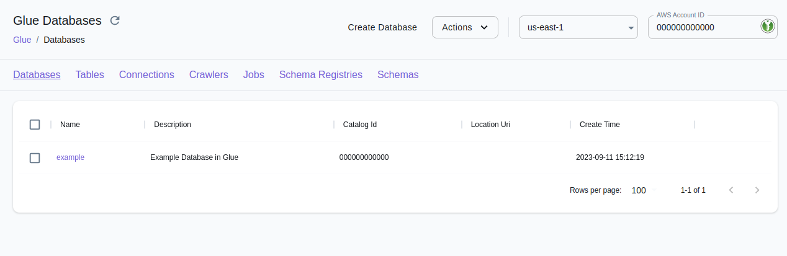

## Introduction

The Glue API in LocalStack Pro allows you to run ETL (Extract-Transform-Load) jobs locally, maintaining table metadata in the local Glue data catalog, and using the Spark ecosystem (PySpark/Scala) to run data processing workflows.

LocalStack allows  you to use the Glue APIs in your local environment.
The supported APIs are available on our [API coverage page](/references/coverage/coverage_glue/), which provides information on the extent of Glue's integration with LocalStack.

## Getting started

This guide is designed for users new to Glue and assumes basic knowledge of the AWS CLI and our [`awslocal`](https://github.com/localstack/awscli-local) wrapper script.

Start your LocalStack container using your preferred method.
We will demonstrate how to create databases and table metadata in Glue, run Glue ETL jobs, import databases from Athena, and run Glue Crawlers with the AWS CLI.


In order to run Glue jobs, some additional dependencies have to be fetched from the network, including a Docker image of apprx. 1.5GB which includes Spark, Presto, Hive and other tools.
These dependencies are automatically fetched when you start up the service, so please make sure you're on a decent internet connection when pulling the dependencies for the first time.


### Creating Databases and Table Metadata

The commands below illustrate the creation of some very basic entries (databases, tables) in the Glue data catalog:

$ awslocal glue create-database --database-input '{"Name":"db1"}'
$ awslocal glue create-table --database db1 --table-input '{"Name":"table1"}'
$ awslocal glue get-tables --database db1


You should see the following output:
```json
{
    "TableList": [
        {
            "Name": "table1",
            "DatabaseName": "db1"
        }
    ]
}
```

### Running Scripts with Scala and PySpark


Create a new PySpark script named `job.py` with the following code:

```python
from pyspark.sql import SparkSession

def init_spark():
   spark = SparkSession.builder.appName("HelloWorld").getOrCreate()
   sc = spark.sparkContext
   return spark,sc

def main():
   spark,sc = init_spark()
   nums = sc.parallelize([1,2,3,4])
   print(nums.map(lambda x: x*x).collect())


if __name__ == '__main__':
   main()
```

You can now copy the script to an S3 bucket:

$ awslocal s3 mb s3://glue-test
$ awslocal s3 cp job.py s3://glue-test/job.py


Next, you can create a job definition:


$ awslocal glue create-job --name job1 --role arn:aws:iam::000000000000:role/glue-role \
  --command '{"Name": "pythonshell", "ScriptLocation": "s3://glue-test/job.py"}'


You can finally start the job execution:


$ awslocal glue start-job-run --job-name job1

The returned `JobRunId` can be used to query the status job the job execution, until it becomes `SUCCEEDED`:

$ awslocal glue get-job-run --job-name job1 --run-id <JobRunId>


You should see the following output:
```json
{
    "JobRun": {
        "Id": "733b76d0",
        "Attempt": 1,
        "JobRunState": "SUCCEEDED"
    }
}
```

For a more detailed example illustrating how to run a local Glue PySpark job, please refer to this [sample repository](https://github.com/localstack/localstack-pro-samples/tree/master/glue-etl-jobs).

### Importing Athena Tables into Glue Data Catalog

The Glue data catalog is integrated with Athena, and the database/table definitions can be imported via the `import-catalog-to-glue` API.

Assume you are running the following Athena queries to create databases and table definitions:
```sql
CREATE DATABASE db2
CREATE EXTERNAL TABLE db2.table1 (a1 Date, a2 STRING, a3 INT) LOCATION 's3://test/table1'
CREATE EXTERNAL TABLE db2.table2 (a1 Date, a2 STRING, a3 INT) LOCATION 's3://test/table2'
```

Then this command will import these DB/table definitions into the Glue data catalog:

$ awslocal glue import-catalog-to-glue


Afterwards, the databases and tables will be available in Glue.
You can query the databases with the `get-databases` operation:


$ awslocal glue get-databases


You should see the following output:
```json
{
    "DatabaseList": [
        ...
        {
            "Name": "db2",
            "Description": "Database db2 imported from Athena",
            "TargetDatabase": {
                "CatalogId": "000000000000",
                "DatabaseName": "db2"
            }
        }
    ]
}
```

And you can query the databases with the `get-databases` operation:

$ awslocal glue get-tables --database-name db2

You should see the following output:
```json
{
    "TableList": [
        {
            "Name": "table1",
            "DatabaseName": "db2",
            "Description": "Table db2.table1 imported from Athena",
            "CreateTime": ...
        },
        {
            "Name": "table2",
            "DatabaseName": "db2",
            "Description": "Table db2.table2 imported from Athena",
            "CreateTime": ...
        }
    ]
}
```

### Crawlers

Glue crawlers allow extracting metadata from structured data sources.

LocalStack Glue currently supports S3 targets (configurable via `S3Targets`), as well as JDBC targets (configurable via `JdbcTargets`).
Support for other target types is in our pipeline and will be added soon.

#### S3 Crawler Example

The example below illustrates crawling tables and partition metadata from S3 buckets.

You can first create an S3 bucket with a couple of items:


$ awslocal s3 mb s3://test
$ printf "1, 2, 3, 4\n5, 6, 7, 8" > /tmp/file.csv
$ awslocal s3 cp /tmp/file.csv s3://test/table1/year=2021/month=Jan/day=1/file.csv
$ awslocal s3 cp /tmp/file.csv s3://test/table1/year=2021/month=Jan/day=2/file.csv
$ awslocal s3 cp /tmp/file.csv s3://test/table1/year=2021/month=Feb/day=1/file.csv
$ awslocal s3 cp /tmp/file.csv s3://test/table1/year=2021/month=Feb/day=2/file.csv


You can then create and trigger the crawler:


$ awslocal glue create-database --database-input '{"Name":"db1"}'
$ awslocal glue create-crawler --name c1 --database-name db1 --role arn:aws:iam::000000000000:role/glue-role --targets '{"S3Targets": [{"Path": "s3://test/table1"}]}'
$ awslocal glue start-crawler --name c1


Finally, you can query the table metadata that has been created by the crawler:


$ awslocal glue get-tables --database-name db1

You should see the following output:
```json
{
    "TableList": [{
        "Name": "table1",
        "DatabaseName": "db1",
        "PartitionKeys": [ ... ]
...
```

You can also query the created table partitions:

$ awslocal glue get-partitions --database-name db1 --table-name table1

You should see the following output:
```json
{
    "Partitions": [{
        "Values": ["2021", "Jan", "1"],
        "DatabaseName": "db1",
        "TableName": "table1",
...
```

#### JDBC Crawler Example

When using JDBC crawlers, you can point your crawler towards a Redshift database created in LocalStack.

Below is a rough outline of the steps required to get the integration for the JDBC crawler working.
You can first create the local Redshift cluster via:

$ awslocal redshift create-cluster --cluster-identifier c1 --node-type dc1.large --master-username test --master-user-password test --db-name db1

The output of this command contains the endpoint address of the created Redshift database:
```json
...
    "Endpoint": {
        "Address": "localhost.localstack.cloud",
        "Port": 4510
    },
...
```

Then you can use any JDBC or Postgres client to create a table `mytable1` in the Redshift database, and fill the table with some data.

Next, you're creating the Glue database, the JDBC connection, as well as the crawler:


$ awslocal glue create-database --database-input '{"Name":"gluedb1"}'
$ awslocal glue create-connection --connection-input \
    {"Name":"conn1","ConnectionType":"JDBC","ConnectionProperties":{"USERNAME":"test","PASSWORD":"test","JDBC_CONNECTION_URL":"jdbc:redshift://localhost.localstack.cloud:4510/db1"}}'
$ awslocal glue create-crawler --name c1 --database-name gluedb1 --role arn:aws:iam::000000000000:role/glue-role --targets '{"JdbcTargets":[{"ConnectionName":"conn1","Path":"db1/%/mytable1"}]}'
$ awslocal glue start-crawler --name c1


Once the crawler has started, you have to wait until the `State` turns to `READY` when querying the current state:

$ awslocal glue get-crawler --name c1


Once the crawler has finished running and is back in `READY` state, the Glue table within the `gluedb1` DB should have been populated and can be queried via the API.

### Schema Registry

The Glue Schema Registry allows you to centrally discover, control, and evolve data stream schemas.
With the Schema Registry, you can manage and enforce schemas and schema compatibilities in your streaming applications.
It integrates nicely with [Managed Streaming for Kafka (MSK)](../managed-streaming-for-kafka).


Currently, LocalStack supports the AVRO dataformat for the Glue Schema Registry.
Support for other dataformats will be added in the future.


You can create a schema registry with the following command:

$ awslocal glue create-registry --registry-name demo-registry


You can create a schema in the newly created registry with the `create-schema` command:

$ awslocal glue create-schema --schema-name demo-schema --registry-id RegistryName=demo-registry --data-format AVRO --compatibility FORWARD \
  --schema-definition '{"type":"record","namespace":"Demo","name":"Person","fields":[{"name":"Name","type":"string"}]}'

You should see the following output:
```json
{
    "RegistryName": "demo-registry",
    "RegistryArn": "arn:aws:glue:us-east-1:000000000000:file-registry/demo-registry",
    "SchemaName": "demo-schema",
    "SchemaArn": "arn:aws:glue:us-east-1:000000000000:schema/demo-registry/demo-schema",
    "DataFormat": "AVRO",
    "Compatibility": "FORWARD",
    "SchemaCheckpoint": 1,
    "LatestSchemaVersion": 1,
    "NextSchemaVersion": 2,
    "SchemaStatus": "AVAILABLE",
    "SchemaVersionId": "546d3220-6ab8-452c-bb28-0f1f075f90dd",
    "SchemaVersionStatus": "AVAILABLE"
}
```

Once the schema has been created, you can create a new version:

$ awslocal glue register-schema-version --schema-id SchemaName=demo-schema,RegistryName=demo-registry \
  --schema-definition '{"type":"record","namespace":"Demo","name":"Person","fields":[{"name":"Name","type":"string"}, {"name":"Address","type":"string"}]}'


You should see the following output:
```json
{
    "SchemaVersionId": "ee38732b-b299-430d-a88b-4c429d9e1208",
    "VersionNumber": 2,
    "Status": "AVAILABLE"
}
```

You can find a more advanced sample in our [localstack-pro-samples repository on GitHub](https://github.com/localstack/localstack-pro-samples/tree/master/glue-msk-schema-registry), which showcases the integration with AWS MSK and automatic schema registrations (including schema rejections based on the compatibilities).

### Delta Lake Tables

LocalStack Glue supports [Delta Lake](https://delta.io), an open-source storage framework that extends Parquet data files with a file-based transaction log for ACID transactions and scalable metadata handling.


Please note that Delta Lake tables are only [supported for Glue versions `3.0` and `4.0`](https://docs.aws.amazon.com/glue/latest/dg/aws-glue-programming-etl-format-delta-lake.html).


To illustrate this feature, we take a closer look at a Glue sample job that creates a Delta Lake table, puts some data into it, and then queries data from the table.

First, we define the PySpark job in a file named `job.py` (see below).
The job first creates a database `db1` and table `table1`, then inserts data into the table via both a dataframe and an `INSERT INTO` query, and finally fetches the inserted rows via a `SELECT` query:

```python
from awsglue.context import GlueContext
from pyspark import SparkContext, SparkConf

conf = SparkConf()
conf.set("spark.sql.extensions", "io.delta.sql.DeltaSparkSessionExtension")
conf.set("spark.sql.catalog.spark_catalog", "org.apache.spark.sql.delta.catalog.DeltaCatalog")
glue_context = GlueContext(SparkContext.getOrCreate(conf=conf))
spark = glue_context.spark_session

# create database and table
spark.sql("CREATE DATABASE db1")
spark.sql("CREATE TABLE db1.table1 (name string, key long) USING delta PARTITIONED BY (key) LOCATION 's3a://test/data/'")

# create dataframe and write to table in S3
df = spark.createDataFrame([("test1", 123)], ["name", "key"])
df.write.format("delta").options(path="s3a://test/data/") \
    .mode("append").partitionBy("key").saveAsTable("db1.table1")

# insert data via 'INSERT' query
spark.sql("INSERT INTO db1.table1 (name, key) VALUES ('test2', 456)")

# get and print results, to run assertions further below
result = spark.sql("SELECT * FROM db1.table1")
print("SQL result:", result.toJSON().collect())
```

You can now run the following commands to create and start the Glue job:


$ awslocal s3 mb s3://test
$ awslocal s3 cp job.py s3://test/job.py
$ awslocal glue create-job --name job1 --role arn:aws:iam::000000000000:role/test \
  --glue-version 4.0 --command '{"Name": "pythonshell", "ScriptLocation": "s3://test/job.py"}'
$ awslocal glue start-job-run --job-name job1
<disable-copy>
{
    "JobRunId": "c9471f40"
}
</disable-copy>


The execution of the Glue job can take a few moments - once the job has finished executing, you should see a log line with the query results in the LocalStack container logs, similar to the output below:
```text
2023-10-17 12:59:20,088 INFO scheduler.DAGScheduler: Job 15 finished: collect at /private/tmp/script-90e5371e.py:28, took 0,158257 s
SQL result: ['{"name":"test1","key":123}', '{"name":"test2","key":456}']
```

In order to see the logs above, make sure to enable `DEBUG=1` in the LocalStack container environment.
Alternatively, you can also retrieve the job logs programmatically via the CloudWatch Logs API - for example, using the job run ID `c9471f40` from above:

$ awslocal logs get-log-events --log-group-name /aws-glue/jobs/logs-v2 --log-stream-name c9471f40
<disable-copy>
{ "events": [ ... ] }
</disable-copy>


## Resource Browser

The LocalStack Web Application provides a Resource Browser for Glue.
You can access the Resource Browser by opening the LocalStack Web Application in your browser, navigating to the **Resources** section, and then clicking on **Glue** under the **Analytics** section.



The Resource Browser allows you to perform the following actions:

- **Manage Databases**: Create, view, and delete databases in your Glue catalog **Databases** tab.
- **Manage Tables**: Create, view, edit, and delete tables in a database in your Glue catalog clicking on the **Tables** tab.
- **Manage Connections**: Create, view, and delete Connections in your Glue catalog by clicking on the **Connections** tab.
- **Manage Crawlers**: Create, view, and delete Crawlers in your Glue catalog by clicking on the **Crawlers** tab.
- **Manage Jobs**: Create, view, and delete Jobs in your Glue catalog by clicking on the **Jobs** tab.
- **Manage Schema Registries**: Create, view, and delete Schema Registries in your Glue catalog by clicking on the **Schema Registries** tab.
- **Manage Schemas**: Create, view, and delete Schemas in your Glue catalog by clicking on the **Schemas** tab.

## Examples

The following Developer Hub applications are using Glue:



The following tutorials are using Glue:


The following code snippets and sample applications provide practical examples of how to use Glue in LocalStack for various use cases:

- [localstack-pro-samples/glue-etl-jobs](https://github.com/localstack/localstack-pro-samples/tree/master/glue-etl-jobs)
  - Simple demo application illustrating the use of the Glue API to run local ETL jobs using LocalStack.
- [localstack-pro-samples/glue-redshift-crawler](https://github.com/localstack/localstack-pro-samples/tree/master/glue-redshift-crawler)
  - Simple demo application illustrating the use of AWS Glue Crawler to populate the Glue metastore from a Redshift database.

## Further Reading

The AWS Glue API is a fairly comprehensive service - more details can be found in the official [AWS Glue Developer Guide](https://docs.aws.amazon.com/glue/latest/dg/what-is-glue.html).

## Current Limitations

Support for triggers is currently limited - the basic API endpoints are implemented, but triggers are currently still under development (more details coming soon).
