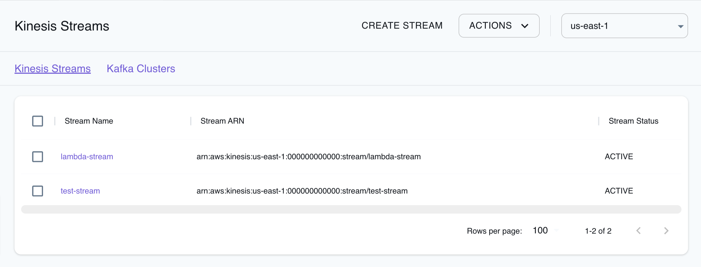

## Introduction

Kinesis is a platform provided by Amazon Web Services (AWS) that enables your application to ingest, buffer, and process data in real-time. Kinesis is suitable for applications that require processing and deriving insights from data streams such as logs, metrics, user interactions, and IoT sensor readings. Kinesis offers three main services: Kinesis Data Streams, Kinesis Data Firehose, and Kinesis Data Analytics. In this page, we take a look at Kinesis Data Streams which allows you to capture and store real-time data streams.

LocalStack allows you to use the Kinesis APIs in your local environment from setting up data streams and configuring data processing to building real-time analytics applications. The supported APIs are available on our [API coverage page](https://docs.localstack.cloud/references/coverage/coverage_kinesis/), which provides information on the extent of Kinesis's integration with LocalStack.

## Getting started

This guide is designed for users new to Kinesis and assumes basic knowledge of the AWS CLI and our [`awslocal`](https://github.com/localstack/awscli-local) wrapper script.

Start your LocalStack container using your preferred method. We will demonstrate how to create a Lambda function to consume events from a Kinesis stream with the AWS CLI.

### Create a Lambda function

You need to create a Lambda function that receives a Kinesis event input and processes the messages that it contains. Create a file named `index.mjs` with the following content:

```javascript
console.log('Loading function');

export const handler = (event, context) => {
    event.Records.forEach(record => {
        let payload = Buffer.from(record.kinesis.data, 'base64').toString('ascii');
        console.log('Decoded payload:', payload);
    });
};
```

You can create a Lambda function using the [`CreateFunction`](https://docs.aws.amazon.com/lambda/latest/dg/API_CreateFunction.html) API. Run the following command to create a Lambda function named `ProcessKinesisRecords`:


$ zip function.zip index.mjs
$ awslocal lambda create-function \
    --function-name ProcessKinesisRecords \
    --zip-file fileb://function.zip \
    --handler index.handler \
    --runtime nodejs18.x \
    --role arn:aws:iam::000000000000:role/lambda-kinesis-role


The following output would be retrieved:

```bash
{
    "FunctionName": "ProcessKinesisRecords",
    "FunctionArn": "arn:aws:lambda:us-east-1:000000000000:function:ProcessKinesisRecords",
    "Runtime": "nodejs18.x",
    "Role": "arn:aws:iam::000000000000:role/lambda-kinesis-role",
    "Handler": "index.handler",
    ...
}
```

### Invoke the Lambda function

Create a file named `input.txt` with the following JSON content:

```text
{
    "Records": [
        {
            "kinesis": {
                "kinesisSchemaVersion": "1.0",
                "partitionKey": "1",
                "sequenceNumber": "49590338271490256608559692538361571095921575989136588898",
                "data": "SGVsbG8sIHRoaXMgaXMgYSB0ZXN0Lg==",
                "approximateArrivalTimestamp": 1545084650.987
            },
            "eventSource": "aws:kinesis",
            "eventVersion": "1.0",
            "eventID": "shardId-000000000006:49590338271490256608559692538361571095921575989136588898",
            "eventName": "aws:kinesis:record",
            "invokeIdentityArn": "arn:aws:iam::000000000000:role/lambda-kinesis-role",
            "awsRegion": "us-east-1",
            "eventSourceARN": "arn:aws:kinesis:us-east-1:000000000000:stream/lambda-stream"
        }
    ]
}
```

The JSON contains a sample Kinesis event. You can use the [`Invoke`](https://docs.aws.amazon.com/lambda/latest/dg/API_Invoke.html) API to invoke the Lambda function with the Kinesis event as input. Execute the following command:


$ awslocal lambda invoke \
    --function-name ProcessKinesisRecords \
    --payload file://input.txt outputfile.txt


### Create a Kinesis Stream

You can create a Kinesis Stream using the [`CreateStream`](https://docs.aws.amazon.com/kinesis/latest/APIReference/API_CreateStream.html) API. Run the following command to create a Kinesis Stream named `lambda-stream`:


$ awslocal kinesis create-stream \
  --stream-name lambda-stream \
  --shard-count 1


You can retrieve the Stream ARN using the [`DescribeStream`](https://docs.aws.amazon.com/kinesis/latest/APIReference/API_DescribeStream.html) API. Execute the following command:


$ awslocal kinesis describe-stream \
  --stream-name lambda-stream


The following output would be retrieved:

```json
{
    "StreamDescription": {
        "Shards": [
            {
                "ShardId": "shardId-000000000000",
                "HashKeyRange": {
                    "StartingHashKey": "0",
                    "EndingHashKey": "340282366920938463463374607431768211455"
                ...
            }
        ],
        "StreamARN": "arn:aws:kinesis:us-east-1:000000000000:stream/lambda-stream",
        "StreamName": "lambda-stream",
        "StreamStatus": "ACTIVE",
        ...
}
```

You can save the `StreamARN` value for later use.

### Add an Event Source in Lambda

You can add an Event Source to your Lambda function using the [`CreateEventSourceMapping`](https://docs.aws.amazon.com/lambda/latest/dg/API_CreateEventSourceMapping.html) API. Run the following command to add the Kinesis Stream as an Event Source to your Lambda function:


$ awslocal lambda create-event-source-mapping \
    --function-name ProcessKinesisRecords \
    --event-source arn:aws:kinesis:us-east-1:000000000000:stream/lambda-stream \
    --batch-size 100 \
    --starting-position LATEST


### Test the Event Source mapping

You can test the event source mapping by adding a record to the Kinesis Stream using the [`PutRecord`](https://docs.aws.amazon.com/kinesis/latest/APIReference/API_PutRecord.html) API. Run the following command to add a record to the Kinesis Stream:


$ awslocal kinesis put-record \
    --stream-name lambda-stream \
    --partition-key 1 \
    --data "Hello, this is a test."


You can fetch the CloudWatch logs for your Lambda function reading records from the stream, using AWS CLI or LocalStack Resource Browser.

## Configuration

| Variable | Description |
| -------- | ----------- |
| `KINESIS_ERROR_PROBABILITY` | Decimal value between `0.0` (default) and `1.0`. This environment variable enables you to inject `ProvisionedThroughputException` at random intervals in your application. While this won't provide insight into your application's overall throughput handling, it aids in testing your application's exception-handling capabilities. |
| `KINESIS_SHARD_LIMIT` | Integer value (default: `100`) or `Infinity` (to disable). Use this variable to assess whether your application conforms to the assigned shard limit. Disabling this behavior requires explicitly setting `KINESIS_SHARD_LIMIT=Infinity`. |
| `KINESIS_LATENCY` | Integer value in milliseconds (default: `500`) or `0` (to disable). Particularly useful for testing latency-sensitive applications. Since local Kinesis service lacks latency simulation, you can introduce artificial latency into your AWS calls using this variable. To disable this behavior, set `KINESIS_LATENCY=0`. |
| `KINESIS_INITIALIZE_STREAMS` | **Deprecated.** Comma-delimited string with stream names, corresponding shard counts, and an optional region for initialization during startup. If no region is provided, the default region is used. For example, `KINESIS_INITIALIZE_STREAMS=my-first-stream:1,my-other-stream:2:us-west-2,my-last-stream:1`. In multi-account setups, the specified streams will be created for all accounts. |

## Resource Browser

The LocalStack Web Application provides a Resource Browser for managing Kinesis Streams & Kafka Clusters. You can access the Resource Browser by opening the LocalStack Web Application in your browser, navigating to the **Resources** section, and then clicking on **Kinesis** under the **Analytics** section.


<br>
<br>

The Resource Browser allows you to perform the following actions:

- **Create Stream**: Create a Kinesis Stream by specifying the **Stream Name**, **Shard Count**, and **Stream Mode**.
- **Create Cluster**: Create a Kafka Cluster by specifying the **Cluster Name**, **Kafka Version**, **Number Of Broker Nodes**, **Instance Type**, and more.
- **View Streams & Clusters**: Click on any of the listed resources to view its details by clicking on the desired Stream & Cluster.
- **Edit Streams & Clusters**: Click on any listed resources to edit its details by clicking on the desired Stream & Cluster.
- **Delete Streams & Clusters**: Select any listed resources to delete them by clicking the **Actions** button and selecting **Remove Selected**.

## Examples

The following code snippets and sample applications provide practical examples of how to use Kinesis in LocalStack for various use cases:

- [Search application with Lambda, Kinesis, Firehose, ElasticSearch, S3](https://github.com/localstack/sample-fuzzy-movie-search-lambda-kinesis-elasticsearch)
- [Streaming Data Pipeline with Kinesis, Tinybird, CloudWatch, Lambda](https://github.com/localstack/serverless-streaming-data-pipeline)

## Current Limitations

In multi-account setups, each AWS account launches a separate instance of Kinesis Mock, which is very resource intensive when a large number of AWS accounts are used. An [open Kinesis Mock issue](https://github.com/etspaceman/kinesis-mock/issues/377) is being used to keep track of this feature.
