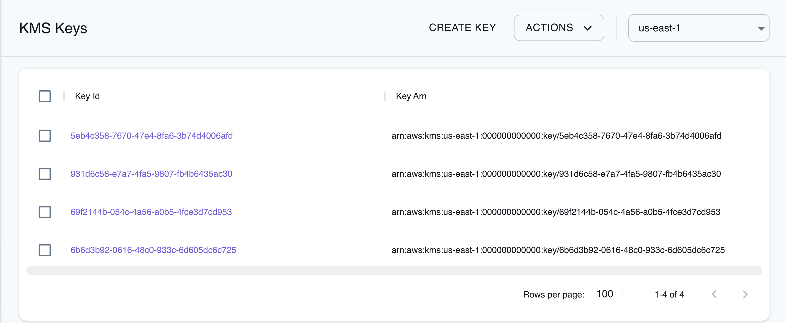

## Introduction

Key Management Service (KMS) is a managed service that allows users to handle encryption keys within the Amazon Web Services ecosystem. KMS allows users to create, control, and utilize keys to encrypt and decrypt data, as well as to sign and verify messages. KMS allows you to create, delete, list, and update aliases, friendly names for your KMS keys, and tag them for identification and automation. You can check [the official AWS documentation](https://docs.aws.amazon.com/kms/latest/developerguide/concepts.html) to understand the basic terms and concepts used in the KMS.

LocalStack allows you to use the KMS APIs in your local environment to create, edit, and view symmetric and asymmetric KMS keys, including HMAC keys. The supported APIs are available on our [API coverage page](https://docs.localstack.cloud/references/coverage/coverage_kms/), which provides information on the extent of KMS's integration with LocalStack.

## Getting started

This guide is designed for users new to KMS and assumes basic knowledge of the AWS CLI and our [`awslocal`](https://github.com/localstack/awscli-local) wrapper script.

Start your LocalStack container using your preferred method. We will demonstrate how to create a simple symmetric encryption key and use it to encrypt/decrypt data.

### Create a key

To generate a new key within the KMS, you can use the [`CreateKey`](https://docs.aws.amazon.com/kms/latest/APIReference/API_CreateKey.html) API. Execute the following command to create a new key:


$ awslocal kms create-key


By default, this command generates a symmetric encryption key, eliminating the need for any additional arguments. You can take a look at the `KeyId` of the freshly generated key in the output, and save it for future use.

In case the key ID is misplaced, it is possible to retrieve a comprehensive list of IDs and [Amazon Resource Names](https://docs.aws.amazon.com/general/latest/gr/aws-arns-and-namespaces.html) (ARNs) for all available keys through the following command:


$ awslocal kms list-keys


Additionally, if needed, you can obtain extensive details about a specific key by providing its key ID or ARN using the subsequent command:


$ awslocal kms describe-key --key-id <KEY_ID>


### Encrypt the data

You can now leverage the generated key for encryption purposes. For instance, let's consider encrypting "_some important stuff_". To do so, you can use the [`Encrypt`](https://docs.aws.amazon.com/kms/latest/APIReference/API_Encrypt.html) API. Execute the following command to encrypt the data:


$ awslocal kms encrypt \
      --key-id 010a4301-4205-4df8-ae52-4c2895d47326 \
      --plaintext "some important stuff" \
      --output text \
      --query CiphertextBlob \
  | base64 --decode > my_encrypted_data


You will notice that a new file named `my_encrypted_data` has been created in your current directory. This file contains the encrypted data, which can be decrypted using the same key.

### Decrypt the data

To decrypt the data, you can use the [`Decrypt`](https://docs.aws.amazon.com/kms/latest/APIReference/API_Decrypt.html) API. You don't need to specify the `KEY_ID` while decrypting the file, since AWS includes the Key ID into the encrypted data. However, with asymmetric keys the `KEY_ID` has to be specified.

Execute the following command to decrypt the data:


$ awslocal kms decrypt \
      --ciphertext-blob fileb://my_encrypted_data \
      --output text \
      --query Plaintext \
  | base64 --decode


Similar to the previous `Encrypt` operation, to retrieve the actual data, it's necessary to decode the Base64-encoded output. To achieve this, employ the `output` and `query` parameters along with the `base64` tool as before. Upon successful execution, the output will correspond to our original text:

```sh
some important stuff
```

## Resource Browser

The LocalStack Web Application provides a Resource Browser for managing KMS keys. You can access the Resource Browser by opening the LocalStack Web Application in your browser, navigating to the **Resources** section, and then clicking on **KMS** under the **Security Identity Compliance** section.


<br>
<br>
The Resource Browser allows you to perform the following actions:

- **Create Key**: Create a new KMS key by specifying the **Policy**, **Key Usage**, **Tags**, **Multi Region**, **Customer Master Key Spec**, and more.
- **Edit Key**: Edit an existing KMS key by specifying the **Description**, after clicking the key in the list and clicking **EDIT KEY**.
- **View Key**: View the details of an existing KMS key by clicking the key in the list.
- **Enable & Disable Key**: Select any listed keys to enable or disable them by clicking the **Actions** button and select **Enable Selected** or **Disable Selected**.
- **Delete Key**: Select any listed keys to delete them by clicking the **Actions** button and selecting **Schedule Deletion**.

## Custom IDs for KMS keys via tags

You can assign custom IDs to KMS keys using the `_custom_id_` tag during key creation. This can be useful to pre-seed a test environment and use a static `KeyId` for your keys.

Below is a simple example to create a key with a custom `KeyId` (note that the `KeyId` should have the format of a UUID):


$ awslocal kms create-key --tags '[{"TagKey":"_custom_id_","TagValue":"00000000-0000-0000-0000-000000000001"}]'


The following output will be displayed:

```json
{
    "KeyMetadata": {
        "AWSAccountId": "000000000000",
        "KeyId": "00000000-0000-0000-0000-000000000001",
    ....
}
```

## Custom Key Material for KMS Keys via Tags

You can seed a KMS key with custom key material using the `_custom_key_material_` tag during creation. 
This can be useful to pre-seed a development environment so values encrypted with KMS can be decrypted later.

Here is an example of using custom key material with the value being base64 encoded:


$ echo 'c3VwZXIgc2VjcmV0IGtleQo=' | base64 -d
<disable-copy>
super secret key
</disable-copy>
$ awslocal kms create-key --tags '[{"TagKey":"_custom_key_material_","TagValue":"c3VwZXIgc2VjcmV0IGtleQo="}]'
<disable-copy>
{
    "KeyMetadata": {
        "AWSAccountId": "000000000000",
        "KeyId": "00000000-0000-0000-0000-000000000001",
    ....
}
</disable-copy>


## Current Limitations

### Encryption data format

In LocalStack's KMS implementation, the encryption process is uniformly symmetric, even when an asymmetric key is requested. Furthermore, LocalStack utilizes an encrypted data format distinct from that employed by AWS.

This could lead to decryption failures if a key is manually generated outside the local KMS environment, imported to KMS using the [ImportKeyMaterial](https://docs.aws.amazon.com/kms/latest/APIReference/API_ImportKeyMaterial.html) API, utilized for encryption within local KMS, and later decryption is attempted externally using the self-generated key. However, conventional setups are likely to function seamlessly.

### Key states

In AWS KMS, cryptographic keys exhibit [multiple states](https://docs.aws.amazon.com/kms/latest/developerguide/key-state.html). However, LocalStack's KMS implementation provides only a subset of these states

- `Enabled`
- `Disabled`
- `Creating`
- `PendingImport`
- `PendingDeletion`

### Multi-region keys 

LocalStack's KMS implementation is equipped to facilitate [multi-region keys](https://docs.aws.amazon.com/kms/latest/developerguide/multi-region-keys-overview.html), but there's a distinct behavior compared to AWS KMS. Unlike AWS KMS, the replication of multi-region key replicas in LocalStack KMS isn't automatically synchronized with their corresponding primary key. Consequently, adjustments made to the primary key's settings won't propagate automatically to the replica.

### Key aliases 

While AWS KMS conveniently establishes [aliases](https://docs.aws.amazon.com/kms/latest/developerguide/kms-alias.html), LocalStack follows suit by supporting these pre-configured aliases. However, it's important to note that in LocalStack, these aliases come into picture after the initial access attempt. Until that point, they are not visible.

### Key specs 

In AWS KMS, [SM2](https://docs.aws.amazon.com/kms/latest/developerguide/asymmetric-key-specs.html#key-spec-sm:~:text=the%20message%20digest.-,SM2%20key%20spec%20(China%20Regions%20only),-The%20SM2%20key) is a supported key spec for asymmetric keys. However, LocalStack's KMS implementation doesn't support this key spec.
