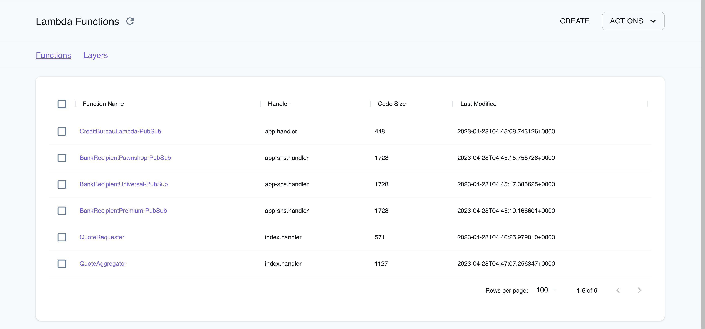

## Introduction

AWS Lambda is a Serverless Function as a Service (FaaS) platform that lets you run code in your preferred programming language on the AWS ecosystem. AWS Lambda automatically scales your code to meet demand and handles server provisioning, management, and maintenance. AWS Lambda allows you to break down your application into smaller, independent functions that integrate seamlessly with AWS services.

LocalStack allows you to use the Lambda APIs to create, deploy, and test your Lambda functions. The supported APIs are available on our [Lambda coverage page](https://docs.localstack.cloud/references/coverage/coverage_lambda/), which provides information on the extent of Lambda's integration with LocalStack.

## Getting started

This guide is designed for users new to Lambda and assumes basic knowledge of the AWS CLI and our [`awslocal`](https://github.com/localstack/awscli-local) wrapper script.

Start your LocalStack container using your preferred method. We will demonstrate how to create a Lambda function with a Function URL. With the Function URL property, you can call a Lambda Function via an HTTP API call.

### Create a Lambda function

To create a new Lambda function, create a new file called `index.js` with the following code:

```javascript
exports.handler = async (event) => {
    let body = JSON.parse(event.body)
    const product = body.num1 * body.num2;
    const response = {
        statusCode: 200,
        body: "The product of " + body.num1 + " and " + body.num2 + " is " + product,
    };
    return response;
};
```

Enter the following command to create a new Lambda function:


$ zip function.zip index.js
$ awslocal lambda create-function \
    --function-name localstack-lambda-url-example \
    --runtime nodejs18.x \
    --zip-file fileb://function.zip \
    --handler index.handler \
    --role arn:aws:iam::000000000000:role/lambda-role



In the old Lambda provider, you could create a function with any arbitrary string as the role, such as `r1`. However, the new provider requires the role ARN to be in the format `arn:aws:iam::000000000000:role/lambda-role` and validates it using an appropriate regex. However, it currently does not check whether the role exists.


### Invoke the Function

To invoke the Lambda function, you can use the [`Invoke` API](https://docs.aws.amazon.com/lambda/latest/dg/API_Invoke.html). Run the following command to invoke the function:


  {}
  
  $ awslocal lambda invoke --function-name localstack-lambda-url-example \
    --payload '{"body": "{\"num1\": \"10\", \"num2\": \"10\"}" }' output.txt
  
  {}
  {}
  
  $ awslocal lambda invoke --function-name localstack-lambda-url-example \
    --cli-binary-format raw-in-base64-out \
    --payload '{"body": "{\"num1\": \"10\", \"num2\": \"10\"}" }' output.txt
  
  {}


### Create a Function URL


[Response streaming](https://docs.aws.amazon.com/lambda/latest/dg/configuration-response-streaming.html) is currently not supported, so it will still return a synchronous/full response instead.


With the Function URL property, there is now a new way to call a Lambda Function via HTTP API call using the [`CreateFunctionURLConfig` API](https://docs.aws.amazon.com/lambda/latest/dg/API_CreateFunctionUrlConfig.html). To create a URL for invoking the function, run the following command:


$ awslocal lambda create-function-url-config \
    --function-name localstack-lambda-url-example \
    --auth-type NONE


This will generate a HTTP URL that can be used to invoke the Lambda function. The URL will be in the format `http://<XXXXXXXX>.lambda-url.us-east-1.localhost.localstack.cloud:4566`.

### Trigger the Lambda function URL

You can now trigger the Lambda function by sending a HTTP POST request to the URL using `cURL` or your REST HTTP client:


$ curl -X POST \
    'http://<XXXXXXXX>.lambda-url.us-east-1.localhost.localstack.cloud:4566/' \
    -H 'Content-Type: application/json' \
    -d '{"num1": "10", "num2": "10"}'


The following output would be retrieved:

```sh
The product of 10 and 10 is 100% 
```

## Lambda Event Source Mappings


LocalStack now supports a new event rule engine for [Lambda event filtering](https://docs.aws.amazon.com/lambda/latest/dg/invocation-eventfiltering.html).
You can [configure]() `EVENT_RULE_ENGINE=java` (preview) to use the AWS [event-ruler](https://github.com/aws/event-ruler), which offers better parity.


[Lambda event source mappings](https://docs.aws.amazon.com/lambda/latest/dg/invocation-eventsourcemapping.html) allows you to connect Lambda functions to other AWS services. The following event sources are supported in LocalStack:

-   [DynamoDB](https://docs.aws.amazon.com/lambda/latest/dg/with-ddb.html)
-   [Kinesis](https://docs.aws.amazon.com/lambda/latest/dg/with-kinesis.html)
-   [Managed Streaming for Apache Kafka (MSK)](https://docs.aws.amazon.com/lambda/latest/dg/with-msk.html)
-   [Simple Queue Service (SQS)](https://docs.aws.amazon.com/lambda/latest/dg/with-sqs.html)

## Lambda Layers (Pro)

[Lambda layers](https://docs.aws.amazon.com/lambda/latest/dg/configuration-layers.html) let you include additional code and dependencies in your Lambda functions. The LocalStack Pro image allows you to deploy Lambda Layers locally to streamline your development and testing process. The Community image also allows creating, updating, and deleting Lambda Layers, but they are not applied when invoking a Lambda function.

### Creating and using a Lambda Layer Locally

To create a Lambda Layer locally, you can use the [`PublishLayerVersion` API](https://docs.aws.amazon.com/lambda/latest/dg/API_PublishLayerVersion.html) in LocalStack. Here's a simple example using Python:


$ mkdir -p /tmp/python/
$ echo 'def util():' > /tmp/python/testlayer.py
$ echo '  print("Output from Lambda layer util function")' >> /tmp/python/testlayer.py
$ (cd /tmp; zip -r testlayer.zip python)
$ LAYER_ARN=$(awslocal lambda publish-layer-version --layer-name layer1 --zip-file fileb:///tmp/testlayer.zip | jq -r .LayerVersionArn)


Next, define a Lambda function that uses our layer:


$ echo 'def handler(*args, **kwargs):' > /tmp/testlambda.py
$ echo '  import testlayer; testlayer.util()' >> /tmp/testlambda.py
$ echo '  print("Debug output from Lambda function")' >> /tmp/testlambda.py
$ (cd /tmp; zip testlambda.zip testlambda.py)
$ awslocal lambda create-function \
  --function-name func1 \
  --runtime python3.8 \
  --role arn:aws:iam::000000000000:role/lambda-role \
  --handler testlambda.handler \
  --timeout 30 \
  --zip-file fileb:///tmp/testlambda.zip \
  --layers $LAYER_ARN


Here, we've defined a Lambda function called `handler()` that imports the `util()` function from our `layer1` Lambda Layer. We then used the [`CreateFunction` API](https://docs.aws.amazon.com/lambda/latest/dg/API_CreateFunction.html) to create this Lambda function in LocalStack, specifying the `layer1` Lambda Layer as a dependency.

To test our Lambda function and see the output from the Lambda Layer, we can invoke the function and check the logs (with `DEBUG=1` enabled). Here's an example:

```shell
> START RequestId: a8bc4ce6-e2e8-189e-cf58-c2eb72827c23 Version: $LATEST
> Output from Lambda layer util function
> Debug output from Lambda function
> END RequestId: a8bc4ce6-e2e8-189e-cf58-c2eb72827c23
```

### Referencing Lambda layers from AWS

If your Lambda function references a layer in real AWS, you can integrate it into your local dev environment by making it accessible to the `886468871268` AWS account ID. This account is managed by LocalStack on AWS.

To grant access to your layer, run the following command:


$ aws lambda add-layer-version-permission \
  --layer-name test-layer \
  --version-number 1 \
  --statement-id layerAccessFromLocalStack \
  --principal 886468871268 \
  --action lambda:GetLayerVersion


Replace `test-layer` and `1` with the name and version number of your layer, respectively.

After granting access, the next time you reference the layer in one of your local Lambda functions using the AWS Lambda layer ARN, the layer will be automatically pulled down and integrated into your local dev environment.

## Special Tools

LocalStack provides various tools to help you develop, debug, and test your AWS Lambda functions more efficiently.

* **Hot reloading**: With Lambda hot reloading, you can continuously apply code changes to your Lambda functions without needing to redeploy them manually. To learn more about how to use hot reloading with LocalStack, check out our [hot reloading documentation]().
* **Remote debugging**: LocalStack's remote debugging functionality allows you to attach a debugger to your Lambda function using your preferred IDE. To get started with remote debugging in LocalStack, see our [debugging documentation]().
* **Lambda VS Code Extension**: LocalStack's Lambda VS Code Extension supports deploying and invoking Python Lambda functions through AWS SAM or AWS CloudFormation. To get started with the Lambda VS Code Extension, see our [Lambda VS Code Extension documentation]().
* **API for querying Lambda runtimes**: LocalStack offers a metadata API to query the list of Lambda runtimes via `GET http://localhost.localstack.cloud:4566/_aws/lambda/runtimes`. It returns the [Supported Runtimes](https://docs.aws.amazon.com/lambda/latest/dg/lambda-runtimes.html) matching AWS parity (i.e., excluding deprecated runtimes) and offers additional filters for `deprecated` runtimes and `all` runtimes (`GET /_aws/lambda/runtimes?filter=all`).

## Resource Browser

The LocalStack Web Application provides a [Resource Browser](https://docs.localstack.cloud/user-guide/web-application/resource-browser/) for managing Lambda resources. You can access the Resource Browser by opening the LocalStack Web Application in your browser, navigating to the **Resources** section, and then clicking on **Lambda** under the **Compute** section.

The Resource Browser displays [Functions](https://app.localstack.cloud/resources/lambda/functions) and [Layers](https://app.localstack.cloud/resources/lambda/layers) resources. You can click on individual resources to view their details.



The Resource Browser allows you to perform the following actions:

- **Create Functions & Layers**: Create a new [Lambda function](https://app.localstack.cloud/resources/lambda/functions/new) or a new [Lambda Layer](https://app.localstack.cloud/resources/lambda/layers/new) by clicking on **Create API** button on top-right and creating a new configuration by clicking on **Submit** button.
- **View Function & Layer Details**: Click on any function or layer to view detailed information such as the resource's name, ARN, runtime, handler, and more. You can also navigate across different versions of the resource.
- **Delete Functions & Layers**: To delete a function or layer, select the resource from the Resource Browser, click on the **Remove Selected** button at the top-right of the screen, and confirm the deletion by clicking on the **Continue** button.

## Migrating to Lambda v2


The legacy Lambda implementation has been removed since LocalStack&nbsp;3.0 (Docker `latest` since 2023-11-09).


As part of the [LocalStack 2.0 release](https://discuss.localstack.cloud/t/new-lambda-implementation-in-localstack-2-0/258), the Lambda provider has been migrated to `v2` (formerly known as `asf`).
With the new implementation, the following changes have been introduced:

- To run Lambda functions in LocalStack, mount the Docker socket into the LocalStack container. Add the following Docker volume mount to your LocalStack startup configuration: `/var/run/docker.sock:/var/run/docker.sock`. You can find an example of this configuration in our official [`docker-compose.yml` file](https://docs.localstack.cloud/getting-started/installation/#starting-localstack-with-docker-compose).
- The `v2` provider discontinues Lambda Executor Modes such as `LAMBDA_EXECUTOR=local`. Previously, this mode was used as a fallback when the Docker socket was unavailable in the LocalStack container, but many users unintentionally used it instead of the configured `LAMBDA_EXECUTOR=docker`. The new provider now behaves similarly to the old `docker-reuse` executor and does not require such configuration.
- The Lambda containers are now reused between invocations. The changes made to the filesystem (such as in `/tmp`) will persist between subsequent invocations if the function is dispatched to the same container. This is known as a **warm start** (see [Operating Lambda](https://aws.amazon.com/blogs/compute/operating-lambda-performance-optimization-part-1/) for more information). To ensure that each invocation starts with a fresh container, you can set the `LAMBDA_KEEPALIVE_MS` configuration option to 0 milliseconds, to force **cold starts**.
- The platform uses [official Docker base images](https://docs.aws.amazon.com/lambda/latest/dg/runtimes-images.html) pulled from `public.ecr.aws/lambda/`, instead of `lambci`, and supports both `arm64` and `x86_64` architectures. The Lambda functions filesystem now matches the AWS Lambda production environment. The ARM containers for compatible runtimes are based on Amazon Linux 2, and ARM-compatible hosts can create functions with the `arm64` architecture.
- Lambda functions in LocalStack resolve AWS domains, such as `s3.amazonaws.com`, to the LocalStack container. This domain resolution is DNS-based and can be disabled by setting `DNS_ADDRESS=0`. For more information, refer to [Transparent Endpoint Injection](). Previously, LocalStack provided patched AWS SDKs to redirect AWS API calls transparently to LocalStack.
- The new provider may generate more exceptions due to invalid input. For instance, while the old provider accepted arbitrary strings (such as `r1`) as Lambda roles when creating a function, the new provider validates role ARNs using a regular expression that requires them to be in the format `arn:aws:iam::000000000000:role/lambda-role`. However, it currently does not verify whether the role actually exists.
- The new Lambda provider now follows the [AWS Lambda state model](https://aws.amazon.com/blogs/compute/tracking-the-state-of-lambda-functions/), while creating and updating Lambda functions, which allows for asynchronous processing. Functions are always created in the `Pending state` and move to `Active` once they are ready to accept invocations. Previously, the functions were created synchronously by blocking until the function state was active. The configuration `LAMBDA_SYNCHRONOUS_CREATE=1` can force synchronous function creation, but it is not recommended.
- LocalStack's Lambda implementation, allows you to customize the Lambda execution environment using the [Lambda Extensions API](https://docs.aws.amazon.com/lambda/latest/dg/runtimes-extensions-api.html). This API allows for advanced monitoring, observability, or developer tooling, providing greater control and flexibility over your Lambda functions. Lambda functions can also be run on hosts with [multi-architecture support](https://docs.localstack.cloud/references/arm64-support/#lambda-multi-architecture-support), allowing you to leverage LocalStack's Lambda API to develop and test Lambda functions with high parity.

The following configuration options from the old provider are discontinued in the new provider:

* The `LAMBDA_EXECUTOR` and specifically, the `LAMBDA_EXECUTOR=local` options are no longer supported.
* The `LAMBDA_STAY_OPEN_MODE` is now the default behavior and can be removed. Instead, use the `LAMBDA_KEEPALIVE_MS` option to configure how long containers should be kept running in between invocations.
* The `LAMBDA_REMOTE_DOCKER` option is not used anymore since the new provider automatically copies zip files and configures hot reloading.
* The `LAMBDA_CODE_EXTRACT_TIME` option is no longer used because function creation is now asynchronous.
* The `LAMBDA_FALLBACK_URL`, `SYNCHRONOUS_KINESIS_EVENTS`, `SYNCHRONOUS_SNS_EVENTS` and `LAMBDA_FORWARD_URL` options are currently not supported.
* The `LAMBDA_CONTAINER_REGISTRY` option is not used anymore. Instead, use the more flexible `LAMBDA_RUNTIME_IMAGE_MAPPING` option to customize individual runtimes.
* The `LAMBDA_XRAY_INIT` option is no longer needed because the X-Ray daemon is always initialized.

However, the new provider still supports the following configuration options:

* The `BUCKET_MARKER_LOCAL` option has a new default value, `hot-reload`. The former default value `__local__` is an invalid bucket name.
* The `LAMBDA_TRUNCATE_STDOUT` option.
* The `LAMBDA_DOCKER_NETWORK` option.
* The `LAMBDA_DOCKER_FLAGS` option.
* The `LAMBDA_REMOVE_CONTAINERS` option.
* The `LAMBDA_DOCKER_DNS` option since LocalStack 2.2.
* The `HOSTNAME_FROM_LAMBDA` option since LocalStack 3.0.

## Examples

The following code snippets and sample applications provide practical examples of how to use Lambda in LocalStack for various use cases:

- [Lambda Hot Reloading](https://github.com/localstack/localstack-pro-samples/tree/master/lambda-hot-reloading) shows how to use hot reloading to update function code and layers without having to redeploy them.
- [Lambda Code Mounting and Debugging](https://github.com/localstack/localstack-pro-samples/tree/master/lambda-mounting-and-debugging) demonstrates how to debug Lambda functions locally using code mounting.
- [Lambda Function URL](https://github.com/localstack-samples/localstack-pro-samples/tree/master/lambda-function-urls-javascript) shows how to use HTTP to invoke a Lambda function via its Function URL.
- [Lambda Layers](https://github.com/localstack/localstack-pro-samples/blob/master/serverless-lambda-layers) demonstrates how to use Lambda layers, which are reusable packages of code that can be shared across multiple functions.
- [Lambda PHP/Bref](https://github.com/localstack/localstack-pro-samples/tree/master/lambda-php-bref-cdk-app) shows how to use PHP/Bref with and without fpm, using the Serverless framework and AWS CDK.
- [Lambda Container Images](https://github.com/localstack/localstack-pro-samples/tree/master/lambda-container-image) demonstrates how to use Lambda functions packaged as container images, which can be built using Docker and pushed to a local ECR registry.
- [Lambda X-Ray](https://github.com/localstack/localstack-pro-samples/tree/master/lambda-xray) shows how to instrument Lambda functions for X-Ray using Powertools and the X-Ray SDK.

## Troubleshooting

### Docker not available

In the old Lambda provider, Lambda functions were executed within the LocalStack container using the local executor mode. This mode was used as a fallback if the Docker socket was unavailable in the LocalStack container. However, many users inadvertently used the local executor mode instead of the intended Docker executor mode, which caused unexpected behavior.

If you encounter the following error message, you may be using the local executor mode:



Lambda 'arn:aws:lambda:us-east-1:000000000000:function:my-function:$LATEST' changed to failed. Reason: Docker not available
...
raise DockerNotAvailable("Docker not available")


An error occurred (ResourceConflictException) when calling the Invoke operation (reached max retries: 0): The operation cannot be performed at this time. The function is currently in the following state: Failed


Error: Failed to create/update the stack: sam-app, Waiter StackCreateComplete failed: Waiter encountered a terminal failure state: For expression "Stacks[].StackStatus" we matched expected path: "CREATE_FAILED" at least once



To fix this issue, add the Docker volume mount `/var/run/docker.sock:/var/run/docker.sock` to your LocalStack startup. Refer to our [sample `docker-compose.yml` file](https://github.com/localstack/localstack/blob/master/docker-compose.yml) as an example.

### Function in Pending state

If you receive a `ResourceConflictException` when trying to invoke a function, it is currently in a `Pending` state and cannot be executed yet. To wait until the function becomes `active`, you can use the following command:


$ awslocal lambda get-function --function-name my-function
An error occurred (ResourceConflictException) when calling the Invoke operation (reached max retries: 0):
The operation cannot be performed at this time.
The function is currently in the following state: Pending

$ awslocal lambda wait function-active-v2 --function-name my-function


Alternatively, you can check the function state using the [`GetFunction` API](https://docs.aws.amazon.com/lambda/latest/dg/API_GetFunction.html):


$ awslocal lambda get-function --function-name my-function
{
  "Configuration": {
    ...
    "RevisionId": "c61d6139-1441-4ad5-983a-5a1cec7a1847",
    "State": "Pending",
    "StateReason": "The function is being created.",
    "StateReasonCode": "Creating",
    ...
  }
}

$ awslocal lambda get-function --function-name my-function
{
  "Configuration": {
    ...
    "RevisionId": "c6633a28-b8d2-40f7-b8e1-02f6f32e8473",
    "State": "Active",
    "LastUpdateStatus": "Successful",
    ...
  }
}


If the function is still in the `Pending` state, the output will include a `"State": "Pending"` field and a `"StateReason": "The function is being created."` message. Once the function is active, the `"State"` field will change to `"Active"` and the `"LastUpdateStatus"` field will indicate the status of the last update.

### Not implemented error

If you are using LocalStack versions prior to 2.0, and encounter a `NotImplementedError` in the LocalStack logs and an `InternalFailure (501) error` in the client while creating a Lambda function using the [`CreateFunction` API](https://docs.aws.amazon.com/lambda/latest/dg/API_CreateFunction.html), check your `PROVIDER_OVERRIDE_LAMBDA` configuration. You might encounter this error if it is set to `legacy`.
