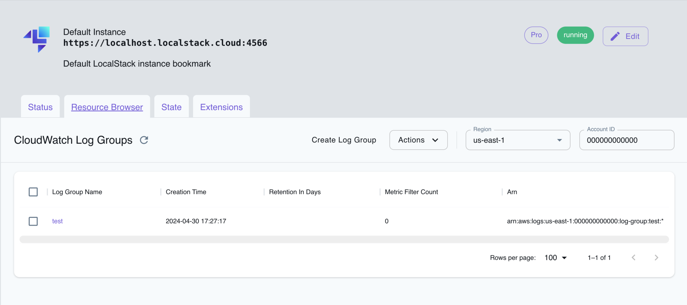

[CloudWatch Logs](https://docs.aws.amazon.com/cloudwatch/index.html) allows to store and retrieve logs. While some services automatically create and write logs (e.g. Lambda), logs can also be added manually. 
CloudWatch Logs is available in the Community version. However, some specific features are only available in Pro.

## Subscription Filters
Subscription filters can be used to forward logs to certain services, e.g. Kinesis, Lambda, and Kinesis Data Firehose. You can read upon details in the [official AWS docs](https://docs.aws.amazon.com/AmazonCloudWatch/latest/logs/SubscriptionFilters.html).

### Subscription Filters with Kinesis Example
In the following we setup a little example on how to use subscription filters with kinesis.

First, we setup the required resources. Therefore, we create a kinesis stream, a log group and log stream. Then we can configure the subscription filter. 

$ awslocal kinesis create-stream --stream-name "logtest" --shard-count 1
$ kinesis_arn=$(awslocal kinesis describe-stream --stream-name "logtest" | jq -r .StreamDescription.StreamARN)
$ awslocal logs create-log-group --log-group-name test

$ awslocal logs create-log-stream \
	--log-group-name test \
	--log-stream-name test

$ awslocal logs put-subscription-filter \
    --log-group-name "test" \
    --filter-name "kinesis_test" \
    --filter-pattern "" \
    --destination-arn $kinesis_arn \
    --role-arn "arn:aws:iam::000000000000:role/kinesis_role"


Next, we can add a log event, that will be forwarded to kinesis.

$ timestamp=$(($(date +'%s * 1000 + %-N / 1000000')))
$ awslocal logs put-log-events --log-group-name test --log-stream-name test --log-events "[{\"timestamp\": ${timestamp} , \"message\": \"hello from cloudwatch\"}]"


Now we can retrieve the data. In our example, there will only be one record. The data record is base64 encoded and compressed in gzip format:

$ shard_iterator=$(awslocal kinesis get-shard-iterator --stream-name logtest --shard-id shardId-000000000000 --shard-iterator-type TRIM_HORIZON | jq -r .ShardIterator)
$ record=$(awslocal kinesis get-records --limit 10 --shard-iterator $shard_iterator | jq -r '.Records[0].Data')
$ echo $record | base64 -d | zcat


## Filter Pattern (Pro only)
[Filter patterns](https://docs.aws.amazon.com/AmazonCloudWatch/latest/logs/FilterAndPatternSyntax.html) can be used to select certain logs only. 

LocalStack currently supports simple json-property filter.

### Metric Filter Example
Metric filters can be used to automatically create CloudWatch metrics. 

In the following example we are interested in logs that include a key-value pair `"foo": "bar"` and create a metric filter. 

$ awslocal logs create-log-group --log-group-name test-filter

$ awslocal logs create-log-stream \
	--log-group-name test-filter \
	--log-stream-name test-filter-stream

$ awslocal logs put-metric-filter \
  --log-group-name test-filter \
  --filter-name my-filter \
  --filter-pattern "{$.foo = \"bar\"}" \
  --metric-transformations \
  metricName=MyMetric,metricNamespace=MyNamespace,metricValue=1,defaultValue=0


Next, we can insert some values:

$ timestamp=$(($(date +'%s * 1000 + %-N / 1000000')))
$ awslocal logs put-log-events --log-group-name test-filter \
   --log-stream-name test-filter-stream \
   --log-events \
    timestamp=$timestamp,message='"{\"foo\":\"bar\", \"hello\": \"world\"}"' \
    timestamp=$timestamp,message="my test event" \
    timestamp=$timestamp,message='"{\"foo\":\"nomatch\"}"'


Now we can check that the metric was indeed created:

end=$(date +%s)
awslocal cloudwatch get-metric-statistics --namespace MyNamespace \
    --metric-name MyMetric --statistics Sum  --period 3600 \
    --start-time 1659621274 --end-time $end


### Filter Log Events
Similarly, you can use filter-pattern to filter logs with different kinds of patterns as described by [AWS](https://docs.aws.amazon.com/AmazonCloudWatch/latest/logs/FilterAndPatternSyntax.html).

#### JSON Filter Pattern
For purely JSON structured log messages, you can use JSON filter patterns to traverse the JSON object.
Enclose your pattern in curly braces, like this: 

$ awslocal logs filter-log-events --log-group-name test-filter --filter-pattern "{$.foo = \"bar\"}"


This returns all events whose top level "foo" key has the "bar" value.

#### Regular Expression Filter Pattern
You can use a simplified regex syntax for regular expression matching.
Enclose your pattern in percentage signs like this:

$ awslocal logs filter-log-events --log-group-name test-filter --filter-pattern "\%[fF]oo\%"

This returns all events containing "Foo" or "foo".
For a complete set of the supported syntax, check [the official AWS documentation](https://docs.aws.amazon.com/AmazonCloudWatch/latest/logs/FilterAndPatternSyntax.html#regex-expressions)

#### Unstructured Filter Pattern
If not specified otherwise in the pattern, we look for a match in the whole event message:

$ awslocal logs filter-log-events --log-group-name test-filter --filter-pattern "foo"


## Resource Browser

The LocalStack Web Application provides a Resource Browser for exploring CloudWatch Logs. You can access the Resource Browser by opening the LocalStack Web Application in your browser, navigating to the **Resources** section, and then clicking on **CloudWatch Logs** under the **Management/Governance** section.

 
 

The Resource Browser allows you to perform the following actions:

* **Create Log Group**: Create a new log group by clicking on the **Create Log Group** button followed by entering the details in the dialog box.
* **Create Log Stream**: Create a new log stream by clicking on the **Create Log Stream** button in the log group detail followed by entering the details in the dialog box.
* **Filter Log Events**: Filter log events by clicking the log stream name followed by entering the filter pattern and clicking **Apply**.
* **Delete Log Group**: Delete a log group by selecting the log group name and clicking on the **Actions** dropdown menu, then selecting **Remove Selected**.
* **Delete Log Stream**: Delete a log stream by selecting the log stream name and clicking on the **Actions** dropdown menu, then selecting **Remove Selected**.
