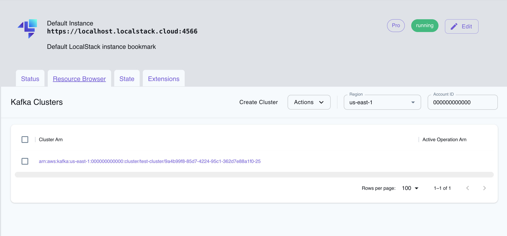

## Introduction

Managed Streaming for Apache Kafka (MSK) is a fully managed Apache Kafka service that allows you to build and run applications that process streaming data. MSK offers a centralized platform to facilitate seamless communication between various AWS services and applications through event-driven architectures, facilitating data ingestion, processing, and analytics for various applications. MSK also features automatic scaling and built-in monitoring, allowing users to build robust, high-throughput data pipelines.

LocalStack allows you to use the MSK APIs in your local environment to spin up Kafka clusters on the local machine, create topics for exchanging messages, and define event source mappings that trigger Lambda functions when messages are received on a certain topic. The supported APIs are available on our [API coverage page](https://docs.localstack.cloud/references/coverage/coverage_kafka/), which provides information on the extent of MSK's integration with LocalStack.

## Getting started

This guide is designed for users new to Managed Streaming for Kafka and assumes basic knowledge of the AWS CLI and our [`awslocal`](https://github.com/localstack/awscli-local) wrapper script.

Start your LocalStack container using your preferred method. We will demonstrate how to configure an MSK Cluster locally, create a Kafka topic, and produce and consume messages.

### Create a local MSK Cluster

To set up a local MSK (Managed Streaming for Apache Kafka) cluster, you can use the [`CreateCluster`](https://docs.aws.amazon.com/msk/1.0/apireference/clusters.html#CreateCluster) API to create a cluster named `EventsCluster` with three broker nodes. 

In this process, you'll need a JSON file named `brokernodegroupinfo.json` which specifies the three subnets where you want your local Amazon MSK to distribute the broker nodes. Create the file and add the following content to it:

```json
{
    "InstanceType": "kafka.m5.xlarge",
    "BrokerAZDistribution": "DEFAULT",
    "ClientSubnets": [
        "subnet-0123456789111abcd",
        "subnet-0123456789222abcd",
        "subnet-0123456789333abcd"
    ]
}
```

Run the following command to create the cluster:


$ awslocal kafka create-cluster \
    --cluster-name "EventsCluster" \
    --broker-node-group-info file://brokernodegroupinfo.json \
    --kafka-version "2.8.0" \
    --number-of-broker-nodes 3


The output of the command looks similar to this:

```bash
{
    "ClusterArn": "arn:aws:kafka:us-east-1:000000000000:cluster/EventsCluster/b154d18a-8ecb-4691-96b2-50348357fc2f-25",
    "ClusterName": "EventsCluster",
    "State": "CREATING"
}
```

The cluster creation process might take a few minutes. You can describe the cluster using the [`DescribeCluster`](https://docs.aws.amazon.com/msk/1.0/apireference/clusters.html#DescribeCluster) API. Run the following command, replacing `ClusterArn` with the Amazon Resource Name (ARN) you obtained above when you created cluster.


$ awslocal kafka describe-cluster \
    --cluster-arn "arn:aws:kafka:us-east-1:000000000000:cluster/EventsCluster/b154d18a-8ecb-4691-96b2-50348357fc2f-25"


The output of the command looks similar to this:

```bash
{
    "ClusterInfo": {
        "BrokerNodeGroupInfo": {
            "BrokerAZDistribution": "DEFAULT",
            "ClientSubnets": [
                "subnet-01",
                "subnet-02",
                "subnet-03"
            ],
            "InstanceType": "kafka.m5.xlarge"
        },
        "ClusterArn": "arn:aws:kafka:us-east-1:000000000000:cluster/EventsCluster/b154d18a-8ecb-4691-96b2-50348357fc2f-25",
        "ClusterName": "EventsCluster",
        "CreationTime": "2022-06-29T02:45:16.848000Z",
        "CurrentBrokerSoftwareInfo": {
            "KafkaVersion": "2.5.0"
        },
        "CurrentVersion": "K5OWSPKW0IK7LM",
        "NumberOfBrokerNodes": 3,
        "State": "ACTIVE",
        "ZookeeperConnectString": "localhost:4510"
    }
}
```

### Create a Kafka topic

To use LocalStack MSK, you can download and utilize the Kafka command line interface (CLI) to create a topic for producing and consuming data.

To download Apache Kafka, execute the following commands.


$ wget https://archive.apache.org/dist/kafka/2.8.0/kafka_2.12-2.8.0.tgz
$ tar -xzf kafka_2.12-2.8.0.tgz


Navigate to the **kafka_2.12-2.8.0** directory. Execute the following command, replacing `ZookeeperConnectString` with the value you saved after running the [`DescribeCluster`](https://docs.aws.amazon.com/msk/1.0/apireference/clusters.html#DescribeCluster) API:


$ bin/kafka-topics.sh \
    --create \
    --zookeeper localhost:4510 \
    --replication-factor 1 \
    --partitions 1 \
    --topic LocalMSKTopic


After executing the command, your output should resemble the following:

```bash
Created topic LocalMSKTopic.
```

### Interacting with the topic

You can now utilize the JVM truststore to establish communication with the MSK cluster. Create a folder named `/tmp` on the client machine, and navigate to the bin folder of the Apache Kafka installation.

Run the following command, replacing `java_home` with the path of your `java_home`. For this instance, the java_home path is `/Library/Internet\ Plug-Ins/JavaAppletPlugin.plugin/Contents/Home`.


The following step is optional and may not be required, depending on the operating system environment being used.



$ cp java_home/lib/security/cacerts /tmp/kafka.client.truststore.jks


While you are still in the `bin` folder of the Apache Kafka installation on the client machine, create a text file named `client.properties` with the following contents:

```txt
ssl.truststore.location=/tmp/kafka.client.truststore.jks
```

Run the following command, replacing `ClusterArn` with the Amazon Resource Name (ARN) you have.


$ awslocal kafka get-bootstrap-brokers \
    --cluster-arn ClusterArn


To proceed with the following commands, save the value associated with the string named `BootstrapBrokerStringTls` from the JSON result obtained from the previous command. It should look like this:

```bash
{
    "BootstrapBrokerString": "localhost:4511"
}
```

Now, navigate to the bin folder and run the next command, replacing `BootstrapBrokerStringTls` with the value you obtained:


$ ./kafka-console-producer.sh \
    --broker-list BootstrapBrokerStringTls \
    --producer.config client.properties \
    --topic LocalMSKTopic


To send messages to your Apache Kafka cluster, enter any desired message and press Enter. You can repeat this process twice or thrice, sending each line as a separate message to the Kafka cluster.

Keep the connection to the client machine open, and open a separate connection to the same machine in a new window. 

In this new connection, navigate to the `bin` folder and run a command, replacing `BootstrapBrokerStringTls` with the value you saved earlier. This command will allow you to interact with the Apache Kafka cluster using the saved value for secure communication.


$ ./kafka-console-consumer.sh \
    --bootstrap-server BootstrapBrokerStringTls \
    --consumer.config client.properties \
    --topic LocalMSKTopic \
    --from-beginning


You should start seeing the messages you entered earlier when you used the console producer command. These messages are TLS encrypted in transit. Enter more messages in the producer window, and watch them appear in the consumer window.

### Adding a local MSK trigger 

You can add a Lambda Event Source Mapping API to create a mapping between a Lambda function, named `my-kafka-function`, and a Kafka topic called `LocalMSKTopic`. The configuration for this mapping sets the starting position of the topic to `LATEST`.

Run the following command to use the [`CreateEventSourceMapping`](https://docs.aws.amazon.com/lambda/latest/dg/API_CreateEventSourceMapping.html) API by specifying the Event Source ARN, the topic name, the starting position, and the Lambda function name.


$ awslocal lambda create-event-source-mapping \
  --event-source-arn arn:aws:kafka:us-east-1:000000000000:cluster/EventsCluster \
  --topics LocalMSKTopic \
  --starting-position LATEST \
  --function-name my-kafka-function


Upon successful completion of the operation to create the Lambda Event Source Mapping, you can expect the following response:

```bash
{
    "UUID": "9c353a2b-bc1a-48b5-95a6-04baf67f01e4",
    "StartingPosition": "LATEST",
    "BatchSize": 100,
    "ParallelizationFactor": 1,
    "EventSourceArn": "arn:aws:kafka:us-east-1:000000000000:cluster/EventsCluster",
    "FunctionArn": "arn:aws:lambda:us-east-1:000000000000:function:my-kafka-function",
    "LastModified": "2021-11-21T20:55:49.438914+01:00",
    "LastProcessingResult": "OK",
    "State": "Enabled",
    "StateTransitionReason": "User action",
    "Topics": [
        "LocalMSKTopic"
    ]
}
```

With the event source mapping feature, LocalStack offers an automated process for spawning Lambda functions whenever a message is published to the designated Kafka topic. 

You can use the `kafka-console-producer.sh` client script to publish messages to the topic. By doing so, you can closely monitor the execution of Lambda functions within Docker containers as new messages arrive by simply observing the LocalStack log output.

## Delete the local MSK cluster

You can delete the local MSK cluster using the [`DeleteCluster`](https://docs.aws.amazon.com/cli/latest/reference/kafka/delete-cluster.html) API. To do so, you must first obtain the ARN of the cluster you want to delete. Run the following command to list all the clusters in the region:


$ awslocal kafka list-clusters --region us-east-1


To initiate the deletion of a cluster, select the corresponding `ClusterARN` from the list of clusters, and then execute the following command:


awslocal kafka delete-cluster --cluster-arn ClusterArn


## Resource Browser

The LocalStack Web Application provides a Resource Browser for managing MSK clusters. 
You can access the Resource Browser by opening the LocalStack Web Application in your browser, navigating to the **Resources** section, and then clicking on **Kafka** under the **Analytics** section.


<br>
<br>

The Resource Browser allows you to perform the following actions:

- **Create Cluster**: Create a new MSK cluster by clicking on the **Create Cluster** button and specifying the required parameters.
- **View Cluster**: View the details of an existing MSK cluster by clicking on the cluster name.
- **Edit Cluster**: Edit the configuration of an existing MSK cluster by clicking on the **Edit** button in the cluster details page.
- **Delete Cluster**: Delete an existing MSK cluster by selecting the cluster name and clicking on the **Actions** dropdown menu, then selecting **Remove Selected**.
