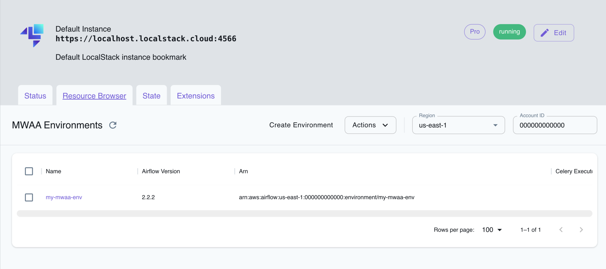

## Introduction

Managed Workflows for Apache Airflow (MWAA) is a fully managed service by AWS that simplifies the deployment, management, and scaling of [Apache Airflow](https://airflow.apache.org/) workflows in the cloud.
MWAA leverages the familiar Airflow features and integrations while integrating with S3, Glue, Redshift, Lambda, and other AWS services to build data pipelines and orchestrate data processing workflows in the cloud.

LocalStack allows you to use the MWAA APIs in your local environment to allow the setup and operation of data pipelines.
The supported APIs are available on the [API coverage page]().

## Getting started

This guide is designed for users new to MWAA and assumes basic knowledge of the AWS CLI and our [`awslocal`](https://github.com/localstack/awscli-local) wrapper script.

Start your LocalStack container using your preferred method.
We will demonstrate how to create an Airflow environment and access the Airflow UI.

### Create a S3 bucket

Create a S3 bucket that will be used for Airflow resources.
Run the following command to create a bucket using the [`mb`](https://docs.aws.amazon.com/cli/latest/reference/s3/mb.html) command.


$ awslocal s3 mb s3://my-mwaa-bucket


### Create an Airflow environment

You can now create an Airflow environment, using the [`CreateEnvironment`](https://docs.aws.amazon.com/mwaa/latest/API/API_CreateEnvironment.html) API.
Run the following command, by specifying the bucket ARN we created earlier:


$ awslocal mwaa create-environment --dag-s3-path /dags \
        --execution-role-arn arn:aws:iam::000000000000:role/airflow-role \
        --network-configuration {} \
        --source-bucket-arn arn:aws:s3:::my-mwaa-bucket \
        --airflow-version 2.10.1 \
        --airflow-configuration-options agent.code=007,agent.name=bond \
        --name my-mwaa-env


### Access the Airflow UI

The Airflow UI can be accessed via the URL in the `WebserverUrl` attribute of the response of the `GetEnvironment` operation.
The username and password are always set to `localstack`.


$ awslocal mwaa get-environment --name my-mwaa-env --query Environment.WebserverUrl
"http://localhost.localstack.cloud:4510"


LocalStack also prints this information in the logs:

```bash
2024-03-06T14:54:47.070  INFO --- [functhread10] l.services.mwaa.provider   : Airflow environment 'my-mwaa-env' available at http://localhost.localstack.cloud:4510 with username 'localstack' and password 'localstack'
```

## Airflow versions

LocalStack supports the following versions of Apache Airflow:

- `2.4.3`
- `2.5.1`
- `2.6.3`
- `2.7.2`
- `2.8.1`
- `2.9.2`
- `2.10.1` (default)

## Airflow configuration options

To configure Airflow environments effectively, you can utilize the `AirflowConfigurationOptions` argument.
These options are transformed into corresponding environment variables and passed to Airflow.
For instance:

- `agent.code`:`007` is transformed into `AIRFLOW__AGENT__CODE:007`.
- `agent.name`:`bond` is transformed into `AIRFLOW__AGENT__NAME:bond`.

This transformation process ensures that your configuration settings are easily applied within the Airflow environment.

## Adding or updating DAGs

When it comes to adding or updating DAGs in Airflow, the process is simple and efficient.
Just upload your DAGs to the designated S3 bucket path, configured by the `DagS3Path` argument.

For example, the command below uploads a sample DAG named `sample_dag.py` to your S3 bucket named `my-mwaa-bucket`:


$ awslocal s3 cp sample_dag.py s3://my-mwaa-bucket/dags


LocalStack syncs new and changed objects in the S3 bucket to the Airflow container every 30 seconds.
The polling interval can be changed using the [`MWAA_S3_POLL_INTERVAL`]() config option.

## Installing custom plugins

You can extend the capabilities of Airflow by incorporating custom plugins, which introduce new operators, interfaces, or hooks.
LocalStack seamlessly supports plugins packaged according to [AWS specifications](https://docs.aws.amazon.com/mwaa/latest/userguide/configuring-dag-import-plugins.html#configuring-dag-plugins-test-create).

To integrate your custom plugins into the MWAA environment, upload the packaged `plugins.zip` file to the designated S3 bucket path:


$ awslocal s3 cp plugins.zip s3://my-mwaa-bucket/plugins.zip


## Installing Python dependencies

LocalStack streamlines the process of installing Python dependencies for Apache Airflow within your environments.
To get started, create a `requirements.txt` file that lists the required dependencies.
For example:

```txt
boto3==1.17.54
boto==2.49.0
botocore==1.20.54
```

Once you have your `requirements.txt` file ready, upload it to the designated S3 bucket, configured for use by the MWAA environment.
Make sure to upload the file to `/requirements.txt` in the bucket:


$ awslocal s3 cp requirements.txt s3://my-mwaa-bucket/requirements.txt


After the upload, the environment will be automatically updated, and your Apache Airflow setup will be equipped with the new dependencies.
It is important to note that, unlike [AWS](https://docs.aws.amazon.com/mwaa/latest/userguide/connections-packages.html), LocalStack does not install any provider packages by default.
Therefore, you must follow the above steps to install any required provider packages.

## Connections

When incorporating connections to other AWS services within your DAGs, it is crucial to specify either the internal Docker IP address of the LocalStack container or utilize `host.docker.internal`.
LocalStack currently does not use the credentials and region from `aws_conn_id`.
This information must be explicitly passed in operators, hooks, and sensors.

## Resource Browser

The LocalStack Web Application provides a Resource Browser for managing MWAA Environments.
You can access the Resource Browser by opening the LocalStack Web Application in your browser, navigating to the **Resource Browser** section, and then clicking on **MWAA** under the **App Integration** section.

<p>

</p>

The Resource Browser allows you to perform the following actions:

- **Create Environment**: Create a new MWAA environment by clicking on the **Create Environment** button and providing the required parameters.
- **View Environment**: View details of an existing MWAA environment by clicking on the environment name.
- **Edit Environment**: Edit an existing MWAA environment by clicking on the **Edit** button after clicking on the environment name.
- **Delete Environment**: Select the environment name and click on the **Actions** button followed by **Remove Selected** button.

## Current Limitations

- LocalStack MWAA does not support [startup scripts](https://docs.aws.amazon.com/mwaa/latest/userguide/using-startup-script.html)
