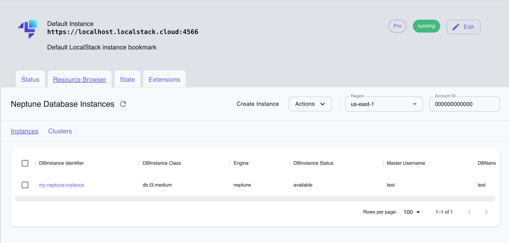

## Introduction

Neptune is a fully managed, highly available, and scalable graph database service offered by AWS. 
It is designed for storing and querying highly connected data for applications that require complex relationship modeling, such as social networks, recommendation engines, and fraud detection.
Neptune supports popular graph query languages like Gremlin and SPARQL, making it compatible with a wide range of graph applications and tools.

LocalStack allows you to use the Neptune APIs in your local environment  to support both property graph and RDF graph models.
The supported APIs are available on our [API coverage page](https://docs.localstack.cloud/references/coverage/coverage_neptune/), which provides information on the extent of Neptune's integration with LocalStack.

 The following versions of Neptune engine are supported by LocalStack:

| Engine Version | Tinkerpop Version |
|-----------------|---------------------|
| `1.1.0.0`       | `3.4.11`            |
| `1.1.1.0`       | `3.5.2`             |
| `1.2.0.0`       | `3.5.2`             |
| `1.2.0.1`       | `3.5.2`             |
| `1.2.0.2`       | `3.5.2`             |
| `1.2.1.0`       | `3.6.2`             |
| `1.2.1.1`       | `3.6.2`             |
| `1.3.0.0`       | `3.6.2`             |
| `1.3.1.0`       | `3.6.2`             |

## Getting started

This guide is designed for users new to Neptune and assumes basic knowledge of the AWS CLI and our `awslocal` wrapper script. 

Start your LocalStack container using your preferred method. We will demonstrate the following with AWS CLI & Python:

- Creating a Neptune cluster.
- Starting a connection to the Neptune cluster.
- Running a Python script to create nodes and edges and query the graph database.

### Create a Neptune cluster

To create a Neptune cluster you can use the [`CreateDBCluster`](https://docs.aws.amazon.com/neptune/latest/userguide/api-clusters.html#CreateDBCluster) API. 
Run the following command to create a Neptune cluster:


$ awslocal neptune create-db-cluster \
    --engine neptune \
    --db-cluster-identifier my-neptune-db


You should see the following output:

```json
{
    "DBCluster": {
        ...
        "Endpoint": "localhost",
        "Port": 4510,  # may vary
        "DBClusterArn": "arn:aws:rds:us-east-1:000000000000:cluster:my-neptune-db",
        ...
    }
}
```

### Add an instance to the cluster

To add an instance you can use the [`CreateDBInstance`](https://docs.aws.amazon.com/neptune/latest/userguide/api-instances.html#CreateDBInstance) API. 
Run the following command to create a Neptune instance:


$ awslocal neptune create-db-instance \
    --db-cluster-identifier my-neptune-db \
    --db-instance-identifier my-neptune-instance \
    --engine neptune \
    --db-instance-class db.t3.medium


In LocalStack the `Endpoint` for the `DBCluster` and the `Endpoint.Address` of the `DBInstance` will be the same and can be used to connect to the graph database.

### Start a connection

To start a connection you have to use the `ws` protocol.

Here is an example that uses Python and [`gremlinpython`](https://pypi.org/project/gremlinpython/) to connect to the database:

```python
from gremlin_python.driver.driver_remote_connection import DriverRemoteConnection
from gremlin_python.process.anonymous_traversal import traversal
from gremlin_python.process.traversal import Bindings, T, gt

ENDPOINT = "localhost:4510" # TODO change to your endpoint
DATABASE_URL = f"ws://{ENDPOINT}/gremlin"


if __name__ == '__main__':
    conn = DriverRemoteConnection(
        DATABASE_URL,
        "g",
        pool_size=1,
    )

    g = traversal().withRemote(conn)

    # add some nodes
    v1 = g.addV("person").property(T.id, "1").property("name", "marko").property("age", 29).next()
    v2 = g.addV("person").property(T.id, "2").property("name", "stephen").property("age", 33).next()
    v3 = g.addV("person").property(T.id, "3").property("name", "mia").property("age", 30).next()

    # add edges/relation
    g.V(Bindings.of("id", v1)).addE("knows").to(v2).property("weight", 0.75).iterate()
    g.V(Bindings.of("id", v1)).addE("knows").to(v3).property("weight", 0.85).iterate()

    # retrieve all names
    names = g.V().values("name").to_list()

    # list all names of persons that know "marko"
    marko_knows = g.V("1").outE("knows").inV().values("name").order().to_list()

    # all persons that "marko" know that are older than 30
    marko_knows_older_30 = g.V("1").out("knows").has("age", gt(30)).values("name").to_list()

    # reset everything
    g.V().drop().iterate()

    result = {
        "names": names,
        "marko_knows": marko_knows,
        "marko_knows_older_30": marko_knows_older_30,
    }
    print(result)
```

## Resource Browser

The LocalStack Web Application provides a Resource Browser for managing Neptune databases and clusters. You can access the Resource Browser by opening the LocalStack Web Application in your browser, navigating to the **Resources** section, and then clicking on **Neptune** under the **Database** section.


<br>
<br>

The Resource Browser allows you to perform the following actions:

* **Create Cluster**: Create a new Neptune cluster by clicking on **Create Cluster** under the **Clusters** tab and providing the required parameters.
* **List Clusters**: View a list of all Neptune clusters in your LocalStack environment by clicking on the **Clusters** tab.
* **View Cluster Details**: Click on a cluster name to view detailed information about the cluster, including its status, endpoint, and other configuration details.
* **Graph Browser**: Access the Neptune Graph Browser by clicking on the **Graph Browser** tab in the cluster details. The Graph Browser allows you to interactively query and visualize the graph data stored in your Neptune cluster.
* **Quick Actions**: Perform quick actions on the cluster, such as adding a new Node, modifying an existing one or creating a new Edge between 2 nodes. You can access the **Quick Actions** by clicking in the respective tab from the cluster details page.
* **Create instance**: Create a new Neptune database by clicking on **Create Instance** under the **Instances** tab and providing the required parameters.
* **List Instances**: View a list of all Neptune databases in your LocalStack environment by clicking on the **Instances** tab.
* **View Instance Details**: Click on a database name to view detailed information about the database, including its status, endpoint, and other configuration details.
* **Edit Instance**: Edit the configuration of a Neptune database by clicking on the **Edit Instance** button in the instance details.

## Examples 

The following code snippets and sample applications provide practical examples of how to use Neptune in LocalStack for various use cases:

- [Neptune Graph Database Demo](https://github.com/localstack/localstack-pro-samples/tree/master/neptune-graph-db)

## Preview Features

### Gremlin Transactions

Gremlin transactions can be enabled by setting the environment `NEPTUNE_ENABLE_TRANSACTION=1`. Be aware that the `engine_version` provided when creating your cluster will be ignored and LocalStack will use `3.7.2` Gremlin Server. This feature is in beta and any feedback is appreciated.

#### Current Limitations

- Fixed id
  - Creating a Vertex with an id in a transaction, then deleting it. Trying to recreate a vertex with the same id will fail.
- Serializer considerations
    - While it is possible to connect to the server with a lower version of Gremlin Language Variants, there are breaking changes to the default `GraphBinarySerializersV1` serializer used by most languages. One possible fix is to use the matching version for your language variant. Otherwise, using the `GraphSONSerializersV3d0` serializer also seems to be working. See example below.
    - If using Neptune <= `1.2.0.2`, the Gryo message serializer is no longer supported. Only affects users explicitly using that serializer.

Example using `gremlinpython==3.6.2`
```python
from gremlin_python.driver import serializer
from gremlin_python.driver.driver_remote_connection import DriverRemoteConnection
from gremlin_python.process.anonymous_traversal import traversal

ENDPOINT = "localhost:4510" # TODO change to your endpoint
DATABASE_URL = f"ws://{ENDPOINT}/gremlin"


if __name__ == '__main__':
    conn = DriverRemoteConnection(
        DATABASE_URL,
        "g",
        # Note, the serializer is only required if using gremplin_python < 3.7.0 
        message_serializer=serializer.GraphSONSerializersV3d0(),
    )

    g = traversal().withRemote(conn)

    tx = g.tx()
    gtx = tx.begin()

    try:
        v1 = gtx.addV("person").property("name", "Mark").next()
        v2 = gtx.addV("person").property("name", "Jane").next()
        tx.commit()
    except Exception:
        tx.rollback()
    
    nodes = g.V().valueMap().fold().next()
    print(nodes)
```
