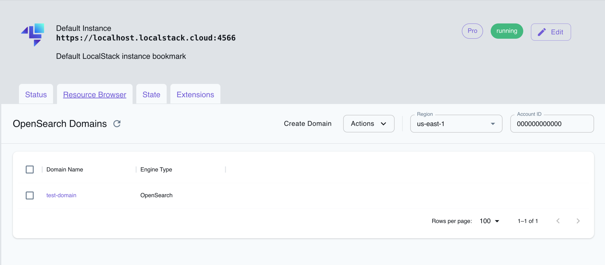

## Introduction

OpenSearch Service is an open-source search and analytics engine, offering developers and organizations advanced search capabilities, robust data analysis, and insightful visualizations. OpenSearch Service also offers log analytics, real-time application monitoring, and clickstream analysis.

LocalStack allows you to use the OpenSearch Service APIs in your local environment to create, manage, and operate the OpenSearch clusters. The supported APIs are available on our [API coverage page](https://docs.localstack.cloud/references/coverage/coverage_opensearch/), which provides information on the extent of OpenSearch's integration with LocalStack.

The following versions of OpenSearch Service are supported by LocalStack:

- 1.0
- 1.1
- 1.2
- 1.3
- 2.3
- 2.7
- 2.9
- 2.11 (**default**)

OpenSearch is closely coupled with the [Elasticsearch Service](../elasticsearch). Clusters generated through the OpenSearch Service will be visible within the Elasticsearch Service interface, and vice versa. You can select an Elasticsearch version with the `--engine-version` parameter while creating an OpenSearch Service domain.

## Getting started

This guide is designed for users new to OpenSearch Service and assumes basic knowledge of the AWS CLI and our [`awslocal`](https://github.com/localstack/awscli-local) wrapper script.

Start your LocalStack container using your preferred method. We will demonstrate how to create a new OpenSearch Service cluster and interact with it, using the AWS CLI.

### Creating an OpenSearch cluster

To create an OpenSearch Service cluster, you can use the [`CreateDomain`](https://docs.aws.amazon.com/opensearch-service/latest/APIReference/API_CreateDomain.html) API. OpenSearch Service domain is synonymous with an OpenSearch cluster. Execute the following command to create a new OpenSearch domain:


$ awslocal opensearch create-domain --domain-name my-domain


Each time you establish a cluster using a new version of OpenSearch, the corresponding OpenSearch binary must be downloaded, a process that might require some time to complete. In the LocalStack log you will see something like, where you can see the cluster starting up in the background.

You can open the LocalStack logs, to see that the OpenSearch Service cluster is being created in the background. You can use the [`DescribeDomain`](https://docs.aws.amazon.com/opensearch-service/latest/APIReference/API_DescribeDomain.html) API to check the status of the cluster:


$ awslocal opensearch describe-domain \
    --domain-name my-domain | jq ".DomainStatus.Processing"


The `Processing` attribute will be `false` once the cluster is up and running. Once the cluster is up, you can interact with the cluster.

### Interact with the cluster

You can now interact with the cluster at the cluster API endpoint for the domain, in this case `http://my-domain.us-east-1.opensearch.localhost.localstack.cloud:4566`.

Run the following command to get the cluster health:


$ curl http://my-domain.us-east-1.opensearch.localhost.localstack.cloud:4566


You can verify that the cluster is up and running by checking the cluster health:


$ curl -s http://my-domain.us-east-1.opensearch.localhost.localstack.cloud:4566/_cluster/health | jq .


The following output will be visible on your terminal:

```json
{
  "cluster_name": "opensearch",
  "status": "green",
  "timed_out": false,
  "number_of_nodes": 1,
  "number_of_data_nodes": 1,
  "discovered_master": true,
  "active_primary_shards": 0,
  "active_shards": 0,
  "relocating_shards": 0,
  "initializing_shards": 0,
  "unassigned_shards": 0,
  "delayed_unassigned_shards": 0,
  "number_of_pending_tasks": 0,
  "number_of_in_flight_fetch": 0,
  "task_max_waiting_in_queue_millis": 0,
  "active_shards_percent_as_number": 100
}
```

## Domain Endpoints

There are two configurable strategies that govern how domain endpoints are created. The strategy can be configured via the `OPENSEARCH_ENDPOINT_STRATEGY` environment variable.

| Value   | Format                                                                              | Description                                                                                           |
| ------- | ----------------------------------------------------------------------------------- | ----------------------------------------------------------------------------------------------------- |
| `domain` | `<domain-name>.<region>.<engine-type>.localhost.localstack.cloud:4566`             | The default strategy employing the `localhost.localstack.cloud` domain for routing to localhost.     |
| `path`   | `localhost:4566/<engine-type>/<region>/<domain-name>`                              | An alternative strategy useful if resolving LocalStack's localhost domain poses difficulties.       |
| `port`   | `localhost:<port-from-range>`                                                      | Directly exposes cluster(s) via ports from [the external service port range](). |

Irrespective of the originating service for the clusters, the domain of each cluster consistently aligns with its engine type, be it OpenSearch or Elasticsearch. Consequently, OpenSearch clusters incorporate `opensearch` within their domains (e.g., `my-domain.us-east-1.opensearch.localhost.localstack.cloud:4566`), while Elasticsearch clusters feature `es` in their domains (e.g., `my-domain.us-east-1.es.localhost.localstack.cloud:4566`).

## Custom Endpoints

LocalStack allows you to define arbitrary endpoints for your clusters within the domain endpoint options. This functionality can be used to overwrite the behavior of the aforementioned endpoint strategies. Moreover, you can opt for custom domains, though it's important to incorporate the edge port (80/443, or the default 4566).

Run the following command to create a new OpenSearch domain with a custom endpoint:


$ awslocal opensearch create-domain --domain-name my-domain \
      --domain-endpoint-options '{ "CustomEndpoint": "http://localhost:4566/my-custom-endpoint", "CustomEndpointEnabled": true }'


After the domain processing is complete, you can access the cluster using the custom endpoint:


$ curl http://localhost:4566/my-custom-endpoint/_cluster/health


## Re-using a single cluster instance

In certain scenarios, creating a distinct cluster instance for each domain might not align with your use-case. For example, if your focus is solely on testing API interactions rather than actual OpenSearch functionality, individual clusters might be excessive. In such situations, the option to set `OPENSEARCH_MULTI_CLUSTER=0` exists, allowing all domains to be funneled into a single cluster instance.

However, it's important to be aware that it can introduce unexpected complications. This is particularly true when dealing with data persistence within OpenSearch or when working with clusters of varying versions. As a result, we advise caution when considering this approach and generally recommend against it.

## Storage Layout

OpenSearch will be organized in your state directory as follows:


$ tree -L 4 ./volume/state
./volume/state
├── opensearch
│   └── arn:aws:es:us-east-1:000000000000:domain
│       ├── my-cluster-1
│       │   ├── backup
│       │   ├── data
│       │   └── tmp
│       ├── my-cluster-2
│       │   ├── backup
│       │   ├── data
│       │   └── tmp


## Advanced Security Options

Both OpenSearch and Elasticsearch services offer **Advanced Security Options**. Presently, OpenSearch domains are equipped with support for an internal user database. However, Elasticsearch domains are not currently covered, whether through the OpenSearch or the Elasticsearch service. IAM support is also not yet available.

A secure OpenSearch domain can be spawned with this example CLI input. Save it in a file named `opensearch_domain.json`.

```json
{
    "DomainName": "secure-domain",
    "ClusterConfig": {
        "InstanceType": "r5.large.search",
        "InstanceCount": 1,
            "DedicatedMasterEnabled": false,
            "ZoneAwarenessEnabled": false,
            "WarmEnabled": false
        },
    "EBSOptions": {
        "EBSEnabled": true,
        "VolumeType": "gp2",
        "VolumeSize": 10
    },
    "EncryptionAtRestOptions": {
        "Enabled": true
    },
    "NodeToNodeEncryptionOptions": {
        "Enabled": true
    },
    "DomainEndpointOptions": {
        "EnforceHTTPS": true
    },
    "AdvancedSecurityOptions": {
        "Enabled": true,
        "InternalUserDatabaseEnabled": true,
        "MasterUserOptions": {
            "MasterUserName": "admin",
            "MasterUserPassword": "really-secure-passwordAa!1"
        }
    }
}
```

To provision it, use the following `awslocal` CLI command, assuming the aforementioned CLI input has been stored in a file named `opensearch_domain.json`:


$ awslocal opensearch create-domain --cli-input-json file://./opensearch_domain.json


Once the domain setup is complete (`Processing: false`), the cluster can only be accessed with the given master user credentials, via HTTP basic authentication:


$ curl -u "admin:really-secure-passwordAa!1" http://secure-domain.us-east-1.opensearch.localhost.localstack.cloud:4566/_cluster/health


The following output will be visible on your terminal:

```json
{"cluster_name":"opensearch","status":"green",...}
```

It's important to note that any unauthorized requests will yield an HTTP response with a status code of 401 (`Unauthorized`).

## OpenSearch Dashboards

[OpenSearch Dashboards](https://opensearch.org/docs/latest/dashboards/) is a great tool to analyze and visualize the data in your OpenSearch domain.
And you can directly use the official OpenSearch Dashboards Docker image to analyze data in your OpenSearch domain within LocalStack!

When using OpenSearch Dashboards with LocalStack, you need to make sure to:
- Enable the [advanced security options]() and set a username and a password.
  This is required by OpenSearch Dashboards.
- Ensure that the OpenSearch Dashboards Docker container uses the LocalStack DNS.
  You can find more information on how to connect your Docker container to Localstack in our [Network Troubleshooting guide]().

First, you need to make sure to start LocalStack in a specific Docker network:

$ localstack start --network ls


Now you can provision a new OpenSearch domain.
Make sure to enable the [advanced security options]():


$ awslocal opensearch create-domain --cli-input-json file://./opensearch_domain.json


Now you can start another container for OpenSearch Dashboards, which is configured such that:
- The port for OpenSearch Dashboards is mapped (`5601`).
- The container is in the same network as LocalStack.
- The container uses the LocalStack DNS.
- The OpenSearch Domain is set.
- The OpenSearch credentials are set.
- The version of OpenSearch Dashboards is the same as the OpenSearch domain.


docker inspect localstack-main | \
	jq -r '.[0].NetworkSettings.Networks | to_entries | .[].value.IPAddress'
# prints 172.22.0.2

docker run --rm -p 5601:5601 \
  --network ls \
  --dns 172.22.0.2 \
  -e "OPENSEARCH_HOSTS=http://secure-domain.us-east-1.opensearch.localhost.localstack.cloud:4566" \
  -e "OPENSEARCH_USERNAME=admin" -e "OPENSEARCH_PASSWORD=really-secure-passwordAa!1" \
  opensearchproject/opensearch-dashboards:2.11.0


Once the container is running, you can reach OpenSearch Dashboards at `http://localhost:5601` and you can log in with your OpenSearch domain credentials.

## Custom OpenSearch backends

LocalStack employs an asynchronous approach to download OpenSearch the first time you create an OpenSearch cluster. Consequently, you'll receive a prompt response from LocalStack initially, followed by the setup of your local OpenSearch cluster once the download and installation are completed.

However, there might be scenarios where this behavior is not desirable. For instance, you may prefer to use an existing OpenSearch cluster that is already up and running. This approach can also prove beneficial when you require a cluster with a customized configuration that isn't supported by LocalStack.

To tailor the OpenSearch backend according to your needs, you can initiate your own local OpenSearch cluster and then direct LocalStack to utilize it through the `OPENSEARCH_CUSTOM_BACKEND` environment variable. It's important to bear in mind that only a single backend configuration is possible, resulting in behavior akin to the approach of [re-using a single cluster instance](#re-using-a-single-cluster-instance).

Here is a sample `docker-compose.yaml` file that contains a single-node OpenSearch cluster and a basic LocalStack setup.

```yaml
version: "3.9"

services:
  opensearch:
    container_name: opensearch
    image: opensearchproject/opensearch:1.1.0
    environment:
      - node.name=opensearch
      - cluster.name=opensearch-docker-cluster
      - discovery.type=single-node
      - bootstrap.memory_lock=true
      - "OPENSEARCH_JAVA_OPTS=-Xms512m -Xmx512m"
      - "DISABLE_SECURITY_PLUGIN=true"
    ports:
      - "9200:9200"
    ulimits:
      memlock:
        soft: -1
        hard: -1
    volumes:
      - data01:/usr/share/opensearch/data

  localstack:
    container_name: "${LOCALSTACK_DOCKER_NAME:-localstack-main}"
    image: localstack/localstack
    ports:
      - "127.0.0.1:4566:4566"            # LocalStack Gateway
      - "127.0.0.1:4510-4559:4510-4559"  # external services port range
    depends_on:
      - opensearch
    environment:
      - OPENSEARCH_CUSTOM_BACKEND=http://opensearch:9200
      - DEBUG=${DEBUG:-0}
    volumes:
      - "${LOCALSTACK_VOLUME_DIR:-./volume}:/var/lib/localstack"
      - "/var/run/docker.sock:/var/run/docker.sock"

volumes:
  data01:
    driver: local
```

You can start the Docker Compose environment using the following command:


$ docker-compose up -d


You can now create an OpenSearch cluster using the `awslocal` CLI:


$ awslocal opensearch create-domain --domain-name my-domain


If the `Processing` status shows as `true`, the cluster isn't fully operational yet. You can use the `describe-domain` command to retrieve the current status:


$ awslocal opensearch describe-domain --domain-name my-domain


You can now verify cluster health and set up indices:


$ curl my-domain.us-east-1.opensearch.localhost.localstack.cloud:4566/_cluster/health | jq


The output will provide insights into the cluster's health and version information.

Finally create an example index using the following command:


$ curl -X PUT my-domain.us-east-1.opensearch.localhost.localstack.cloud:4566/my-index


## Resource Browser

The LocalStack Web Application provides a Resource Browser for managing OpenSearch domains. 
You can access the Resource Browser by opening the LocalStack Web Application in your browser, navigating to the **Resources** section, and then clicking on **OpenSearch Service** under the **Analytics** section.


<br>
<br>

The Resource Browser allows you to perform the following actions:

- **Create Domain**: Create a new OpenSearch domain by clicking on the **Create Domain** button and providing the required details.
- **View Domain Details**: Click on a domain to view its details, such as the domain name, status, endpoint, and configuration.
- **Edit Domain**: Edit the configuration of a domain by clicking on domain name and then clicking on the **Edit Domain** button.
- **Delete Domain**: Delete a domain by selecting the domain name and clicking on the **Actions** dropdown menu, then selecting **Remove Selected**.

## Current Limitations

Internally, LocalStack makes use of the [OpenSearch Python client 2.x](https://github.com/opensearch-project/opensearch-py). The functionalities marked as deprecated in OpenSearch 1.x and subsequently removed in OpenSearch 2.x may not operate reliably when interacting with OpenSearch 1.x clusters through LocalStack. You can refer to the [compatibility documentation](https://github.com/opensearch-project/opensearch-py/blob/main/COMPATIBILITY.md) provided by the [OpenSearch Python client repository](https://github.com/opensearch-project/opensearch-py).

AWS typically populates the `Endpoint` attribute of the cluster status only after the cluster is fully operational. In contrast, LocalStack provides the endpoint information immediately but retains `Processing = "true"` until the cluster initialization is complete.
    
The `CustomEndpointOptions` in LocalStack offers the flexibility to utilize arbitrary endpoint URLs, a feature that diverges from the constraints imposed by AWS.

## Troubleshooting

If you encounter difficulties resolving subdomains while employing the `OPENSEARCH_ENDPOINT_STRATEGY=domain` (the default setting), it's advisable to investigate whether your DNS configuration might be obstructing rebind queries. For further insights on addressing this issue, refer to the section on [DNS rebind protection]().
