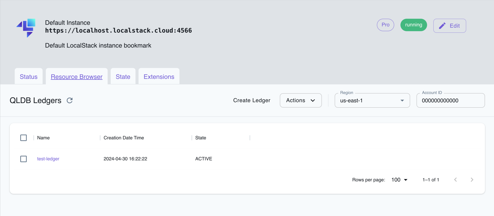

## Introduction

Amazon Quantum Ledger Database is a fully managed ledger database service offered by Amazon Web
Services. It is designed to provide transparent, immutable, and cryptographically verifiable
transaction
log functionality to applications. QLDB is particularly useful for applications that need a secure
and scalable
way to maintain a complete and verifiable history of data changes over time.


LocalStack allows you to use the QLDB APIs in your local environment to create and manage ledgers.
The supported APIs are available on the [API coverage page]( "QLDB service coverage page"), which provides information on the extent of QLDB's integration with LocalStack. 

## Getting started

These instructions will follow along with
the [getting started guide](https://docs.aws.amazon.com/qldb/latest/developerguide/getting-started.html)
from the official documentation, but instead of using the console to
perform all the operations, the LocalStack AWS CLI (management API only) and the QLDB shell (data
API only) will be used.

### Installing the QLDB shell

QLDB supports PartiQL, a SQL-compatible query language, which allows you to query and manipulate
data stored in QLDB.
You can write PartiQL statements to perform complex queries, aggregations, and transformations on
your data.
Amazon QLDB provides a command line shell for interaction with the transactional data API. With the
QLDB shell,
you can run PartiQL statements on ledger data.

For instructions on how to use and install the latest version of the QLDB shell, see
the [README.md](https://github.com/awslabs/amazon-qldb-shell/blob/main/README.md#installation) file
on GitHub.
QLDB provides pre-built binary files for Linux, macOS, and Windows in
the [Releases](https://github.com/awslabs/amazon-qldb-shell/releases) section of the repository.

### Creating a new ledger

QLDB provides ledger databases, which are centralized, immutable, and cryptographically verifiable
journals of transactions.


$ awslocal qldb create-ledger --name vehicle-registration --permissions-mode ALLOW_ALL


```bash
{
    "Name": "vehicle-registration",
    "Arn": "arn:aws:qldb:us-east-1:000000000000:ledger/vehicle-registration",
    "State": "ACTIVE",
    "CreationDateTime": 1696782718.0,
    "PermissionsMode": "ALLOW_ALL",
    "DeletionProtection": true
}
```



- Permissions mode – the following options are available in AWS:

**Allow all** – A legacy permissions mode that enables access control with API-level granularity for
ledgers.
This mode disregards any table-level or command-level IAM permissions policies that you create for
the ledger.

**Standard** (Recommended) - A permissions mode that enables access control with finer granularity
for ledgers,
tables, and PartiQL commands. It is recommended using this permissions mode to maximize the security
of your
ledger data.
By default, this mode denies all requests to run any PartiQL commands on any tables in this ledger.
To allow PartiQL
commands, you must create IAM permissions policies for specific table resources and PartiQL actions,
in addition to
the `SendCommand` API permission for the ledger.


The following command can be used directly to write PartiQL statements against a QLDB ledger:


$ qldb --qldb-session-endpoint http://localhost:4566 --ledger vehicle-registration


The user can continue from here to create tables, populate and interrogate them.

### Creating tables and sample data

PartiQL is a query language designed for processing structured data, allowing you to perform 
various data manipulation tasks using familiar SQL-like syntax. 


qldb> CREATE TABLE VehicleRegistration


```bash
{
    information_schema: {
      user_tables: [
        {
          name: "VehicleRegistration",
          status: "ACTIVE",
          indexes: [
         ]
        }
      ]
    },
   Vehicle: [
   ],
   VehicleRegistration: [
   ]
}
1 document in bag (read-ios: 0, server-time: 0ms, total-time: 31ms)
```

The `VehicleRegistration` table was created. Now it's time to add some items:


qldb> INSERT INTO VehicleRegistration VALUE
{
    'VIN' : 'KM8SRDHF6EU074761',
    'RegNum' : 1722,
    'State' : 'WA',
    'City' : 'Kent',
    'PendingPenaltyTicketAmount' : 130.75,
    'Owners' : {
        'PrimaryOwner' : { 'PersonId': '294jJ3YUoH1IEEm8GSabOs' },
        'SecondaryOwners' : [
            { 'PersonId' : '1nmeDdLo3AhGswBtyM1eYh' },
            { 'PersonId': 'IN7MvYtUjkp1GMZu0F6CG9' }
        ]
    },
    'ValidFromDate' : `2017-09-14T`,
    'ValidToDate' : `2020-06-25T`
}


```bash
{
documentId: "3TYR9BamzyqHWBjYOfHegE"
}
1 document in bag (read-ios: 0, server-time: 0ms, total-time: 894ms)
```

### Querying a table

The table can be interrogated based on the inserted registration number:


qldb> SELECT * FROM VehicleRegistration WHERE RegNum=1722


```bash
{
    'VIN' : 'KM8SRDHF6EU074761',
    'RegNum' : 1722,
    'State' : 'WA',
    'City' : 'Kent',
    'PendingPenaltyTicketAmount' : 130.75,
    'Owners' : {
        'PrimaryOwner' : { 'PersonId': '294jJ3YUoH1IEEm8GSabOs' },
        'SecondaryOwners' : [
            { 'PersonId' : '1nmeDdLo3AhGswBtyM1eYh' },
            { 'PersonId': 'IN7MvYtUjkp1GMZu0F6CG9' }
        ]
    },
    'ValidFromDate' : `2017-09-14T`,
    'ValidToDate' : `2020-06-25T`
}
1 document in bag (read-ios: 0, server-time: 0ms, total-time: 477ms)
```

### Modifying documents in a ledger

Additional changes can be made to documents in the `vehicle-registration` ledger with more complex
queries.
Supposed the vehicle is sold and changes owners, this information needs to be updated with a new
person ID.


qldb> UPDATE VehicleRegistration AS r SET r.Owners.PrimaryOwner.PersonId = '112233445566NO' WHERE r.VIN = 'KM8SRDHF6EU074761'

The command will return the updated document ID.
```bash
{
  documentId: "3TYR9BamzyqHWBjYOfHegE"
}
1 document in bag (read-ios: 0, server-time: 0ms, total-time: 62ms)
```
The next step is to check on the updates made to the `PersonId` field of the `PrimaryOwner`:

qldb> SELECT r.Owners FROM VehicleRegistration AS r WHERE r.VIN = 'KM8SRDHF6EU074761'


```bash
{
    Owners: {
        PrimaryOwner: {
        PersonId: "112233445566NO"
    },
    SecondaryOwners: [
        {
            PersonId: "1nmeDdLo3AhGswBtyM1eYh"
        },
        {
            PersonId: "IN7MvYtUjkp1GMZu0F6CG9"
        }
    ]
    }
}
1 document in bag (read-ios: 0, server-time: 0ms, total-time: 518ms)
```

### Viewing the revision history of a document

After modifying the data in a document, the user can query the history of the entity.
You can see all revisions of a document that you inserted, updated, and deleted by querying the
built-in History function.
First the unique `id` of the document must be found.


qldb> SELECT r_id FROM VehicleRegistration AS r BY r_id WHERE r.VIN = 'KM8SRDHF6EU074761'

```bash
{
r_id: "3TYR9BamzyqHWBjYOfHegE"
}

1 document in bag (read-ios: 0, server-time: 0ms, total-time: 541ms)
```

Then, the `id` is used to query the history function.


qldb> SELECT h.data.VIN, h.data.City, h.data.Owners FROM history(VehicleRegistration) AS h WHERE h.metadata.id = '3TYR9BamzyqHWBjYOfHegE'


```bash
{
  VIN: "KM8SRDHF6EU074761",
  City: "Kent",
  Owners: {
    PrimaryOwner: {
      PersonId: "294jJ3YUoH1IEEm8GSabOs"
    },
    SecondaryOwners: [
    {
      PersonId: "1nmeDdLo3AhGswBtyM1eYh"
    },
    {
      PersonId: "IN7MvYtUjkp1GMZu0F6CG9"
    }
    ]
  }
},
{
  VIN: "KM8SRDHF6EU074761",
  City: "Kent",
  Owners: {
    PrimaryOwner: {
      PersonId: "112233445566NO"
    },
    SecondaryOwners: [
    {
      PersonId: "1nmeDdLo3AhGswBtyM1eYh"
    },
    {
      PersonId: "IN7MvYtUjkp1GMZu0F6CG9"
    }
    ]
  }
}
2 documents in bag (read-ios: 0, server-time: 0ms, total-time: 544ms)
```

### Cleaning up resources

Unused ledgers can be deleted. You'll notice that directly running the following command will lead
to an error message.


$ awslocal qldb delete-ledger --name vehicle-registration


```bash
An error occurred (ResourcePreconditionNotMetException) when calling the DeleteLedger operation: Preventing deletion 
of ledger vehicle-registration with DeletionProtection enabled
```

This can be adjusted using the `update-ledger` command in the AWS CLI to remove the deletion protection of the ledger:


$ awslocal qldb update-ledger --name vehicle-registration --no-deletion-protection


```bash
{
  "Name": "vehicle-registration",
  "Arn": "arn:aws:qldb:us-east-1:000000000000:ledger/vehicle-registration",
  "State": "ACTIVE",
  "CreationDateTime": 1697038061.0,
  "DeletionProtection": false
}
```

Now the `delete-ledger` command can be repeated without errors.

## Resource Browser

The LocalStack Web Application provides a Resource Browser for managing QLDB ledgers. You can access the Resource Browser by opening the LocalStack Web Application in your browser, navigating to the **Resources** section, and then clicking on **QLDB** under the **Database** section.


<br>
<br>

The Resource Browser allows you to perform the following actions:

- **Create Ledger**: Create a new QLDB ledger by clicking on the **Create Ledger** button and providing the ledger name and permissions mode.
- **View Ledger**: View the details of a specific ledger by clicking on the ledger name.
- **Edit Ledger**: Edit the details of a specific ledger by clicking on the ledger name and then clicking on the **Edit Ledger** button.
- **Delete Ledger**: Delete a specific ledger by selecting the ledger name and clicking on the **Actions** dropdown menu, then selecting **Remove Selected**.

## Examples

Interacting with Amazon QLDB (Quantum Ledger Database) is typically done using language-specific
software
development kits (SDKs) provided by AWS. These SDKs make it easier for developers to interact with
QLDB and
perform operations such as managing ledgers, executing PartiQL queries, and processing the results.
When interacting with QLDB, it's common to use a combination of SDKs and PartiQL queries to achieve
specific data
processing tasks, ensuring flexibility and ease of development.

A simple QLDB example running on LocalStack is provided
in [this Github repository](https://github.com/localstack/localstack-pro-samples/tree/master/qldb-ledger-queries)
.
The sample consists of two simple scenarios:

1. Create and list tables via the `pyqldb` Python library.
2. Insert data into two tables and perform a `JOIN` query that combines data from the two tables.
