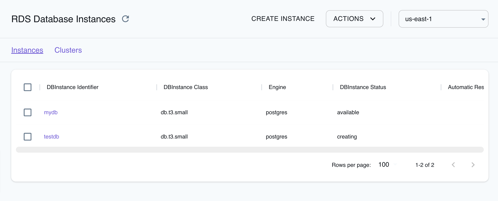

## Introduction

Relational Database Service (RDS) is a managed database service provided by Amazon Web Services (AWS) that allows users to setup, operate, and scale relational databases in the cloud. RDS allows you to deploy and manage various relational database engines like MySQL, PostgreSQL, MariaDB, and Microsoft SQL Server. RDS handles routine database tasks such as provisioning, patching, backup, recovery, and scaling.

LocalStack allows you to use the RDS APIs in your local environment to create and manage RDS clusters and instances for testing & integration purposes. The supported APIs are available on our [API coverage page](https://docs.localstack.cloud/references/coverage/coverage_rds/), which provides information on the extent of RDS's integration with LocalStack.

## Getting started

This guide is designed for users new to RDS and assumes basic knowledge of the AWS CLI and our [`awslocal`](https://github.com/localstack/awscli-local) wrapper script.

Start your LocalStack container using your preferred method. We will demonstrate the following with the AWS CLI:

1. Creating an RDS cluster.
2. Generating a `SecretsManager` secret containing the database password.
3. Executing a basic `SELECT 123 query` through the RDS Data API.

LocalStack's RDS implementation also supports the [RDS Data API](https://docs.aws.amazon.com/AmazonRDS/latest/AuroraUserGuide/data-api.html), which allows executing data queries against RDS clusters over a JSON/REST interface. 

### Create an RDS cluster

To create an RDS cluster, you can use the [`CreateDBCluster`](https://docs.aws.amazon.com/AmazonRDS/latest/APIReference/API_CreateDBCluster.html) API. 
The following command creates a new cluster with the name `db1` and the engine `aurora-postgresql`. 
Instances for the cluster must be added manually.


$ awslocal rds create-db-cluster \
    --db-cluster-identifier db1 \
    --engine aurora-postgresql \
    --database-name test \
    --master-username myuser \
    --master-user-password mypassword


You should see the following output:

```json
{
    "DBCluster": {
        ...
        "Endpoint": "localhost",
        "Port": 4510,  # may vary
        "DBClusterArn": "arn:aws:rds:us-east-1:000000000000:cluster:db1",
        ...
    }
}
```

To add an instance you can run the following command:


$ awslocal rds create-db-instance \
    --db-instance-identifier db1-instance \
    --db-cluster-identifier db1 \
    --engine aurora-postgresql \
    --db-instance-class db.t3.large


### Create a SecretsManager secret

To create a `SecretsManager` secret, you can use the [`CreateSecret`](https://docs.aws.amazon.com/AmazonRDS/latest/APIReference/API_CreateSecret.html) API. Before creating the secret, you need to create a JSON file containing the credentials for the database. The following command creates a file called `mycreds.json` with the credentials for the database.


$ cat << 'EOF' > mycreds.json
{
    "engine": "aurora-postgresql", 
    "username": "myuser",
    "password": "mypassword",
    "host": "localhost",
    "dbname": "test",
    "port": "4510"
}
EOF


Run the following command to create the secret:


$ awslocal secretsmanager create-secret \
    --name dbpass \
    --secret-string file://mycreds.json


You should see the following output:

```json
{
    "ARN": "arn:aws:secretsmanager:us-east-1:000000000000:secret:dbpass-cfnAX",
    "Name": "dbpass",
    "VersionId": "fffa1f4a-2381-4a2b-a977-4869d59a16c0"
}
```

### Execute a query

To execute a query, you can use the [`ExecuteStatement`](https://docs.aws.amazon.com/AmazonRDS/latest/APIReference/API_ExecuteStatement.html) API. 

Make sure to replace the `secret-arn` with the ARN from the secret you just created in the previous step, and check that the `resource-arn` matches the `cluster-arn` that you have created before.

The following command executes a query against the database. The query returns the value `123`.


$ awslocal rds-data execute-statement \
    --database test \
    --resource-arn arn:aws:rds:us-east-1:000000000000:cluster:db1 \
    --secret-arn arn:aws:secretsmanager:us-east-1:000000000000:secret:dbpass-cfnAX \
    --include-result-metadata --sql 'SELECT 123'


You should see the following output:

```json
{
    "columnMetadata": [
        {
            "arrayBaseColumnType": 0,
            "isAutoIncrement": false,
            "isCaseSensitive": false,
            "isCurrency": false,
            "isSigned": true,
            "label": "?column?",
            "name": "?column?",
            "nullable": 0,
            "precision": 10,
            "scale": 0,
            "schemaName": "",
            "tableName": "",
            "type": 4,
            "typeName": "int4"
        }
    ],
    "numberOfRecordsUpdated": 0,
    "records": [
        [
            {
                "longValue": 123
            }
        ]
    ]
}
```

Alternative clients, such as `psql`, can also be employed to interact with the database. You can retrieve the hostname and port of your created instance either from the preceding output or by using the [`DescribeDbInstances`](https://docs.aws.amazon.com/AmazonRDS/latest/APIReference/API_DescribeDBInstances.html) API.


$ psql -d test -U test -p 4513 -h localhost -W


## Supported DB engines

Presently, you can spin up PostgreSQL, MariaDB, MySQL, and MSSQL (SQL Server) databases directly on your local machine, using LocalStack's RDS implementation. However, certain configurations of RDS clusters and instances currently offer only CRUD functionality. For instance, the `storage-encrypted` flag is returned as configured, but active support for actual storage encryption is not yet available.

### PostgreSQL Engine

When you establish an RDS DB cluster or instance using the `postgres`/`aurora-postgresql` DB engine along with a specified `EngineVersion`, LocalStack will dynamically install and configure the corresponding PostgreSQL version as required. Presently, you have the option to choose major versions ranging from 10 to 15. If you select a major version beyond this range, the system will automatically default to version 11.

It's important to note that the selection of minor versions is not available. The latest major version will be installed within the Docker environment. If you wish to prevent the installation of customized versions, adjusting the `RDS_PG_CUSTOM_VERSIONS` environment variable to `0` will enforce the use of the default PostgreSQL version 11.


While the [`DescribeDbCluster`](https://docs.aws.amazon.com/AmazonRDS/latest/APIReference/API_DescribeDBClusters.html) and [`DescribeDbInstances`](https://docs.aws.amazon.com/AmazonRDS/latest/APIReference/API_DescribeDBInstances.html) APIs will still reflect the initially defined `engine-version`, the actual installed PostgreSQL engine might differ. This can have implications, particularly when employing a Terraform configuration, where unexpected changes should be avoided.


Instances and clusters with the PostgreSQL engine have the capability to both create and restore snapshots.

### MariaDB Engine

MariaDB will be set up as an operating system package within LocalStack. However, currently, the option to choose a particular version is not available. As of now, snapshots are not supported for MariaDB.

### MySQL Engine

A MySQL community server will be launched in a new Docker container upon requesting the MySQL engine. 

The `engine-version` will serve as the tag for the Docker image, allowing you to freely select the desired MySQL version from those available on the [official MySQL Docker Hub](https://hub.docker.com/_/mysql). If you have a specific image in mind, you can also use the environment variable `MYSQL_IMAGE=<my-image:tag>`.


The `arm64` MySQL images are limited to newer versions. For more information about availability, check the [MySQL Docker Hub repository](https://hub.docker.com/_/mysql).


It's essential to understand that the `MasterUserPassword` you define for the database cluster/instance will be used as the `MYSQL_ROOT_PASSWORD` environment variable for the `root` user within the MySQL container. The user specified in `MasterUserName` will use the same password and will have complete access to the database. As of now, snapshots are not supported for MySQL.

### Microsoft SQL Server Engine

To utilize MSSQL databases, it's necessary to expressly agree to the terms of the [Microsoft SQL Server End-User Licensing Agreement (EULA)](https://hub.docker.com/_/microsoft-mssql-server) by configuring `MSSQL_ACCEPT_EULA=Y` within the LocalStack container environment. The `arm64` architecture is not currently officially supported for MSSQL.

For the MSSQL engine, the database server is initiated in a fresh Docker container using the `latest` image. As of now, snapshots are not supported for MSSQL.

## Default Usernames and Passwords

The following details concern default usernames, passwords, and database names for local RDS clusters created by LocalStack:

-   The default values for `master-username` and `db-name` are both **test**. For the `master-user-password`, the default is **test**, except for MSSQL databases, which employ **Test123!** as the default master password.
-   When setting up a new RDS instance, you have the flexibility to utilize any `master-username`, with the exception of **postgres**. The system will automatically generate the user.
-   It's important to remember that the username **postgres** has special significance, preventing the creation of a new RDS instance under this particular name.
-   For clarity, please avoid using the `db-name` **postgres**, as it is already allocated for use by LocalStack.

## IAM Authentication Support

IAM authentication tokens can be employed to establish connections with RDS. As of now, this functionality is supported for PostgreSQL within LocalStack. However, IAM authentication is not yet validated at this stage. Consequently, any database user assigned the `rds_iam` role will obtain a valid token, thereby gaining the ability to connect to the database.

In this example, you will be able to verify the IAM authentication process for RDS Postgres:

1.  Establish a database instance and obtain the corresponding host and port information.
2.  Connect to the database using the master username and password. Subsequently, generate a new user and assign the `rds_iam` role as follows:
    -   `CREATE USER <username> WITH LOGIN`
    -   `GRANT rds_iam TO <username>`
3.  Create a token for the `<username>` using the `generate-db-auth-token` command.
4.  Connect to the database utilizing the user you generated and the token obtained in the previous step as the password.

### Create a database instance

The following command creates a new database instance with the name `mydb` and the engine `postgres`. The database will be created with a single instance, which will be used as the master instance.


$ MASTER_USER=hello
$ MASTER_PW='MyPassw0rd!'
$ DB_NAME=test
$ awslocal rds create-db-instance \
    --master-username $MASTER_USER \
    --master-user-password $MASTER_PW \
    --db-instance-identifier mydb \
    --engine postgres \
    --db-name $DB_NAME \
    --enable-iam-database-authentication \
    --db-instance-class db.t3.small


### Connect to the database

You can retrieve the hostname and port of your created instance either from the preceding output or by using the [`DescribeDbInstances`](https://docs.aws.amazon.com/AmazonRDS/latest/APIReference/API_DescribeDBInstances.html) API. Run the following command to retrieve the host and port of the instance:


$ PORT=$(awslocal rds describe-db-instances --db-instance-identifier mydb | jq -r ".DBInstances[0].Endpoint.Port")
$ HOST=$(awslocal rds describe-db-instances --db-instance-identifier mydb | jq -r ".DBInstances[0].Endpoint.Address")


Next, you can connect to the database using the master username and password:


$ PGPASSWORD=$MASTER_PW psql -d $DB_NAME -U $MASTER_USER -p $PORT -h $HOST -w -c 'CREATE USER myiam WITH LOGIN'
$ PGPASSWORD=$MASTER_PW psql -d $DB_NAME -U $MASTER_USER -p $PORT -h $HOST -w -c 'GRANT rds_iam TO myiam'


### Create a token

You can create a token for the user you generated using the [`generate-db-auth-token`](https://docs.aws.amazon.com/cli/latest/reference/rds/generate-db-auth-token.html) command:


$ TOKEN=$(awslocal rds generate-db-auth-token --username myiam --hostname $HOST --port $PORT)


You can now connect to the database utilizing the user you generated and the token obtained in the previous step as the password:


$ PGPASSWORD=$TOKEN psql -d $DB_NAME -U myiam -w -p $PORT -h $HOST


## Global Database Support

LocalStack extends support for [Aurora Global Database](https://docs.aws.amazon.com/AmazonRDS/latest/AuroraUserGuide/aurora-global-database.html) with certain limitations:

- Creating a global database will result in the generation of a single local database. All clusters and instances associated with the global database will share a common endpoint.
- It's important to note that clusters removed from a global database lose their ability to function as standalone clusters, differing from their intended behavior on AWS.
- At present, the capability for persistence within global databases is not available.

## Resource Browser

The LocalStack Web Application provides a Resource Browser for managing RDS instances and clusters. You can access the Resource Browser by opening the LocalStack Web Application in your browser, navigating to the **Resources** section, and then clicking on **RDS** under the **Database** section.


<br>
<br>

The Resource Browser allows you to perform the following actions:

- **Create Instance**: Create a new RDS instance by specifying the instance name, engine, DBInstance Class & Identifier, and other parameters.
- **Create Cluster**: Create a new RDS cluster by specifying the database name, engine, DBCluster Identifier, and other parameters.
- **View Instance & Cluster**: View an existing RDS instance or cluster by clicking the instance/cluster name.
- **Edit Instance & Cluster**: Edit an existing RDS instance or cluster by clicking the instance/cluster name and clicking the **EDIT INSTANCE** or **EDIT CLUSTER** button.
- **Remove Instance & Cluster**: Remove an existing RDS instance or cluster by clicking the instance/cluster name and clicking the **ACTIONS** followed by **Remove Selected** button.

## Examples

The following code snippets and sample applications provide practical examples of how to use RDS in LocalStack for various use cases:

- [AppSync GraphQL APIs for DynamoDB and RDS Aurora PostgreSQL](https://github.com/localstack/appsync-graphql-api-sample)
- [Amazon RDS initialization using CDK, Lambda, ECR, and Secrets Manager](https://github.com/localstack/amazon-rds-init-cdk)
- [Serverless RDS Proxy with API Gateway, Lambda, and Aurora RDS](https://github.com/localstack-samples/sample-serverless-rds-proxy-demo/)
- [Running queries against an RDS database](https://github.com/localstack/localstack-pro-samples/tree/master/rds-db-queries)
- [Running cloud integration tests against LocalStack's RDS with Testcontainers](https://github.com/localstack/localstack-pro-samples/tree/master/testcontainers-java-sample)
