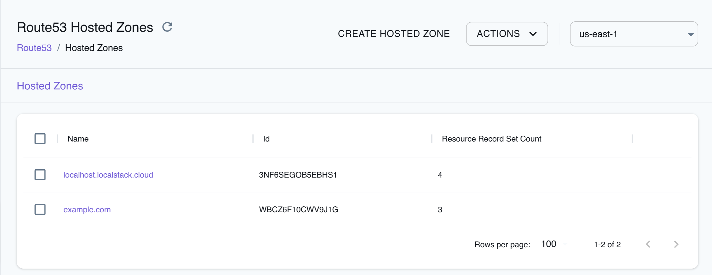

## Introduction

Route 53 is a highly scalable and reliable domain name system (DNS) web service provided by Amazon Web Services. Route 53 allows you to register domain names, and associate them with IP addresses or other resources. In addition to basic DNS functionality, Route 53 offers advanced features like health checks and DNS failover. Route 53 integrates seamlessly with other AWS services, such as route traffic to CloudFront distributions, S3 buckets configured for static website hosting, EC2 instances, and more.

LocalStack allows you to use the Route53 APIs in your local environment to create hosted zones and to manage DNS entries.
The supported APIs are available on our [API coverage page](https://docs.localstack.cloud/references/coverage/coverage_route53/), which provides information on the extent of Route53's integration with LocalStack.

Our Pro offering integrates with our DNS server to respond to DNS queries with these domains.

## Getting started

This guide is designed for users new to Route53 and assumes basic knowledge of the AWS CLI and our [`awslocal`](https://github.com/localstack/awscli-local) wrapper script.

Start your LocalStack container using your preferred method. We will demonstrate how to create a hosted zone and query the DNS record with the AWS CLI.

### Create a hosted zone

You can created a hosted zone for `example.com` using the [`CreateHostedZone`](https://docs.aws.amazon.com/Route53/latest/APIReference/API_CreateHostedZone.html) API. Run the following command:


$ zone_id=$(awslocal route53 create-hosted-zone \
    --name example.com \
    --caller-reference r1 | jq -r '.HostedZone.Id')
$ echo $zone_id


The following output would be retrieved:

```bash
/hostedzone/WBCZ6F10CWV9J1G
```

### Change resource record sets

You can now change the resource record sets for the hosted zone `example.com` using the [`ChangeResourceRecordSets`](https://docs.aws.amazon.com/Route53/latest/APIReference/API_ChangeResourceRecordSets.html) API. Run the following command:


$ awslocal route53 change-resource-record-sets \
    --hosted-zone-id $zone_id \
    --change-batch 'Changes=[{Action=CREATE,ResourceRecordSet={Name=test.example.com,Type=A,ResourceRecords=[{Value=1.2.3.4}]}}]'


The following output would be retrieved:

```bash
{
    "ChangeInfo": {
        "Id": "/change/C2682N5HXP0BZ4",
        "Status": "INSYNC",
        "SubmittedAt": "2010-09-10T01:36:41.958000Z"
    }
}
```

## DNS resolution

LocalStack Pro supports the ability to respond to DNS queries for your Route53 domain names, with our [integrated DNS server]().


To follow the example below you must [configure your system DNS to use the LocalStack DNS server]().


### Query a DNS record

You can query the DNS record using `dig` via the built-in DNS server by running the following command:


$ dig @localhost test.example.com


The following output would be retrieved:

```bash
;; QUESTION SECTION:
;test.example.com.              IN      A

;; ANSWER SECTION:
test.example.com.       300     IN      A       1.2.3.4
```

### Customizing internal endpoint resolution

The DNS name `localhost.localstack.cloud`, along with its subdomains like `mybucket.s3.localhost.localstack.cloud`, serves an internal routing purpose within LocalStack.
It facilitates communication between a LocalStack compute environment (such as a Lambda function) and the LocalStack APIs, as well as your containerised applications with the LocalStack APIs.
For example configurations, see the [Network Troubleshooting guide]().

For most use-cases, the default configuration of the internal LocalStack DNS name requires no modification. It functions seamlessly in typical scenarios. However, there are instances where adjusting the external resolution of this DNS name becomes necessary. For instance, this might be required when your LocalStack instance operates on a distinct Docker network compared to your application code or even on a separate machine.

Suppose you intend to achieve a scenario in which all subdomains in the format `*.localhost.localstack.cloud` resolve to the IP address `5.6.7.8`. This IP signifies the accessibility of your LocalStack instance. This can be accomplished using Route53.

Create a hosted zone for the domain `localhost.localstack.cloud` using the [`CreateHostedZone` API](https://docs.aws.amazon.com/Route53/latest/APIReference/API_CreateHostedZone.html) API. Run the following command:


$ zone_id=$(awslocal route53 create-hosted-zone \
    --name localhost.localstack.cloud \
    --caller-reference r1 | jq -r .HostedZone.Id)
$ echo $zone_id


The following output would be retrieved:

```bash
/hostedzone/3NF6SEGOB5EBHS1
```

You can now use the [`ChangeResourceRecordSets`](https://docs.aws.amazon.com/Route53/latest/APIReference/API_ChangeResourceRecordSets.html) API to create a record set for the domain `localhost.localstack.cloud` using the `zone_id` retrieved in the previous step. Run the following command to accomplish this:


$ awslocal route53 change-resource-record-sets \
    --hosted-zone-id $zone_id \
    --change-batch '{"Changes":[{"Action":"CREATE","ResourceRecordSet":{"Name":"localhost.localstack.cloud","Type":"A","ResourceRecords":[{"Value":"5.6.7.8"}]}},{"Action":"CREATE","ResourceRecordSet":{"Name":"*.localhost.localstack.cloud","Type":"A","ResourceRecords":[{"Value":"5.6.7.8"}]}}]}'


The following output would be retrieved:

```bash
{
    "ChangeInfo": {
        "Id": "/change/C2682N5HXP0BZ4",
        "Status": "INSYNC",
        "SubmittedAt": "2010-09-10T01:36:41.958000Z"
    }
}
```

You can now verify that the DNS name `localhost.localstack.cloud` and its subdomains resolve to the IP address:


$ dig @127.0.0.1 bucket1.s3.localhost.localstack.cloud
$ dig @127.0.0.1 localhost.localstack.cloud


The following output would be retrieved:

```bash
...
;; ANSWER SECTION:
bucket1.s3.localhost.localstack.cloud. 300 IN A 127.0.0.1
bucket1.s3.localhost.localstack.cloud. 300 IN A 5.6.7.8
...
;; QUESTION SECTION:
;localhost.localstack.cloud.    IN      A

;; ANSWER SECTION:
localhost.localstack.cloud. 300 IN      A       5.6.7.8
```

## Resource Browser

The LocalStack Web Application provides a Route53 for creating hosted zones and to manage DNS entries. You can access the Resource Browser by opening the LocalStack Web Application in your browser, navigating to the **Resources** section, and then clicking on **Route53** under the **Analytics** section.



The Resource Browser allows you to perform the following actions:

- **Create Hosted Zone**: Create a hosted zone for a domain name by clicking on the **Create Hosted Zone** button. This will open a modal where you can enter the name, VPC, and other parameters and click on the **Submit** button to create the hosted zone.
- **View Hosted Zone**: View the details of a hosted zone by clicking on the specific hosted zone name. This will open a modal where you can view the hosted zone details.
- **Create Record**: Click on the **Records** button on the individual hosted zone page, followed by clicking **Create Record** to create a record for the hosted zone. This will open a modal where you can enter the name, type, and other parameters and click on the **Submit** button to create the record.
- **Edit Record**: Click on the **Records** button on the individual hosted zone page, followed by clicking **Edit** on the specific record to edit the record. This will open a modal where you can edit the record details and click on the **Submit** button to save the changes.s
- **View Records**: Click on the **Records** button on the individual hosted zone page, followed by clicking on the specific record to view the record details. This will open a modal where you can view the record details.
- **Delete Hosted Zone**: Select the hosted zones you want to delete by clicking on the checkbox next to the hosted zone name, followed by clicking on the **Actions** button and then clicking on **Remove Selected**.
- **Delete Record**: Click on the **Records** button on the individual hosted zone page, followed by clicking on checkbox next to the specific record, and then clicking on the **Actions** button and then clicking on **Remove Selected**.

## Examples

The following code snippets and sample applications provide practical examples of how to use Route53 in LocalStack for various use cases:

 - [DNS Failover with Route53 on LocalStack](https://github.com/localstack/localstack-pro-samples/tree/master/route53-dns-failover)
